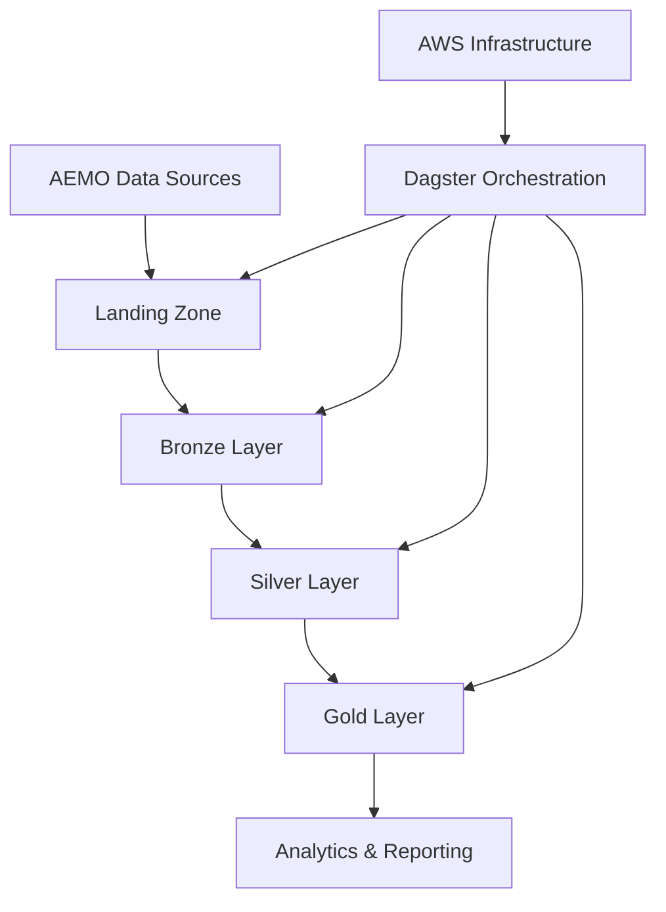
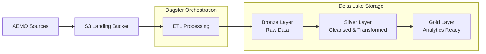
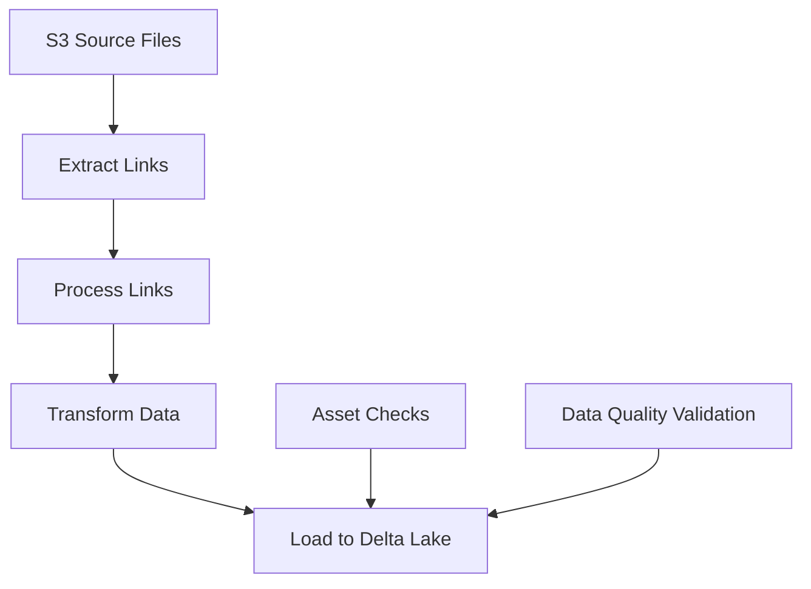

# Australian Energy Markets Data Repo

## Overview

The Australian Energy Markets Data repo is a (in progress) solution for ingesting,
processing, and analyzing data from various Australian energy market sources,
including the Australian Energy Market Operator (AEMO) and other data providers.

This project implements the following architecture:

- Dagster for orchestration
- Polars for data processing
- and Delta Lake for reliable data storage

## AWS Infrastructure Architecture

### High-Level Architecture



### Key Infrastructure Components

1. **VPC & Networking**

   - Public and private subnets across (currently) a single AZ
   - [FckNat](https://fck-nat.dev/stable/) Instance for private subnet internet access
   - Security groups for fine-grained access control

2. **Compute Resources**

   - Bastion host for secure SSH access to the environment
   - EC2 instances for authentication and web services
   - ECS cluster for Dagster orchestration

3. **Storage**

   - S3 buckets organized in a medallion architecture:
     - Landing: Raw incoming data
     - Bronze: Parsed raw data
     - Silver: Cleansed and transformed data
     - Gold: Analytics-ready data
   - PostgreSQL for Dagster metadata storage
   - [Dyanmodb Locking Table](https://delta-io.github.io/delta-rs/usage/writing/writing-to-s3-with-locking-provider/) to guarantee ACID Transactions

4. **Security**
   - IAM roles
   - Security groups restricting network access
   - SSH key-based authentication
   - [Caddy](https://caddyserver.com/) Reverse Proxy + Route 53 -> FastAPI Authentication Service + Cognito

## AEMO ETL Strategies

### Data Flow



### ETL Process



## Environment Variables

```bash
# Specify the development environment
DEVELOPMENT_ENVIRONMENT="DEV|TEST|PROD etc..."

# Specify the location where the development is occurring
DEVELOPMENT_LOCATION="LOCAL|AWS| etc."

# Defaults to energy-market -> convert to EnergyMarket during stack creation
# For the new project name, consider using:
NAME_PREFIX="energy-market"

ADMINISTRATOR_IPS="$(curl ifconfig.me --silent)"

# cognito data
COGNITO_DAGSTER_AUTH_CLIENT_ID=...
COGNITO_DAGSTER_AUTH_SERVER_METADATA_URL=... # https://cognito-idp.<region>.amazonaws.com/<user pool id>/.well-known/openid-configuration
COGNITO_DAGSTER_AUTH_CLIENT_SECRET=...

# root url for for website e.g https://ausenergymarketdata.com
WEBSITE_ROOT_URL=...

# email address
DEVELOPER_EMAIL=...

```

## Deployment Instructions

### Prerequisites

- AWS CLI configured with appropriate credentials
- AWS CDK installed and bootstrapped in your account
- Environment variables set (see Environment Variables section)
- UV package manager installed

### Deploying the Infrastructure

The project includes several deployment scripts in the `infrastructure/aws/scripts` directory to simplify the deployment process:

1. Full deployment:

   ```bash
   cd infrastructure/aws
   ./scripts/deploy.sh
   ```

   This script copies common configurations, syncs dependencies with UV, and deploys all stacks with concurrency.

2. Destroy all resources:

   ```bash
   cd infrastructure/aws
   ./scripts/destroy.sh
   ```

   This removes all deployed AWS resources.

3. Redeploy only Dagster services:

   ```bash
   cd infrastructure/aws
   ./scripts/redeploy-dev-dagster-services.sh
   ```

   This script destroys and redeploys only the Dagster-related services, useful for updates to the ETL code.

4. Activate the development environment:

   ```bash
   cd infrastructure/aws
   source ./scripts/activate.sh
   ```

   This sets up the Python virtual environment with all required dependencies.

### SSH Access to Instances

The infrastructure includes a bastion host and other instances that can be accessed securely using provided scripts:

1. SSH to the bastion host:

   ```bash
   cd infrastructure/aws
   ./scripts/ssh-bastion-host.sh
   ```

   This script:

   - Retrieves the SSH key from AWS SSM Parameter Store
   - Identifies the bastion host instance
   - Establishes an SSH connection with proper permissions

2. SSH to the Caddy server:

   ```bash
   cd infrastructure/aws
   ./scripts/ssh-caddy-server.sh
   ```

   Similar to the bastion host script, this connects you directly to the Caddy web server.

These scripts handle all the complexity of retrieving keys and instance information, making secure access simple.

## Project Structure

- `backend-services/dagster-etl-services/aemo-etl/`: ETL pipelines for AEMO data
- `infrastructure/aws/`: AWS infrastructure as code using CDK
  - `infrastructure/`: CDK stack definitions
  - `bin/`: CDK app entry point
  - `scripts/`: Deployment and access scripts
    - `deploy.sh`: Full infrastructure deployment
    - `destroy.sh`: Remove all infrastructure
    - `redeploy-dev-dagster-services.sh`: Update only Dagster services
    - `ssh-bastion-host.sh`: Connect to bastion host
    - `ssh-caddy-server.sh`: Connect to Caddy server
    - `activate.sh`: Set up development environment
    - `get-common.sh`: Copy common configurations
- `backend-services/authentication-service/`: Authentication service

## Getting Started

1. Clone the repository
2. Set up environment variables
3. Activate the development environment:

   ```bash
   cd infrastructure/aws
   source ./scripts/activate.sh
   ```

4. Deploy infrastructure:

   ```bash
   ./scripts/deploy.sh
   ```

5. Run Dagster pipelines:

   ```bash
   cd backend-services/dagster-etl-services/aemo-etl
   dagster dev
   ```
