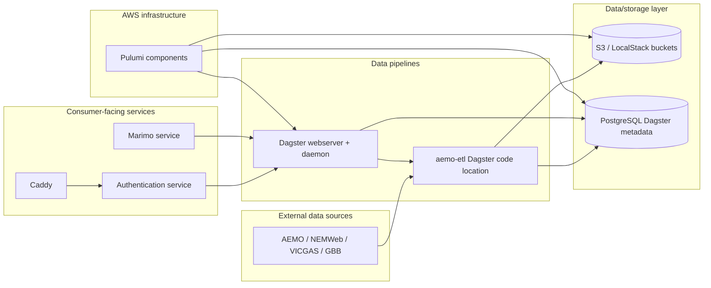

# Energy Market Delta Lake

Monorepo for ingesting, orchestrating, and serving Australian energy market data.
The repository combines:

- **Data pipelines** (Dagster + `aemo-etl`) for extraction and transformation.
- **Runtime services** (authentication, notebooks, reverse-proxy, local dependencies).
- **Infrastructure as code** (Pulumi on AWS).
- **Specifications and migration notes** for planned and in-progress work.

## Quickstart (local)

```bash
# 1) start local service stack
cd backend-services
source .envrc  # or: direnv allow
podman-compose up --build -d

# 2) run repository quality checks (from repo root)
cd ..
prek run -a
```

Then open Dagster UI at `http://localhost:3000`.

## Prerequisites

| Tool | Suggested version | Used for |
|---|---:|---|
| Python | 3.11+ | Service and ETL development |
| uv | latest | Python dependency + tool management |
| Podman + podman-compose | see `backend-services/README.md` | Local multi-service stack |
| Pulumi CLI | latest | Infrastructure provisioning |
| pre-commit tool (`prek`) | latest | Repository lint/format/test hooks |

## High-level architecture


```mermaid
flowchart LR
  subgraph Sources[External data sources]
    A[AEMO / NEMWeb / VICGAS / GBB]
  end

  subgraph Pipelines[Data pipelines]
    B[aemo-etl Dagster code location]
    C[Dagster webserver + daemon]
  end

  subgraph Storage[Data/storage layer]
    D[(S3 / LocalStack buckets)]
    E[(PostgreSQL Dagster metadata)]
  end

  subgraph Consumers[Consumer-facing services]
    F[Authentication service]
    G[Marimo service]
    H[Caddy]
  end

  subgraph Infra[AWS infrastructure]
    I[Pulumi components]
  end

  A --> B
  B --> D
  B --> E
  C --> B
  C --> E
  F --> C
  G --> C
  H --> F
  I --> C
  I --> D
  I --> E
```

## Repository tree (high-level)

```text
energy-market-delta-lake/
├── backend-services/                 # Local runtime stack and application services
│   ├── compose.yaml                  # Local Dagster stack composition
│   ├── dagster-core/                 # Dagster webserver/daemon image and configs
│   ├── dagster-user/aemo-etl/        # Dagster code location and ETL assets
│   ├── authentication/               # Auth API service
│   ├── marimo/                       # Notebook/application service
│   ├── caddy/                        # Reverse proxy/static entrypoint
│   ├── localstack/                   # Local AWS emulation setup
│   └── postgres/                     # Local Postgres setup
├── infrastructure/
│   └── aws-pulumi/                   # AWS infrastructure definitions and tests
├── specs/                            # Design docs, migration plans, technical notes
├── scripts/                          # Repository-level helper scripts
└── .pre-commit-config.yaml           # Repository quality/lint entrypoint
```

## Component map

- **`backend-services/`**
  - Primary application runtime for local development, centered around Dagster.
  - See `backend-services/README.md` for full local stack setup and operations.
- **`backend-services/dagster-user/aemo-etl/`**
  - Core ETL definitions, sensors, factories, and tests for market datasets.
- **`infrastructure/aws-pulumi/`**
  - Cloud resources and deployment logic for AWS environments.
- **`specs/`**
  - Architecture decisions, migration plans, and implementation notes.
- **`scripts/` + root pre-commit config**
  - Repository workflow tooling (kept secondary to product architecture).

## Environment model

- **Local**: containerized stack in `backend-services/` (Postgres + LocalStack + Dagster services).
- **Cloud (AWS)**: infrastructure defined in `infrastructure/aws-pulumi/` and deployed per Pulumi stack configuration.
- **Config sources**:
  - Local runtime variables: `backend-services/.envrc`
  - Infrastructure stack config: `infrastructure/aws-pulumi/Pulumi.<stack>.yaml`

## Data lifecycle (conceptual)

1. **Ingest** market source files/events from AEMO/NEMWeb/VICGAS/GBB.
2. **Land** raw data in object storage (S3 in cloud, LocalStack S3 locally).
3. **Transform** datasets through Dagster-managed ETL assets/jobs.
4. **Persist metadata/state** in PostgreSQL for orchestration and run history.
5. **Serve/consume** via downstream services and user-facing endpoints.

## Where to start

### Run the local backend stack

Follow `backend-services/README.md` to launch the local Dagster stack with
Postgres and LocalStack.

### Work on ETL pipeline code

Start in `backend-services/dagster-user/aemo-etl/README.md`.

### Work on AWS infrastructure

Start in `infrastructure/aws-pulumi/README.md`.

## Testing and quality commands

| Scope | Command |
|---|---|
| Repository-wide hooks | `prek run -a` |
| ETL project tests | `cd backend-services/dagster-user/aemo-etl && uv run pytest` |
| AWS Pulumi tests | `cd infrastructure/aws-pulumi && uv run pytest` |

## Deployment pointers

- Infrastructure deploy flow is managed in `infrastructure/aws-pulumi/`.
- Use Pulumi preview/apply workflows from that directory:

```bash
cd infrastructure/aws-pulumi
pulumi preview
pulumi up
```

## Ownership and support

- **Data platform code**: `backend-services/` and `backend-services/dagster-user/aemo-etl/`
- **Infrastructure**: `infrastructure/aws-pulumi/`
- **Design docs / decisions**: `specs/`

(If your team has Slack channels/on-call aliases, add them here.)

## Roadmap and known gaps

See `specs/` for active plans and technical notes, including migration and
warning-remediation documents.

## Development workflow

- Use pre-commit hooks from the repository root:

```bash
prek run -a
```

- Service-specific tests and commands should be run from each sub-project
  directory (`backend-services/...`, `infrastructure/aws-pulumi/...`).
