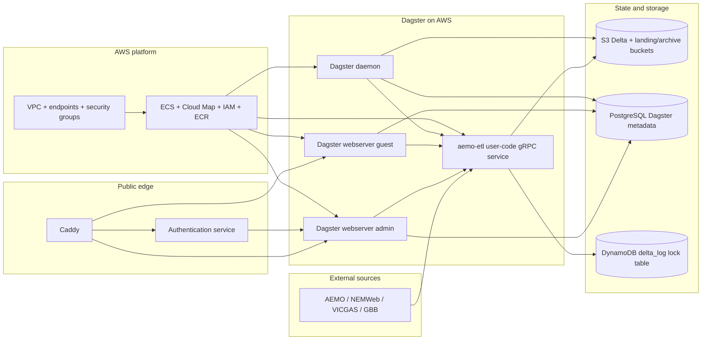

# Energy Market Delta Lake

Monorepo for ingesting, orchestrating, and serving Australian energy market data.

The canonical system architecture is the AWS deployment provisioned from
`infrastructure/aws-pulumi`. Local compose under `backend-services/` exists to
support development, testing, and validation of the deployed platform.

## What this repo contains

- Dagster-based ETL code in `backend-services/dagster-user/aemo-etl`
- Dagster runtime, auth, proxy, and local support services in `backend-services`
- AWS infrastructure as code in `infrastructure/aws-pulumi`
- Technical specs and implementation notes in `specs`

## Canonical architecture


```mermaid
flowchart LR
  subgraph Sources[External sources]
    A[AEMO / NEMWeb / VICGAS / GBB]
  end

  subgraph Edge[Public edge]
    B[Caddy]
    C[Authentication service]
  end

  subgraph Dagster[Dagster on AWS]
    D[Dagster webserver admin]
    E[Dagster webserver guest]
    F[Dagster daemon]
    G[aemo-etl user-code gRPC service]
  end

  subgraph Data[State and storage]
    H[(S3 Delta + landing/archive buckets)]
    I[(PostgreSQL Dagster metadata)]
    J[(DynamoDB delta_log lock table)]
  end

  subgraph Platform[AWS platform]
    K[VPC + endpoints + security groups]
    L[ECS + Cloud Map + IAM + ECR]
  end

  A --> G
  B --> C
  B --> D
  B --> E
  C --> D
  D --> G
  E --> G
  F --> G
  G --> H
  F --> H
  G --> J
  D --> I
  E --> I
  F --> I
  K --> L
  L --> D
  L --> E
  L --> F
  L --> G
```

The deployed stack provisions:

- public Caddy entrypoint on EC2
- FastAPI authentication service
- Dagster admin and guest webservers
- Dagster daemon
- `aemo-etl` gRPC user-code service
- PostgreSQL for Dagster run, schedule, and event-log storage
- S3 buckets for landing, archive, Delta tables, and IO-manager payloads
- DynamoDB `delta_log` locking table
- VPC, endpoints, security groups, IAM roles, ECR repositories, ECS, and Cloud Map

See [docs/architecture.md](docs/architecture.md) for the fuller system view.

## Workflow

At a high level the deployed workflow is:

1. Discovery assets poll public AEMO/NEMWeb sources and land files in S3.
2. Unzipper sensors expand zipped inputs and archive successful zip payloads.
3. Event-driven bronze assets ingest landed files into Delta tables.
4. Source-specific silver assets deduplicate and standardize current-state tables.
5. `gas_model` assets build shared dimensions and marts from the source silver layer.
6. Dagster metadata and orchestration state live in PostgreSQL, while data products live in S3-backed Delta tables.

The orchestration details come from the Dagster definitions in
`backend-services/dagster-user/aemo-etl`, including event-driven sensors and
automation-conditioned downstream assets.

See [docs/workflow.md](docs/workflow.md) for the repo-level workflow summary and
[backend-services/dagster-user/aemo-etl/docs/architecture/high_level_architecture.md](backend-services/dagster-user/aemo-etl/docs/architecture/high_level_architecture.md)
for ETL internals.

## Repository layout

```text
energy-market-delta-lake/
├── backend-services/                 # Local dev/test harness and service source
│   ├── dagster-core/                 # Dagster webserver/daemon image and config
│   ├── dagster-user/aemo-etl/        # Dagster code location and ETL docs
│   ├── authentication/               # OIDC session/auth service
│   ├── caddy/                        # Reverse proxy image/config
│   ├── marimo/                       # Local notebook service
│   ├── localstack/                   # Local AWS emulation bootstrap
│   └── postgres/                     # Local PostgreSQL image/setup
├── docs/                             # Repo-level architecture and workflow docs
├── infrastructure/
│   └── aws-pulumi/                   # Canonical AWS deployment definitions
├── specs/                            # Specs, migration notes, design docs
└── scripts/                          # Repo-level helper scripts
```

## Local development and testing

`backend-services/compose.yaml` is a local development and testing harness. It is
useful for validating service interactions, running Dagster locally, and working
against LocalStack-backed storage, but it is not the primary architecture.

Typical local flow:

```bash
cd backend-services
source .envrc
podman-compose up --build -d
```

The local entrypoint is Caddy at `https://localhost`.

Use the local stack when you need:

- local Dagster UI and daemon behavior
- LocalStack-backed S3 and DynamoDB-compatible workflows
- local auth/proxy integration checks
- notebook experimentation through `marimo`

See [backend-services/README.md](backend-services/README.md) for the local stack.

## Quickstart

### Work on the deployed architecture

Start with:

- [docs/architecture.md](docs/architecture.md)
- [docs/workflow.md](docs/workflow.md)
- [infrastructure/aws-pulumi/README.md](infrastructure/aws-pulumi/README.md)

### Work on ETL definitions

Start with:

- [backend-services/dagster-user/aemo-etl/README.md](backend-services/dagster-user/aemo-etl/README.md)
- [backend-services/dagster-user/aemo-etl/docs/architecture/high_level_architecture.md](backend-services/dagster-user/aemo-etl/docs/architecture/high_level_architecture.md)

### Work on local test/dev services

Start with:

- [backend-services/README.md](backend-services/README.md)

## Prerequisites

| Tool | Suggested version | Used for |
|---|---:|---|
| Python | 3.11+ | Repo tooling and service development |
| uv | latest | Python dependency and tool management |
| Podman + podman-compose | see `backend-services/README.md` | Local test/dev stack |
| Pulumi CLI | latest | AWS infrastructure deployment |
| `prek` | latest | Repository lint/format/test hooks |

## Commands

| Scope | Command |
|---|---|
| Repository-wide hooks | `prek run -a` |
| ETL project tests | `cd backend-services/dagster-user/aemo-etl && uv run pytest` |
| AWS Pulumi tests | `cd infrastructure/aws-pulumi && uv run pytest` |
| Local stack | `cd backend-services && source .envrc && podman-compose up --build -d` |

## Deployment

Pulumi is the source of truth for deployed infrastructure:

```bash
cd infrastructure/aws-pulumi
pulumi preview
pulumi up
```

See [infrastructure/aws-pulumi/README.md](infrastructure/aws-pulumi/README.md)
for stack details, component breakdown, and integration-test commands.
