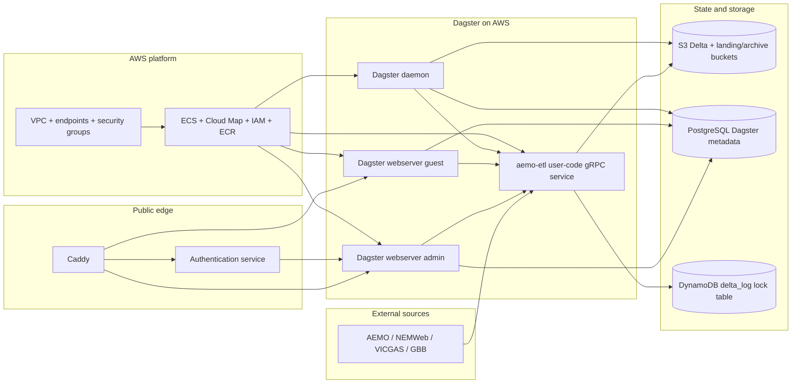

# Energy Market Delta Lake

Monorepo for ingesting, orchestrating, and serving Australian energy market data.

The canonical system architecture is the AWS deployment provisioned from
`infrastructure/aws-pulumi`. Local compose under `backend-services/` exists to
support development, testing, and validation of the deployed platform.

## Table of contents

- [What this repo contains](#what-this-repo-contains)
- [Canonical architecture](#canonical-architecture)
- [Workflow](#workflow)
- [Repository layout](#repository-layout)
- [Local development and testing](#local-development-and-testing)
- [Documentation map](#documentation-map)
- [Prerequisites](#prerequisites)
- [Tooling](#tooling)
- [Commands](#commands)
- [Deployment](#deployment)

## What this repo contains

- Dagster-based ETL code in `backend-services/dagster-user/aemo-etl`
- Dagster runtime, auth, proxy, and local support services in `backend-services`
- AWS infrastructure as code in `infrastructure/aws-pulumi`

## Canonical architecture


```mermaid
flowchart LR
  subgraph Sources[External sources]
    A[AEMO / NEMWeb / VICGAS / GBB]
  end

  subgraph Edge[Public edge]
    B[Caddy]
    C[Authentication service]
  end

  subgraph Dagster[Dagster on AWS]
    D[Dagster webserver admin]
    E[Dagster webserver guest]
    F[Dagster daemon]
    G[aemo-etl user-code gRPC service]
  end

  subgraph Data[State and storage]
    H[(S3 Delta + landing/archive buckets)]
    I[(PostgreSQL Dagster metadata)]
    J[(DynamoDB delta_log lock table)]
  end

  subgraph Platform[AWS platform]
    K[VPC + endpoints + security groups]
    L[ECS + Cloud Map + IAM + ECR]
  end

  A --> G
  B --> C
  B --> D
  B --> E
  C --> D
  D --> G
  E --> G
  F --> G
  G --> H
  F --> H
  G --> J
  D --> I
  E --> I
  F --> I
  K --> L
  L --> D
  L --> E
  L --> F
  L --> G
```

The deployed stack provisions:

- public Caddy entrypoint on EC2
- FastAPI authentication service
- Dagster admin and guest webservers
- Dagster daemon
- `aemo-etl` gRPC user-code service
- PostgreSQL for Dagster run, schedule, and event-log storage
- S3 buckets for landing, archive, Delta tables, and IO-manager payloads
- DynamoDB `delta_log` locking table
- VPC, endpoints, security groups, IAM roles, ECR repositories, ECS, and Cloud Map

See [docs/architecture.md](docs/architecture.md) for the fuller system view.

## Workflow

At a high level the deployed workflow is:

1. Discovery/listing assets poll public AEMO/NEMWeb sources and land files in S3.
1. Unzipper sensors expand zipped inputs and archive successful zip payloads.
1. Event-driven source-table bronze assets ingest landed files into current-state Delta tables through explicit source-table ingestion logic, archiving processed files only after a table write, deleting zero-byte landing objects, and warning on skipped selected keys.
1. Source-specific silver assets deduplicate and standardize current-state tables.
1. `gas_model` assets build shared dimensions and marts from the source silver layer.
1. A daily Delta maintenance job compacts and full-vacuums Delta-backed tables.
1. Dagster metadata and orchestration state live in PostgreSQL, while data products live in S3-backed Delta tables.

The ETL Subproject also exposes `aemo-replay-bronze-archive` for dry-run
planning and explicit `--replace` rebuilds of source-table bronze Delta tables
from archived source files. Source-table bronze keeps bounded current state;
append replay history remains in archive storage.

For local **End-to-end test** setup, `aemo-e2e-archive-seed` derives the full
`gas_model` seed spec from Dagster definitions, refreshes an ignored cached
Archive slice under `backend-services/.e2e/aemo-etl`, and lets LocalStack runs
reuse that cache without live AWS archive access. Archive seed refresh is
opt-in and defaults to 10 raw objects per required source table and 3 zip
objects per required domain.

The orchestration details come from the Dagster definitions in
`backend-services/dagster-user/aemo-etl`, including event-driven sensors and
automation-conditioned downstream assets. The Delta maintenance schedule runs
`delta_table_vacuum_job` at 02:00 Australia/Melbourne and uses full vacuum
retention `0` for unreferenced Delta files unless an asset overrides maintenance
settings in its metadata.

See [docs/workflow.md](docs/workflow.md) for the repo-level workflow summary and
[backend-services/dagster-user/aemo-etl/docs/architecture/high_level_architecture.md](backend-services/dagster-user/aemo-etl/docs/architecture/high_level_architecture.md)
for ETL internals.

## Repository layout

```text
energy-market-delta-lake/
├── backend-services/                 # Local dev/test harness and service source
│   ├── dagster-core/                 # Dagster webserver/daemon image and config
│   ├── dagster-user/aemo-etl/        # Dagster code location and ETL docs
│   ├── authentication/               # OIDC session/auth service
│   ├── caddy/                        # Reverse proxy image/config
│   ├── marimo/                       # Local notebook service
│   ├── localstack/                   # Local AWS emulation bootstrap
│   ├── postgres/                     # Local PostgreSQL image/setup
│   └── scripts/                      # backend-services command helpers
├── docs/                             # Repo-level architecture and workflow docs
├── infrastructure/
│   └── aws-pulumi/                   # Canonical AWS deployment definitions
└── scripts/                          # Repo-level helper scripts
```

## Local development and testing

`backend-services/compose.yaml` is a local development and testing harness. It is
useful for validating service interactions, running Dagster locally, and working
against LocalStack-backed storage, but it is not the primary architecture.

Typical local flow:

```bash
cd backend-services
source .envrc
podman-compose up --build -d
```

The local entrypoint is Caddy at `https://localhost`.

Use the local stack when you need:

- local Dagster UI and daemon behavior
- LocalStack-backed S3 and DynamoDB-compatible workflows
- local auth/proxy integration checks
- notebook experimentation through `marimo`

See [backend-services/README.md](backend-services/README.md) for the local stack.
For isolated AEMO ETL **End-to-end test** validation without the broader fixed
developer stack, use `backend-services/scripts/aemo-etl-e2e run`; it starts the
isolated services, enables only the intended Dagster automation, bootstraps
non-sensor prerequisites, and monitors the full `gas_model` dataflow.
Defaults are host webserver port `3001`, 90 minute timeout, Dagster
`max_concurrent_runs` `6`, 10 cached raw objects per required source table, and
3 cached zip objects per required domain.

## Documentation map

Follow the docs in repository order:

### `docs/`

- [docs/architecture.md](docs/architecture.md)
- [docs/agent-issue-loop.md](docs/agent-issue-loop.md)
- [docs/documentation-sync.md](docs/documentation-sync.md)
- [docs/workflow.md](docs/workflow.md)
- [docs/agents/issue-tracker.md](docs/agents/issue-tracker.md)
- [docs/agents/triage-labels.md](docs/agents/triage-labels.md)
- [docs/agents/domain.md](docs/agents/domain.md)

### `backend-services/`

- [backend-services/README.md](backend-services/README.md)
- [backend-services/authentication/README.md](backend-services/authentication/README.md)
- [backend-services/marimo/README.md](backend-services/marimo/README.md)

### `backend-services/dagster-user/aemo-etl/`

- [backend-services/dagster-user/aemo-etl/README.md](backend-services/dagster-user/aemo-etl/README.md)
- [backend-services/dagster-user/aemo-etl/docs/architecture/high_level_architecture.md](backend-services/dagster-user/aemo-etl/docs/architecture/high_level_architecture.md)
- [backend-services/dagster-user/aemo-etl/docs/gas_model/README.md](backend-services/dagster-user/aemo-etl/docs/gas_model/README.md)

### `infrastructure/aws-pulumi/`

- [infrastructure/aws-pulumi/README.md](infrastructure/aws-pulumi/README.md)
- [infrastructure/aws-pulumi/docs/README.md](infrastructure/aws-pulumi/docs/README.md)
- [infrastructure/aws-pulumi/docs/vpc.md](infrastructure/aws-pulumi/docs/vpc.md)

## Prerequisites

| Tool | Suggested version | Used for |
|---|---:|---|
| Python | 3.11+ | Repo tooling and service development |
| uv | latest | Python dependency and tool management |
| Podman + podman-compose | see `backend-services/README.md` | Local test/dev stack |
| Pulumi CLI | latest | AWS infrastructure deployment |
| `prek` | latest | Repository lint/format/test hooks |
| `lychee` | latest | Offline root Markdown link checks |

## Tooling

`prek` is the workspace hook runner for this repo. Run it from the repository
root so it can discover the root hooks and **Subproject** hook configs.

The configured hooks cover:

- generic file hygiene from `pre-commit-hooks`, including trailing whitespace,
  final newlines, YAML syntax, and large-file checks
- Dockerfile linting with `hadolint`
- Markdown linting and formatting with `rumdl`
- offline root Markdown link checking with `lychee`
- shell formatting, linting, and executable-script header documentation with
  `shfmt`, `shellcheck`, and `scripts/check_shell_script_headers.py`
- Python project metadata formatting with `pyproject-fmt`
- Python linting and formatting with `ruff`, including Subproject-specific
  Google-style docstring ratchets where enabled
- Python type checking with `zuban`
- Python tests with `pytest`, split into explicit **Unit test**,
  **Component test**, **Integration test**, and **Deployed test** lanes where a
  **Subproject** needs them
- Dagster definition and config validation with `dg check defs`,
  `dg check toml`, and `dg check yaml` for the ETL project

### Documentation QA ratchet

The documentation QA ratchet is staged by **Subproject** and enforced through
the same `prek` command surfaces as code QA:

- The repo **Commit check** is `prek run -a` from the repository root. For a
  single **Subproject**, use that Subproject's documented **Commit check**
  command, such as `make run-prek` for `aemo-etl` or `prek run -a` from
  `infrastructure/aws-pulumi`. These **Commit check** surfaces are the local
  **Fast check** path: static checks plus **Unit tests** and **Component tests**,
  without containers, live network, or deployed cloud resources. A **Push check**
  may add guarded **Integration tests**, such as the ETL LocalStack lane.
- Ruff owns Python linting and formatting. A Python **Subproject** is under the
  Google-style docstring ratchet only when its `pyproject.toml` selects Ruff `D`
  rules and its hook config runs `ruff check`. The current ratchet covers
  `backend-services/authentication`, `backend-services/marimo`,
  `backend-services/dagster-user/aemo-etl`, and
  `infrastructure/aws-pulumi`, with each Subproject's pyproject defining its
  test, generated, schema-heavy, or entrypoint exclusions.
  `backend-services/dagster-core` is not currently on this ratchet.
- `shfmt` formats shell scripts.
- `shellcheck` checks shell correctness.
- `scripts/check_shell_script_headers.py` enforces shell documentation for
  executable shell scripts: a script with a shell shebang must have a human
  purpose/context comment block immediately after the shebang. Tool directives
  such as `shellcheck` or `shfmt` comments do not count as that human header.

Do not treat a future **Subproject** as covered by the ratchet until its own
hook and project config have been added and the maintained docs name those files
in `sync.sources`.

Most Python project hooks run through `uv run` inside the project that owns the
hook config. AWS Pulumi shell hooks, including `shfmt` and `shellcheck`, are
pinned in that **Subproject**'s uv dev environment. The shared
`backend-services` shell lint hook pins `shellcheck-py` in its hook environment
instead of relying on the caller's `PATH`.

## Commands

| Scope | Command |
|---|---|
| Install git hooks | `prek install` |
| Repository **Commit check** | `prek run -a` |
| Root Markdown link check | `prek run lychee -a` |
| ETL pytest fast target | `cd backend-services/dagster-user/aemo-etl && make fast-test` |
| ETL local **Integration tests** | `cd backend-services/dagster-user/aemo-etl && make integration-test` |
| AWS Pulumi unit/component pytest target | `cd infrastructure/aws-pulumi && uv run pytest tests/unit tests/component -x -q` |
| AWS Pulumi deployed tests | `cd infrastructure/aws-pulumi && PULUMI_INTEGRATION_TESTS=1 uv run pytest tests/deployed -v` |
| Local stack | `cd backend-services && source .envrc && podman-compose up --build -d` |
| Isolated AEMO ETL **End-to-end test** stack | `backend-services/scripts/aemo-etl-e2e run` |
| Ralph Gitflow drain | `python3 scripts/ralph.py --drain` |
| Ralph trunk drain | `python3 scripts/ralph.py --drain --delivery-mode trunk` |
| Ralph promotion | `python3 scripts/ralph.py --promote` |
| Ralph run inspection | `python3 scripts/ralph.py --inspect-run .ralph/runs/issue-25-...` |
| Ralph metadata recovery | `python3 scripts/ralph.py --recover-run .ralph/runs/issue-25-...` |

Ralph Gitflow drain keeps `dev` current with `main` before integrating work, and
Promotion fast-forwards `dev` to the promotion commit after pushing `main`. A
plain Ralph drain uses a default budget of 10 implementation attempts; pass
`--max-issues 0` only for explicit unlimited drain mode. Live `--issue`,
`--drain`, and `--promote` runs require a clean root worktree before Ralph
claims issues, creates worktrees, performs **Local integration**, or pushes;
`--dry-run` remains available on a dirty root worktree, and
`--allow-dirty-worktree` is the explicit override. Promotion resolves the
fetched source branch to a revision, creates an isolated source worktree at that
revision, and runs the aggregate **Push check** there. Promotion runs include
the AEMO ETL **End-to-end test** gate when the promoted range includes
`backend-services/dagster-user/aemo-etl/` files; that gate runs from the same
source worktree before any Promotion merge, push, `dev` branch sync, GitHub
metadata update, or issue closure. During long Codex and QA phases, Ralph prints
heartbeat lines with the active phase and log path, and the command logs under
`.ralph/runs/...` update while the command is still running.
Each implementation and **Promotion** run also maintains
`.ralph/runs/.../ralph-run.json` with issue, **Delivery mode**, **Integration
target**, Promotion source tree, QA, QA runtime environment, push, commit, and
GitHub metadata state for recovery. Use
`--inspect-run` for a read-only summary, then use `--recover-run` only after
the recorded **Local integration** commit is verified reachable from the
expected **Integration target**; recovery reconciles GitHub comments, runtime
labels, integrated or merged labels, and issue closure according to **Delivery
mode**.
Ralph also grants spawned Codex subprocesses **Sandboxed issue access** by
default so they can run authenticated `gh issue` reads and writes during AFK
drains. The sandbox receives a `GH_TOKEN` from the parent environment or local
`gh auth`, with a wrapper that blocks broader `gh` commands; Git push auth and
**Local integration** remain outside the sandbox.
Ralph passes writable QA runtime paths to spawned Codex subprocesses and to
Ralph-run QA commands. Explicit operator values for `DAGSTER_HOME`,
`XDG_CACHE_HOME`, and `UV_CACHE_DIR` are preserved; unset or empty values fall
back to child directories named `dagster-home`, `xdg-cache`, and `uv-cache`
under `/tmp/ralph-qa-runtime/<repo-slug>/<run-dir-name>/`, with the effective
values recorded in the run manifest.

## Deployment

Pulumi is the source of truth for deployed infrastructure:

```bash
cd infrastructure/aws-pulumi
pulumi preview
pulumi up
```

See [infrastructure/aws-pulumi/README.md](infrastructure/aws-pulumi/README.md)
for stack details, component breakdown, and deployed-test commands.

## Sync metadata

- `sync.owner`: `docs`
- `sync.sources`:
  - `.pre-commit-config.yaml`
  - `CONTEXT.md`
  - `AGENTS.md`
  - `backend-services/.pre-commit-config.yaml`
  - `backend-services/authentication/.pre-commit-config.yaml`
  - `backend-services/authentication/pyproject.toml`
  - `backend-services/dagster-core/pyproject.toml`
  - `backend-services/dagster-user/aemo-etl/.pre-commit-config.yaml`
  - `backend-services/dagster-user/aemo-etl/Makefile`
  - `backend-services/dagster-user/aemo-etl/pyproject.toml`
  - `backend-services/dagster-user/aemo-etl/src/aemo_etl/factories/df_from_s3_keys/current_state.py`
  - `backend-services/dagster-user/aemo-etl/src/aemo_etl/factories/df_from_s3_keys/assets.py`
  - `backend-services/dagster-user/aemo-etl/src/aemo_etl/factories/df_from_s3_keys/definitions.py`
  - `backend-services/dagster-user/aemo-etl/src/aemo_etl/factories/df_from_s3_keys/source_tables.py`
  - `backend-services/dagster-user/aemo-etl/src/aemo_etl/defs/resources.py`
  - `backend-services/dagster-user/aemo-etl/src/aemo_etl/cli/replay_bronze_archive.py`
  - `backend-services/dagster-user/aemo-etl/src/aemo_etl/cli/e2e_archive_seed.py`
  - `backend-services/dagster-user/aemo-etl/src/aemo_etl/maintenance/archive_replay.py`
  - `backend-services/dagster-user/aemo-etl/src/aemo_etl/maintenance/e2e_archive_seed.py`
  - `backend-services/scripts/aemo-etl-e2e`
  - `backend-services/marimo/.pre-commit-config.yaml`
  - `backend-services/marimo/pyproject.toml`
  - `infrastructure/aws-pulumi/__main__.py`
  - `infrastructure/aws-pulumi/.pre-commit-config.yaml`
  - `infrastructure/aws-pulumi/pyproject.toml`
  - `infrastructure/aws-pulumi/scripts/run-integration-tests`
  - `backend-services/compose.yaml`
  - `backend-services/dagster-user/aemo-etl/src/aemo_etl/definitions.py`
  - `backend-services/dagster-user/aemo-etl/src/aemo_etl/maintenance/delta_tables.py`
  - `scripts/check_shell_script_headers.py`
  - `scripts/ralph.py`
  - `tests/test_documentation_qa_ratchet.py`
  - `docs/adr/0003-bounded-current-state-bronze-source-tables.md`
- `sync.scope`: `architecture, tooling`
- `sync.qa`:
  - `git diff --name-only`
  - `rg -n "<changed-file-path>" README.md docs backend-services infrastructure`
  - `verify links, diagrams, commands, paths, ports, env vars, and names`
