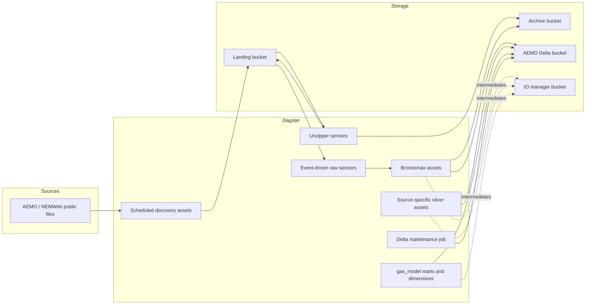
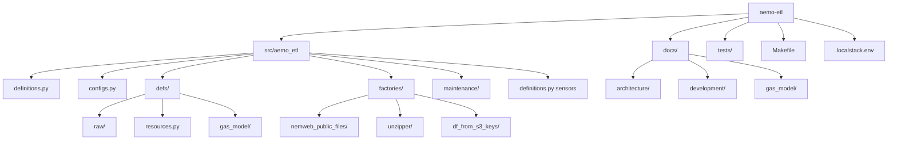
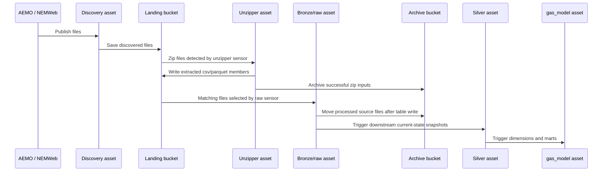

# aemo-etl

`aemo-etl` is a Dagster-based AEMO gas ETL project for discovering and ingesting AEMO/NEMWeb source files, staging raw datasets into Delta tables on S3-compatible storage, transforming source-specific silver and `gas_model` marts into parquet snapshot datasets, and supporting both LocalStack-backed local development and AWS execution.

## Table of contents

- [What the project does](#what-the-project-does)
- [High-level architecture](#high-level-architecture)
- [Ingestion flow](#ingestion-flow)
- [Data domains and asset layers](#data-domains-and-asset-layers)
- [Requirements and installation](#requirements-and-installation)
- [Environment configuration](#environment-configuration)
- [Running locally](#running-locally)
- [Common commands](#common-commands)
- [Project layout](#project-layout)
- [Further documentation](#further-documentation)

## What the project does

The project materializes Dagster assets defined under `src/aemo_etl/defs` to build a gas-market lakehouse on Delta tables.

- Scheduled NEMWeb discovery/listing assets poll `REPORTS/CURRENT/VicGas`,
  `REPORTS/CURRENT/GBB`, and the root CSV reports in `REPORTS/CURRENT/STTM`
  every 30 minutes and copy source files into landing storage.
- `download_vicgas_public_report_zip_files_job` and
  `download_sttm_day_zip_files_job` can be launched manually to bootstrap or
  backfill VicGas `PublicRptsNN.zip` and STTM `DAYNN.ZIP` bundles into landing
  storage with filename-preserving keys.
- Unzipper assets expand zipped source payloads in landing storage and archive the original zip files after successful extraction.
- Event-driven source-table bronze assets read matching landing files, collapse each micro-batch to the latest `source_file` row per `surrogate_key`, explicitly merge current-state Delta rows by `surrogate_key`, archive processed files only after a table write, delete zero-byte landing objects, and warn on skipped selected keys.
- Silver assets overwrite source-specific parquet snapshots from the current bronze state.
- `gas_model` assets combine GBB and VICGAS silver tables into shared dimensions and marts.
- `delta_table_vacuum_schedule` runs `delta_table_vacuum_job` daily at 02:00 Australia/Melbourne to compact and vacuum Delta-backed assets.
- `aemo-e2e-archive-seed` derives the full `gas_model` local **End-to-end test** seed spec from Dagster definitions and manages the ignored cached Archive seed under `backend-services/.e2e/aemo-etl`.

## High-level architecture





- Raw ingestion: `factories/nemweb_public_files`, `factories/unzipper`, and `factories/df_from_s3_keys` define three separate roles: discovery/listing bronze assets, unzipper extraction assets, and source-table bronze/silver ingestion assets. Source-table bronze writes current-state Delta tables through explicit ingestion logic, archives processed files only after a table write, deletes zero-byte landing objects, and reports skipped selected keys with a non-blocking WARN asset check; downstream silver assets and checks load bronze tables through a read-only Delta IO manager.
- Source-specific silver assets: `silver.gbb.*` and `silver.vicgas.*` assets deduplicate current source rows and expose consistent parquet snapshot datasets for downstream use.
- Gas-model marts: `src/aemo_etl/defs/gas_model` builds cross-source dimensions and fact tables from the source-specific silver layer.
- Storage: landing and archive buckets hold files; the AEMO bucket holds bronze Delta tables plus parquet snapshot datasets for source silver and `gas_model`; the IO manager bucket stores Dagster-managed intermediates.
- Orchestration: `src/aemo_etl/definitions.py` loads definitions from `src/aemo_etl/defs`, wires event-driven and failed-run sensors, and merges the scheduled Delta maintenance definitions from `src/aemo_etl/maintenance`. The source-table event-driven sensor defaults cap each bronze raw ingestion run request at 128 MB (128,000,000 bytes) and 25 selected landing files; these are source-table batching defaults, not the full repo **Fast check** or **Push check** configuration. The sensor blocks a failed job from repeating at the same job tags, but allows a retry when retry-relevant tags such as ECS CPU or memory change.
- Delta maintenance: `delta_table_vacuum_job` discovers assets backed by Delta IO managers and a `dagster/uri`, then uses per-asset `delta_maintenance/*` metadata. Missing metadata defaults to compacting and full-vacuuming with retention `0`, retention enforcement disabled, and `dry_run=False`.

Delta maintenance metadata is optional and flat:

- `delta_maintenance/enabled`: set `False` to skip the asset.
- `delta_maintenance/compact`: set `False` to skip compaction.
- `delta_maintenance/vacuum`: set `False` to skip vacuum.
- `delta_maintenance/retention_hours`: non-negative retention hours, default `0`.
- `delta_maintenance/enforce_retention_duration`: whether Delta enforces safe retention duration, default `False`.
- `delta_maintenance/dry_run`: set `True` to list removable files without deleting them.

## Ingestion flow



Detailed sequence diagrams for GBB, VICGAS, STTM, and raw-to-silver behavior live in [docs/architecture/ingestion_flows.md](docs/architecture/ingestion_flows.md).

## Data domains and asset layers

- `raw`: scheduled discovery/listing assets plus source-table bronze ingestion assets that capture current source-table state from landing storage into Delta tables. Source-table bronze stores bounded current state; append replay history remains in archive storage.
- `gbb`: source-specific silver assets for Gas Bulletin Board datasets such as flows, capacity, locations, linepack, and nomination data.
- `vicgas`: source-specific silver assets for Victorian gas reports such as operational meter readings, allocations, prices, linepack, heating values, and settlements.
- `sttm`: source-specific silver assets for Short Term Trading Market reports.
  STTM source-table bronze covers complete v19.1 spec-backed public report
  coverage for `INT651` through `INT684` and `INT687` through `INT691` from a
  compact checked-in manifest under `src/aemo_etl/defs/raw/sttm`; `INT685`
  and `INT685B` are live STTM root CSV reports but remain landing-only gaps
  because they are absent from the v19.1 specification. Manual STTM `DAYNN.ZIP`
  bootstrap writes bundles under `bronze/sttm/<filename>` for the STTM unzipper
  path; `CURRENTDAY.*` aliases stay out of the bootstrap/backfill path.
- `gas_model`: shared dimensions and marts that reconcile GBB and VICGAS source data into reporting-friendly tables.

Detailed gas-model ERDs remain under `docs/gas_model/`:

- [Gas dimensions ERD](docs/gas_model/gas_dim_erd.md)
- [Gas operations mart ERD](docs/gas_model/gas_operations_mart_erd.md)
- [Gas market mart ERD](docs/gas_model/gas_market_mart_erd.md)
- [Gas capacity and settlement mart ERD](docs/gas_model/gas_capacity_settlement_mart_erd.md)
- [Gas quality and status mart ERD](docs/gas_model/gas_quality_status_mart_erd.md)

## Requirements and installation

- Python `>=3.13,<3.14`
- [`uv`](https://docs.astral.sh/uv/)

Install dependencies with:

```bash
uv sync
```

## Environment configuration

The runtime configuration is driven primarily by environment variables read in `src/aemo_etl/configs.py`.

- `DEVELOPMENT_ENVIRONMENT`: logical environment name, defaults to `dev`.
- `DEVELOPMENT_LOCATION`: execution location, defaults to `local`. Use `aws` for deployed execution defaults.
- `NAME_PREFIX`: project prefix used in derived bucket names, defaults to `energy-market`.
- `AWS_ENDPOINT_URL`: optional S3/DynamoDB endpoint override. Set this for LocalStack workflows, typically through `.localstack.env`.
- `DAGSTER_FAILURE_ALERT_TOPIC_ARN`: optional SNS topic ARN for failed-run alerts. If unset, the alert sensor logs a warning and skips notification delivery.
- `DAGSTER_FAILURE_ALERT_BASE_URL`: optional Dagster UI base URL used in failed-run alert links.

Derived bucket names are built from `DEVELOPMENT_ENVIRONMENT` and `NAME_PREFIX`:

- `IO_MANAGER_BUCKET`: `{env}-{prefix}-io-manager`
- `LANDING_BUCKET`: `{env}-{prefix}-landing`
- `ARCHIVE_BUCKET`: `{env}-{prefix}-archive`
- `AEMO_BUCKET`: `{env}-{prefix}-aemo`

For LocalStack-backed runs and tests, expect local AWS-style credentials such as:

- `AWS_ACCESS_KEY_ID=test`
- `AWS_SECRET_ACCESS_KEY=test`
- `AWS_SESSION_TOKEN=test`
- `AWS_DEFAULT_REGION=ap-southeast-2`

Integration tests also set `AWS_ALLOW_HTTP=true` and `AWS_S3_LOCKING_PROVIDER=dynamodb` for local Delta workflows.

## Running locally

Use `.localstack.env` when you want Dagster and the ETL assets to talk to LocalStack instead of AWS:

```bash
source .localstack.env
```

LocalStack is required for local end-to-end ingestion or integration-test workflows because the project expects S3-compatible storage and DynamoDB-backed Delta locking. It is not required just to read the code or edit docs.

Start the local Dagster UI with:

```bash
dg dev
```

The local UI is available at `http://localhost:3000`.

Sensors and schedules default to stopped in local execution and default to running on AWS. That behavior comes from `DEVELOPMENT_LOCATION` in `src/aemo_etl/configs.py`.

The `aemo_etl_failed_run_alert_sensor` also follows that default. In AWS it sends
failed-run notifications through an AWS SNS topic when
`DAGSTER_FAILURE_ALERT_TOPIC_ARN` is configured.

Use the manual `ops/testing/failed_run_alert_probe` asset to create a real
failed run when validating the alert sensor in a live Dagster deployment. It is
not scheduled or sensor-triggered.

## Common commands

```bash
make unit-test
make component-test
make fast-test
make integration-test
make integration-test-testmon
make duplicate-check
make run-prek
uv run dg launch --job download_vicgas_public_report_zip_files_job
uv run dg launch --job download_sttm_day_zip_files_job
dg launch --assets "key:ops/testing/failed_run_alert_probe"
uv run aemo-e2e-archive-seed spec
uv run aemo-e2e-archive-seed refresh
uv run aemo-replay-bronze-archive --domain gbb
uv run aemo-replay-bronze-archive --domain sttm
uv run aemo-replay-bronze-archive --table gbb.bronze_gasbb_contacts --replace
```

`make run-prek` is this Subproject's **Commit check**. It runs the configured
hooks, including executable shell script header documentation for scripts.
Ruff enforces Google-style docstrings for public production ETL APIs and applies
the default `C901` complexity threshold across the Subproject. Tests,
generated-like raw source-table definitions, and TypedDict model specs are
outside the docstring ratchet.

`aemo-replay-bronze-archive` is dry-run unless `--replace` is present. Dry-run
reports matching archive files, planned batch count, total bytes, and target
Delta table URI for all source-table bronze assets (`--all`), one domain
(`--domain`), or one table (`--table`). Replace mode rebuilds from archive in
bounded batches; the first non-empty replay batch overwrites the target table,
and later batches merge on `surrogate_key`, update only when
`source_content_hash` changes, insert new keys, and retain target rows absent
from later files.

`aemo-e2e-archive-seed refresh` is opt-in and defaults to the live
`dev-energy-market-archive` bucket, 3 raw objects per required source table,
and 3 zip objects per required domain. It writes cached objects and
`seed-run-manifest.json` under `backend-services/.e2e/aemo-etl`; later
LocalStack runs can load that cache without live archive access.

## Project layout

```text
aemo-etl/
├── docs/
│   ├── architecture/
│   ├── development/
│   └── gas_model/
├── src/aemo_etl/
│   ├── configs.py
│   ├── cli/
│   ├── definitions.py
│   ├── defs/
│   ├── factories/
│   └── maintenance/
├── tests/
├── .localstack.env
├── Makefile
└── pyproject.toml
```

## Further documentation

- [Architecture overview](docs/architecture/high_level_architecture.md)
- [Ingestion sequence diagrams](docs/architecture/ingestion_flows.md)
- [Local development guide](docs/development/local_development.md)
- [ADR 0003: bounded current-state bronze source tables](../../../docs/adr/0003-bounded-current-state-bronze-source-tables.md)
- [Gas-model ERDs](docs/gas_model/)

## Sync metadata

- `sync.owner`: `docs`
- `sync.sources`:
  - `backend-services/dagster-user/aemo-etl/src/aemo_etl/definitions.py`
  - `backend-services/dagster-user/aemo-etl/src/aemo_etl/alerts.py`
  - `backend-services/dagster-user/aemo-etl/src/aemo_etl/maintenance/delta_tables.py`
  - `backend-services/dagster-user/aemo-etl/src/aemo_etl/configs.py`
  - `backend-services/dagster-user/aemo-etl/src/aemo_etl/defs/jobs/download_vicgas_public_report_zip_files.py`
  - `backend-services/dagster-user/aemo-etl/src/aemo_etl/defs/testing.py`
  - `backend-services/dagster-user/aemo-etl/src/aemo_etl/defs/raw/nemweb_public_files.py`
  - `backend-services/dagster-user/aemo-etl/src/aemo_etl/defs/raw/unzipper.py`
  - `backend-services/dagster-user/aemo-etl/src/aemo_etl/defs/raw/sttm/_manifest.py`
  - `backend-services/dagster-user/aemo-etl/src/aemo_etl/defs/raw/sttm/source_tables.json`
  - `backend-services/dagster-user/aemo-etl/src/aemo_etl/defs/raw/sttm/int651_v1_ex_ante_market_price_rpt_1.py`
  - `backend-services/dagster-user/aemo-etl/src/aemo_etl/defs/raw/sttm/int652_v1_ex_ante_schedule_quantity_rpt_1.py`
  - `backend-services/dagster-user/aemo-etl/src/aemo_etl/defs/raw/sttm/int653_v3_ex_ante_pipeline_price_rpt_1.py`
  - `backend-services/dagster-user/aemo-etl/src/aemo_etl/defs/raw/sttm/int654_v1_provisional_market_price_rpt_1.py`
  - `backend-services/dagster-user/aemo-etl/src/aemo_etl/defs/raw/sttm/int655_v1_provisional_schedule_quantity_rpt_1.py`
  - `backend-services/dagster-user/aemo-etl/src/aemo_etl/defs/raw/sttm/int656_v2_provisional_pipeline_data_rpt_1.py`
  - `backend-services/dagster-user/aemo-etl/src/aemo_etl/defs/raw/sttm/int657_v2_ex_post_market_data_rpt_1.py`
  - `backend-services/dagster-user/aemo-etl/src/aemo_etl/defs/raw/sttm/int658_v1_latest_allocation_quantity_rpt_1.py`
  - `backend-services/dagster-user/aemo-etl/src/aemo_etl/defs/raw/sttm/int659_v1_bid_offer_rpt_1.py`
  - `backend-services/dagster-user/aemo-etl/src/aemo_etl/defs/raw/sttm/int660_v1_contingency_gas_bids_and_offers_rpt_1.py`
  - `backend-services/dagster-user/aemo-etl/src/aemo_etl/defs/raw/sttm/int661_v1_contingency_gas_called_scheduled_bid_offer_rpt_1.py`
  - `backend-services/dagster-user/aemo-etl/src/aemo_etl/defs/raw/sttm/int662_v1_provisional_deviation_rpt_1.py`
  - `backend-services/dagster-user/aemo-etl/src/aemo_etl/defs/raw/sttm/int663_v1_provisional_variation_rpt_1.py`
  - `backend-services/dagster-user/aemo-etl/src/aemo_etl/defs/raw/sttm/int664_v1_daily_provisional_mos_allocation_rpt_1.py`
  - `backend-services/dagster-user/aemo-etl/src/aemo_etl/defs/raw/sttm/int665_v1_mos_stack_data_rpt_1.py`
  - `backend-services/dagster-user/aemo-etl/src/aemo_etl/defs/raw/sttm/int666_v1_market_notice_rpt_1.py`
  - `backend-services/dagster-user/aemo-etl/src/aemo_etl/defs/raw/sttm/int667_v1_market_parameters_rpt_1.py`
  - `backend-services/dagster-user/aemo-etl/src/aemo_etl/defs/raw/sttm/int668_v1_schedule_log_rpt_1.py`
  - `backend-services/dagster-user/aemo-etl/src/aemo_etl/defs/raw/sttm/int669_v1_settlement_version_rpt_1.py`
  - `backend-services/dagster-user/aemo-etl/src/aemo_etl/defs/raw/sttm/int670_v1_registered_participants_rpt_1.py`
  - `backend-services/dagster-user/aemo-etl/src/aemo_etl/defs/raw/sttm/int671_v1_hub_facility_definition_rpt_1.py`
  - `backend-services/dagster-user/aemo-etl/src/aemo_etl/defs/raw/sttm/int672_v1_cumulative_price_rpt_1.py`
  - `backend-services/dagster-user/aemo-etl/src/aemo_etl/defs/raw/sttm/int673_v1_total_contingency_bid_offer_rpt_1.py`
  - `backend-services/dagster-user/aemo-etl/src/aemo_etl/defs/raw/sttm/int674_v1_total_contingency_gas_schedules_rpt_1.py`
  - `backend-services/dagster-user/aemo-etl/src/aemo_etl/defs/raw/sttm/int675_v1_default_allocation_notice_rpt_1.py`
  - `backend-services/dagster-user/aemo-etl/src/aemo_etl/defs/raw/sttm/int676_v1_rolling_average_price_rpt_1.py`
  - `backend-services/dagster-user/aemo-etl/src/aemo_etl/defs/raw/sttm/int677_v1_contingency_gas_price_rpt_1.py`
  - `backend-services/dagster-user/aemo-etl/src/aemo_etl/defs/raw/sttm/int678_v1_net_market_balance_daily_amounts_rpt_1.py`
  - `backend-services/dagster-user/aemo-etl/src/aemo_etl/defs/raw/sttm/int679_v1_net_market_balance_settlement_amounts_rpt_1.py`
  - `backend-services/dagster-user/aemo-etl/src/aemo_etl/defs/raw/sttm/int680_v1_dp_flag_data_rpt_1.py`
  - `backend-services/dagster-user/aemo-etl/src/aemo_etl/defs/raw/sttm/int681_v1_daily_provisional_capacity_data_rpt_1.py`
  - `backend-services/dagster-user/aemo-etl/src/aemo_etl/defs/raw/sttm/int682_v1_settlement_mos_and_capacity_data_rpt_1.py`
  - `backend-services/dagster-user/aemo-etl/src/aemo_etl/defs/raw/sttm/int683_v1_provisional_used_mos_steps_rpt_1.py`
  - `backend-services/dagster-user/aemo-etl/src/aemo_etl/defs/raw/sttm/int684_v1_settlement_used_mos_steps_rpt_1.py`
  - `backend-services/dagster-user/aemo-etl/src/aemo_etl/defs/raw/sttm/int687_v1_facility_hub_capacity_data_rpt_1.py`
  - `backend-services/dagster-user/aemo-etl/src/aemo_etl/defs/raw/sttm/int688_v1_allocation_warning_limit_thresholds_rpt_1.py`
  - `backend-services/dagster-user/aemo-etl/src/aemo_etl/defs/raw/sttm/int689_v1_expost_allocation_quantity_rpt_1.py`
  - `backend-services/dagster-user/aemo-etl/src/aemo_etl/defs/raw/sttm/int690_v1_deviation_price_data_rpt_1.py`
  - `backend-services/dagster-user/aemo-etl/src/aemo_etl/defs/raw/sttm/int691_v1_sttm_ctp_register_rpt_1.py`
  - `backend-services/dagster-user/aemo-etl/src/aemo_etl/factories/df_from_s3_keys/current_state.py`
  - `backend-services/dagster-user/aemo-etl/src/aemo_etl/factories/df_from_s3_keys/assets.py`
  - `backend-services/dagster-user/aemo-etl/src/aemo_etl/factories/df_from_s3_keys/definitions.py`
  - `backend-services/dagster-user/aemo-etl/src/aemo_etl/factories/df_from_s3_keys/source_tables.py`
  - `backend-services/dagster-user/aemo-etl/src/aemo_etl/defs/resources.py`
  - `backend-services/dagster-user/aemo-etl/src/aemo_etl/maintenance/archive_replay.py`
  - `backend-services/dagster-user/aemo-etl/src/aemo_etl/cli/replay_bronze_archive.py`
  - `backend-services/dagster-user/aemo-etl/src/aemo_etl/maintenance/e2e_archive_seed.py`
  - `backend-services/dagster-user/aemo-etl/src/aemo_etl/cli/e2e_archive_seed.py`
  - `backend-services/dagster-user/aemo-etl/src/aemo_etl/factories/s3_pending_objects.py`
  - `backend-services/dagster-user/aemo-etl/src/aemo_etl/factories/unzipper/sensors.py`
  - `backend-services/dagster-user/aemo-etl/Makefile`
  - `backend-services/dagster-user/aemo-etl/.pre-commit-config.yaml`
  - `backend-services/dagster-user/aemo-etl/pyproject.toml`
  - `docs/adr/0003-bounded-current-state-bronze-source-tables.md`
- `sync.scope`: `architecture, tooling`
- `sync.qa`:
  - `git diff --name-only`
  - `rg -n "<changed-file-path>" README.md docs backend-services infrastructure`
  - `verify links, diagrams, commands, paths, ports, env vars, and names`
