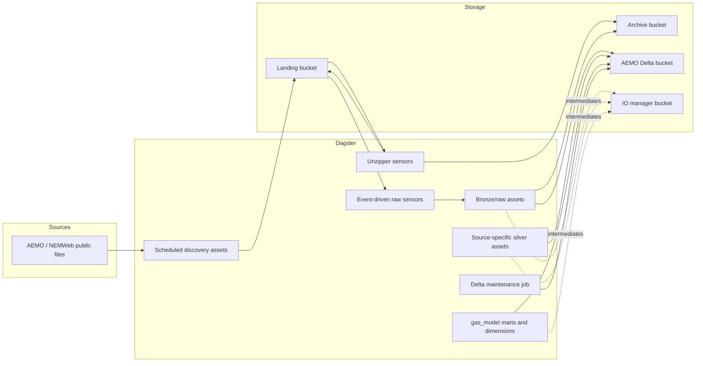
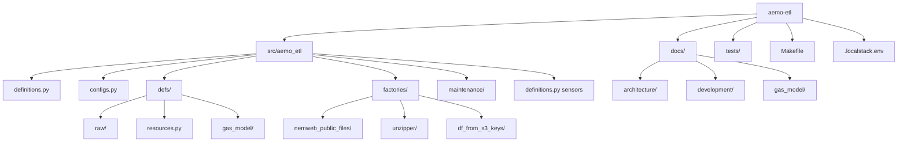
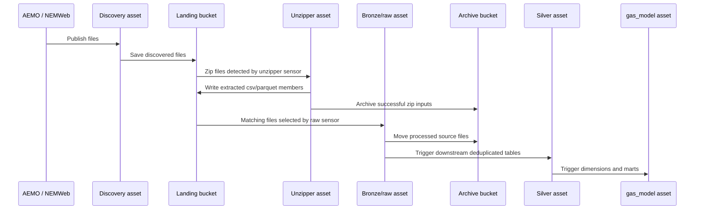

# aemo-etl

`aemo-etl` is a Dagster-based AEMO gas ETL project for discovering and ingesting AEMO/NEMWeb source files, staging raw datasets into Delta tables on S3-compatible storage, transforming source-specific silver and `gas_model` marts into parquet snapshot datasets, and supporting both LocalStack-backed local development and AWS execution.

## Table of contents

- [What the project does](#what-the-project-does)
- [High-level architecture](#high-level-architecture)
- [Ingestion flow](#ingestion-flow)
- [Data domains and asset layers](#data-domains-and-asset-layers)
- [Requirements and installation](#requirements-and-installation)
- [Environment configuration](#environment-configuration)
- [Running locally](#running-locally)
- [Common commands](#common-commands)
- [Project layout](#project-layout)
- [Further documentation](#further-documentation)

## What the project does

The project materializes Dagster assets defined under `src/aemo_etl/defs` to build a gas-market lakehouse on Delta tables.

- Scheduled NEMWeb discovery assets poll `REPORTS/CURRENT/VicGas` and `REPORTS/CURRENT/GBB` every 15 minutes and copy source files into landing storage.
- `download_vicgas_public_report_zip_files_job` can be launched manually to bootstrap or backfill VicGas `PublicRptsNN.zip` bundles into landing storage.
- Unzipper assets expand zipped source payloads in landing storage and archive the original zip files after successful extraction.
- Event-driven bronze assets read matching landing files, normalize them into partitioned Delta tables, and move processed source files into archive storage.
- Silver assets deduplicate the current source-specific state.
- `gas_model` assets combine GBB and VICGAS silver tables into shared dimensions and marts.
- `delta_table_vacuum_schedule` runs `delta_table_vacuum_job` daily at 02:00 Australia/Melbourne to compact and vacuum Delta-backed assets.

## High-level architecture





- Raw ingestion: `factories/nemweb_public_files`, `factories/unzipper`, and `factories/df_from_s3_keys` define the discovery, extraction, and bronze/silver ingestion patterns reused across many source tables.
- Source-specific silver assets: `silver.gbb.*` and `silver.vicgas.*` assets deduplicate current source rows and expose consistent parquet snapshot datasets for downstream use.
- Gas-model marts: `src/aemo_etl/defs/gas_model` builds cross-source dimensions and fact tables from the source-specific silver layer.
- Storage: landing and archive buckets hold files; the AEMO bucket holds bronze Delta tables plus parquet snapshot datasets for source silver and `gas_model`; the IO manager bucket stores Dagster-managed intermediates.
- Orchestration: `src/aemo_etl/definitions.py` loads definitions from `src/aemo_etl/defs`, wires event-driven and failed-run sensors, and merges the scheduled Delta maintenance definitions from `src/aemo_etl/maintenance`.
- Delta maintenance: `delta_table_vacuum_job` discovers assets backed by Delta IO managers and a `dagster/uri`, then uses per-asset `delta_maintenance/*` metadata. Missing metadata defaults to compacting and full-vacuuming with retention `0`, retention enforcement disabled, and `dry_run=False`.

Delta maintenance metadata is optional and flat:

- `delta_maintenance/enabled`: set `False` to skip the asset.
- `delta_maintenance/compact`: set `False` to skip compaction.
- `delta_maintenance/vacuum`: set `False` to skip vacuum.
- `delta_maintenance/retention_hours`: non-negative retention hours, default `0`.
- `delta_maintenance/enforce_retention_duration`: whether Delta enforces safe retention duration, default `False`.
- `delta_maintenance/dry_run`: set `True` to list removable files without deleting them.

## Ingestion flow



Detailed sequence diagrams for GBB, VICGAS, and raw-to-silver behavior live in [docs/architecture/ingestion_flows.md](docs/architecture/ingestion_flows.md).

## Data domains and asset layers

- `raw`: scheduled discovery assets plus bronze ingestion assets that capture full source datasets from landing storage into Delta tables.
- `gbb`: source-specific silver assets for Gas Bulletin Board datasets such as flows, capacity, locations, linepack, and nomination data.
- `vicgas`: source-specific silver assets for Victorian gas reports such as operational meter readings, allocations, prices, linepack, heating values, and settlements.
- `gas_model`: shared dimensions and marts that reconcile GBB and VICGAS source data into reporting-friendly tables.

Detailed gas-model ERDs remain under `docs/gas_model/`:

- [Gas dimensions ERD](docs/gas_model/gas_dim_erd.md)
- [Gas operations mart ERD](docs/gas_model/gas_operations_mart_erd.md)
- [Gas market mart ERD](docs/gas_model/gas_market_mart_erd.md)
- [Gas capacity and settlement mart ERD](docs/gas_model/gas_capacity_settlement_mart_erd.md)
- [Gas quality and status mart ERD](docs/gas_model/gas_quality_status_mart_erd.md)

## Requirements and installation

- Python `>=3.13,<3.14`
- [`uv`](https://docs.astral.sh/uv/)

Install dependencies with:

```bash
uv sync
```

## Environment configuration

The runtime configuration is driven primarily by environment variables read in `src/aemo_etl/configs.py`.

- `DEVELOPMENT_ENVIRONMENT`: logical environment name, defaults to `dev`.
- `DEVELOPMENT_LOCATION`: execution location, defaults to `local`. Use `aws` for deployed execution defaults.
- `NAME_PREFIX`: project prefix used in derived bucket names, defaults to `energy-market`.
- `AWS_ENDPOINT_URL`: optional S3/DynamoDB endpoint override. Set this for LocalStack workflows, typically through `.localstack.env`.
- `DAGSTER_FAILURE_ALERT_TOPIC_ARN`: optional SNS topic ARN for failed-run alerts. If unset, the alert sensor logs a warning and skips notification delivery.
- `DAGSTER_FAILURE_ALERT_BASE_URL`: optional Dagster UI base URL used in failed-run alert links.

Derived bucket names are built from `DEVELOPMENT_ENVIRONMENT` and `NAME_PREFIX`:

- `IO_MANAGER_BUCKET`: `{env}-{prefix}-io-manager`
- `LANDING_BUCKET`: `{env}-{prefix}-landing`
- `ARCHIVE_BUCKET`: `{env}-{prefix}-archive`
- `AEMO_BUCKET`: `{env}-{prefix}-aemo`

For LocalStack-backed runs and tests, expect local AWS-style credentials such as:

- `AWS_ACCESS_KEY_ID=test`
- `AWS_SECRET_ACCESS_KEY=test`
- `AWS_SESSION_TOKEN=test`
- `AWS_DEFAULT_REGION=ap-southeast-2`

Integration tests also set `AWS_ALLOW_HTTP=true` and `AWS_S3_LOCKING_PROVIDER=dynamodb` for local Delta workflows.

## Running locally

Use `.localstack.env` when you want Dagster and the ETL assets to talk to LocalStack instead of AWS:

```bash
source .localstack.env
```

LocalStack is required for local end-to-end ingestion or integration-test workflows because the project expects S3-compatible storage and DynamoDB-backed Delta locking. It is not required just to read the code or edit docs.

Start the local Dagster UI with:

```bash
dg dev
```

The local UI is available at `http://localhost:3000`.

Sensors and schedules default to stopped in local execution and default to running on AWS. That behavior comes from `DEVELOPMENT_LOCATION` in `src/aemo_etl/configs.py`.

The `aemo_etl_failed_run_alert_sensor` also follows that default. In AWS it sends
failed-run notifications through an AWS SNS topic when
`DAGSTER_FAILURE_ALERT_TOPIC_ARN` is configured.

Use the manual `ops/testing/failed_run_alert_probe` asset to create a real
failed run when validating the alert sensor in a live Dagster deployment. It is
not scheduled or sensor-triggered.

## Common commands

```bash
make unit-test
make component-test
make fast-test
make integration-test
make integration-test-testmon
make duplicate-check
make run-prek
uv run dg launch --job download_vicgas_public_report_zip_files_job
dg launch --assets "key:ops/testing/failed_run_alert_probe"
```

## Project layout

```text
aemo-etl/
├── docs/
│   ├── architecture/
│   ├── development/
│   └── gas_model/
├── src/aemo_etl/
│   ├── configs.py
│   ├── definitions.py
│   ├── defs/
│   ├── factories/
│   └── maintenance/
├── tests/
├── .localstack.env
├── Makefile
└── pyproject.toml
```

## Further documentation

- [Architecture overview](docs/architecture/high_level_architecture.md)
- [Ingestion sequence diagrams](docs/architecture/ingestion_flows.md)
- [Local development guide](docs/development/local_development.md)
- [Gas-model ERDs](docs/gas_model/)

## Sync metadata

- `sync.owner`: `docs`
- `sync.sources`:
  - `backend-services/dagster-user/aemo-etl/src/aemo_etl/definitions.py`
  - `backend-services/dagster-user/aemo-etl/src/aemo_etl/alerts.py`
  - `backend-services/dagster-user/aemo-etl/src/aemo_etl/maintenance/delta_tables.py`
  - `backend-services/dagster-user/aemo-etl/src/aemo_etl/configs.py`
  - `backend-services/dagster-user/aemo-etl/src/aemo_etl/defs/jobs/download_vicgas_public_report_zip_files.py`
  - `backend-services/dagster-user/aemo-etl/src/aemo_etl/defs/testing.py`
  - `backend-services/dagster-user/aemo-etl/src/aemo_etl/defs/raw/nemweb_public_files.py`
  - `backend-services/dagster-user/aemo-etl/src/aemo_etl/factories/df_from_s3_keys/assets.py`
  - `backend-services/dagster-user/aemo-etl/src/aemo_etl/factories/df_from_s3_keys/definitions.py`
  - `backend-services/dagster-user/aemo-etl/src/aemo_etl/defs/resources.py`
  - `backend-services/dagster-user/aemo-etl/Makefile`
  - `backend-services/dagster-user/aemo-etl/.pre-commit-config.yaml`
- `sync.scope`: `architecture`
- `sync.qa`:
  - `git diff --name-only`
  - `rg -n "<changed-file-path>" README.md docs backend-services infrastructure`
  - `verify links, diagrams, commands, paths, ports, env vars, and names`
