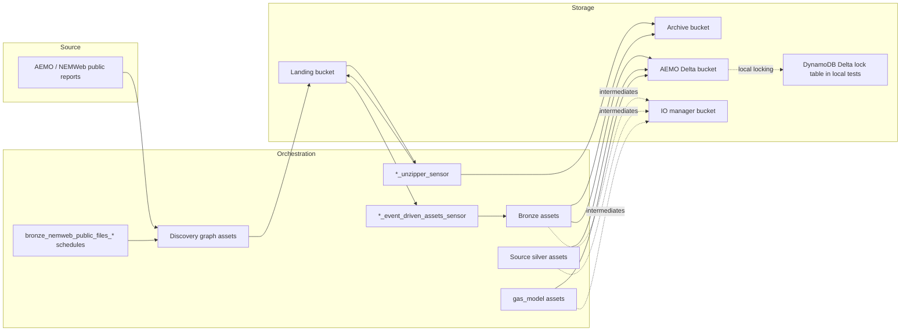
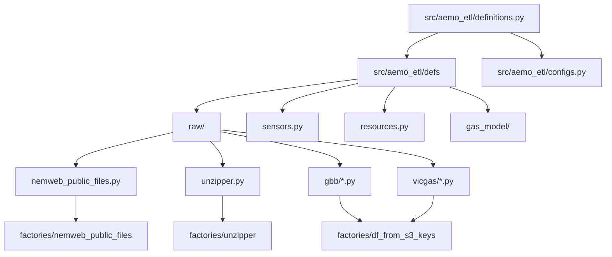

# High-Level Architecture

This project packages Dagster definitions for ingesting public AEMO gas files into bronze Delta tables and then transforming those source-specific datasets into parquet-backed source silver and shared `gas_model` layers.

## Table of contents

- [Runtime overview](#runtime-overview)
- [How definitions are loaded](#how-definitions-are-loaded)
- [Component roles](#component-roles)
- [Sensors and automation](#sensors-and-automation)
- [Storage model](#storage-model)
- [S3-backed IO managers](#s3-backed-io-managers)
- [Module map](#module-map)
- [Related docs](#related-docs)

## Runtime overview

## How definitions are loaded

`src/aemo_etl/definitions.py` is the project entrypoint for Dagster. It does two things:

1. Declares shared resources:
   - `s3`: `dagster_aws.s3.S3Resource`
   - `io_manager`: Dagster's S3 pickle IO manager pointing at `IO_MANAGER_BUCKET`
   - ECS executor when `DEVELOPMENT_LOCATION == "aws"`
2. Calls `load_from_defs_folder(path_within_project=Path(__file__).parent)` to discover all definitions under `src/aemo_etl/defs`.

That means the actual asset topology is assembled from small modules in:

- `src/aemo_etl/defs/raw`
- `src/aemo_etl/defs/sensors.py`
- `src/aemo_etl/defs/resources.py`
- `src/aemo_etl/defs/gas_model`

## Component roles

### Discovery assets

`src/aemo_etl/defs/raw/nemweb_public_files.py` registers the scheduled discovery assets:

- `bronze_nemweb_public_files_vicgas`
- `bronze_nemweb_public_files_gbb`

These are created by `factories/nemweb_public_files/definitions.py`. Each one:

- polls a NEMWeb folder every 15 minutes
- filters links
- downloads or converts discovered source files into landing storage
- records a Delta table of discovered file metadata in the AEMO bucket

### Unzipper assets

`src/aemo_etl/defs/raw/unzipper.py` registers one unzipper asset per domain:

- `unzipper_vicgas`
- `unzipper_gbb`

Those assets are sensor-driven, look for `*.zip` objects in landing storage, expand members in place, convert CSV members to Parquet when possible, and archive the original zip only after all members succeed.

### Bronze and source silver assets

The source-table modules under `src/aemo_etl/defs/raw/gbb` and `src/aemo_etl/defs/raw/vicgas` are generated from `factories/df_from_s3_keys/definitions.py`.

For each source table the factory creates:

- one bronze asset under `bronze/<domain>/...`
- one source-specific silver asset under `silver/<domain>/...`
- schema and duplicate-row checks

The bronze asset:

- receives S3 object keys from a sensor run config
- reads bytes from landing storage
- applies optional preprocessing hooks
- writes a partitioned Delta append table into the AEMO bucket
- archives processed source files by moving them from landing to archive

The corresponding silver asset:

- reads the bronze Delta table
- sorts and deduplicates by `surrogate_key`
- overwrites the current parquet snapshot in the AEMO bucket
- auto-materializes when its bronze dependency changes

### Gas-model assets

`src/aemo_etl/defs/gas_model` contains curated dimensions and fact tables such as:

- `silver_gas_dim_date`
- `silver_gas_dim_operational_point`
- `silver_gas_fact_operational_meter_flow`

These assets consume the source silver layer and publish shared dimensions and marts back into `silver/gas_model/...` parquet snapshot datasets.

## Sensors and automation

`src/aemo_etl/defs/sensors.py` wires three orchestration patterns:

- `vicgas_unzipper_sensor` and `gbb_unzipper_sensor`
  - watch landing storage for `*.zip`
  - launch unzipper assets with matching S3 keys
- `vicgas_event_driven_assets_sensor` and `gbb_event_driven_assets_sensor`
  - watch landing storage for file patterns declared on bronze assets
  - launch bronze ingestion assets with matching S3 keys
- `default_automation_condition_sensor`
  - covers everything else
  - lets the non-event-driven silver and `gas_model` assets materialize when dependencies update

Locally these sensors default to stopped. On AWS they default to running.

## Storage model

Bucket naming comes from `src/aemo_etl/configs.py`:

- `LANDING_BUCKET`: incoming files ready for unzip or bronze ingestion
- `ARCHIVE_BUCKET`: successfully processed raw source files and zips
- `AEMO_BUCKET`: Delta table storage for bronze assets and parquet snapshot storage for source silver and `gas_model` assets
- `IO_MANAGER_BUCKET`: Dagster IO manager payloads and intermediates

All bucket names are derived from:

- `DEVELOPMENT_ENVIRONMENT`
- `NAME_PREFIX`

Example defaults:

- `dev-energy-market-landing`
- `dev-energy-market-archive`
- `dev-energy-market-aemo`
- `dev-energy-market-io-manager`

## S3-backed IO managers

`src/aemo_etl/defs/resources.py` defines three Delta-oriented IO managers plus one Parquet overwrite IO manager:

- `aemo_deltalake_append_io_manager`
  - append mode with schema merge
- `aemo_deltalake_overwrite_io_manager`
  - overwrite mode with schema merge
- `aemo_deltalake_ingest_partitioned_append_io_manager`
  - append mode partitioned by `ingested_date`
- `aemo_parquet_overwrite_io_manager`
  - overwrites a Parquet dataset directory with the current snapshot

The Delta managers persist `polars.LazyFrame` outputs to Delta tables in the AEMO bucket using the `dagster/uri` asset metadata. The Parquet manager overwrites a Parquet dataset directory at the same metadata URI contract. All managers publish preview, row count, and schema metadata back into Dagster.

## Module map

## Related docs

- [Ingestion sequence diagrams](ingestion_flows.md)
- [Local development guide](../development/local_development.md)
- [Gas-model ERDs](../gas_model/)

## Sync metadata

- `sync.owner`: `docs`
- `sync.sources`:
  - `backend-services/dagster-user/aemo-etl/src/aemo_etl/definitions.py`
  - `backend-services/dagster-user/aemo-etl/src/aemo_etl/defs/sensors.py`
  - `backend-services/dagster-user/aemo-etl/src/aemo_etl/defs/raw/nemweb_public_files.py`
  - `backend-services/dagster-user/aemo-etl/src/aemo_etl/defs/resources.py`
  - `backend-services/dagster-user/aemo-etl/src/aemo_etl/factories/df_from_s3_keys/definitions.py`
  - `backend-services/dagster-user/aemo-etl/src/aemo_etl/defs/raw/table_metadata.py`
  - `backend-services/dagster-user/aemo-etl/src/aemo_etl/defs/gas_model/silver_gas_fact_operational_meter_flow.py`
- `sync.scope`: `architecture`
- `sync.qa`:
  - `git diff --name-only`
  - `rg -n "<changed-file-path>" README.md docs backend-services infrastructure`
  - `verify links, diagrams, commands, paths, ports, env vars, and names`
