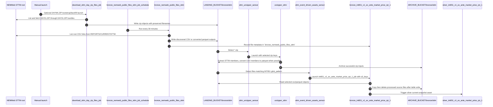
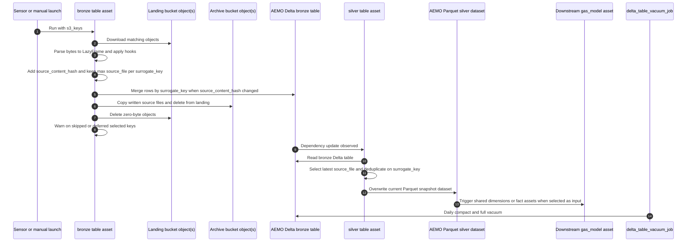

# Ingestion Flows

These diagrams show the main ingestion paths implemented by the current factories and definition modules. They stay close to the repo's real layers: scheduled NEMWeb discovery, landing and archive buckets, unzipper assets, bronze ingestion assets, source silver assets, and downstream `gas_model` automation.

## Table of contents

- [GBB ingestion flow](#gbb-ingestion-flow)
- [VICGAS ingestion flow](#vicgas-ingestion-flow)
- [STTM ingestion flow](#sttm-ingestion-flow)
- [Raw-to-silver transformation flow](#raw-to-silver-transformation-flow)
- [LocalStack and S3-compatible behavior](#localstack-and-s3-compatible-behavior)
- [Related docs](#related-docs)

## GBB ingestion flow

Trigger and output notes:

- The first step is schedule-driven from `src/aemo_etl/defs/raw/nemweb_public_files.py`.
- The unzip and bronze steps are sensor-driven from `src/aemo_etl/definitions.py`; that module also registers the failed-run alert sensor, which is not part of the ingestion data path shown here. Source-table bronze raw sensors select at most 128 MB (128,000,000 bytes) and 25 landing files per run request by default. Those caps are source-table batching defaults, not the full repo **Fast check** or **Push check** configuration. The source-table sensor suppresses repeated launches after a failed job at the same job tags, while allowing a retry after retry-relevant tags such as ECS CPU or memory change.
- Outputs land in Delta tables under the AEMO bucket plus archived source files
  under `ARCHIVE_BUCKET/bronze/gbb`. Processed source files are archived only
  after a table write; zero-byte landing objects are deleted; missing,
  unsupported, and deferred selected keys produce a non-blocking WARN asset
  check.

## VICGAS ingestion flow

Trigger and output notes:

- This follows the same factory pattern as GBB, but the downstream assets are the `int*` VICGAS report assets under `src/aemo_etl/defs/raw/vicgas`.
- `download_vicgas_public_report_zip_files_job` is ad hoc only. It is used for
  bootstrap or backfill of `PublicRptsNN.zip` bundles into
  `LANDING_BUCKET/bronze/vicgas/<filename>`; the existing unzipper and raw
  sensors handle downstream processing. Its `target_files` config is
  basename-only, case-insensitive, and defaults to all matching bundles.
- The bronze assets merge current-state Delta rows by `surrogate_key` after
  collapsing each micro-batch to the maximum `source_file` per key, archive
  processed source files only after a table write, delete zero-byte landing
  objects, and warn on skipped selected keys; the silver assets overwrite the
  current parquet snapshot.

## STTM ingestion flow

Trigger and output notes:

- STTM is a source-table bronze domain inside the AEMO ETL Subproject. It is
  not a Subproject.
- Discovery is root-only for public STTM CSV reports. It excludes
  `CURRENTDAY.*`, `DAYNN.ZIP`, `Contingency_Gas/`, `MOS Estimates/`, and other
  subfolder content. `download_sttm_day_zip_files_job` owns DAYNN.ZIP
  bootstrap/backfill separately and writes bundles to
  `LANDING_BUCKET/bronze/sttm/<filename>` so `sttm_unzipper_sensor` can launch
  `unzipper_sttm`.
- STTM DAYNN.ZIP target selection uses basename regex matching for `DAY01.ZIP`
  through `DAY31.ZIP`, de-duplicates listing entries, processes deterministically,
  skips current-day aliases, and fails fast for invalid or missing
  `target_files` config.
- `INT651` is the first spec-backed STTM source-table asset. Its compact
  manifest lives under `src/aemo_etl/defs/raw/sttm`, declares every source
  report column as `String`, and keeps the standard ingestion metadata columns.
- `INT685` and `INT685B` appear as live root CSV reports but are absent from
  the v19.1 STTM report specification manifest. Discovery may land those files,
  but they are landing-only gaps until a spec-backed source-table entry exists.

## Raw-to-silver transformation flow

Trigger and output notes:

- The bronze run can come from an event-driven sensor or from a manual asset launch with explicit `s3_keys`.
- Bronze writes current-state Delta rows through explicit `df_from_s3_keys` ingestion logic. It archives processed landing files only after a table write, deletes zero-byte landing objects after the write helper returns normally, and emits `check_skipped_s3_keys` as a non-blocking WARN asset check for missing, unsupported, or deferred selected keys. Downstream silver assets and checks load existing bronze Delta tables through `aemo_deltalake_source_table_bronze_read_io_manager`; `df_from_s3_keys` silver uses `aemo_parquet_overwrite_io_manager`.
- Source-table bronze assets are current-state Delta tables, not append-history
  tables. Discovery/listing assets such as `bronze_nemweb_public_files_*` and
  extraction assets such as `unzipper_*` are separate ingestion roles.
- `source_content_hash` is calculated from declared source columns, while
  `surrogate_key` is generated from each table's configured key columns. The
  merge updates a matched `surrogate_key` only when the hash changes and inserts
  new keys; target rows absent from a later source file remain in bronze.
- `aemo-replay-bronze-archive` rebuilds source-table bronze Delta tables from
  archive storage. It can target all source-table bronze assets, one domain, or
  one table; dry-run is the default and reports matching archive files, planned
  batch count, total bytes, and target table URI. `--replace` is required before
  it overwrites the first non-empty replay batch and then merges later batches
  with the same current-state predicate.
- `delta_table_vacuum_schedule` runs daily at 02:00 Australia/Melbourne and uses each Delta asset's `delta_maintenance/*` metadata, defaulting to compact plus full vacuum retention `0`.
- A representative downstream example is `silver_gas_fact_operational_meter_flow`, which reads VICGAS silver inputs plus shared dimensions and writes a `silver/gas_model/...` parquet snapshot dataset.
- Downstream `gas_model` silver assets retry failed materializations up to three times with a 60-second exponential backoff and plus/minus jitter.

## LocalStack and S3-compatible behavior

When `AWS_ENDPOINT_URL` points at LocalStack, the same flow runs against local
S3-compatible storage rather than AWS. Integration tests also create a
`delta_log` DynamoDB table so Delta locking works for local **End-to-end test**
materializations. For local **End-to-end test** setup,
`aemo-e2e-archive-seed` can refresh the ignored cached Archive seed for the full
`gas_model` target and load the cached objects into LocalStack landing storage
before Dagster starts. The default seed slice is 3 raw objects per required
source table and 3 zip objects per required domain.

## Related docs

- [High-level architecture](high_level_architecture.md)
- [Local development guide](../development/local_development.md)
- [ADR 0003: bounded current-state bronze source tables](../../../../../docs/adr/0003-bounded-current-state-bronze-source-tables.md)
- [Gas-model ERDs](../gas_model/)

## Sync metadata

- `sync.owner`: `docs`
- `sync.sources`:
  - `backend-services/dagster-user/aemo-etl/src/aemo_etl/defs/raw/nemweb_public_files.py`
  - `backend-services/dagster-user/aemo-etl/src/aemo_etl/defs/raw/sttm/_manifest.py`
  - `backend-services/dagster-user/aemo-etl/src/aemo_etl/defs/raw/sttm/source_tables.json`
  - `backend-services/dagster-user/aemo-etl/src/aemo_etl/defs/raw/sttm/int651_v1_ex_ante_market_price_rpt_1.py`
  - `backend-services/dagster-user/aemo-etl/src/aemo_etl/defs/jobs/download_vicgas_public_report_zip_files.py`
  - `backend-services/dagster-user/aemo-etl/src/aemo_etl/defs/raw/unzipper.py`
  - `backend-services/dagster-user/aemo-etl/src/aemo_etl/alerts.py`
  - `backend-services/dagster-user/aemo-etl/src/aemo_etl/definitions.py`
  - `backend-services/dagster-user/aemo-etl/src/aemo_etl/factories/df_from_s3_keys/current_state.py`
  - `backend-services/dagster-user/aemo-etl/src/aemo_etl/factories/df_from_s3_keys/assets.py`
  - `backend-services/dagster-user/aemo-etl/src/aemo_etl/factories/df_from_s3_keys/definitions.py`
  - `backend-services/dagster-user/aemo-etl/src/aemo_etl/factories/df_from_s3_keys/source_tables.py`
  - `backend-services/dagster-user/aemo-etl/src/aemo_etl/factories/s3_pending_objects.py`
  - `backend-services/dagster-user/aemo-etl/src/aemo_etl/maintenance/delta_tables.py`
  - `backend-services/dagster-user/aemo-etl/src/aemo_etl/maintenance/archive_replay.py`
  - `backend-services/dagster-user/aemo-etl/src/aemo_etl/cli/replay_bronze_archive.py`
  - `backend-services/dagster-user/aemo-etl/src/aemo_etl/maintenance/e2e_archive_seed.py`
  - `backend-services/dagster-user/aemo-etl/src/aemo_etl/cli/e2e_archive_seed.py`
  - `backend-services/dagster-user/aemo-etl/src/aemo_etl/defs/resources.py`
  - `backend-services/dagster-user/aemo-etl/src/aemo_etl/defs/gas_model/silver_gas_fact_operational_meter_flow.py`
  - `backend-services/dagster-user/aemo-etl/src/aemo_etl/factories/unzipper/definitions.py`
  - `backend-services/dagster-user/aemo-etl/src/aemo_etl/factories/unzipper/sensors.py`
  - `docs/adr/0003-bounded-current-state-bronze-source-tables.md`
- `sync.scope`: `behavior`
- `sync.qa`:
  - `git diff --name-only`
  - `rg -n "<changed-file-path>" README.md docs backend-services infrastructure`
  - `verify links, diagrams, commands, paths, ports, env vars, and names`
