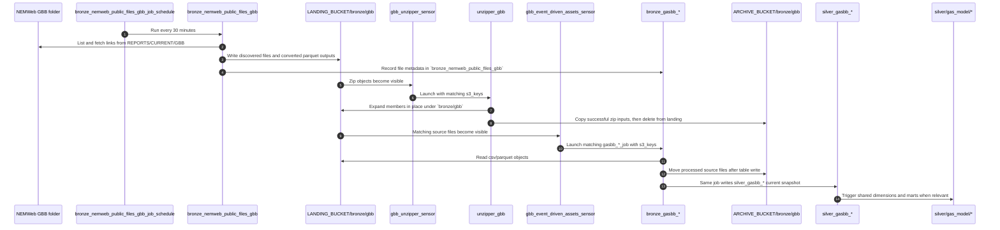
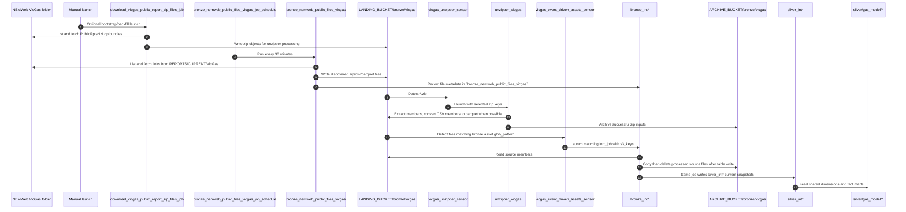
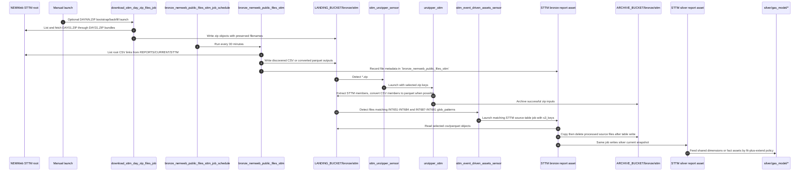
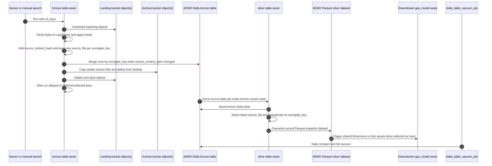

# Ingestion Flows

These diagrams show the main ingestion paths implemented by the current factories and definition modules. They stay close to the repo's real layers: scheduled NEMWeb discovery, manifest-backed AEMO gas document ingestion, landing and archive buckets, unzipper assets, bronze ingestion assets, source silver assets, and downstream `gas_model` automation.

## Table of contents

- [Source-table current-state reader journey](#source-table-current-state-reader-journey)
- [Archive source coverage, cached seed, and bronze replay journey](#archive-source-coverage-cached-seed-and-bronze-replay-journey)
- [GBB ingestion flow](#gbb-ingestion-flow)
- [VICGAS ingestion flow](#vicgas-ingestion-flow)
- [STTM ingestion flow](#sttm-ingestion-flow)
- [AEMO gas document source flow](#aemo-gas-document-source-flow)
- [Raw-to-silver transformation flow](#raw-to-silver-transformation-flow)
- [LocalStack and S3-compatible behavior](#localstack-and-s3-compatible-behavior)
- [Related docs](#related-docs)

## Source-table current-state reader journey

This section follows the GBB, STTM, and VICGAS source-table path from source
definition to current-state bronze and source silver output. It covers the
assets generated by `factories/df_from_s3_keys`. The scheduled
`bronze_nemweb_public_files_*` discovery/listing assets and `unzipper_*`
extraction assets have separate ingestion roles.

### 1. A source-table definition registers the contract

Each source table is defined in a domain module under `src/aemo_etl/defs/raw`.
GBB and VICGAS modules declare their source-table fields in Python. STTM modules
load compact v19.1 manifest entries from `src/aemo_etl/defs/raw/sttm`.

The module calls `df_from_s3_keys_definitions_factory`, which records the
source-table contract in two places:

- Dagster receives one bronze asset, one source silver asset, schema checks,
  duplicate-row checks, and one `<name_suffix>_job`.
- `register_source_table_spec` records a `DFFromS3KeysSourceTableSpec` for
  archive replay and recovery planning.

A maintainer should read these fields as one contract:

- `domain`: selects the landing/archive prefix such as `bronze/gbb`.
- `name_suffix`: names the bronze asset, silver asset, and Dagster job.
- `glob_pattern`: selects pending landing objects for the bronze asset.
- `schema`: declares the source columns plus ingestion metadata columns.
- `surrogate_key_sources`: declares the source columns that identify one
  current-state row.
- `report_family`: places the asset in the Source report family group and tags.
- `bronze_postprocess_object_hooks`: clean raw bytes before parsing and
  `surrogate_key` generation.
- `bronze_postprocess_lazyframe_hooks`: clean parsed rows after
  `surrogate_key` generation and before `source_file` and
  `source_content_hash` are added.

The factory also records `surrogate_key_sources`, `source_content_hash_sources`,
`dagster/uri`, `glob_pattern`, and table names in Dagster metadata. Those
metadata fields are the first place to inspect when a materialization selects
unexpected objects, creates duplicate keys, or feeds an unexpected downstream
asset.

### 2. Discovery and unzipper assets create landing objects

Scheduled NEMWeb discovery assets write public report files or converted
outputs into `LANDING_BUCKET/bronze/<domain>`. Some source files arrive as zip
bundles. The domain unzipper sensor launches `unzipper_<domain>` for matching
zip objects, the unzipper expands members back into landing storage, and the
zip input moves to `ARCHIVE_BUCKET/bronze/<domain>` after successful extraction.

Landing objects are therefore pending source-table inputs. Archive objects are
successfully processed raw inputs or successful zip inputs. Source-table bronze
ingestion reads from landing and writes processed source files to the same key
under archive after the current-state write path returns.

### 3. The event-driven sensor selects pending source-table objects

`src/aemo_etl/definitions.py` wires
`vicgas_event_driven_assets_sensor`, `gbb_event_driven_assets_sensor`, and
`sttm_event_driven_assets_sensor`. Each sensor scans its landing prefix, reads
each bronze asset's `glob_pattern` metadata, and builds a run request for the
matching `<name_suffix>_job`.

The run config passes selected landing keys to the bronze asset as `s3_keys`.
The default source-table caps are 128 MB (128,000,000 bytes) and 25 selected
files per bronze run request. The sensor skips a launch when the matching job is
already active. It also suppresses repeated launches after the latest completed
run for that job failed with the same retry-relevant job tags, while a change to
tags such as ECS CPU or memory permits a new launch.

When a file remains in landing, a maintainer should check the sensor decision
before changing source-table code: confirm the object key matches the intended
`glob_pattern`, the object falls within the byte and file caps, no active run
already owns the job, and no failed run with the same job tags is blocking a
repeat launch.

### 4. The bronze asset parses selected keys and classifies outcomes

`bronze_df_from_s3_keys_asset_factory` builds the bronze asset body. During a
run it de-duplicates the configured `s3_keys` order and stages each selected
object:

- unsupported file extensions are reported as skipped
- missing keys are reported as skipped
- zero-byte objects are tracked for deletion after the write helper returns
- supported non-empty objects are read from landing, parsed, normalized, and
  staged into a local Delta batch

CSV source-table parsing accepts declared headers or schema-ordered headerless
rows. Physical CSV lines containing NUL bytes are dropped before
`surrogate_key` and `source_content_hash` are calculated. Parquet and other
registered file types use the shared bytes-to-LazyFrame parser.

For each non-empty object, the bronze parser adds ingestion timestamps, fills
missing declared surrogate-key columns with nulls when the source frame is
empty, builds `surrogate_key` from `surrogate_key_sources`, runs lazyframe
hooks, sets `source_file` to the future archive URI, casts declared columns, and
adds `source_content_hash`. The hash covers declared source columns and excludes
ingestion metadata, `surrogate_key`, `source_file`, and
`source_content_hash`.

### 5. The current-state write keeps bounded bronze rows

The staged source rows collapse to one current-state batch before the Delta
write. `collapse_current_state_batch` keeps rows from the maximum `source_file`
per `surrogate_key`. If the latest source-file rows still contain the same
`surrogate_key` with different `source_content_hash` values, the run fails with
sampled duplicate-key diagnostics. That failure points to a too-shallow
`surrogate_key_sources` definition or a missing source-specific dedupe hook.

`write_source_table_current_state_batch` writes the batch to the bronze Delta
table:

- first table write uses append mode
- `--replace` archive replay uses overwrite mode for the first non-empty batch
- existing tables use Delta merge with
  `source.surrogate_key = target.surrogate_key`
- matched rows update when the target hash is missing or differs from the
  source hash
- unmatched source rows insert
- target rows with no matching source row remain in place

That last rule makes source-table bronze a bounded current-state table with
no-delete-on-absence semantics. If a later AEMO file omits an older
`surrogate_key`, bronze keeps the older row until an explicit deletion design
exists.

### 6. Landing finalization and asset checks show what still needs attention

After the write helper returns, the bronze asset finalizes selected landing
objects:

- processed keys move from landing to archive when the helper wrote a table
- processed keys also move to archive for a zero-row batch that required no
  table change
- non-empty processed keys stay in landing when no table write occurred
- zero-byte keys are deleted after the helper returns
- missing and unsupported selected keys stay unresolved

The materialization metadata records processed, archived, zero-byte, deleted,
missing, unsupported, and deferred counts. The inline
`check_skipped_s3_keys` asset check uses WARN severity and does not block the
materialization. Inspect that check whenever selected non-empty objects remain
missing, unsupported, or deferred in landing.

### 7. Source silver and recovery paths read the bounded bronze table

The paired source silver asset depends on the bronze asset and belongs to the
same `<name_suffix>_job`. When an event-driven source-table sensor launches that
job, Dagster runs the bronze asset and then the source silver asset in the same
run. The source-table bronze asset's IO manager is read-only for downstream
reads; the bronze asset itself wrote current-state rows through explicit
`df_from_s3_keys` logic. Source silver loads bronze, keeps the latest
`source_file` row per `surrogate_key`, and overwrites the current Parquet
snapshot in the AEMO bucket.

Archive storage remains the replay source for rebuilds. Use
`aemo-replay-bronze-archive` from the AEMO ETL Subproject when source-table
bronze must be rebuilt from archive. Dry-run is the default and reports the
matching archive files, planned batches, total bytes, and target Delta table
URI. `--replace` applies the destructive rebuild after the operator has checked
the dry-run scope.

Before changing a source-table definition or surrogate key, inspect the source
spec, Dagster metadata, current duplicate-key or skipped-key checks, the archive
scope for the table, downstream source silver and `gas_model` consumers, and ADR
[0003](../../../../../docs/adr/0003-bounded-current-state-bronze-source-tables.md).
If the change affects `surrogate_key_sources` for an existing source table,
normal ingestion will not delete rows that were retained under the old key.
Ralph **Promotion** can record table-specific archive replay guidance, but the
operator owns the dry-run and `--replace` recovery commands.

## Archive source coverage, cached seed, and bronze replay journey

Archive source coverage starts with the same source-table specs that normal
bronze ingestion registers through `df_from_s3_keys`. Each requirement names an
Archive prefix such as `bronze/gbb` and a source-table glob pattern. The shared
planner matches Archive object keys case-insensitively under that prefix,
normalizes object sizes, reports available and selected object counts, records
shortfalls, de-duplicates selected keys, and groups selected objects into
batches when the caller sets byte or file limits.

Two maintenance paths use that coverage plan:

- `aemo-e2e-archive-seed` derives a full `gas_model` local **End-to-end test**
  seed spec from Dagster definitions. It selects required source-table archive
  slices and zip-domain slices from the upstream closure of
  `tag:aemo_etl_layer=gas_model`.
- `aemo-replay-bronze-archive` selects registered source-table bronze specs by
  `--all`, `--domain`, or `--table`, then builds a dry-run or replace plan for
  those source-table Delta tables.

The seed path uses a latest-object policy. `spec` imports definitions and writes
the derived source requirements to stdout. `refresh` lists the configured live
Archive bucket, downloads the selected latest source-table and zip-domain
objects, writes the ignored cache under `backend-services/.e2e/aemo-etl`, and
writes `seed-run-manifest.json`. `load-localstack` reads that local cache,
validates the same coverage horizon, uploads selected cached objects into
LocalStack landing storage, and writes a new seed-run manifest. It does not read
the live Archive bucket.

The replay path uses all matching source-table objects for the selected scope.
Dry-run is the default. It lists Archive objects and prints the table ID,
Archive bucket, Archive prefix, glob pattern, matching file list, file count,
planned batch count, total bytes, and target Delta table URI. It does not read
object bytes and it does not write Delta tables. Replace mode reads the
selected Archive objects, stages parsed rows locally, overwrites the target
table with the first non-empty batch, and merges later batches with the same
current-state predicate used by normal source-table bronze ingestion.

Operators should use dry-run output as the replay boundary. Before replacing a
current-state bronze table, check the intended credentials and bucket names,
source-table scope, Archive prefix, glob pattern, matching file list, batch
count, total bytes, and target Delta table URI. Those checks catch wrong
environment, wrong table, stale spec, and incomplete archive coverage before a
destructive overwrite starts.

Replay recovery stays tied to bounded current-state source-table ingestion.
Replay uses the same parser, duplicate-key diagnostics, `surrogate_key`,
`source_content_hash`, and no-delete-on-absence merge semantics described in
the source-table reader journey above. After replace, source silver and affected
`gas_model` assets need normal Dagster rematerialization from the rebuilt
bronze table.

For the operator command sequence, see
[Local Development: Archive source coverage, cached seed, and bronze replay](../development/local_development.md#archive-source-coverage-cached-seed-and-bronze-replay).

## GBB ingestion flow

Trigger and output notes:

- The first step is schedule-driven from `src/aemo_etl/defs/raw/nemweb_public_files.py`.
- The unzip and bronze steps are sensor-driven from `src/aemo_etl/definitions.py`; that module also registers the failed-run alert sensor, which is not part of the ingestion data path shown here. Source-table bronze raw sensors select at most 128 MB (128,000,000 bytes) and 25 landing files per run request by default. Those caps are source-table batching defaults, not the full repo **Fast check** or **Push check** configuration. The source-table sensor suppresses repeated launches after a failed job at the same job tags, while allowing a retry after retry-relevant tags such as ECS CPU or memory change.
- GBB source-table bronze/source-silver pairs are organized in Source report
  family groups such as `gas_gbb_market`, `gas_gbb_operations`,
  `gas_gbb_capacity`, `gas_gbb_quality`, and `gas_gbb_reference`.
- Outputs land in Delta tables under the AEMO bucket plus archived source files
  under `ARCHIVE_BUCKET/bronze/gbb`. Processed source files are archived after a
  table write or when a zero-row processed batch requires no table change;
  zero-byte landing objects are deleted; missing, unsupported, and deferred
  selected keys produce a non-blocking WARN asset check.

## VICGAS ingestion flow

Trigger and output notes:

- This follows the same factory pattern as GBB, but the downstream assets are the `int*` VICGAS report assets under `src/aemo_etl/defs/raw/vicgas`.
- VICGAS source-table bronze/source-silver pairs are organized in Source report
  family groups such as `gas_vicgas_market`, `gas_vicgas_operations`,
  `gas_vicgas_settlement_retail`, `gas_vicgas_capacity`,
  `gas_vicgas_quality`, `gas_vicgas_reference`, and `gas_vicgas_notices`.
- `download_vicgas_public_report_zip_files_job` is ad hoc only. It is used for
  bootstrap or backfill of `PublicRptsNN.zip` bundles into
  `LANDING_BUCKET/bronze/vicgas/<filename>`; the existing unzipper and raw
  sensors handle downstream processing. Its `target_files` config is
  basename-only, case-insensitive, and defaults to all matching bundles.
- The bronze assets reject conflicting latest-source rows for the same
  `surrogate_key`, merge current-state Delta rows by key after collapsing each
  micro-batch to the maximum `source_file` per key, archive processed source
  files after a table write or when a zero-row processed batch requires no
  table change, delete zero-byte landing objects, and warn on skipped selected
  keys; the silver assets overwrite the current parquet snapshot.

## STTM ingestion flow

Trigger and output notes:

- STTM is a source-table bronze domain inside the AEMO ETL Subproject. It is
  not a Subproject.
- Discovery is root-only for public STTM CSV reports. It excludes
  `CURRENTDAY.*`, `DAYNN.ZIP`, `Contingency_Gas/`, `MOS Estimates/`, and other
  subfolder content. `download_sttm_day_zip_files_job` owns DAYNN.ZIP
  bootstrap/backfill separately and writes bundles to
  `LANDING_BUCKET/bronze/sttm/<filename>` so `sttm_unzipper_sensor` can launch
  `unzipper_sttm`.
- STTM DAYNN.ZIP target selection uses basename regex matching for `DAY01.ZIP`
  through `DAY31.ZIP`, de-duplicates listing entries, processes deterministically,
  skips current-day aliases, and fails fast for invalid or missing
  `target_files` config.
- `INT651` through `INT684` and `INT687` through `INT691` are the complete
  v19.1 spec-backed STTM source-table assets. Their compact manifest lives
  under `src/aemo_etl/defs/raw/sttm`, declares every source report column as
  `String`, and keeps the standard ingestion metadata columns.
- STTM source-table bronze/source-silver pairs are organized in Source report
  family groups such as `gas_sttm_market`, `gas_sttm_settlement_retail`,
  `gas_sttm_capacity`, `gas_sttm_reference`, and `gas_sttm_notices`.
- `INT685` and `INT685B` appear as live root CSV reports but are absent from
  the v19.1 STTM report specification manifest. Discovery may land those files,
  but they are landing-only gaps until a spec-backed source-table entry exists.
- Manifest-backed STTM coverage uses the fit-plus-extend modeling policy in ADR
  [0006](../../../../../docs/adr/0006-sttm-gas-model-uses-fit-plus-extend-modeling.md):
  matching STTM grains enrich existing `gas_model` assets, and distinct STTM
  grains become new `gas_model` facts.

## AEMO gas document source flow

```mermaid
sequenceDiagram
    autonumber
    participant Discovery as aemo-refresh-gas-document-media-manifest
    participant Manifest as Checked-in media manifest
    participant MajorPages as AEMO major publications, library, GSOO, and WA GSOO pages
    participant AEMO as AEMO direct media URLs
    participant Schedule as bronze_aemo_gas_document_sources_job_schedule
    participant Docs as bronze_aemo_gas_document_sources
    participant MajorSchedule as bronze_aemo_major_publications_hub_downloads_schedule
    participant MajorDocs as bronze_aemo_major_publications_hub_downloads
    participant Landing as LANDING_BUCKET/bronze/aemo_gas_documents
    participant MajorLanding as LANDING_BUCKET/bronze/aemo_major_publications
    participant DeltaDocs as AEMO Delta metadata table
    participant MajorDelta as AEMO major publications Delta table
    participant Archive as ARCHIVE_BUCKET/bronze/aemo_gas_documents
    participant MajorArchive as ARCHIVE_BUCKET/bronze/aemo_major_publications

    Discovery->>AEMO: Manually visit configured source pages with Playwright
    Discovery->>Manifest: Write non-empty manifest and validation report JSON
    Schedule->>Docs: Run daily
    Docs->>Manifest: Load source-page and media-link observations
    Docs->>AEMO: Download media rows with browser-compatible headers
    Docs->>Docs: Classify include, exclude, and needs_human_review observations
    Docs->>Docs: Record runtime download failures without media bytes
    Docs->>Landing: Write included media bytes by content_sha256 and safe suffix
    Docs->>DeltaDocs: Merge bronze_aemo_gas_document_sources metadata rows
    Docs->>Archive: Copy landed media after metadata write, then delete from landing
    MajorSchedule->>MajorDocs: Run daily after manifest-backed asset window
    MajorDocs->>MajorPages: Discover configured source pages and child publication pages live
    MajorDocs->>AEMO: Download included public publication media
    MajorDocs->>MajorDocs: Dedupe normalized URLs and content hashes while retaining observations
    MajorDocs->>MajorDocs: Count source pages, included downloads, failures, review-needed rows
    MajorDocs->>MajorLanding: Write included media bytes by content_sha256 and safe suffix
    MajorDocs->>MajorDelta: Merge bronze_aemo_major_publications_hub_downloads metadata rows
    MajorDocs->>MajorArchive: Copy landed media after metadata write, then delete from landing
```

### 1. The source-page configuration defines the document scope

`src/aemo_etl/defs/raw/aemo_gas_documents.py` registers two raw document-source
families built by `factories/aemo_gas_documents`:

- `bronze_aemo_gas_document_sources` covers configured AEMO gas source pages
  such as GBB, STTM, DWGM, ECGS, GSH, PCT, retail gas, and related gas process
  pages.
- `bronze_aemo_major_publications_hub_downloads` covers the approved
  major-publications source family: the AEMO energy-systems major publications
  hub, the library major publications page, GSOO, and WA GSOO.

For the manifest-backed gas document source, read
`DEFAULT_AEMO_GAS_DOCUMENT_SOURCE_PAGES` before changing source scope. Each
entry declares the source page URL, `corpus_source`, include decision, audit
reason, and whether the scraper should fetch links or discover child pages. A
maintainer should inspect the current checked-in manifest and discovery report
before changing that configuration so the diff can explain whether the change
adds a source page, changes an include decision, changes an audit reason, or
just updates the observed AEMO links.

The major-publications family uses live discovery during its daily asset run.
The manifest-backed gas document source keeps the AEMO energy-systems major
publications hub as observation-only `needs_human_review` metadata so one source
family owns the landing/archive bytes for those broader publication bundles.

### 2. Manifest refresh converts source pages into reviewable JSON

The manual `aemo-refresh-gas-document-media-manifest` CLI refreshes the
checked-in manifest and discovery report. The local command workflow lives in
the [Local development guide](../development/local_development.md#aemo-gas-document-manifest-refresh).

During refresh, Playwright visits each configured source page, extracts public
AEMO `/-/media/...` links, and calls `discover_manifest_payloads` to produce two
different artifacts:

- `aemo_gas_document_media_manifest.json` is the package input for daily
  materialization. It contains source-page entries and media-link entries with
  `include_decision`, `document_family_id`, `document_kind`, source URL fields,
  visible document version/date fields, and `should_download`.
- `aemo_gas_document_media_discovery_report.json` is review evidence for the
  refresh. It records source-page refresh status, candidate media counts,
  preserved media counts, direct-media validation status, HTTP status code,
  content type, content length, resolved URL, and validation errors.

The manifest and discovery report are not source-table CSV ingestion manifests.
They do not declare table fields, `glob_pattern` values, `surrogate_key_sources`,
or replay scope. They record document source-page observations and media URL
validation evidence for the AEMO gas document source workflow.

When AEMO blocks or breaks a configured source page, refresh preserves existing
media-link entries for that page instead of replacing them with an empty result.
When direct media validation fails, the discovery report records the failure and
the manifest keeps the media-link row with `should_download=false`. That row
stays metadata-only until a later refresh validates the URL and marks it
downloadable.

### 3. The daily raw asset reads the checked-in manifest

`aemo_gas_document_sources_definitions_factory` creates
`bronze_aemo_gas_document_sources_job` and a daily schedule. The default
`bronze_aemo_gas_document_sources` asset path does not scrape source-page HTML
during materialization. It loads the checked-in package manifest through
`MANIFEST_FILENAME`, converts entries into pending observations, and downloads
only rows whose manifest state says `should_download=true`.

The asset uses browser-compatible request headers for direct media URLs. It
records source-page rows, excluded rows, `needs_human_review` rows, failed
download rows, and included media rows in the same bronze metadata table. If a
previously downloadable URL fails during materialization, the asset writes a
metadata-only row with the failure reason and increments `failed_download_count`.

The major-publications asset key is
`bronze/aemo_major_publications/bronze_aemo_major_publications_hub_downloads`
and its visual group is `gas_aemo_major_publications`. Its materialization
metadata includes target table URI, landing/archive roots, source page count,
included download count, failed count, and review-needed count. Validate this
source family with `make component-test` for the AEMO ETL **Component test**
lane and `make run-prek` for the AEMO ETL **Commit check**.

### 4. Included media bytes become raw document assets

Included media links produce content-addressed objects under
`LANDING_BUCKET/bronze/aemo_gas_documents` with safe URL or content-type
suffixes. Their metadata rows include source URL, resolved URL, source page,
include decision, `content_sha256`, content type, content length, target key,
document family/version fields, and archive `storage_uri`.

After the metadata Delta write succeeds, the asset copies landed media to
`ARCHIVE_BUCKET/bronze/aemo_gas_documents` and deletes the landing object.
Duplicate normalized source URLs share one media GET during a materialization.
Byte-identical responses from different source URLs share the same
content-addressed landing/archive key while preserving each metadata row.

Excluded observations, `needs_human_review` observations, failed direct-media
validation rows, and runtime download failures remain metadata-only. They do
not land raw document bytes.

### 5. This workflow stays separate from source-table ingestion

The document source workflow stops at raw media bytes in landing/archive plus
bronze metadata in the AEMO bucket. It has no wiki, embedding, vector-store, or
document text-extraction side effects. ADR
[0010](../../../../../docs/adr/0010-gas-market-knowledge-base.md) and the
[Gas market knowledge base Subproject](../../../../../tools/gas-market-knowledge-base/README.md)
keep the bronze source manifest command, archive PDF cache fetcher,
Docling-based silver document extraction, Docling Hybrid chunks, silver chunk
index validation, and cited **Market context** pages outside the AEMO ETL
ingestion boundary.

Source-table ingestion is the separate GBB, STTM, and VICGAS path described in
the [Source-table current-state reader journey](#source-table-current-state-reader-journey).
That path selects landing CSV/parquet objects through `glob_pattern` metadata,
parses rows against a source-table schema, calculates `surrogate_key` and
`source_content_hash`, archives processed source files, and writes paired
bronze/source-silver current-state tables. The AEMO gas document source path
does not feed that source-table sensor, unzipper, archive replay, or source
silver workflow.

## Raw-to-silver transformation flow

Trigger and output notes:

- The bronze run can come from an event-driven sensor or from a manual asset launch with explicit `s3_keys`.
- Bronze writes current-state Delta rows through explicit `df_from_s3_keys` ingestion logic. It parses headered CSVs or schema-ordered headerless CSVs, drops NUL-contaminated physical CSV lines before surrogate-key generation, archives processed landing files after a table write or when a zero-row processed batch requires no table change, deletes zero-byte landing objects after the write helper returns normally, and emits `check_skipped_s3_keys` as a non-blocking WARN asset check for missing, unsupported, or deferred selected keys. Downstream silver assets and checks load existing bronze Delta tables through `aemo_deltalake_source_table_bronze_read_io_manager`; `df_from_s3_keys` silver uses `aemo_parquet_overwrite_io_manager`, which writes the current Parquet snapshot before counting rows from the written part.
- Source-table bronze assets are current-state Delta tables, not append-history
  tables. Discovery/listing assets such as `bronze_nemweb_public_files_*` and
  extraction assets such as `unzipper_*` are separate ingestion roles.
- Dagster visual groups are organized by role or Source report family. Source
  table assets carry structured tags for `aemo_etl_layer`, `aemo_etl_domain`,
  `aemo_etl_role`, and `aemo_etl_report_family`; curated gas-model assets use
  `aemo_etl_layer=gas_model` and `aemo_etl_mart` for durable selection.
- `source_content_hash` is calculated from declared source columns, while
  `surrogate_key` is generated from each table's configured key columns. The
  merge updates a matched `surrogate_key` only when the hash changes and inserts
  new keys; target rows absent from a later source file remain in bronze.
- `aemo-replay-bronze-archive` rebuilds source-table bronze Delta tables from
  archive storage. It can target all source-table bronze assets, one domain, or
  one table; dry-run is the default and reports matching archive files, planned
  batch count, total bytes, and target table URI. `--replace` is required before
  it overwrites the first non-empty replay batch and then merges later batches
  with the same current-state predicate.
- `delta_table_vacuum_schedule` runs daily at 02:00 Australia/Melbourne and uses each Delta asset's `delta_maintenance/*` metadata, defaulting to compact plus full vacuum retention `0`.
- A representative downstream example is `silver_gas_fact_operational_meter_flow`, which reads VICGAS silver inputs plus shared dimensions and writes a `silver/gas_model/...` parquet snapshot dataset.
- Downstream `gas_model` silver assets retry failed materializations up to three times with a 60-second exponential backoff and plus/minus jitter.

## LocalStack and S3-compatible behavior

When `AWS_ENDPOINT_URL` points at LocalStack, the same flow runs against local
S3-compatible storage rather than AWS. Integration tests also create a
`delta_log` DynamoDB table so Delta locking works for local **End-to-end test**
materializations. For local **End-to-end test** setup,
`aemo-e2e-archive-seed` can refresh the ignored cached Archive seed for the full
curated `gas_model` target selected by `tag:aemo_etl_layer=gas_model` and load
the cached objects into LocalStack landing storage before Dagster starts. The
default seed slice is 3 raw objects per required source table and 3 zip objects
per required domain. Refresh can also write explicit zero-byte placeholders for
valid source-table archive gaps; zip-domain coverage remains mandatory so
unzipper-backed e2e inputs are still present. The archive coverage, seed load,
and bronze replay command journey is documented in
[Archive source coverage, cached seed, and bronze replay journey](#archive-source-coverage-cached-seed-and-bronze-replay-journey).

The AEMO gas document Integration test uses the same LocalStack buckets and
Delta lock table to verify included media bytes move from
`LANDING_BUCKET/bronze/aemo_gas_documents` to
`ARCHIVE_BUCKET/bronze/aemo_gas_documents` after
`bronze_aemo_gas_document_sources` is written.

## Related docs

- [High-level architecture](high_level_architecture.md)
- [Local development guide](../development/local_development.md)
- [ADR 0003: bounded current-state bronze source tables](../../../../../docs/adr/0003-bounded-current-state-bronze-source-tables.md)
- [ADR 0006: STTM gas_model fit-plus-extend modeling](../../../../../docs/adr/0006-sttm-gas-model-uses-fit-plus-extend-modeling.md)
- [ADR 0010: Gas market knowledge base](../../../../../docs/adr/0010-gas-market-knowledge-base.md)
- [Gas-model maintainer contract](../gas_model/)

## Sync metadata

- `sync.owner`: `docs`
- `sync.sources`:
  - `backend-services/dagster-user/aemo-etl/src/aemo_etl/asset_organization.py`
  - `backend-services/dagster-user/aemo-etl/src/aemo_etl/defs/raw/nemweb_public_files.py`
  - `backend-services/dagster-user/aemo-etl/src/aemo_etl/defs/raw/aemo_gas_documents.py`
  - `backend-services/dagster-user/aemo-etl/src/aemo_etl/defs/raw/sttm/_manifest.py`
  - `backend-services/dagster-user/aemo-etl/src/aemo_etl/defs/raw/sttm/source_tables.json`
  - `backend-services/dagster-user/aemo-etl/src/aemo_etl/defs/raw/sttm/int651_v1_ex_ante_market_price_rpt_1.py`
  - `backend-services/dagster-user/aemo-etl/src/aemo_etl/defs/raw/sttm/int652_v1_ex_ante_schedule_quantity_rpt_1.py`
  - `backend-services/dagster-user/aemo-etl/src/aemo_etl/defs/raw/sttm/int653_v3_ex_ante_pipeline_price_rpt_1.py`
  - `backend-services/dagster-user/aemo-etl/src/aemo_etl/defs/raw/sttm/int654_v1_provisional_market_price_rpt_1.py`
  - `backend-services/dagster-user/aemo-etl/src/aemo_etl/defs/raw/sttm/int655_v1_provisional_schedule_quantity_rpt_1.py`
  - `backend-services/dagster-user/aemo-etl/src/aemo_etl/defs/raw/sttm/int656_v2_provisional_pipeline_data_rpt_1.py`
  - `backend-services/dagster-user/aemo-etl/src/aemo_etl/defs/raw/sttm/int657_v2_ex_post_market_data_rpt_1.py`
  - `backend-services/dagster-user/aemo-etl/src/aemo_etl/defs/raw/sttm/int658_v1_latest_allocation_quantity_rpt_1.py`
  - `backend-services/dagster-user/aemo-etl/src/aemo_etl/defs/raw/sttm/int659_v1_bid_offer_rpt_1.py`
  - `backend-services/dagster-user/aemo-etl/src/aemo_etl/defs/raw/sttm/int660_v1_contingency_gas_bids_and_offers_rpt_1.py`
  - `backend-services/dagster-user/aemo-etl/src/aemo_etl/defs/raw/sttm/int661_v1_contingency_gas_called_scheduled_bid_offer_rpt_1.py`
  - `backend-services/dagster-user/aemo-etl/src/aemo_etl/defs/raw/sttm/int662_v1_provisional_deviation_rpt_1.py`
  - `backend-services/dagster-user/aemo-etl/src/aemo_etl/defs/raw/sttm/int663_v1_provisional_variation_rpt_1.py`
  - `backend-services/dagster-user/aemo-etl/src/aemo_etl/defs/raw/sttm/int664_v1_daily_provisional_mos_allocation_rpt_1.py`
  - `backend-services/dagster-user/aemo-etl/src/aemo_etl/defs/raw/sttm/int665_v1_mos_stack_data_rpt_1.py`
  - `backend-services/dagster-user/aemo-etl/src/aemo_etl/defs/raw/sttm/int666_v1_market_notice_rpt_1.py`
  - `backend-services/dagster-user/aemo-etl/src/aemo_etl/defs/raw/sttm/int667_v1_market_parameters_rpt_1.py`
  - `backend-services/dagster-user/aemo-etl/src/aemo_etl/defs/raw/sttm/int668_v1_schedule_log_rpt_1.py`
  - `backend-services/dagster-user/aemo-etl/src/aemo_etl/defs/raw/sttm/int669_v1_settlement_version_rpt_1.py`
  - `backend-services/dagster-user/aemo-etl/src/aemo_etl/defs/raw/sttm/int670_v1_registered_participants_rpt_1.py`
  - `backend-services/dagster-user/aemo-etl/src/aemo_etl/defs/raw/sttm/int671_v1_hub_facility_definition_rpt_1.py`
  - `backend-services/dagster-user/aemo-etl/src/aemo_etl/defs/raw/sttm/int672_v1_cumulative_price_rpt_1.py`
  - `backend-services/dagster-user/aemo-etl/src/aemo_etl/defs/raw/sttm/int673_v1_total_contingency_bid_offer_rpt_1.py`
  - `backend-services/dagster-user/aemo-etl/src/aemo_etl/defs/raw/sttm/int674_v1_total_contingency_gas_schedules_rpt_1.py`
  - `backend-services/dagster-user/aemo-etl/src/aemo_etl/defs/raw/sttm/int675_v1_default_allocation_notice_rpt_1.py`
  - `backend-services/dagster-user/aemo-etl/src/aemo_etl/defs/raw/sttm/int676_v1_rolling_average_price_rpt_1.py`
  - `backend-services/dagster-user/aemo-etl/src/aemo_etl/defs/raw/sttm/int677_v1_contingency_gas_price_rpt_1.py`
  - `backend-services/dagster-user/aemo-etl/src/aemo_etl/defs/raw/sttm/int678_v1_net_market_balance_daily_amounts_rpt_1.py`
  - `backend-services/dagster-user/aemo-etl/src/aemo_etl/defs/raw/sttm/int679_v1_net_market_balance_settlement_amounts_rpt_1.py`
  - `backend-services/dagster-user/aemo-etl/src/aemo_etl/defs/raw/sttm/int680_v1_dp_flag_data_rpt_1.py`
  - `backend-services/dagster-user/aemo-etl/src/aemo_etl/defs/raw/sttm/int681_v1_daily_provisional_capacity_data_rpt_1.py`
  - `backend-services/dagster-user/aemo-etl/src/aemo_etl/defs/raw/sttm/int682_v1_settlement_mos_and_capacity_data_rpt_1.py`
  - `backend-services/dagster-user/aemo-etl/src/aemo_etl/defs/raw/sttm/int683_v1_provisional_used_mos_steps_rpt_1.py`
  - `backend-services/dagster-user/aemo-etl/src/aemo_etl/defs/raw/sttm/int684_v1_settlement_used_mos_steps_rpt_1.py`
  - `backend-services/dagster-user/aemo-etl/src/aemo_etl/defs/raw/sttm/int687_v1_facility_hub_capacity_data_rpt_1.py`
  - `backend-services/dagster-user/aemo-etl/src/aemo_etl/defs/raw/sttm/int688_v1_allocation_warning_limit_thresholds_rpt_1.py`
  - `backend-services/dagster-user/aemo-etl/src/aemo_etl/defs/raw/sttm/int689_v1_expost_allocation_quantity_rpt_1.py`
  - `backend-services/dagster-user/aemo-etl/src/aemo_etl/defs/raw/sttm/int690_v1_deviation_price_data_rpt_1.py`
  - `backend-services/dagster-user/aemo-etl/src/aemo_etl/defs/raw/sttm/int691_v1_sttm_ctp_register_rpt_1.py`
  - `backend-services/dagster-user/aemo-etl/src/aemo_etl/defs/jobs/download_vicgas_public_report_zip_files.py`
  - `backend-services/dagster-user/aemo-etl/src/aemo_etl/defs/raw/unzipper.py`
  - `backend-services/dagster-user/aemo-etl/src/aemo_etl/alerts.py`
  - `backend-services/dagster-user/aemo-etl/src/aemo_etl/definitions.py`
  - `backend-services/dagster-user/aemo-etl/src/aemo_etl/factories/df_from_s3_keys/current_state.py`
  - `backend-services/dagster-user/aemo-etl/src/aemo_etl/factories/df_from_s3_keys/assets.py`
  - `backend-services/dagster-user/aemo-etl/src/aemo_etl/factories/df_from_s3_keys/definitions.py`
  - `backend-services/dagster-user/aemo-etl/src/aemo_etl/factories/df_from_s3_keys/source_tables.py`
  - `backend-services/dagster-user/aemo-etl/src/aemo_etl/factories/aemo_gas_documents/assets.py`
  - `backend-services/dagster-user/aemo-etl/src/aemo_etl/factories/aemo_gas_documents/definitions.py`
  - `backend-services/dagster-user/aemo-etl/src/aemo_etl/factories/aemo_gas_documents/manifest.py`
  - `backend-services/dagster-user/aemo-etl/src/aemo_etl/factories/aemo_gas_documents/models.py`
  - `backend-services/dagster-user/aemo-etl/src/aemo_etl/factories/aemo_gas_documents/scraper.py`
  - `backend-services/dagster-user/aemo-etl/src/aemo_etl/cli/refresh_aemo_gas_document_manifest.py`
  - `backend-services/dagster-user/aemo-etl/pyproject.toml`
  - `backend-services/dagster-user/aemo-etl/src/aemo_etl/factories/s3_pending_objects.py`
  - `backend-services/dagster-user/aemo-etl/src/aemo_etl/maintenance/delta_tables.py`
  - `backend-services/dagster-user/aemo-etl/src/aemo_etl/maintenance/archive_source_planning.py`
  - `backend-services/dagster-user/aemo-etl/src/aemo_etl/maintenance/archive_replay.py`
  - `backend-services/dagster-user/aemo-etl/src/aemo_etl/cli/replay_bronze_archive.py`
  - `backend-services/dagster-user/aemo-etl/src/aemo_etl/maintenance/e2e_archive_seed.py`
  - `backend-services/dagster-user/aemo-etl/src/aemo_etl/cli/e2e_archive_seed.py`
  - `backend-services/dagster-user/aemo-etl/src/aemo_etl/defs/resources.py`
  - `backend-services/dagster-user/aemo-etl/src/aemo_etl/defs/gas_model/silver_gas_fact_operational_meter_flow.py`
  - `backend-services/dagster-user/aemo-etl/docs/gas_model/README.md`
  - `backend-services/dagster-user/aemo-etl/src/aemo_etl/factories/unzipper/definitions.py`
  - `backend-services/dagster-user/aemo-etl/src/aemo_etl/factories/unzipper/sensors.py`
  - `docs/adr/0003-bounded-current-state-bronze-source-tables.md`
  - `docs/adr/0006-sttm-gas-model-uses-fit-plus-extend-modeling.md`
  - `docs/adr/0010-gas-market-knowledge-base.md`
  - `tools/gas-market-knowledge-base/README.md`
- `sync.scope`: `behavior`
- `sync.qa`:
  - `git diff --name-only`
  - `rg -n "<changed-file-path>" README.md docs backend-services infrastructure`
  - `verify links, diagrams, commands, paths, ports, env vars, and names`
