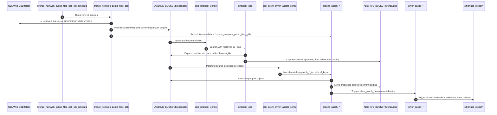
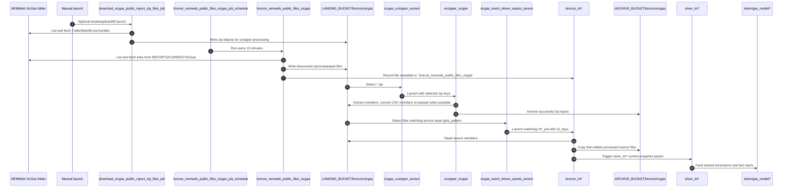
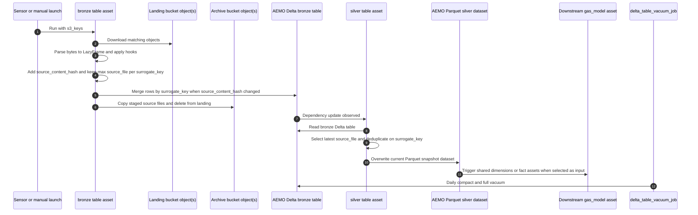

# Ingestion Flows

These diagrams show the main ingestion paths implemented by the current factories and definition modules. They stay close to the repo's real layers: scheduled NEMWeb discovery, landing and archive buckets, unzipper assets, bronze ingestion assets, source silver assets, and downstream `gas_model` automation.

## Table of contents

- [GBB ingestion flow](#gbb-ingestion-flow)
- [VICGAS ingestion flow](#vicgas-ingestion-flow)
- [Raw-to-silver transformation flow](#raw-to-silver-transformation-flow)
- [LocalStack and S3-compatible behavior](#localstack-and-s3-compatible-behavior)
- [Related docs](#related-docs)

## GBB ingestion flow

Trigger and output notes:

- The first step is schedule-driven from `src/aemo_etl/defs/raw/nemweb_public_files.py`.
- The unzip and bronze steps are sensor-driven from `src/aemo_etl/definitions.py`; that module also registers the failed-run alert sensor, which is not part of the ingestion data path shown here. Source-table bronze raw sensors select at most 128 MB (128,000,000 bytes) and 25 landing files per run request by default. Those caps are source-table batching defaults, not the full repo **Fast check** or **Push check** configuration.
- Outputs land in Delta tables under the AEMO bucket plus archived source files under `ARCHIVE_BUCKET/bronze/gbb`.

## VICGAS ingestion flow

Trigger and output notes:

- This follows the same factory pattern as GBB, but the downstream assets are the `int*` VICGAS report assets under `src/aemo_etl/defs/raw/vicgas`.
- `download_vicgas_public_report_zip_files_job` is ad hoc only. It is used for bootstrap or backfill of `PublicRptsNN.zip` bundles into `LANDING_BUCKET/bronze/vicgas`; the existing unzipper and raw sensors handle downstream processing.
- The bronze assets merge current-state Delta rows by `surrogate_key` after collapsing each micro-batch to the maximum `source_file` per key; the silver assets overwrite the current parquet snapshot.

## Raw-to-silver transformation flow

Trigger and output notes:

- The bronze run can come from an event-driven sensor or from a manual asset launch with explicit `s3_keys`.
- Bronze uses `aemo_deltalake_current_state_merge_io_manager`; `df_from_s3_keys` silver uses `aemo_parquet_overwrite_io_manager`.
- `aemo-replay-bronze-archive` rebuilds source-table bronze Delta tables from
  archive storage. It can target all source-table bronze assets, one domain, or
  one table; dry-run is the default and reports matching archive files, planned
  batch count, total bytes, and target table URI. `--replace` is required before
  it overwrites the first non-empty replay batch and then merges later batches
  with the same current-state predicate.
- `delta_table_vacuum_schedule` runs daily at 02:00 Australia/Melbourne and uses each Delta asset's `delta_maintenance/*` metadata, defaulting to compact plus full vacuum retention `0`.
- A representative downstream example is `silver_gas_fact_operational_meter_flow`, which reads VICGAS silver inputs plus shared dimensions and writes a `silver/gas_model/...` parquet snapshot dataset.
- Downstream `gas_model` silver assets retry failed materializations up to three times with a 60-second exponential backoff and plus/minus jitter.

## LocalStack and S3-compatible behavior

When `AWS_ENDPOINT_URL` points at LocalStack, the same flow runs against local S3-compatible storage rather than AWS. Integration tests also create a `delta_log` DynamoDB table so Delta locking works for local end-to-end materializations.

## Related docs

- [High-level architecture](high_level_architecture.md)
- [Local development guide](../development/local_development.md)
- [Gas-model ERDs](../gas_model/)

## Sync metadata

- `sync.owner`: `docs`
- `sync.sources`:
  - `backend-services/dagster-user/aemo-etl/src/aemo_etl/defs/raw/nemweb_public_files.py`
  - `backend-services/dagster-user/aemo-etl/src/aemo_etl/defs/jobs/download_vicgas_public_report_zip_files.py`
  - `backend-services/dagster-user/aemo-etl/src/aemo_etl/alerts.py`
  - `backend-services/dagster-user/aemo-etl/src/aemo_etl/definitions.py`
  - `backend-services/dagster-user/aemo-etl/src/aemo_etl/factories/df_from_s3_keys/assets.py`
  - `backend-services/dagster-user/aemo-etl/src/aemo_etl/factories/df_from_s3_keys/definitions.py`
  - `backend-services/dagster-user/aemo-etl/src/aemo_etl/factories/df_from_s3_keys/source_tables.py`
  - `backend-services/dagster-user/aemo-etl/src/aemo_etl/factories/s3_pending_objects.py`
  - `backend-services/dagster-user/aemo-etl/src/aemo_etl/maintenance/delta_tables.py`
  - `backend-services/dagster-user/aemo-etl/src/aemo_etl/maintenance/archive_replay.py`
  - `backend-services/dagster-user/aemo-etl/src/aemo_etl/cli/replay_bronze_archive.py`
  - `backend-services/dagster-user/aemo-etl/src/aemo_etl/defs/resources.py`
  - `backend-services/dagster-user/aemo-etl/src/aemo_etl/defs/gas_model/silver_gas_fact_operational_meter_flow.py`
  - `backend-services/dagster-user/aemo-etl/src/aemo_etl/factories/unzipper/definitions.py`
  - `backend-services/dagster-user/aemo-etl/src/aemo_etl/factories/unzipper/sensors.py`
- `sync.scope`: `behavior`
- `sync.qa`:
  - `git diff --name-only`
  - `rg -n "<changed-file-path>" README.md docs backend-services infrastructure`
  - `verify links, diagrams, commands, paths, ports, env vars, and names`
