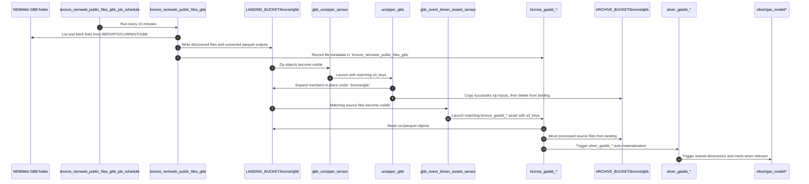
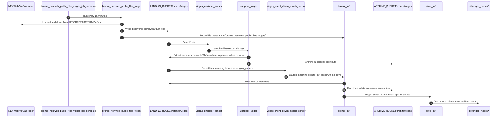
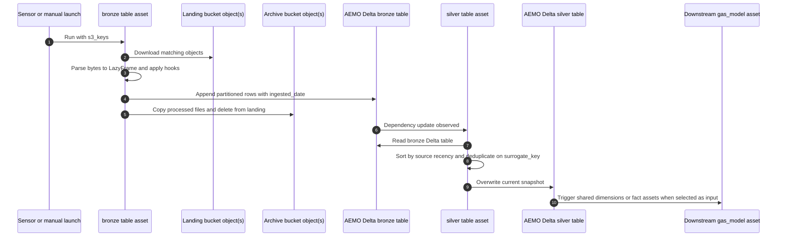

# Ingestion Flows

These diagrams show the main ingestion paths implemented by the current factories and definition modules. They stay close to the repo's real layers: scheduled NEMWeb discovery, landing and archive buckets, unzipper assets, bronze ingestion assets, source silver assets, and downstream `gas_model` automation.

## Table of contents

- [GBB ingestion flow](#gbb-ingestion-flow)
- [VICGAS ingestion flow](#vicgas-ingestion-flow)
- [Raw-to-silver transformation flow](#raw-to-silver-transformation-flow)
- [LocalStack and S3-compatible behavior](#localstack-and-s3-compatible-behavior)
- [Related docs](#related-docs)

## GBB ingestion flow

Trigger and output notes:

- The first step is schedule-driven from `src/aemo_etl/defs/raw/nemweb_public_files.py`.
- The unzip and bronze steps are sensor-driven from `src/aemo_etl/defs/sensors.py`.
- Outputs land in Delta tables under the AEMO bucket plus archived source files under `ARCHIVE_BUCKET/bronze/gbb`.

## VICGAS ingestion flow

Trigger and output notes:

- This follows the same factory pattern as GBB, but the downstream assets are the `int*` VICGAS report assets under `src/aemo_etl/defs/raw/vicgas`.
- The bronze assets write partitioned Delta tables by `ingested_date`; the silver assets overwrite the deduplicated current snapshot.

## Raw-to-silver transformation flow

Trigger and output notes:

- The bronze run can come from an event-driven sensor or from a manual asset launch with explicit `s3_keys`.
- Bronze uses `aemo_deltalake_ingest_partitioned_append_io_manager`; silver uses `aemo_deltalake_overwrite_io_manager`.
- A representative downstream example is `silver_gas_fact_operational_meter_flow`, which reads VICGAS silver inputs plus shared dimensions and writes a `silver/gas_model/...` Delta table.

## LocalStack and S3-compatible behavior

When `AWS_ENDPOINT_URL` points at LocalStack, the same flow runs against local S3-compatible storage rather than AWS. Integration tests also create a `delta_log` DynamoDB table so Delta locking works for local end-to-end materializations.

## Related docs

- [High-level architecture](high_level_architecture.md)
- [Local development guide](../development/local_development.md)
- [Gas-model ERDs](../gas_model/)
