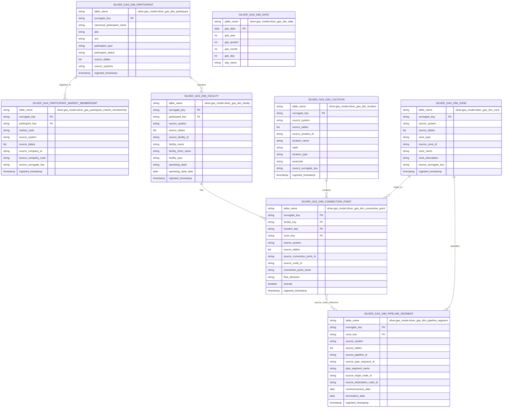

# Gas Model Silver Dimension ERD

This document defines the first-pass entity relationship design for the
`silver.gas_model` dimension layer. These are silver-layer model tables only;
fact tables are intentionally out of scope for this ERD.

Mermaid entity identifiers avoid dots for renderer compatibility. Each entity
therefore includes a `table_name` attribute with the fully qualified table name.

## LocalStack Profiling Evidence

The relationship and grain choices below are based on read-only profiling of the
materialized bronze tables in LocalStack bucket `dev-energy-market-aemo`.

| Bronze source | Rows | Key evidence | Model impact |
| --- | ---: | --- | --- |
| `bronze.gbb.bronze_gasbb_facilities` | 419 | 172 unique `FacilityId`; `FacilityId, LastUpdated` is unique | Current snapshot required for `silver_gas_dim_facility` |
| `bronze.gbb.bronze_gasbb_locations_list` | 25 | 25 unique `LocationId` | Stable source for `silver_gas_dim_location` |
| `bronze.gbb.bronze_gasbb_nodes_connection_points` | 3,528 | 811 unique `ConnectionPointId`; 834 unique `FacilityId, ConnectionPointId, FlowDirection` | Current snapshot required for `silver_gas_dim_connection_point` |
| `bronze.gbb.bronze_gasbb_participants_list` | 253 | 253 unique `CompanyId`; 235 non-empty ABNs | Strong source for participant identity |
| `bronze.gbb.bronze_gasbb_demand_zones_and_pipeline_connectionpoint_mapping` | 325 | Unique on `FacilityId, NodeId, ConnectionPointId, FlowDirection`; 102 demand zones | Supports connection-point to demand-zone mapping |
| `bronze.gbb.bronze_gasbb_linepack_zones` | 56 | Unique on `Operator, LinepackZone`; 55 unique linepack zones | Supports linepack zone records |
| `bronze.vicgas.bronze_int125_v8_details_of_organisations_1` | 815 | Unique on `company_id, market_code`; 366 unique `company_id` | Requires participant market-membership bridge |
| `bronze.vicgas.bronze_int258_v4_mce_nodes_1` | 61 | Unique on `pipeline_id, point_group_identifier_id` | Supports VICGAS network references |
| `bronze.vicgas.bronze_int259_v4_pipe_segment_1` | 84 | 77 unique `pipe_segment_id`; unique on `pipe_segment_id, commencement_date` | Current snapshot required for pipeline segments |
| `bronze.vicgas.bronze_int188_v4_ctm_to_hv_zone_mapping_1` | 152 | 152 unique `mirn`; 144 unique `hv_zone` | Supports HV zone records |
| `bronze.vicgas.bronze_int284_v4_tuos_zone_postcode_map_1` | 484 | Unique on `postcode, tuos_zone`; 19 unique `tuos_zone` | Supports TUOS zone records |

Observed relationship coverage:

| Relationship | Coverage evidence |
| --- | --- |
| GBB nodes/connection points to GBB facilities | 164 child facility IDs, 172 parent facility IDs, 0 missing |
| GBB nodes/connection points to GBB locations | 25 child location IDs, 25 parent location IDs, 0 missing |
| GBB demand-zone map to GBB facilities | 35 child facility IDs, 172 parent facility IDs, 0 missing |
| GBB demand-zone map to GBB nodes | 318 child node IDs, 487 parent node IDs, 0 missing |
| GBB facilities to GBB participants via operator | 87 child operator IDs, 253 parent company IDs, 2 missing |
| VICGAS pipe segment origin nodes to MCE nodes | 55 child node IDs, 61 parent node IDs, 0 missing |
| VICGAS pipe segment destination nodes to MCE nodes | 58 child node IDs, 61 parent node IDs, 0 missing |

Participant merge evidence:

| Candidate identifier | Evidence |
| --- | --- |
| Company ID | 252 IDs overlap between GBB `CompanyId` and VICGAS `company_id` |
| ABN | 235 ABNs overlap between GBB `ABN` and VICGAS `abn` |
| Market membership | VICGAS rows are at `company_id, market_code` grain, with companies appearing in 1 to 7 markets |

## Silver Dimension ERD

## Dimension Transformations

### `silver.gas_model.silver_gas_dim_date`

- Grain: one row per `gas_date`.
- Inputs: generated scaffold from the minimum and maximum parsed gas dates present in current bronze gas sources once facts are introduced.
- Surrogate key sources: `["gas_date"]`.
- V1 role: available for downstream facts, but independent of other dimensions.

### `silver.gas_model.silver_gas_dim_participant`

- Grain: one current row per merged participant identity.
- Inputs: `bronze.gbb.bronze_gasbb_participants_list` and `bronze.vicgas.bronze_int125_v8_details_of_organisations_1`.
- Merge precedence: matching company ID first, normalized ABN/ACN second, normalized company name only as a review candidate.
- Surrogate key sources: the selected canonical participant identifier.
- Current snapshot: choose the latest source row per participant using parsed source update fields where available, then `ingested_timestamp`.
- Lineage: preserve contributing source systems and source surrogate keys for traceability.

### `silver.gas_model.silver_gas_participant_market_membership`

- Grain: one row per participant, market, source-system registration.
- Inputs: primarily `bronze.vicgas.bronze_int125_v8_details_of_organisations_1`; include GBB registration rows with a source market of `NATGASBB` where appropriate.
- Surrogate key sources: `["participant_key", "source_system", "market_code"]`.
- Purpose: keeps market-specific VICGAS registration grain out of the participant identity dimension.

### `silver.gas_model.silver_gas_dim_facility`

- Grain: one current row per source-qualified facility.
- Inputs: `bronze.gbb.bronze_gasbb_facilities`.
- Surrogate key sources: `["source_system", "source_facility_id"]`.
- Current snapshot: select the latest row per `FacilityId` using parsed `LastUpdated`, then `OperatingStateDate`, then `ingested_timestamp`.
- Relationships: link `OperatorId` to `silver_gas_dim_participant` where a participant match exists; keep the relationship nullable because two profiled operator IDs do not resolve to GBB participants.

### `silver.gas_model.silver_gas_dim_location`

- Grain: one current row per source-qualified location or geography member.
- Inputs: `bronze.gbb.bronze_gasbb_locations_list`, plus geography values from VICGAS zone/postcode mappings as later enrichment.
- Surrogate key sources: `["source_system", "source_location_id"]`.
- Current snapshot: GBB locations are already unique on `LocationId`; retain latest by `LastUpdated` and `ingested_timestamp` defensively.

### `silver.gas_model.silver_gas_dim_connection_point`

- Grain: one current row per source-qualified facility, connection point, and flow direction.
- Inputs: `bronze.gbb.bronze_gasbb_nodes_connection_points` and `bronze.gbb.bronze_gasbb_demand_zones_and_pipeline_connectionpoint_mapping`.
- Surrogate key sources: `["source_system", "source_facility_id", "source_connection_point_id", "flow_direction"]`.
- Current snapshot: select latest by parsed `LastUpdated`, then `EffectiveDate`, then `ingested_timestamp`.
- Relationships: link to facility and location from source IDs; link to demand zone where the mapping covers the connection point.

### `silver.gas_model.silver_gas_dim_zone`

- Grain: one row per source-qualified zone.
- Inputs: GBB demand-zone mapping, GBB linepack zones, VICGAS HV zone mapping, and VICGAS TUOS postcode mapping.
- Surrogate key sources: `["source_system", "zone_type", "source_zone_id"]`.
- Zone types: `demand_zone`, `linepack_zone`, `heating_value_zone`, and `tuos_zone`.
- Current snapshot: choose latest mapping row per source zone using available update fields, then `ingested_timestamp`.

### `silver.gas_model.silver_gas_dim_pipeline_segment`

- Grain: one current row per source-qualified pipeline segment.
- Inputs: `bronze.vicgas.bronze_int259_v4_pipe_segment_1` and `bronze.vicgas.bronze_int258_v4_mce_nodes_1`.
- Surrogate key sources: `["source_system", "source_pipe_segment_id"]`.
- Current snapshot: select latest row per `pipe_segment_id` using parsed `commencement_date`, `last_mod_date`, then `ingested_timestamp`.
- Relationships: link to linepack zone where available; keep origin and destination node IDs as source-qualified references because they are VICGAS MCE node identifiers rather than proven cross-source connection-point keys.

## Shared Silver Rules

- All V1 dimension tables are current snapshots.
- All table names use the `silver_gas_*` prefix and full qualification
  `silver.gas_model.<table_name>`.
- Dagster asset keys should use `["silver", "gas_model"]`.
- Asset metadata should set `dagster/table_name` to the fully qualified table
  name, for example `silver.gas_model.silver_gas_dim_participant`.
- Asset metadata should include `grain`, `surrogate_key_sources`, and
  list-valued `source_tables`.
- `grain` describes what one output row represents.
- `surrogate_key_sources` lists the columns used to generate the silver
  `surrogate_key`.
- `source_tables` lists all bronze tables used by the silver asset, even when
  there is only one source table.
- The silver `surrogate_key` is generated from model business keys, not inherited
  from bronze surrogate keys.
- Semantic foreign key columns such as `participant_key`, `facility_key`,
  `location_key`, and `zone_key` store the parent silver table's `surrogate_key`
  value.
- `source_surrogate_key` is direct bronze-row lineage only. Future multi-source
  rows should use list or structured lineage rather than forcing a single source
  key.
- Every dimension preserves lineage columns where source data provides them:
  `source_system`, `source_tables`, `source_file`, `source_surrogate_key`, and
  `ingested_timestamp`.
