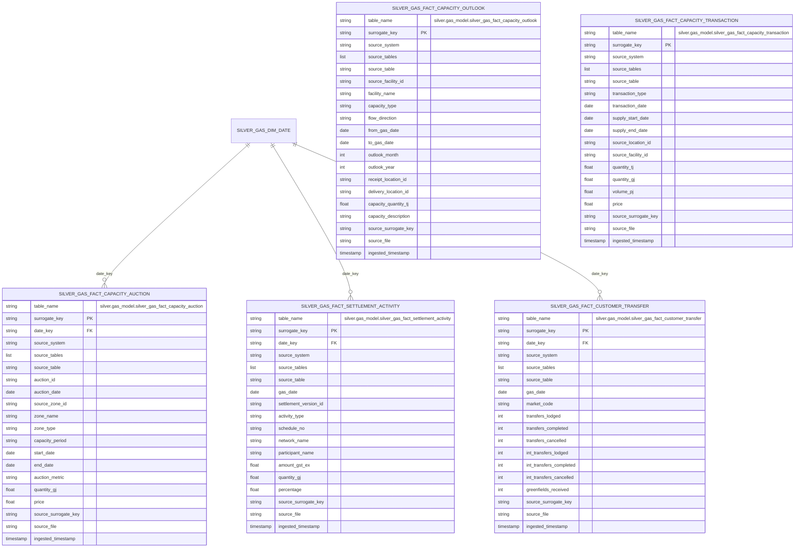

# Gas Capacity And Settlement Mart ERD

This document covers the implemented capacity, auction, transfer, and
settlement facts in `silver.gas_model`.

## Table of contents

- [Fact Inventory](#fact-inventory)
- [ERD](#erd)
- [Implemented Source Tables](#implemented-source-tables)
- [Notes](#notes)
- [Related docs](#related-docs)

## Fact Inventory

| Asset | Grain |
| --- | --- |
| `silver.gas_model.silver_gas_fact_capacity_outlook` | one row per source-specific capacity outlook observation |
| `silver.gas_model.silver_gas_fact_capacity_transaction` | one row per source-specific capacity or LNG transaction |
| `silver.gas_model.silver_gas_fact_capacity_auction` | one row per source-specific capacity auction observation |
| `silver.gas_model.silver_gas_fact_settlement_activity` | one row per source-specific settlement activity observation |
| `silver.gas_model.silver_gas_fact_customer_transfer` | one row per gas date and market code customer transfer summary |

## ERD

## Implemented Source Tables

- `silver_gas_fact_capacity_outlook`:
  `silver.gbb.silver_gasbb_short_term_capacity_outlook`,
  `silver.gbb.silver_gasbb_medium_term_capacity_outlook`,
  `silver.gbb.silver_gasbb_uncontracted_capacity`,
  `silver.gbb.silver_gasbb_nameplate_rating`,
  `silver.gbb.silver_gasbb_connection_point_nameplate`
- `silver_gas_fact_capacity_transaction`:
  `silver.gbb.silver_gasbb_short_term_transactions`,
  `silver.gbb.silver_gasbb_short_term_swap_transactions`,
  `silver.gbb.silver_gasbb_gsh_gas_trades`,
  `silver.gbb.silver_gasbb_lng_transactions`,
  `silver.gbb.silver_gasbb_lng_shipments`
- `silver_gas_fact_capacity_auction`:
  `silver.vicgas.silver_int339_v4_ccauction_bid_stack_1`,
  `silver.vicgas.silver_int342_v4_ccauction_sys_capability_1`,
  `silver.vicgas.silver_int343_v4_ccauction_auction_qty_1`,
  `silver.vicgas.silver_int345_v4_ccauction_zone_1`,
  `silver.vicgas.silver_int348_v4_cctransfer_1`,
  `silver.vicgas.silver_int351_v4_ccregistry_summary_1`,
  `silver.vicgas.silver_int353_v4_ccauction_qty_won_1`,
  `silver.vicgas.silver_int353_v4_ccauction_qty_won_all_1`,
  `silver.vicgas.silver_int381_v4_tie_breaking_event_1`
- `silver_gas_fact_settlement_activity`:
  `silver.vicgas.silver_int117a_v4_est_ancillary_payments_1`,
  `silver.vicgas.silver_int117b_v4_ancillary_payments_1`,
  `silver.vicgas.silver_int138_v4_settlement_version_1`,
  `silver.vicgas.silver_int312_v4_settlements_activity_1`,
  `silver.vicgas.silver_int322a_v4_uplift_breakdown_sett_1`,
  `silver.vicgas.silver_int322b_v4_uplift_breakdown_prud_1`,
  `silver.vicgas.silver_int538_v4_settlement_versions_1`,
  `silver.vicgas.silver_int583_v4_monthly_cumulative_imb_pos_1`
- `silver_gas_fact_customer_transfer`:
  `silver.vicgas.silver_int311_v5_customer_transfers_1`

## Notes

- `silver_gas_fact_capacity_outlook` and `silver_gas_fact_capacity_transaction`
  do not currently carry conformed foreign keys; they retain source-qualified
  facility and location identifiers.
- `silver_gas_fact_capacity_auction` and `silver_gas_fact_settlement_activity`
  only share the conformed date dimension in the implemented schema.

## Related docs

- [Gas-model index](README.md)
- [Shared dimensions ERD](gas_dim_erd.md)
- [High-level architecture](../architecture/high_level_architecture.md)
- [Ingestion sequence diagrams](../architecture/ingestion_flows.md)

## Sync metadata

- `sync.owner`: `docs`
- `sync.sources`:
  - `backend-services/dagster-user/aemo-etl/src/aemo_etl/defs/gas_model/silver_gas_fact_capacity_outlook.py`
  - `backend-services/dagster-user/aemo-etl/src/aemo_etl/defs/gas_model/silver_gas_fact_capacity_transaction.py`
  - `backend-services/dagster-user/aemo-etl/src/aemo_etl/defs/gas_model/silver_gas_fact_capacity_auction.py`
  - `backend-services/dagster-user/aemo-etl/src/aemo_etl/defs/gas_model/silver_gas_fact_settlement_activity.py`
  - `backend-services/dagster-user/aemo-etl/src/aemo_etl/defs/gas_model/silver_gas_fact_customer_transfer.py`
- `sync.scope`: `interface`
- `sync.qa`:
  - `git diff --name-only`
  - `rg -n "<changed-file-path>" README.md docs backend-services infrastructure`
  - `verify links, diagrams, commands, paths, ports, env vars, and names`
