# Gas Capacity And Settlement Mart ERD

This document covers the implemented capacity, auction, transfer, allocation,
MOS, settlement, net-market-balance, and related STTM flag facts in
`silver.gas_model`.

## Table of contents

- [Fact Inventory](#fact-inventory)
- [ERD](#erd)
- [Implemented Source Tables](#implemented-source-tables)
- [Notes](#notes)
- [Related docs](#related-docs)

## Fact Inventory

| Asset | Grain |
| --- | --- |
| `silver.gas_model.silver_gas_fact_capacity_outlook` | one row per source-specific capacity outlook observation |
| `silver.gas_model.silver_gas_fact_capacity_transaction` | one row per source-specific capacity or LNG transaction |
| `silver.gas_model.silver_gas_fact_capacity_auction` | one row per source-specific capacity auction observation |
| `silver.gas_model.silver_gas_fact_settlement_activity` | one row per source-specific settlement activity observation |
| `silver.gas_model.silver_gas_fact_customer_transfer` | one row per gas date and market code customer transfer summary |
| `silver.gas_model.silver_gas_fact_sttm_allocation_quantity` | one row per STTM gas date, facility, flow direction, and allocation version |
| `silver.gas_model.silver_gas_fact_sttm_market_settlement` | one row per STTM settlement or NMB component at its accepted source grain |
| `silver.gas_model.silver_gas_fact_sttm_capacity_settlement` | one row per STTM gas date, facility, and MOS or capacity settlement component |
| `silver.gas_model.silver_gas_fact_sttm_mos_stack` | one row per STTM MOS stack step and effective or used-step context |
| `silver.gas_model.silver_gas_fact_sttm_default_allocation_notice` | one row per STTM default allocation notice |
| `silver.gas_model.silver_gas_fact_sttm_allocation_limit` | one row per STTM gas date and facility allocation warning-limit set |
| `silver.gas_model.silver_gas_fact_sttm_market_parameter` | one row per STTM hub and effective market parameter period |

## ERD

```mermaid
erDiagram
    SILVER_GAS_DIM_DATE ||--o{ SILVER_GAS_FACT_CAPACITY_AUCTION : date_key
    SILVER_GAS_DIM_DATE ||--o{ SILVER_GAS_FACT_SETTLEMENT_ACTIVITY : date_key
    SILVER_GAS_DIM_DATE ||--o{ SILVER_GAS_FACT_CUSTOMER_TRANSFER : date_key
    SILVER_GAS_DIM_DATE ||--o{ SILVER_GAS_FACT_STTM_ALLOCATION_QUANTITY : date_key
    SILVER_GAS_DIM_DATE ||--o{ SILVER_GAS_FACT_STTM_MARKET_SETTLEMENT : date_and_period_keys
    SILVER_GAS_DIM_DATE ||--o{ SILVER_GAS_FACT_STTM_CAPACITY_SETTLEMENT : date_key
    SILVER_GAS_DIM_DATE ||--o{ SILVER_GAS_FACT_STTM_MOS_STACK : date_and_effective_keys
    SILVER_GAS_DIM_DATE ||--o{ SILVER_GAS_FACT_STTM_DEFAULT_ALLOCATION_NOTICE : date_key
    SILVER_GAS_DIM_DATE ||--o{ SILVER_GAS_FACT_STTM_ALLOCATION_LIMIT : date_key
    SILVER_GAS_DIM_DATE ||--o{ SILVER_GAS_FACT_STTM_MARKET_PARAMETER : effective_date_keys

    SILVER_GAS_DIM_FACILITY ||--o{ SILVER_GAS_FACT_STTM_ALLOCATION_QUANTITY : facility_key
    SILVER_GAS_DIM_FACILITY ||--o{ SILVER_GAS_FACT_STTM_MARKET_SETTLEMENT : facility_key
    SILVER_GAS_DIM_FACILITY ||--o{ SILVER_GAS_FACT_STTM_CAPACITY_SETTLEMENT : facility_key
    SILVER_GAS_DIM_FACILITY ||--o{ SILVER_GAS_FACT_STTM_MOS_STACK : facility_key
    SILVER_GAS_DIM_FACILITY ||--o{ SILVER_GAS_FACT_STTM_DEFAULT_ALLOCATION_NOTICE : facility_key
    SILVER_GAS_DIM_FACILITY ||--o{ SILVER_GAS_FACT_STTM_ALLOCATION_LIMIT : facility_key

    SILVER_GAS_DIM_ZONE ||--o{ SILVER_GAS_FACT_STTM_ALLOCATION_QUANTITY : zone_key
    SILVER_GAS_DIM_ZONE ||--o{ SILVER_GAS_FACT_STTM_MARKET_SETTLEMENT : zone_key
    SILVER_GAS_DIM_ZONE ||--o{ SILVER_GAS_FACT_STTM_CAPACITY_SETTLEMENT : zone_key
    SILVER_GAS_DIM_ZONE ||--o{ SILVER_GAS_FACT_STTM_MOS_STACK : zone_key
    SILVER_GAS_DIM_ZONE ||--o{ SILVER_GAS_FACT_STTM_DEFAULT_ALLOCATION_NOTICE : zone_key
    SILVER_GAS_DIM_ZONE ||--o{ SILVER_GAS_FACT_STTM_ALLOCATION_LIMIT : zone_key
    SILVER_GAS_DIM_ZONE ||--o{ SILVER_GAS_FACT_STTM_MARKET_PARAMETER : zone_key

    SILVER_GAS_DIM_PARTICIPANT ||--o{ SILVER_GAS_FACT_STTM_MOS_STACK : participant_key

    SILVER_GAS_FACT_CAPACITY_OUTLOOK {
        string table_name "silver.gas_model.silver_gas_fact_capacity_outlook"
        string surrogate_key PK
        string source_system
        list source_tables
        string source_table
        string source_facility_id
        string facility_name
        string capacity_type
        string flow_direction
        date from_gas_date
        date to_gas_date
        int outlook_month
        int outlook_year
        string receipt_location_id
        string delivery_location_id
        float capacity_quantity_tj
        string capacity_description
        string source_surrogate_key
        string source_file
        timestamp ingested_timestamp
    }

    SILVER_GAS_FACT_CAPACITY_TRANSACTION {
        string table_name "silver.gas_model.silver_gas_fact_capacity_transaction"
        string surrogate_key PK
        string source_system
        list source_tables
        string source_table
        string transaction_type
        date transaction_date
        date supply_start_date
        date supply_end_date
        string source_location_id
        string source_facility_id
        float quantity_tj
        float quantity_gj
        float volume_pj
        float price
        string source_surrogate_key
        string source_file
        timestamp ingested_timestamp
    }

    SILVER_GAS_FACT_CAPACITY_AUCTION {
        string table_name "silver.gas_model.silver_gas_fact_capacity_auction"
        string surrogate_key PK
        string date_key FK
        string source_system
        list source_tables
        string source_table
        string auction_id
        date auction_date
        string source_zone_id
        string zone_name
        string zone_type
        string capacity_period
        date start_date
        date end_date
        string auction_metric
        float quantity_gj
        float price
        string source_surrogate_key
        string source_file
        timestamp ingested_timestamp
    }

    SILVER_GAS_FACT_SETTLEMENT_ACTIVITY {
        string table_name "silver.gas_model.silver_gas_fact_settlement_activity"
        string surrogate_key PK
        string date_key FK
        string source_system
        list source_tables
        string source_table
        date gas_date
        string settlement_version_id
        string activity_type
        string schedule_no
        string network_name
        string participant_name
        float amount_gst_ex
        float quantity_gj
        float percentage
        string source_surrogate_key
        string source_file
        timestamp ingested_timestamp
    }

    SILVER_GAS_FACT_CUSTOMER_TRANSFER {
        string table_name "silver.gas_model.silver_gas_fact_customer_transfer"
        string surrogate_key PK
        string date_key FK
        string source_system
        list source_tables
        string source_table
        date gas_date
        string market_code
        int transfers_lodged
        int transfers_completed
        int transfers_cancelled
        int int_transfers_lodged
        int int_transfers_completed
        int int_transfers_cancelled
        int greenfields_received
        string source_surrogate_key
        string source_file
        timestamp ingested_timestamp
    }

    SILVER_GAS_FACT_STTM_ALLOCATION_QUANTITY {
        string table_name "silver.gas_model.silver_gas_fact_sttm_allocation_quantity"
        string surrogate_key PK
        string date_key FK
        string facility_key FK
        string zone_key FK
        string source_system
        list source_tables
        string source_table
        string source_report_id
        date gas_date
        string allocation_version
        string source_hub_id
        string source_facility_id
        string flow_direction
        float allocation_qty_inc_mos_gj
        string allocation_qty_quality_type
        string source_surrogate_key
        string source_file
        timestamp ingested_timestamp
    }

    SILVER_GAS_FACT_STTM_MARKET_SETTLEMENT {
        string table_name "silver.gas_model.silver_gas_fact_sttm_market_settlement"
        string surrogate_key PK
        string date_key FK
        string period_start_date_key FK
        string period_end_date_key FK
        string facility_key FK
        string zone_key FK
        string source_system
        list source_tables
        string source_table
        string source_report_id
        date gas_date
        date period_start_date
        date period_end_date
        string settlement_run_id
        string settlement_stage
        string settlement_component
        string source_hub_id
        string source_facility_id
        float quantity_gj
        float amount
        string source_surrogate_key
        string source_file
        timestamp ingested_timestamp
    }

    SILVER_GAS_FACT_STTM_CAPACITY_SETTLEMENT {
        string table_name "silver.gas_model.silver_gas_fact_sttm_capacity_settlement"
        string surrogate_key PK
        string date_key FK
        string facility_key FK
        string zone_key FK
        string source_system
        list source_tables
        string source_table
        string source_report_id
        date gas_date
        string settlement_run_id
        string settlement_stage
        string capacity_settlement_component
        string source_hub_id
        string source_facility_id
        float quantity_gj
        string source_surrogate_key
        string source_file
        timestamp ingested_timestamp
    }

    SILVER_GAS_FACT_STTM_MOS_STACK {
        string table_name "silver.gas_model.silver_gas_fact_sttm_mos_stack"
        string surrogate_key PK
        string date_key FK
        string effective_from_date_key FK
        string effective_to_date_key FK
        string participant_key FK
        string facility_key FK
        string zone_key FK
        string source_system
        list source_tables
        string source_table
        string source_report_id
        string mos_stack_context
        string settlement_run_id
        date gas_date
        date effective_from_date
        date effective_to_date
        string source_hub_id
        string source_facility_id
        string stack_id
        string stack_type
        string stack_step_id
        string participant_id
        float estimated_maximum_quantity_gj
        float step_quantity_gj
        float step_price
        string source_surrogate_key
        string source_file
        timestamp ingested_timestamp
    }

    SILVER_GAS_FACT_STTM_DEFAULT_ALLOCATION_NOTICE {
        string table_name "silver.gas_model.silver_gas_fact_sttm_default_allocation_notice"
        string surrogate_key PK
        string date_key FK
        string facility_key FK
        string zone_key FK
        string source_system
        list source_tables
        string source_table
        string source_report_id
        string notice_id
        date gas_date
        string source_hub_id
        string source_facility_id
        string notice_message
        string source_surrogate_key
        string source_file
        timestamp ingested_timestamp
    }

    SILVER_GAS_FACT_STTM_ALLOCATION_LIMIT {
        string table_name "silver.gas_model.silver_gas_fact_sttm_allocation_limit"
        string surrogate_key PK
        string date_key FK
        string facility_key FK
        string zone_key FK
        string source_system
        list source_tables
        string source_table
        string source_report_id
        date gas_date
        string source_hub_id
        string source_facility_id
        float upper_warning_limit_gj
        float lower_warning_limit_gj
        timestamp source_report_timestamp
        string source_surrogate_key
        string source_file
        timestamp ingested_timestamp
    }

    SILVER_GAS_FACT_STTM_MARKET_PARAMETER {
        string table_name "silver.gas_model.silver_gas_fact_sttm_market_parameter"
        string surrogate_key PK
        string effective_from_date_key FK
        string effective_to_date_key FK
        string zone_key FK
        string source_system
        list source_tables
        string source_table
        string source_report_id
        string parameter_type
        string source_hub_id
        date effective_from_date
        date effective_to_date
        string dp_flag
        string source_surrogate_key
        string source_file
        timestamp ingested_timestamp
    }
```

## Implemented Source Tables

- `silver_gas_fact_capacity_outlook`:
  `silver.gbb.silver_gasbb_short_term_capacity_outlook`,
  `silver.gbb.silver_gasbb_medium_term_capacity_outlook`,
  `silver.gbb.silver_gasbb_uncontracted_capacity`,
  `silver.gbb.silver_gasbb_nameplate_rating`,
  `silver.gbb.silver_gasbb_connection_point_nameplate`
- `silver_gas_fact_capacity_transaction`:
  `silver.gbb.silver_gasbb_short_term_transactions`,
  `silver.gbb.silver_gasbb_short_term_swap_transactions`,
  `silver.gbb.silver_gasbb_gsh_gas_trades`,
  `silver.gbb.silver_gasbb_lng_transactions`,
  `silver.gbb.silver_gasbb_lng_shipments`
- `silver_gas_fact_capacity_auction`:
  `silver.vicgas.silver_int339_v4_ccauction_bid_stack_1`,
  `silver.vicgas.silver_int342_v4_ccauction_sys_capability_1`,
  `silver.vicgas.silver_int343_v4_ccauction_auction_qty_1`,
  `silver.vicgas.silver_int345_v4_ccauction_zone_1`,
  `silver.vicgas.silver_int348_v4_cctransfer_1`,
  `silver.vicgas.silver_int351_v4_ccregistry_summary_1`,
  `silver.vicgas.silver_int353_v4_ccauction_qty_won_1`,
  `silver.vicgas.silver_int353_v4_ccauction_qty_won_all_1`,
  `silver.vicgas.silver_int381_v4_tie_breaking_event_1`
- `silver_gas_fact_settlement_activity`:
  `silver.vicgas.silver_int117a_v4_est_ancillary_payments_1`,
  `silver.vicgas.silver_int117b_v4_ancillary_payments_1`,
  `silver.vicgas.silver_int138_v4_settlement_version_1`,
  `silver.vicgas.silver_int312_v4_settlements_activity_1`,
  `silver.vicgas.silver_int322a_v4_uplift_breakdown_sett_1`,
  `silver.vicgas.silver_int322b_v4_uplift_breakdown_prud_1`,
  `silver.vicgas.silver_int538_v4_settlement_versions_1`,
  `silver.vicgas.silver_int583_v4_monthly_cumulative_imb_pos_1`
- `silver_gas_fact_customer_transfer`:
  `silver.vicgas.silver_int311_v5_customer_transfers_1`
- `silver_gas_fact_sttm_allocation_quantity`:
  `silver.sttm.silver_int658_v1_latest_allocation_quantity_rpt_1`,
  `silver.sttm.silver_int689_v1_expost_allocation_quantity_rpt_1`
- `silver_gas_fact_sttm_market_settlement`:
  `silver.sttm.silver_int662_v1_provisional_deviation_rpt_1`,
  `silver.sttm.silver_int663_v1_provisional_variation_rpt_1`,
  `silver.sttm.silver_int678_v1_net_market_balance_daily_amounts_rpt_1`,
  `silver.sttm.silver_int679_v1_net_market_balance_settlement_amounts_rpt_1`
- `silver_gas_fact_sttm_capacity_settlement`:
  `silver.sttm.silver_int664_v1_daily_provisional_mos_allocation_rpt_1`,
  `silver.sttm.silver_int681_v1_daily_provisional_capacity_data_rpt_1`,
  `silver.sttm.silver_int682_v1_settlement_mos_and_capacity_data_rpt_1`
- `silver_gas_fact_sttm_mos_stack`:
  `silver.sttm.silver_int665_v1_mos_stack_data_rpt_1`,
  `silver.sttm.silver_int683_v1_provisional_used_mos_steps_rpt_1`,
  `silver.sttm.silver_int684_v1_settlement_used_mos_steps_rpt_1`
- `silver_gas_fact_sttm_default_allocation_notice`:
  `silver.sttm.silver_int675_v1_default_allocation_notice_rpt_1`
- `silver_gas_fact_sttm_allocation_limit`:
  `silver.sttm.silver_int688_v1_allocation_warning_limit_thresholds_rpt_1`
- `silver_gas_fact_sttm_market_parameter`:
  `silver.sttm.silver_int680_v1_dp_flag_data_rpt_1`

## Notes

- `silver_gas_fact_capacity_outlook` and `silver_gas_fact_capacity_transaction`
  do not currently carry conformed foreign keys; they retain source-qualified
  facility and location identifiers.
- `silver_gas_fact_capacity_auction` and `silver_gas_fact_settlement_activity`
  only share the conformed date dimension in the implemented schema.
- STTM allocation quantity rows split latest `INT658` and ex-post `INT689`
  rows with `allocation_version`; `allocation_qty_quality_type` is retained for
  `INT689` because its flag values carry source-specific data-quality meaning.
- STTM market settlement rows unpivot deviation, variation, MOS payment, and
  net-market-balance reports into source component rows. NMB period rows from
  `INT678` and `INT679` use `period_start_date_key` and `period_end_date_key`
  instead of a `gas_date` grain.
- STTM capacity settlement rows unpivot provisional and settlement MOS/capacity
  quantities from `INT664`, `INT681`, and `INT682`; settlement rows retain
  `settlement_run_id`.
- STTM MOS stack rows combine registered stack-step data from `INT665` with
  provisional and settlement used-step markers from `INT683` and `INT684`.
  Quantity and price fields are populated only where the source reports them.
- STTM default allocation notice, allocation limit, and DP flag parameter rows
  keep notice text, warning limits, and `dp_flag` without normalizing away their
  source-specific semantics.

## Related docs

- [Gas-model index](README.md)
- [Shared dimensions ERD](gas_dim_erd.md)
- [High-level architecture](../architecture/high_level_architecture.md)
- [Ingestion sequence diagrams](../architecture/ingestion_flows.md)

## Sync metadata

- `sync.owner`: `docs`
- `sync.sources`:
  - `backend-services/dagster-user/aemo-etl/src/aemo_etl/defs/gas_model/silver_gas_fact_capacity_outlook.py`
  - `backend-services/dagster-user/aemo-etl/src/aemo_etl/defs/gas_model/silver_gas_fact_capacity_transaction.py`
  - `backend-services/dagster-user/aemo-etl/src/aemo_etl/defs/gas_model/silver_gas_fact_capacity_auction.py`
  - `backend-services/dagster-user/aemo-etl/src/aemo_etl/defs/gas_model/silver_gas_fact_settlement_activity.py`
  - `backend-services/dagster-user/aemo-etl/src/aemo_etl/defs/gas_model/silver_gas_fact_customer_transfer.py`
  - `backend-services/dagster-user/aemo-etl/src/aemo_etl/defs/gas_model/silver_gas_fact_sttm_allocation_quantity.py`
  - `backend-services/dagster-user/aemo-etl/src/aemo_etl/defs/gas_model/silver_gas_fact_sttm_market_settlement.py`
  - `backend-services/dagster-user/aemo-etl/src/aemo_etl/defs/gas_model/silver_gas_fact_sttm_capacity_settlement.py`
  - `backend-services/dagster-user/aemo-etl/src/aemo_etl/defs/gas_model/silver_gas_fact_sttm_mos_stack.py`
  - `backend-services/dagster-user/aemo-etl/src/aemo_etl/defs/gas_model/silver_gas_fact_sttm_default_allocation_notice.py`
  - `backend-services/dagster-user/aemo-etl/src/aemo_etl/defs/gas_model/silver_gas_fact_sttm_allocation_limit.py`
  - `backend-services/dagster-user/aemo-etl/src/aemo_etl/defs/gas_model/silver_gas_fact_sttm_market_parameter.py`
- `sync.scope`: `interface`
- `sync.qa`:
  - `git diff --name-only`
  - `rg -n "<changed-file-path>" README.md docs backend-services infrastructure`
  - `verify links, diagrams, commands, paths, ports, env vars, and names`
