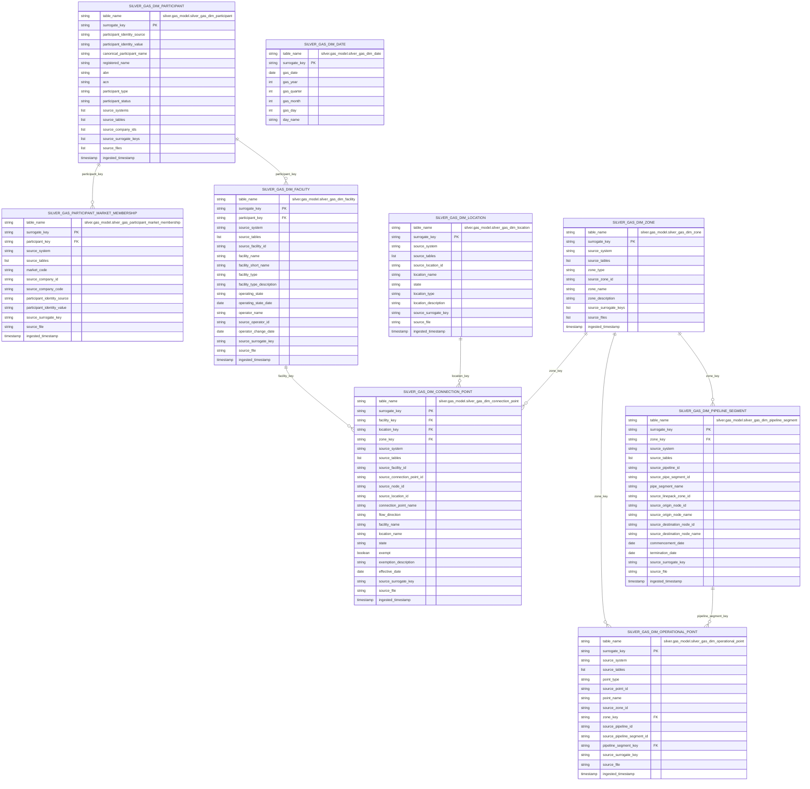

# Gas Model Shared Dimensions ERD

This document describes the shared dimension and bridge assets currently
implemented under `silver.gas_model`. It is aligned to the registered Dagster
definitions in `src/aemo_etl/defs/gas_model`.

The diagrams below are intentionally reduced to relationship columns, business
identifiers, and lineage fields. The full asset schemas live in the
corresponding Python definitions.

## Table of contents

- [Shared Asset Inventory](#shared-asset-inventory)
- [ERD](#erd)
- [Implemented Source Tables](#implemented-source-tables)
- [Notes](#notes)
- [Related docs](#related-docs)

## Shared Asset Inventory

| Asset | Grain |
| --- | --- |
| `silver.gas_model.silver_gas_dim_date` | one row per calendar date from 1900-01-01 through the run date |
| `silver.gas_model.silver_gas_dim_participant` | one current row per merged gas participant identity |
| `silver.gas_model.silver_gas_participant_market_membership` | one row per participant, source system, and market code |
| `silver.gas_model.silver_gas_dim_facility` | one current row per source-qualified gas facility |
| `silver.gas_model.silver_gas_dim_location` | one current row per source-qualified gas location |
| `silver.gas_model.silver_gas_dim_connection_point` | one current row per source-qualified gas connection point |
| `silver.gas_model.silver_gas_dim_zone` | one current row per source-qualified gas zone |
| `silver.gas_model.silver_gas_dim_pipeline_segment` | one current row per source-qualified gas pipeline segment |
| `silver.gas_model.silver_gas_dim_operational_point` | one current row per source-qualified VICGAS operational point |

## ERD

## Implemented Source Tables

- `silver_gas_dim_date`: no source table; generated as a scheduled calendar
  from `1900-01-01` through the run date.
- `silver_gas_dim_participant`:
  `silver.gbb.silver_gasbb_participants_list`,
  `silver.vicgas.silver_int125_v8_details_of_organisations_1`
- `silver_gas_participant_market_membership`:
  `silver.gbb.silver_gasbb_participants_list`,
  `silver.vicgas.silver_int125_v8_details_of_organisations_1`
- `silver_gas_dim_facility`: `silver.gbb.silver_gasbb_facilities`
- `silver_gas_dim_location`: `silver.gbb.silver_gasbb_locations_list`
- `silver_gas_dim_connection_point`:
  `silver.gbb.silver_gasbb_nodes_connection_points`,
  `silver.gbb.silver_gasbb_demand_zones_and_pipeline_connectionpoint_mapping`
- `silver_gas_dim_zone`:
  `silver.gbb.silver_gasbb_demand_zones_and_pipeline_connectionpoint_mapping`,
  `silver.gbb.silver_gasbb_linepack_zones`,
  `silver.vicgas.silver_int188_v4_ctm_to_hv_zone_mapping_1`,
  `silver.vicgas.silver_int284_v4_tuos_zone_postcode_map_1`,
  `silver.vicgas.silver_int259_v4_pipe_segment_1`
- `silver_gas_dim_pipeline_segment`:
  `silver.vicgas.silver_int259_v4_pipe_segment_1`,
  `silver.vicgas.silver_int258_v4_mce_nodes_1`
- `silver_gas_dim_operational_point`:
  `silver.vicgas.silver_int236_v4_operational_meter_readings_1`,
  `silver.vicgas.silver_int313_v4_allocated_injections_withdrawals_1`

## Notes

- `surrogate_key` is the primary key for every shared asset, including
  `silver_gas_dim_date`.
- `silver_gas_dim_date` is a conformed calendar generated independently of
  source tables and refreshed by a daily Dagster schedule.
- `silver_gas_dim_zone` also keeps list-valued lineage because multiple source
  rows can contribute to one conformed zone row.
- `silver_gas_dim_operational_point` currently has nullable `zone_key` and
  `pipeline_segment_key`; the implemented transform does not yet resolve those
  joins from source identifiers.
- No direct foreign key exists between `silver_gas_dim_connection_point` and
  `silver_gas_dim_pipeline_segment`; both retain source node identifiers rather
  than a proven conformed join.

## Related docs

- [Gas-model index](README.md)
- [aemo-etl project README](../../README.md)
- [High-level architecture](../architecture/high_level_architecture.md)
- [Ingestion sequence diagrams](../architecture/ingestion_flows.md)

## Sync metadata

- `sync.owner`: `docs`
- `sync.sources`:
  - `backend-services/dagster-user/aemo-etl/src/aemo_etl/defs/gas_model/silver_gas_dim_date.py`
  - `backend-services/dagster-user/aemo-etl/src/aemo_etl/defs/gas_model/silver_gas_dim_participant.py`
  - `backend-services/dagster-user/aemo-etl/src/aemo_etl/defs/gas_model/silver_gas_participant_market_membership.py`
  - `backend-services/dagster-user/aemo-etl/src/aemo_etl/defs/gas_model/silver_gas_dim_facility.py`
  - `backend-services/dagster-user/aemo-etl/src/aemo_etl/defs/gas_model/silver_gas_dim_location.py`
  - `backend-services/dagster-user/aemo-etl/src/aemo_etl/defs/gas_model/silver_gas_dim_connection_point.py`
  - `backend-services/dagster-user/aemo-etl/src/aemo_etl/defs/gas_model/silver_gas_dim_zone.py`
  - `backend-services/dagster-user/aemo-etl/src/aemo_etl/defs/gas_model/silver_gas_dim_pipeline_segment.py`
  - `backend-services/dagster-user/aemo-etl/src/aemo_etl/defs/gas_model/silver_gas_dim_operational_point.py`
- `sync.scope`: `interface`
- `sync.qa`:
  - `git diff --name-only`
  - `rg -n "<changed-file-path>" README.md docs backend-services infrastructure`
  - `verify links, diagrams, commands, paths, ports, env vars, and names`
