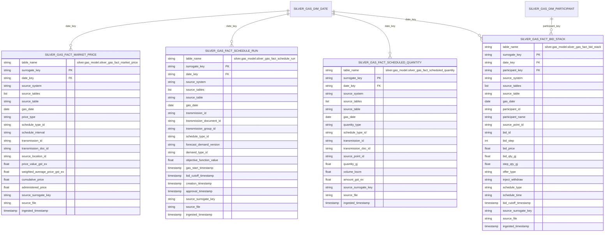

# Gas Market Mart ERD

This document covers the currently implemented market and scheduling facts in
`silver.gas_model`.

## Table of contents

- [Fact Inventory](#fact-inventory)
- [ERD](#erd)
- [Implemented Source Tables](#implemented-source-tables)
- [Notes](#notes)
- [Related docs](#related-docs)

## Fact Inventory

| Asset | Grain |
| --- | --- |
| `silver.gas_model.silver_gas_fact_market_price` | one row per source-specific market price observation |
| `silver.gas_model.silver_gas_fact_schedule_run` | one row per source schedule run |
| `silver.gas_model.silver_gas_fact_scheduled_quantity` | one row per source-specific scheduled quantity observation |
| `silver.gas_model.silver_gas_fact_bid_stack` | one row per source-specific bid stack step |

## ERD

## Implemented Source Tables

- `silver_gas_fact_market_price`:
  `silver.vicgas.silver_int037b_v4_indicative_mkt_price_1`,
  `silver.vicgas.silver_int037c_v4_indicative_price_1`,
  `silver.vicgas.silver_int039b_v4_indicative_locational_price_1`,
  `silver.vicgas.silver_int041_v4_market_and_reference_prices_1`,
  `silver.vicgas.silver_int042_v4_weighted_average_daily_prices_1`,
  `silver.vicgas.silver_int199_v4_cumulative_price_1`,
  `silver.vicgas.silver_int310_v1_price_and_withdrawals_rpt_1`,
  `silver.vicgas.silver_int310_v4_price_and_withdrawals_1`,
  `silver.vicgas.silver_int235_v4_sched_system_total_1`
- `silver_gas_fact_schedule_run`:
  `silver.vicgas.silver_int108_v4_scheduled_run_log_7_1`
- `silver_gas_fact_scheduled_quantity`:
  `silver.vicgas.silver_int050_v4_sched_withdrawals_1`,
  `silver.vicgas.silver_int235_v4_sched_system_total_1`,
  `silver.vicgas.silver_int291_v4_out_of_merit_order_gas_1`,
  `silver.vicgas.silver_int316_v4_operational_gas_1`
- `silver_gas_fact_bid_stack`:
  `silver.vicgas.silver_int131_v4_bids_at_bid_cutoff_times_prev_2_1`,
  `silver.vicgas.silver_int314_v4_bid_stack_1`

## Notes

- `participant_key` on `silver_gas_fact_bid_stack` is currently nullable; the
  transform keeps source participant identifiers without resolving them to
  `silver_gas_dim_participant`.
- `silver_gas_fact_market_price` and `silver_gas_fact_scheduled_quantity` use
  source-qualified location, node, and transmission identifiers rather than
  conformed dimension foreign keys.

## Related docs

- [Gas-model index](README.md)
- [Shared dimensions ERD](gas_dim_erd.md)
- [High-level architecture](../architecture/high_level_architecture.md)
- [Ingestion sequence diagrams](../architecture/ingestion_flows.md)

## Sync metadata

- `sync.owner`: `docs`
- `sync.sources`:
  - `backend-services/dagster-user/aemo-etl/src/aemo_etl/defs/gas_model/silver_gas_fact_market_price.py`
  - `backend-services/dagster-user/aemo-etl/src/aemo_etl/defs/gas_model/silver_gas_fact_schedule_run.py`
  - `backend-services/dagster-user/aemo-etl/src/aemo_etl/defs/gas_model/silver_gas_fact_scheduled_quantity.py`
  - `backend-services/dagster-user/aemo-etl/src/aemo_etl/defs/gas_model/silver_gas_fact_bid_stack.py`
- `sync.scope`: `interface`
- `sync.qa`:
  - `git diff --name-only`
  - `rg -n "<changed-file-path>" README.md docs backend-services infrastructure`
  - `verify links, diagrams, commands, paths, ports, env vars, and names`
