# Gas Operations Mart ERD

This document defines the first-pass `silver.gas_model` Operations Mart. It
extends the silver gas dimensions with operational fact tables covering GBB and
VICGAS physical flow, storage, forecast, linepack, and metered operational
readings.

Mermaid entity identifiers avoid dots for renderer compatibility. Each entity
therefore includes a `table_name` attribute with the fully qualified table name.

## Mart Scope

The Operations Mart is a silver-layer analytic model. It should answer physical
operations questions such as:

- How much gas flowed through each GBB connection point by gas day?
- What daily demand, supply, transfer, and storage values were reported by GBB
  facility and location?
- What forecasts were published for GBB and VICGAS operational demand?
- What linepack and linepack-capacity status was observed?
- What VICGAS operational meter, injection, and withdrawal quantities were
  reported by operational point?

Pricing, settlement, capacity certificates, auction, contacts, notices, and
participant registration analytics are out of scope for this mart. Those should
be modeled in separate marts.

## Silver Operations Mart ERD

```mermaid
erDiagram
    SILVER_GAS_DIM_DATE ||--o{ SILVER_GAS_FACT_CONNECTION_POINT_FLOW : dates
    SILVER_GAS_DIM_DATE ||--o{ SILVER_GAS_FACT_FACILITY_FLOW_STORAGE : dates
    SILVER_GAS_DIM_DATE ||--o{ SILVER_GAS_FACT_NOMINATION_FORECAST : dates
    SILVER_GAS_DIM_DATE ||--o{ SILVER_GAS_FACT_LINEPACK : dates
    SILVER_GAS_DIM_DATE ||--o{ SILVER_GAS_FACT_OPERATIONAL_METER_FLOW : dates

    SILVER_GAS_DIM_FACILITY ||--o{ SILVER_GAS_FACT_CONNECTION_POINT_FLOW : facility
    SILVER_GAS_DIM_FACILITY ||--o{ SILVER_GAS_FACT_FACILITY_FLOW_STORAGE : facility
    SILVER_GAS_DIM_FACILITY ||--o{ SILVER_GAS_FACT_NOMINATION_FORECAST : facility
    SILVER_GAS_DIM_FACILITY ||--o{ SILVER_GAS_FACT_LINEPACK : facility_status

    SILVER_GAS_DIM_LOCATION ||--o{ SILVER_GAS_FACT_CONNECTION_POINT_FLOW : location
    SILVER_GAS_DIM_LOCATION ||--o{ SILVER_GAS_FACT_FACILITY_FLOW_STORAGE : location
    SILVER_GAS_DIM_LOCATION ||--o{ SILVER_GAS_FACT_NOMINATION_FORECAST : location

    SILVER_GAS_DIM_CONNECTION_POINT ||--o{ SILVER_GAS_FACT_CONNECTION_POINT_FLOW : connection_point
    SILVER_GAS_DIM_ZONE ||--o{ SILVER_GAS_FACT_CONNECTION_POINT_FLOW : demand_zone
    SILVER_GAS_DIM_ZONE ||--o{ SILVER_GAS_FACT_LINEPACK : linepack_zone
    SILVER_GAS_DIM_ZONE ||--o{ SILVER_GAS_FACT_OPERATIONAL_METER_FLOW : zone
    SILVER_GAS_DIM_PIPELINE_SEGMENT ||--o{ SILVER_GAS_FACT_OPERATIONAL_METER_FLOW : pipeline_segment

    SILVER_GAS_DIM_OPERATIONAL_POINT ||--o{ SILVER_GAS_FACT_OPERATIONAL_METER_FLOW : operational_point

    SILVER_GAS_DIM_DATE {
        string table_name "silver.gas_model.silver_gas_dim_date"
        string surrogate_key PK
        date gas_date
        int gas_year
        int gas_quarter
        int gas_month
        int gas_day
        string day_name
        timestamp ingested_timestamp
    }

    SILVER_GAS_DIM_OPERATIONAL_POINT {
        string table_name "silver.gas_model.silver_gas_dim_operational_point"
        string surrogate_key PK
        string source_system
        list source_tables
        string point_type
        string source_point_id
        string point_name
        string source_zone_id
        string zone_key FK
        string source_pipeline_id
        string source_pipeline_segment_id
        string pipeline_segment_key FK
        string source_surrogate_key
        string source_file
        timestamp ingested_timestamp
    }

    SILVER_GAS_FACT_CONNECTION_POINT_FLOW {
        string table_name "silver.gas_model.silver_gas_fact_connection_point_flow"
        string surrogate_key PK
        string date_key FK
        string facility_key FK
        string location_key FK
        string connection_point_key FK
        string zone_key FK
        string source_system
        list source_tables
        date gas_date
        string source_facility_id
        string source_connection_point_id
        string flow_direction
        float actual_quantity_tj
        string quality
        timestamp source_last_updated_timestamp
        string source_surrogate_key
        string source_file
        timestamp ingested_timestamp
    }

    SILVER_GAS_FACT_FACILITY_FLOW_STORAGE {
        string table_name "silver.gas_model.silver_gas_fact_facility_flow_storage"
        string surrogate_key PK
        string date_key FK
        string facility_key FK
        string location_key FK
        string source_system
        list source_tables
        date gas_date
        string source_facility_id
        string source_location_id
        float demand_tj
        float supply_tj
        float transfer_in_tj
        float transfer_out_tj
        float held_in_storage_tj
        float cushion_gas_storage_tj
        timestamp source_last_updated_timestamp
        string source_surrogate_key
        string source_file
        timestamp ingested_timestamp
    }

    SILVER_GAS_FACT_NOMINATION_FORECAST {
        string table_name "silver.gas_model.silver_gas_fact_nomination_forecast"
        string surrogate_key PK
        string date_key FK
        string facility_key FK
        string location_key FK
        string source_system
        list source_tables
        date gas_date
        string forecast_type
        string forecast_version
        int gas_interval
        float demand_forecast_gj
        float supply_forecast_gj
        float transfer_in_forecast_gj
        float transfer_out_forecast_gj
        float override_quantity_gj
        string source_surrogate_key
        string source_file
        timestamp ingested_timestamp
    }

    SILVER_GAS_FACT_LINEPACK {
        string table_name "silver.gas_model.silver_gas_fact_linepack"
        string surrogate_key PK
        string date_key FK
        string facility_key FK
        string zone_key FK
        string source_system
        list source_tables
        date gas_date
        timestamp observation_timestamp
        float actual_linepack_gj
        string adequacy_flag
        string adequacy_description
        timestamp source_last_updated_timestamp
        string source_surrogate_key
        string source_file
        timestamp ingested_timestamp
    }

    SILVER_GAS_FACT_OPERATIONAL_METER_FLOW {
        string table_name "silver.gas_model.silver_gas_fact_operational_meter_flow"
        string surrogate_key PK
        string date_key FK
        string operational_point_key FK
        string zone_key FK
        string pipeline_segment_key FK
        string source_system
        list source_tables
        date gas_date
        int gas_interval
        string flow_direction
        float quantity_gj
        timestamp commencement_timestamp
        timestamp termination_timestamp
        string source_surrogate_key
        string source_file
        timestamp ingested_timestamp
    }
```

## Supporting Dimensions

### `silver.gas_model.silver_gas_dim_date`

- Grain: one row per `gas_date`.
- Inputs: generated calendar from min and max parsed gas dates across the
  Operations Mart source tables.
- Surrogate key sources: `["gas_date"]`.
- Required before all fact assets so each fact can store `date_key`.

### `silver.gas_model.silver_gas_dim_operational_point`

- Grain: one current row per source-qualified operational point.
- Inputs:
  `bronze.vicgas.bronze_int236_v4_operational_meter_readings_1`,
  `bronze.vicgas.bronze_int313_v4_allocated_injections_withdrawals_1`, and
  any later VICGAS operations sources that expose MIRN, meter, direction, or
  node identifiers not covered by GBB connection points.
- Surrogate key sources: `["source_system", "point_type", "source_point_id"]`.
- Purpose: provides a conformed dimension for VICGAS points that cannot be
  safely resolved to `silver_gas_dim_connection_point` in V1.
- Relationships: nullable links to `silver_gas_dim_zone` and
  `silver_gas_dim_pipeline_segment` where source identifiers are available.

## Fact Transformations

### `silver.gas_model.silver_gas_fact_connection_point_flow`

- Grain: one row per `GasDate`, `FacilityId`, `ConnectionPointId`,
  `FlowDirection`, and `LastUpdated`.
- Source: `bronze.gbb.bronze_gasbb_pipeline_connection_flow_v2`.
- Surrogate key sources:
  `["gas_date", "facility_key", "connection_point_key", "flow_direction", "source_last_updated_timestamp"]`.
- Measures: `actual_quantity_tj`.
- Dimension joins:
  - `date_key`: parsed `GasDate` to `silver_gas_dim_date.gas_date`.
  - `facility_key`: `FacilityId` to `silver_gas_dim_facility.source_facility_id`
    where `source_system = "GBB"`.
  - `location_key`: `LocationId` to `silver_gas_dim_location.source_location_id`
    where `source_system = "GBB"`.
  - `connection_point_key`: `FacilityId`, `ConnectionPointId`, and
    `FlowDirection` to `silver_gas_dim_connection_point`.
  - `zone_key`: inherited from the matched connection point where available.

### `silver.gas_model.silver_gas_fact_facility_flow_storage`

- Grain: one row per `GasDate`, `FacilityId`, `LocationId`, and `LastUpdated`.
- Source: `bronze.gbb.bronze_gasbb_actual_flow_storage`.
- Surrogate key sources:
  `["gas_date", "facility_key", "location_key", "source_last_updated_timestamp"]`.
- Measures: `demand_tj`, `supply_tj`, `transfer_in_tj`, `transfer_out_tj`,
  `held_in_storage_tj`, and `cushion_gas_storage_tj`.
- Dimension joins:
  - `date_key`: parsed `GasDate` to `silver_gas_dim_date.gas_date`.
  - `facility_key`: `FacilityId` to `silver_gas_dim_facility.source_facility_id`
    where `source_system = "GBB"`.
  - `location_key`: `LocationId` to `silver_gas_dim_location.source_location_id`
    where `source_system = "GBB"`.

### `silver.gas_model.silver_gas_fact_nomination_forecast`

- Grain: source-specific forecast row by gas date, optional facility/location,
  optional forecast version, and optional gas interval.
- Sources:
  - `bronze.gbb.bronze_gasbb_nomination_and_forecast`.
  - `bronze.vicgas.bronze_int126_v4_dfs_data_1`.
  - `bronze.vicgas.bronze_int153_v4_demand_forecast_rpt_1`.
- Surrogate key sources:
  `["source_system", "source_forecast_identifier", "gas_date", "forecast_version", "gas_interval"]`.
- Measures: normalize cross-source forecast quantities to GJ:
  - GBB `Demand`, `Supply`, `TransferIn`, and `TransferOut` are TJ and should
    also be stored as GJ by multiplying by 1000.
  - VICGAS `total_demand_forecast` and `forecast_demand_gj` are stored as GJ.
  - VICGAS `vc_override_gj` maps to `override_quantity_gj`.
- Dimension joins:
  - `date_key`: parsed `Gasdate`, `gas_date`, or `forecast_date`.
  - GBB `facility_key` and `location_key` where `FacilityId` and `LocationId`
    are present.
  - VICGAS rows keep facility/location keys null in V1 unless a later
    operational point mapping proves a safe join.

### `silver.gas_model.silver_gas_fact_linepack`

- Grain: one row per source-system linepack observation.
- Sources:
  - `bronze.vicgas.bronze_int128_v4_actual_linepack_1`.
  - `bronze.gbb.bronze_gasbb_linepack_capacity_adequacy`.
- Surrogate key sources:
  `["source_system", "gas_date", "facility_key", "zone_key", "observation_timestamp", "source_last_updated_timestamp"]`.
- Measures and status:
  - VICGAS `actual_linepack` maps to `actual_linepack_gj`.
  - GBB `Flag` maps to `adequacy_flag`.
  - GBB `Description` maps to `adequacy_description`.
- Dimension joins:
  - `date_key`: parsed `GasDate` or date component of
    `commencement_datetime`.
  - GBB `facility_key`: `FacilityId` to `silver_gas_dim_facility`.
  - VICGAS `zone_key`: nullable in V1 unless linepack zone identifiers are
    present in the source row.

### `silver.gas_model.silver_gas_fact_operational_meter_flow`

- Grain: one row per `gas_date`, operational point, flow direction, and
  interval/hour where provided.
- Sources:
  - `bronze.vicgas.bronze_int236_v4_operational_meter_readings_1`.
  - `bronze.vicgas.bronze_int313_v4_allocated_injections_withdrawals_1`.
- Surrogate key sources:
  `["source_system", "gas_date", "operational_point_key", "flow_direction", "gas_interval"]`.
- Measures: `quantity_gj`.
- Direction mapping:
  - INT236 `direction` maps directly to `flow_direction`.
  - INT313 `inject_withdraw` maps to `flow_direction`.
- Dimension joins:
  - `date_key`: parsed `gas_date`.
  - `operational_point_key`: INT236 `direction_code_name` or INT313
    `phy_mirn` to `silver_gas_dim_operational_point`.
  - `zone_key` and `pipeline_segment_key`: nullable in V1 unless available on
    the operational point dimension.

## Shared Operations Mart Rules

- All Operations Mart tables live under `silver.gas_model`.
- All fact table names use the `silver_gas_fact_*` prefix.
- Every fact stores a silver-generated `surrogate_key`; bronze surrogate keys
  are lineage only.
- Every fact preserves `source_system`, `source_tables`, `source_surrogate_key`,
  `source_file`, and `ingested_timestamp`.
- Every asset should include metadata for `dagster/table_name`,
  `dagster/column_schema`, `grain`, `surrogate_key_sources`, `source_tables`,
  and materialization-time `dagster/column_lineage`.
- Every fact should include required-field, duplicate-key, schema-match, and
  schema-drift checks.
- Unit normalization is fact-specific:
  - Keep GBB operational flow/storage measures in TJ when the source is TJ.
  - Normalize cross-source forecast and meter-flow measures to GJ.
  - Preserve source units or source-valued audit columns where unit conversion
    occurs.

## Implementation Sequence

1. Implement `silver_gas_dim_date`.
2. Implement `silver_gas_dim_operational_point`.
3. Implement GBB facts:
   `silver_gas_fact_connection_point_flow`,
   `silver_gas_fact_facility_flow_storage`, and
   `silver_gas_fact_linepack` for GBB adequacy status.
4. Implement cross-source forecast fact:
   `silver_gas_fact_nomination_forecast`.
5. Implement VICGAS operational facts:
   `silver_gas_fact_linepack` for actual linepack and
   `silver_gas_fact_operational_meter_flow`.
