# Gas Operations Mart ERD

This document covers the currently implemented operational flow and storage
facts in `silver.gas_model`. Shared dimensions are defined once in
`docs/gas_model/gas_dim_erd.md`.

## Table of contents

- [Fact Inventory](#fact-inventory)
- [ERD](#erd)
- [Implemented Source Tables](#implemented-source-tables)
- [Notes](#notes)
- [Related docs](#related-docs)

## Fact Inventory

| Asset | Grain |
| --- | --- |
| `silver.gas_model.silver_gas_fact_connection_point_flow` | one row per gas date, facility, connection point, flow direction, and source update |
| `silver.gas_model.silver_gas_fact_facility_flow_storage` | one row per gas date, facility, location, and source update |
| `silver.gas_model.silver_gas_fact_nomination_forecast` | one row per source-specific forecast row |
| `silver.gas_model.silver_gas_fact_linepack` | one row per source-system linepack observation |
| `silver.gas_model.silver_gas_fact_operational_meter_flow` | one row per source-specific VICGAS operational meter flow observation |

## ERD

```mermaid
erDiagram
    SILVER_GAS_DIM_DATE ||--o{ SILVER_GAS_FACT_CONNECTION_POINT_FLOW : date_key
    SILVER_GAS_DIM_FACILITY ||--o{ SILVER_GAS_FACT_CONNECTION_POINT_FLOW : facility_key
    SILVER_GAS_DIM_LOCATION ||--o{ SILVER_GAS_FACT_CONNECTION_POINT_FLOW : location_key
    SILVER_GAS_DIM_CONNECTION_POINT ||--o{ SILVER_GAS_FACT_CONNECTION_POINT_FLOW : connection_point_key
    SILVER_GAS_DIM_ZONE ||--o{ SILVER_GAS_FACT_CONNECTION_POINT_FLOW : zone_key

    SILVER_GAS_DIM_DATE ||--o{ SILVER_GAS_FACT_FACILITY_FLOW_STORAGE : date_key
    SILVER_GAS_DIM_FACILITY ||--o{ SILVER_GAS_FACT_FACILITY_FLOW_STORAGE : facility_key
    SILVER_GAS_DIM_LOCATION ||--o{ SILVER_GAS_FACT_FACILITY_FLOW_STORAGE : location_key

    SILVER_GAS_DIM_DATE ||--o{ SILVER_GAS_FACT_NOMINATION_FORECAST : date_key
    SILVER_GAS_DIM_FACILITY ||--o{ SILVER_GAS_FACT_NOMINATION_FORECAST : facility_key
    SILVER_GAS_DIM_LOCATION ||--o{ SILVER_GAS_FACT_NOMINATION_FORECAST : location_key

    SILVER_GAS_DIM_DATE ||--o{ SILVER_GAS_FACT_LINEPACK : date_key
    SILVER_GAS_DIM_FACILITY ||--o{ SILVER_GAS_FACT_LINEPACK : facility_key
    SILVER_GAS_DIM_ZONE ||--o{ SILVER_GAS_FACT_LINEPACK : zone_key

    SILVER_GAS_DIM_DATE ||--o{ SILVER_GAS_FACT_OPERATIONAL_METER_FLOW : date_key
    SILVER_GAS_DIM_OPERATIONAL_POINT ||--o{ SILVER_GAS_FACT_OPERATIONAL_METER_FLOW : operational_point_key
    SILVER_GAS_DIM_ZONE ||--o{ SILVER_GAS_FACT_OPERATIONAL_METER_FLOW : zone_key
    SILVER_GAS_DIM_PIPELINE_SEGMENT ||--o{ SILVER_GAS_FACT_OPERATIONAL_METER_FLOW : pipeline_segment_key

    SILVER_GAS_FACT_CONNECTION_POINT_FLOW {
        string table_name "silver.gas_model.silver_gas_fact_connection_point_flow"
        string surrogate_key PK
        string date_key FK
        string facility_key FK
        string location_key FK
        string connection_point_key FK
        string zone_key FK
        string source_system
        list source_tables
        date gas_date
        string source_facility_id
        string source_connection_point_id
        string flow_direction
        float actual_quantity_tj
        string quality
        string source_surrogate_key
        string source_file
        timestamp ingested_timestamp
    }

    SILVER_GAS_FACT_FACILITY_FLOW_STORAGE {
        string table_name "silver.gas_model.silver_gas_fact_facility_flow_storage"
        string surrogate_key PK
        string date_key FK
        string facility_key FK
        string location_key FK
        string source_system
        list source_tables
        date gas_date
        string source_facility_id
        string source_location_id
        float demand_tj
        float supply_tj
        float transfer_in_tj
        float transfer_out_tj
        float held_in_storage_tj
        float cushion_gas_storage_tj
        string source_surrogate_key
        string source_file
        timestamp ingested_timestamp
    }

    SILVER_GAS_FACT_NOMINATION_FORECAST {
        string table_name "silver.gas_model.silver_gas_fact_nomination_forecast"
        string surrogate_key PK
        string date_key FK
        string facility_key FK
        string location_key FK
        string source_system
        list source_tables
        string source_table
        date gas_date
        string forecast_type
        string forecast_version
        string source_facility_id
        string source_location_id
        int gas_interval
        float demand_forecast_gj
        float supply_forecast_gj
        float transfer_in_forecast_gj
        float transfer_out_forecast_gj
        float override_quantity_gj
        string source_surrogate_key
        string source_file
        timestamp ingested_timestamp
    }

    SILVER_GAS_FACT_LINEPACK {
        string table_name "silver.gas_model.silver_gas_fact_linepack"
        string surrogate_key PK
        string date_key FK
        string facility_key FK
        string zone_key FK
        string source_system
        list source_tables
        string source_table
        date gas_date
        timestamp observation_timestamp
        string source_facility_id
        float actual_linepack_gj
        string adequacy_flag
        string adequacy_description
        string source_surrogate_key
        string source_file
        timestamp ingested_timestamp
    }

    SILVER_GAS_FACT_OPERATIONAL_METER_FLOW {
        string table_name "silver.gas_model.silver_gas_fact_operational_meter_flow"
        string surrogate_key PK
        string date_key FK
        string operational_point_key FK
        string zone_key FK
        string pipeline_segment_key FK
        string source_system
        list source_tables
        string source_table
        date gas_date
        string gas_interval
        string point_type
        string source_point_id
        string flow_direction
        float quantity_gj
        timestamp commencement_timestamp
        timestamp termination_timestamp
        string source_surrogate_key
        string source_file
        timestamp ingested_timestamp
    }
```

## Implemented Source Tables

- `silver_gas_fact_connection_point_flow`:
  `silver.gbb.silver_gasbb_pipeline_connection_flow_v2`
- `silver_gas_fact_facility_flow_storage`:
  `silver.gbb.silver_gasbb_actual_flow_storage`
- `silver_gas_fact_nomination_forecast`:
  `silver.gbb.silver_gasbb_nomination_and_forecast`,
  `silver.vicgas.silver_int126_v4_dfs_data_1`,
  `silver.vicgas.silver_int153_v4_demand_forecast_rpt_1`
- `silver_gas_fact_linepack`:
  `silver.gbb.silver_gasbb_linepack_capacity_adequacy`,
  `silver.vicgas.silver_int128_v4_actual_linepack_1`
- `silver_gas_fact_operational_meter_flow`:
  `silver.vicgas.silver_int236_v4_operational_meter_readings_1`,
  `silver.vicgas.silver_int313_v4_allocated_injections_withdrawals_1`

## Notes

- `zone_key` on `silver_gas_fact_connection_point_flow` is inherited from the
  resolved connection point row.
- `silver_gas_fact_nomination_forecast` mixes GBB and VICGAS sources and keeps
  `source_table` to preserve source-specific forecast semantics.
- `facility_key`, `location_key`, `zone_key`, and `pipeline_segment_key` are
  nullable where the current transforms cannot safely resolve a conformed parent.

## Related docs

- [Gas-model index](README.md)
- [Shared dimensions ERD](gas_dim_erd.md)
- [High-level architecture](../architecture/high_level_architecture.md)
- [Ingestion sequence diagrams](../architecture/ingestion_flows.md)
