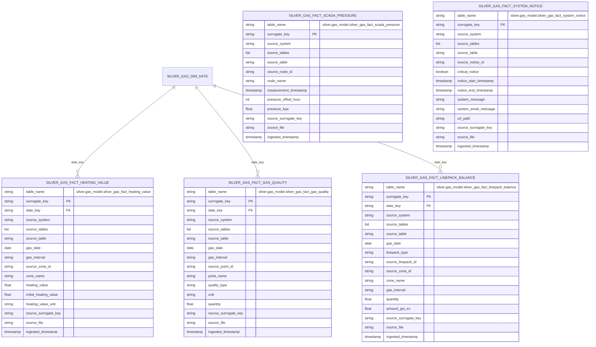

# Gas Quality And Status Mart ERD

This document covers the implemented VICGAS quality, pressure, notice, and
linepack-status facts in `silver.gas_model`.

## Table of contents

- [Fact Inventory](#fact-inventory)
- [ERD](#erd)
- [Implemented Source Tables](#implemented-source-tables)
- [Notes](#notes)
- [Related docs](#related-docs)

## Fact Inventory

| Asset | Grain |
| --- | --- |
| `silver.gas_model.silver_gas_fact_heating_value` | one row per source-specific heating value observation |
| `silver.gas_model.silver_gas_fact_gas_quality` | one row per source-specific gas quality or composition measurement |
| `silver.gas_model.silver_gas_fact_scada_pressure` | one row per MCE node pressure measurement offset |
| `silver.gas_model.silver_gas_fact_linepack_balance` | one row per source-specific linepack balance observation |
| `silver.gas_model.silver_gas_fact_system_notice` | one row per source-specific system notice |

## ERD

## Implemented Source Tables

- `silver_gas_fact_heating_value`:
  `silver.vicgas.silver_int047_v4_heating_values_1`,
  `silver.vicgas.silver_int139_v4_declared_daily_state_heating_value_1`,
  `silver.vicgas.silver_int139a_v4_daily_zonal_heating_1`,
  `silver.vicgas.silver_int439_v4_published_daily_heating_value_non_pts_1`,
  `silver.vicgas.silver_int539_v4_daily_zonal_hv_1`,
  `silver.vicgas.silver_int839a_v1_daily_zonal_hv_1`
- `silver_gas_fact_gas_quality`:
  `silver.vicgas.silver_int140_v5_gas_quality_data_1`,
  `silver.vicgas.silver_int176_v4_gas_composition_data_1`
- `silver_gas_fact_scada_pressure`:
  `silver.vicgas.silver_int276_v4_hourly_scada_pressures_at_mce_nodes_1`
- `silver_gas_fact_linepack_balance`:
  `silver.vicgas.silver_int089_v4_linepack_balance_1`,
  `silver.vicgas.silver_int152_v4_sched_min_qty_linepack_1`,
  `silver.vicgas.silver_int257_v4_linepack_with_zones_1`
- `silver_gas_fact_system_notice`:
  `silver.vicgas.silver_int029a_v4_system_notices_1`,
  `silver.vicgas.silver_int929a_v4_system_notices_1`

## Notes

- These assets keep source-qualified zone, point, node, and notice identifiers;
  they do not currently resolve to conformed `zone_key`, `operational_point_key`,
  or other shared-dimension foreign keys.
- `silver_gas_fact_scada_pressure` is intentionally standalone in the ERD
  because the implemented schema has no conformed foreign keys.

## Related docs

- [Gas-model index](README.md)
- [Shared dimensions ERD](gas_dim_erd.md)
- [High-level architecture](../architecture/high_level_architecture.md)
- [Ingestion sequence diagrams](../architecture/ingestion_flows.md)

## Sync metadata

- `sync.owner`: `docs`
- `sync.sources`:
  - `backend-services/dagster-user/aemo-etl/src/aemo_etl/defs/gas_model/silver_gas_fact_heating_value.py`
  - `backend-services/dagster-user/aemo-etl/src/aemo_etl/defs/gas_model/silver_gas_fact_gas_quality.py`
  - `backend-services/dagster-user/aemo-etl/src/aemo_etl/defs/gas_model/silver_gas_fact_scada_pressure.py`
  - `backend-services/dagster-user/aemo-etl/src/aemo_etl/defs/gas_model/silver_gas_fact_linepack_balance.py`
  - `backend-services/dagster-user/aemo-etl/src/aemo_etl/defs/gas_model/silver_gas_fact_system_notice.py`
- `sync.scope`: `interface`
- `sync.qa`:
  - `git diff --name-only`
  - `rg -n "<changed-file-path>" README.md docs backend-services infrastructure`
  - `verify links, diagrams, commands, paths, ports, env vars, and names`
