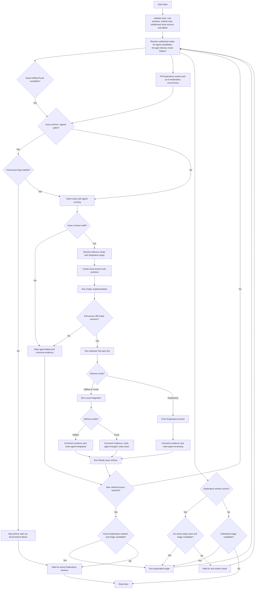
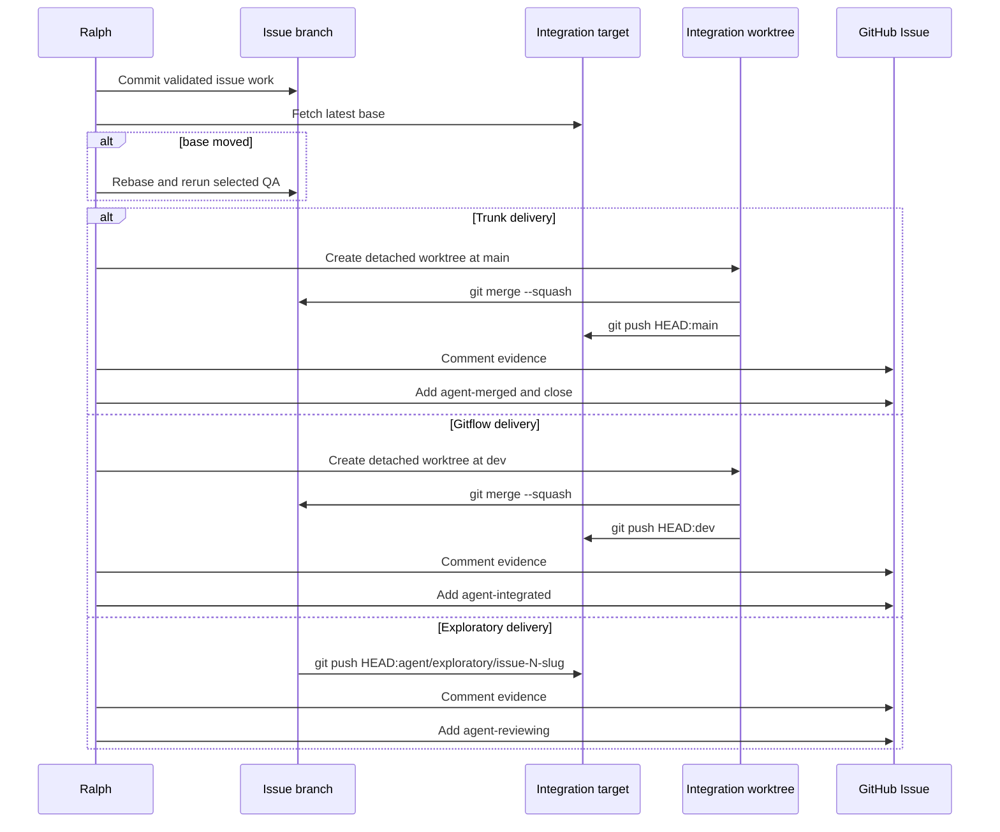

# Ralph Loop

This page documents the repo-local Ralph loop. The compatibility command stays
at `scripts/ralph.py`; the packaged Typer CLI, side-effect adapters, and loop
controller live in `tools/ralph-loop/src/ralph_loop/cli.py`, with pure workflow
helpers in `tools/ralph-loop/src/ralph_loop/workflow.py` and manifest state
helpers in `tools/ralph-loop/src/ralph_loop/state.py`. The loop uses GitHub
Issues as the queue, Codex as the implementation and triage worker, repo
**Test lane** commands as the validation boundary, and **Local integration**,
Exploratory handoff, plus **Promotion** as the success paths after QA.
Promotion also records a deterministic **Post-Promotion deployment
classification** from the promoted changed-file inventory.

## Table of contents

- [Purpose](#purpose)
- [Drain flow](#drain-flow)
- [Labels](#labels)
- [Run modes](#run-modes)
- [Live run preflight](#live-run-preflight)
- [Operator run](#operator-run)
- [AFK run monitoring](#afk-run-monitoring)
- [Run manifest](#run-manifest)
- [Run inspection and recovery](#run-inspection-and-recovery)
- [Implementation pass](#implementation-pass)
- [Promotion pass](#promotion-pass)
- [Triage pass](#triage-pass)
- [Ready issue refresh](#ready-issue-refresh)
- [QA policy](#qa-policy)
- [Failure handling](#failure-handling)

## Purpose

Ralph drains agent-ready GitHub issues through a guarded local loop:

1. Find unblocked `ready-for-agent` issues in queue order.
2. Resolve each issue **Delivery mode** and **Integration target** before lane
   selection.
3. Keep Gitflow and Trunk delivery in a serial lane while eligible Exploratory
   delivery issues run in a bounded worker pool.
4. Run `codex exec` to implement each claimed issue.
5. Run deterministic local QA.
6. For Gitflow or Trunk delivery, squash-merge validated work onto the latest
   **Integration target** locally.
7. In **Gitflow delivery**, push `dev`, comment evidence, mark
   `agent-integrated`, and leave the issue open for **Promotion**.
8. In **Trunk delivery**, push `main`, comment evidence, mark `agent-merged`,
   and close the issue.
9. In **Exploratory delivery**, push a durable **Exploratory branch** from
   `origin/main`, comment evidence, mark `agent-reviewing`, and leave the issue
   open for human review.
10. Run **Ready issue refresh** when enabled under a scheduler claim gate after
    each successful issue attempt. The gate pauses new claims while refresh
    analysis and metadata mutation run; already active Exploratory workers may
    finish.
11. If no serial Gitflow or Trunk ready issue can be claimed, triage the next
    unblocked issue and rescan. In parallel drains, that triage pass may run
    while already active Exploratory workers continue.

The loop stops when the queue has no unblocked implementation or triage
candidates, or when `--max-issues` is reached. A plain `--drain` run defaults
to 10 claimed implementation issues; `--max-issues 0` is the explicit unlimited
drain mode.
`--max-issues` counts claimed implementation issues across the serial and
Exploratory lanes. When the cap is reached, Ralph stops scheduling new issue
claims and waits for already active Exploratory workers to finish. Automated
triage remains outside this claimed-issue budget; if active Exploratory workers
are already running and no serial ready issue is claimable, Ralph may run a
triage pass before waiting for those workers.

`--max-codex-attempts` is a separate per-issue Codex implementation budget. It
defaults to `5` total attempts for each claimed issue, including the initial
implementation attempt and retries after Codex or QA failures. Retry prompts
include the previous failure detail. Future review-repair attempts should draw
from the same per-issue budget. Full-access implementation passes that change
files outside the issue's context anchors still fail immediately without retry.

The checkpointed Operator run path wraps the issue and **Promotion** commands
for unattended cleanup. It uses the same lane-aware drain scheduler as plain
`--drain`, so Gitflow and Trunk work stays serial while eligible Exploratory
work uses the bounded worker pool. One Operator cycle can checkpoint multiple
child implementation manifests from that scheduler pass before it runs
**Promotion** for reviewed Gitflow work. **Promotion** starts only after active
Exploratory workers, implementation **Ready issue refresh** gates, and metadata
updates from the scheduler pass have settled. The Operator checkpoints
**Post-promotion review** follow-up creation and repeats until the Operator
queue is clean or a guard or failure condition stops the run with recovery
guidance.

Human operators should call Ralph through repo-local skills:

```text
$grill-with-docs -> optional $to-prd -> $shape-issues -> $ralph-triage -> $ralph-loop drain -> review dev -> $ralph-loop promote
```

Use [OPERATOR.md](../../OPERATOR.md) for the first-class **Operator workflow**.
`$shape-issues` shapes tracer-bullet issue drafts, gates implementation drafts,
checks **Issue context assessor** evidence and stiffness, and may publish
explicitly confirmed gate-passing outputs as `needs-triage` issues only. It
also writes pre-publication review Markdown at `issue-drafts.md` and
`issue-drafts/*.md`, and it does not move issues to `ready-for-agent`.
Follow-up verbs after a `$shape-issues` plan stay in issue-draft execution;
direct implementation requires `$ralph-loop` or an explicit named GitHub Issue
request. Fixture-gated reports can preview with `--dry-run`, but non-dry-run
publication requires `--allow-fixture-publish`, preflights `gh`
authentication and repository access, and records fixture provenance.
`$ralph-triage` prepares GitHub Issues for drain by setting category, state, and
**Delivery mode** labels. `$ralph-loop` owns the backing script commands,
including `$ralph-loop drain` and `$ralph-loop promote`.
Use `$ralph-curate` before triage or drain when the open issue queue needs to
be reconciled against current branch state.

## Drain flow



## Labels

Triage state labels:

- `needs-triage`
- `needs-info`
- `ready-for-agent`
- `ready-for-human`
- `wontfix`

Category labels:

- `bug`
- `enhancement`

Ralph runtime labels:

- `agent-running`
- `agent-failed`
- `agent-merged`
- `agent-integrated`
- `agent-reviewing`

Ralph delivery labels:

- `delivery-gitflow`
- `delivery-trunk`
- `delivery-exploratory`

Use `ready-for-agent` as the queue selection signal. `needs-triage`,
`needs-info`, `ready-for-human`, `wontfix`, `agent-running`, `agent-failed`,
`agent-merged`, `agent-integrated`, and `agent-reviewing` block
implementation. Runtime labels including `agent-reviewing` also block
automated triage reconsideration.

`delivery-gitflow` is the default **Delivery mode**. `delivery-trunk` is an
opt-in label for small docs, tests, tooling, or script changes.
`delivery-exploratory` is an opt-in label for durable **Exploratory branch**
work that needs explicit human judgment before it can become normal delivery
work. If
`delivery-exploratory` conflicts with Gitflow or trunk labels, Ralph keeps
`delivery-exploratory` and removes the others. If only Gitflow and trunk
conflict, Ralph keeps `delivery-gitflow`, removes `delivery-trunk`, and
proceeds through the safer default.

Create or refresh the labels with:

```bash
python3 scripts/ralph.py --bootstrap-labels
```

## Run modes

Dry-run the drain queue preview:

```bash
python3 scripts/ralph.py --drain --dry-run
```

`--drain --dry-run` previews the next serial Gitflow or trunk candidate plus up
to two eligible Exploratory candidates, using each issue's resolved
**Delivery mode**. Set `--exploratory-concurrency N` to change that
Exploratory preview bound; the default is `2` and the minimum is `1`.
Targeted `--issue` dry runs still preview only that issue.

Drain up to 10 claimed implementation issues:

```bash
python3 scripts/ralph.py --drain
```

Live `--drain` runs a lane-aware scheduler. Gitflow and Trunk delivery stay in a
single serial lane. Exploratory delivery issues are submitted oldest-first to a
`ThreadPoolExecutor` with at most `--exploratory-concurrency` active workers.
The scheduler preserves queue order within each lane and applies `--max-issues`
to claimed issues across both lanes. When **Ready issue refresh** starts after a
successful **Local integration** or Exploratory handoff, the scheduler pauses
new issue claims until all pending refresh passes complete successfully. Running
Exploratory workers are not cancelled; they may finish while the claim gate is
closed. When no serial Gitflow or Trunk ready issue is claimable, the scheduler
may run one automated triage pass while active Exploratory workers continue.
That triage pass does not consume the `--max-issues` claimed-issue budget.

Drain or run the Operator loop without applying **Ready issue refresh** metadata
updates:

```bash
python3 scripts/ralph.py --drain --skip-ready-issue-refresh
```

Drain directly to trunk for small low-risk changes:

```bash
python3 scripts/ralph.py --drain --delivery-mode trunk
```

Drain to durable **Exploratory branches** for exploratory changes:

```bash
python3 scripts/ralph.py --drain --delivery-mode exploratory
```

Preview more Exploratory candidates in a dry run:

```bash
python3 scripts/ralph.py --drain --dry-run --exploratory-concurrency 4
```

Drain until only blocked or non-actionable issues remain:

```bash
python3 scripts/ralph.py --drain --max-issues 0
```

Use a different per-issue Codex attempt budget:

```bash
python3 scripts/ralph.py --drain --max-codex-attempts 3
```

Implement one specific issue:

```bash
python3 scripts/ralph.py --issue 25
```

Implement `.agents/` workflow issues only after explicit operator approval for a
**Full-access implementation pass**:

```bash
python3 scripts/ralph.py --issue 25 --allow-full-access-implementation
```

Implement one specific issue and then run **Ready issue refresh**:

```bash
python3 scripts/ralph.py --issue 25 --ready-issue-refresh
```

Promote reviewed Gitflow work from `dev` to `main`:

```bash
python3 scripts/ralph.py --promote
```

Promote and opt into post-Promotion **Ready issue refresh** for a direct
Promotion command:

```bash
python3 scripts/ralph.py --promote --ready-issue-refresh
```

Run repeated drain and **Promotion** cycles in a foreground terminal:

```bash
python3 scripts/ralph.py --drain-promote-all --max-cycles 10
```

Checkpointed Operator child runs forward `--exploratory-concurrency`; the
default remains `2`. Foreground `--drain-promote-all` runs the same scheduler
directly.

Launch the checkpointed Operator run in Codex-safe detached mode:

```bash
python3 scripts/ralph.py --drain-promote-all --detach
```

Inspect the latest Operator run without following child logs:

```bash
python3 scripts/ralph.py --operator-run-status latest
```

Apply explicit Exploratory acceptance decisions from a JSON artifact:

```bash
python3 scripts/ralph.py --apply-exploratory-acceptance-decisions path/to/decisions.json
```

Continue a paused Exploratory acceptance conflict run after the acceptance
worktree is resolved and clean:

```bash
python3 scripts/ralph.py --continue-exploratory-acceptance .ralph/runs/exploratory-acceptance-20260504T010203Z
```

Use `--source-branch <branch>` with that command only when the Gitflow source
branch is not `dev`. The apply flow does not support `--dry-run` because
accepted decisions may push the source branch after merged-target QA passes.

Skip the default **Post-promotion review** during **Promotion**:

```bash
python3 scripts/ralph.py --promote --skip-post-promotion-review
```

Run **Post-promotion review** but skip automatic validated follow-up issue
creation:

```bash
python3 scripts/ralph.py --promote --skip-post-promotion-followups
```

Override the **Integration target** explicitly when needed:

```bash
python3 scripts/ralph.py --issue 25 --target-branch feature/my-branch
```

Inspect a completed or failed implementation run without mutating GitHub or git
state:

```bash
python3 scripts/ralph.py --inspect-run .ralph/runs/issue-25-20260504T010203Z
```

Recover missing GitHub metadata after verifying the recorded published commit
reached the expected **Integration target**:

```bash
python3 scripts/ralph.py --recover-run .ralph/runs/issue-25-20260504T010203Z
```

Bypass the live clean-root preflight only when the operator intentionally wants
Ralph to run with uncommitted root worktree changes:

```bash
python3 scripts/ralph.py --drain --allow-dirty-worktree
```

## Live run preflight

Live `--issue`, `--drain`, `--promote`,
`--apply-exploratory-acceptance-decisions`, and
`--continue-exploratory-acceptance` runs fail before GitHub issue claim,
worktree creation, **Local integration**, Exploratory handoff, acceptance
merge, acceptance continue, or push when the root worktree has uncommitted
changes. Commit or stash root worktree changes before live Ralph runs. Use
`--allow-dirty-worktree` only for an explicit dirty-worktree operation.
`--dry-run` remains available on a dirty root worktree for drain and issue
previews so operators can inspect the next Ralph action without mutating issues
or branches.

Before a live drain, validate both GitHub API auth and Git push auth for the
expected **Integration target**:

```bash
gh auth status
git push --dry-run origin HEAD:main
```

When using token-based GitHub CLI auth, export `GH_TOKEN` in the shell that runs
Ralph. Do not paste token values into commands, issue comments, docs, or logs.
Ralph also gives spawned Codex subprocesses **Sandboxed issue access** by
default: it resolves a token from `GH_TOKEN`, `GITHUB_TOKEN`, or `gh auth
token`, injects it as `GH_TOKEN`, enables network for the Codex sandbox selected
for that phase, and prepends a wrapper that permits only `gh auth status` plus
the phase-specific `gh issue` commands. Implementation, triage, and **Ready
issue refresh** passes may get phase-limited issue reads and writes. The
**Post-promotion review** gets read-only issue access: `gh issue view`,
`gh issue list`, and `gh issue status`. The review agent cannot call
`gh issue create`, `comment`, `edit`, `close`, or `reopen`. After a successful
**Promotion**, Ralph may create structured follow-up issues itself through a
validated create-only helper that calls only issue search and issue create. This
does not grant Git push access; Git fetches, **Local integration**, Exploratory
handoff pushes, **Integration target** pushes, and **Promotion** stay in
Ralph's outer loop.

Ralph treats ready issues whose `## Context anchors` include `.agents/` `Path:`
or `Doc:` paths as agent-workflow changes. Those issues require
`--allow-full-access-implementation` before Ralph claims the issue. Without that
operator flag, Ralph records `full_access_implementation.status:
blocked_missing_operator_flag` and stops as an **Environment failure** before
claiming, creating a worktree, or marking the issue failed. With the flag,
only the Codex implementation subprocess for that issue runs as a
**Full-access implementation pass** using Codex's approvals-and-sandbox bypass.
The subprocess receives read-only GitHub Issue commands only: `gh auth status`,
`gh issue view`, `gh issue list`, and `gh issue status`.

After each full-access Codex implementation attempt returns, Ralph reads the
worktree diff before QA. Every changed file must match an issue context anchor;
`Path:` and `Doc:` anchors are file or directory path anchors, and directory
anchors, including anchors ending in `/`, allow files below that directory. If
any changed file is outside those anchors, Ralph records
`full_access_implementation.status: diff_out_of_scope`, skips QA, skips retry,
skips **Local integration** or Exploratory handoff, preserves the implementation
worktree, and marks the claimed issue failed with recovery guidance.

Ralph also standardizes writable QA runtime paths for spawned Codex
subprocesses and Ralph-run QA commands. If the operator exports `DAGSTER_HOME`,
`XDG_CACHE_HOME`, or `UV_CACHE_DIR`, Ralph preserves that explicit value.
Otherwise it sets the variable under
`/tmp/ralph-qa-runtime/<repo-slug>/<run-dir-name>/` using `dagster-home`,
`xdg-cache`, and `uv-cache` child directories. These defaults keep sandboxed
**Commit check**, **Push check**, and Dagster CLI commands away from
home-directory cache locations that may be read-only.

Use `HEAD:dev` for Gitflow target validation, `HEAD:main` for trunk or
promotion validation, and `HEAD:agent/exploratory/issue-N-slug` for a specific
Exploratory handoff. Run Ralph from a local worktree that is aligned with the
remote branch being operated on. The script fetches the implementation base
during implementation and rebases issue work if that base moves, but the
operator should start from a known repo state.

## Operator run

`python3 scripts/ralph.py --drain-promote-all` runs the Operator orchestration
loop. Ready work in each cycle is handed to the same lane-aware drain scheduler
used by plain `--drain`: Gitflow and Trunk issue attempts remain serial, while
eligible Exploratory issues run up to `--exploratory-concurrency` in parallel.
The Operator records compact checkpoints under
`.ralph/operator-runs/.../operator-run.json` and links each checkpoint to the
detailed child `.ralph/runs/.../ralph-run.json` manifest for the issue or
**Promotion** that just crossed a boundary. A single Operator cycle can record
multiple issue success or failure checkpoints before the next **Promotion**
checkpoint.

Completed or stopped Operator runs also write
`.ralph/operator-runs/.../operator-run-rollup.md` and
`.ralph/operator-runs/.../operator-run-rollup.json`. The Markdown rollup is the
first review surface for the full drain-and-**Promotion** run; the JSON rollup
is the stable tooling surface for issue outcomes, manual recoveries, **Local
integration** commits, **Promotion** commits, QA surfaces,
**Post-promotion review** follow-ups, post-Promotion deployment execution,
deploy-repair issue creation, final queue state, and stop or failure reasons.
Both rollups record the underlying child `.ralph/runs/.../ralph-run.json` paths
without tailing child Codex JSONL or rich command logs.
When open `agent-reviewing` issues remain and no unblocked ready work can
proceed, the Operator run also writes `exploratory-acceptance-review.md` and
`exploratory-acceptance-review.json` under the same run directory.

The Operator run checks the open GitHub Issue queue for these runtime states:

- `ready-for-agent`
- `agent-integrated`
- `agent-reviewing`
- `agent-running`
- `agent-failed`

It stops cleanly only when none of those open issues remain. It stops with
`needs_review` when open `agent-reviewing` issues require **Exploratory
acceptance review** before blocked ready work can proceed. That checkpoint is
`exploratory_acceptance_review_required`; it is non-mutating and does not push,
comment, edit labels, close issues, or update **Integration targets**. It still
stops with failed recovery guidance when `agent-running` or `agent-failed`
issues remain, when ready issues are blocked by non-review work, when an issue
or **Promotion** child manifest fails, when the drain scheduler reports a fatal
refresh, post-push metadata, or environment failure, or when `--max-cycles` is
reached. The default cycle guard is 10; use `--max-cycles 0` only for explicit
unlimited Operator runs.

Checkpoints are recorded for:

- issue success or failure
- before **Promotion**
- **Promotion** success or failure
- **Post-promotion review** follow-up creation
- post-Promotion **Ready issue refresh**
- deployment skipped, started, succeeded, or failed
- deploy-repair issue creation after failed deployment
- **Exploratory acceptance review** required
- queue clean
- stopped-by-guard

The `before_promotion` checkpoint is written only after the scheduler pass has
returned. That means active Exploratory workers have finished, implementation
**Ready issue refresh** claim gates have opened, and child metadata updates have
either completed or produced recorded recovery evidence.
Deployment checkpoints are written only after successful Promotion metadata
updates, **Post-promotion review**, follow-up creation, and post-Promotion
**Ready issue refresh** have completed in the Promotion child run.

Detached mode is the Codex-safe path:

```bash
python3 scripts/ralph.py --drain-promote-all --detach
```

The launcher prints the Operator run directory and a status command, then exits
without tailing child Codex JSONL or rich command logs. Codex should stop
polling after launch and inspect status only at issue boundaries:

```bash
python3 scripts/ralph.py --operator-run-status latest
python3 scripts/ralph.py --operator-run-status .ralph/operator-runs/operator-20260506T010203Z
```

Status reports the current state, last checkpoint, current issue or
**Promotion**, child manifest paths, rollup artifact paths, queue counts, and
recommended next action. Read `operator-run-rollup.md` first for completed or
stopped runs. Open the child `ralph-run.json` or command logs only when the
status guidance or rollup points to a failed issue, failed **Promotion**, or
manual recovery condition. If status reports `needs_review`, read
`exploratory-acceptance-review.md`, then run the `$ralph-loop` Exploratory
acceptance review flow before rerunning drain or **Promotion**.

## AFK run monitoring

Ralph writes command logs while subprocesses are still running. Long Codex
implementation attempts write to `codex-implementation-N.jsonl`, triage writes
to `codex-triage.jsonl`, read-only **Ready issue refresh** analysis writes to
`codex-ready-issue-refresh-analysis.jsonl`, **Post-promotion review** writes to
`codex-post-promotion-review.jsonl`, QA writes to `qa-*` logs, and Git
operations write to their named `git-*` logs under the current
`.ralph/runs/...` run directory.
While a command is active, the log has `exit: running`; after the command
finishes, Ralph rewrites the same log with the final exit status while
preserving stdout, stderr, command, and cwd.

After a successful, failed, or partial **Promotion** with changed files and an
available review worktree, Ralph tries to save the final
**Post-promotion review** Markdown report as `post-promotion-review.md` beside
`codex-post-promotion-review.jsonl` and prints the same report to the terminal.

During logged long-running phases, Ralph prints a heartbeat about every 30
seconds:

```text
Ralph heartbeat: phase=#49: Codex implementation attempt 1; log=/repo/.ralph/runs/issue-49-.../codex-implementation-1.jsonl
```

For AFK drains, use the heartbeat phase to see what Ralph is waiting on and tail
the active log path to inspect live command output. If the terminal only shows
heartbeats and no completion message, the phase is still running. If a command
fails, the same log path appears in the failure output or issue evidence.

## Run manifest

Every implementation run and **Promotion** run writes
`.ralph/runs/.../ralph-run.json`. The manifest is rewritten as milestones
complete, so a failed run still records the last known recovery state.

Key fields for inspection:

- `schema_version`: manifest format version.
- `run_kind`: `implementation` or `promotion`.
- `status` and `stage`: current run outcome and latest milestone.
- `events`: timestamped milestone history.
- `issue`: implementation issue number, title, and URL.
- `github_metadata.issues`: promoted issue numbers, recorded issue evidence
  commits, per-issue Promotion metadata command log paths, and manual recovery
  evidence warnings during **Promotion**.
- `configuration.exploratory_concurrency`: the configured Exploratory preview
  bound for the Ralph run.
- `delivery_mode`: issue **Delivery mode**; **Promotion** records `gitflow`.
- `integration_target`: branch Ralph is updating for the run.
- `source_branch`: **Promotion** source branch, usually `dev`.
- `source_tree`: **Promotion** source branch revision and source worktree used
  for QA.
- `promotion_worktree_preflight`: stale Promotion source or target worktree
  checks, including the blocking path, git-worktree registration state, current
  head, dirty state when inspectable, and recovery guidance.
- `promotion_commit_inventory`: full promoted source commit range with each
  commit SHA, subject, and whether it matched verified issue evidence or
  remained an unverified **Promotion** commit. When one evidence commit maps to
  multiple issues, the inventory records every issue mapping.
- `deployment_classification`: deterministic **Post-Promotion deployment
  classification** with the selected tier, reason, recommended action,
  deployable paths, non-triggering **Agent workflow changes**, and other
  non-triggering paths. Direct Promotion records this field and prints the
  recommendation without running AWS or Pulumi commands.
- `deploy_repair_issues`: deploy-failure analysis status, Markdown artifact
  path, created issue URLs, duplicate source-marker skips, validation downgrades
  to `needs-triage`, warning-only creation failures, and recovery guidance for
  checkpointed Operator deployment failures.
- `post_promotion_review`: enabled state, skip reason, warning-only review
  status, review log path, and Markdown artifact path for **Promotion** runs.
- `post_promotion_followups`: enabled state, created issue URLs, duplicate
  source-marker skips, validation downgrades to `needs-triage`, warning-only
  creation failures, and recovery guidance for **Promotion** follow-ups.
- `ready_issue_refresh`: enabled state, skip reason, read-only analysis status,
  candidate issue numbers, candidate issue metadata, analysis log path, Markdown
  artifact path, mutation results, recovery guidance, and failure state for
  implementation runs after successful **Local integration** or Exploratory
  handoff and for **Promotion** runs after verified issue closures.
- `drain_scheduler.fatal_stop`: drain fatal-stop state for implementation runs,
  including whether the live drain scheduler was enabled, whether the child
  triggered or observed the stop, the fatal reason, error message, recovery log
  path, and active Exploratory worker issue numbers.
- `branch_sync`: Gitflow `main`-into-`dev` sync status, sync worktree path,
  merge or push log path, conflicted files, failure type, and recovery guidance
  when Ralph must stop before issue implementation.
- `formatter_recovery`: implementation commit formatter-rewrite recovery
  status, formatter-modified tracked files, staged files, original and retry
  commit log paths, rerun **Commit check** results, failure type, and recovery
  guidance.
- `full_access_implementation`: whether a **Full-access implementation pass** was
  enabled or required, the normalized context anchors, changed files,
  out-of-scope files, status, and recovery guidance.
- `decisions`: explicit Exploratory acceptance decisions, per-issue validation
  state, handoff branch and commit, accepted `dev` commit, metadata operations,
  and recovery context for `exploratory_acceptance_apply` runs.
- `acceptance_conflict`: paused Exploratory acceptance conflict status,
  acceptance worktree path, conflicted files, `decisions.json`,
  `conflicts.json`, `codex-resolution-prompt.md`, continue command, and
  recovery guidance.
- `branches`: issue, source, and target branch names that apply to the run.
- `paths`: repo root, run directory, worktree container, and implementation,
  branch-sync, integration, Promotion source, Promotion target, or Exploratory
  acceptance worktree paths.
- `changed_files`: current file diff used for QA, **Local integration**, or
  Exploratory handoff or acceptance.
- `qa_results`: selected QA commands, cwd, log path, and pass/fail state.
- `qa_results[].run_manifest_evidence`: durable evidence captured from a
  successful QA command that prints `run manifest:`. Ralph copies the emitted
  JSON manifest into the Ralph run directory when it still exists, or writes a
  JSON evidence extract from the QA log when the source manifest is unavailable.
  The entry records the original source path, durable artifact path, artifact
  kind, and key e2e observations.
- `qa_runtime_env`: effective `DAGSTER_HOME`, `XDG_CACHE_HOME`, and
  `UV_CACHE_DIR` values plus whether each came from the operator environment or
  Ralph's writable fallback.
- `sandboxed_issue_access`: non-secret token source, wrapper path, allowed
  command set, and network access state for spawned Codex subprocesses.
- `integration_commit`: published implementation commit. For Gitflow and Trunk
  delivery this is the **Local integration** commit; for Exploratory delivery
  this is the **Exploratory branch** commit.
- `promotion_commit`: **Promotion** commit pushed to `main`.
- `local_branch_fast_forwards`: checked-out local source branch and
  **Integration target** branch fast-forward status, worktree path,
  current and target commits, and recovery command plus reason when a local
  branch is not safe to update.
- `pushes`: per-branch push state, commit SHA, and push log path.
- `github_metadata`: claim, completion, failure, Promotion comment, label, and
  close state.
- `failure`: user-facing error message and command log path when the run fails.

## Run inspection and recovery

Use `--inspect-run <run_dir>` first when a terminal shows a post-push metadata
failure, a completed issue looks inconsistent in GitHub, or an AFK run needs a
read-only summary. Inspection reads only `<run_dir>/ralph-run.json` and reports
the issue, **Delivery mode**, **Integration target**, QA status, push status,
metadata status, and recommended next action. It does not call `gh`, run git
commands, edit labels, comment, close issues, or change refs.

Use `--recover-run <run_dir>` only for implementation runs whose manifest
records a published implementation commit. Recovery fetches the expected target
branch and refuses to proceed unless the recorded commit is reachable from
`origin/<integration-target>`. This guard keeps GitHub metadata reconciliation
behind proof that the **Local integration** commit or Exploratory handoff commit
reached the expected branch.

After reachability is verified, recovery reconciles GitHub metadata to the
issue's **Delivery mode**:

- **Trunk delivery**: ensure the completion comment exists, remove runtime
  labels, apply `agent-merged`, and close the issue.
- **Gitflow delivery**: ensure the completion comment exists, remove runtime
  labels, apply `agent-integrated`, and leave the issue open for **Promotion**.
  If the issue was closed prematurely, recovery reopens it.
- **Exploratory delivery**: ensure the completion comment exists, remove
  runtime labels, apply `agent-reviewing`, and leave or reopen the issue for
  human review.

Recovery does not rerun Codex, rerun QA, create commits, push branches, or clean
worktrees. Normal Ralph runs keep fail-stop behavior: if metadata operations
fail after a push, Ralph stops loudly so an operator can inspect the run and
recover deliberately.

Exploratory acceptance merge conflicts pause with run status
`acceptance_conflict` before push or GitHub Issue metadata mutation. Ralph
leaves the acceptance worktree in place and writes `decisions.json`,
`conflicts.json`, and `codex-resolution-prompt.md` under the run directory. The
prompt tells Codex to work only in that acceptance worktree, preserve the
accepted issue intent, commit the conflict resolution, and leave the worktree
clean. Use `--inspect-run <run_dir>` to print the paused worktree path and the
`--continue-exploratory-acceptance <run_dir>` command.

`--continue-exploratory-acceptance <run_dir>` reloads the paused decision set,
refuses missing or mismatched artifacts, refuses a missing, stale, dirty, or
still-conflicted acceptance worktree, reruns selected merged-target QA, pushes
the Gitflow source branch, and only then applies acceptance metadata. During
resume, Ralph preserves already-recorded per-issue acceptance commits and
derives any missing issue evidence from the resolved first-parent history so
each accepted issue points at the commit that made its handoff reachable. If
metadata fails after `dev` is pushed, treat the run as post-push recovery:
verify the pushed commits in the manifest, then add any missing
`Ralph exploratory acceptance completed.` evidence and label transitions before
rerunning **Promotion**. Non-conflict apply failures before the accepted branch
push still leave accepted issue metadata unchanged and record recovery guidance
in the manifest.

If a failed Gitflow run passed issue QA but failed before recording
`integration_commit`, and an operator manually creates or pushes the recovered
commit to `dev`, preserve **Promotion** closure evidence before applying or
leaving `agent-integrated`. Verify the recovered commit is reachable from
`origin/dev` and is not already on `origin/main`, then add an issue comment that
starts with this exact contract:

```markdown
Ralph Gitflow manual recovery completed.

Commit: `<dev-commit-sha>`
Delivery mode: `gitflow`
Target branch: `dev`
Recovered from run: `<run-dir>`
```

The `Commit:` line must name the `dev` commit that made the recovered issue
work reachable from the Gitflow source branch. Keep the issue open with
`agent-integrated` so the next **Promotion** can verify the commit in the
promoted range, comment Promotion evidence, replace `agent-integrated` with
`agent-merged`, and close the issue. If **Promotion** sees manual recovery
evidence on an open `agent-integrated` issue but cannot parse a commit from the
documented contract, it emits a warning with the recovery action and records
`manual_recovery_commit_unparseable` in the Promotion manifest instead of
leaving the issue silently unreconciled.

## Implementation pass

An implementation issue must have these sections:

- `## What to build`
- `## Acceptance criteria`
- `## Blocked by`

An Exploratory delivery issue must also have `## Review focus`, stating the
human judgment the durable **Exploratory branch** needs. Missing
`## Review focus` marks the issue `agent-failed` before Ralph creates an
implementation worktree, invokes Codex, or publishes an Exploratory handoff.

If any referenced blocker in `Blocked by` is still open, Ralph skips the issue.
If the issue contract is malformed, Ralph marks the issue `agent-failed` and
leaves a result comment with the run log path.

Ralph chooses **Delivery mode** from issue labels first, then from the CLI
default. Missing delivery labels are written back to the issue before
implementation. `delivery-gitflow` defaults to `origin/dev`; if that branch does
not exist, Ralph creates it from `origin/main`. Before creating a Gitflow issue
branch, Ralph also syncs `origin/main` into `origin/dev` when `main` is not
already an ancestor of `dev`, so the **Integration target** is not behind trunk.
This branch sync runs before Ralph claims the issue. If the merge conflicts or
an existing `agent-sync-main-into-dev` worktree indicates stale sync state,
Ralph records `branch_sync` recovery guidance in the run manifest and stops the
drain without marking unrelated `ready-for-agent` issues failed.
`delivery-trunk` defaults to `origin/main`. `delivery-exploratory` defaults to
a per-issue **Exploratory branch** named `agent/exploratory/issue-N-slug`.
Ralph fails clearly before Codex implementation if that remote branch already
exists; otherwise it creates the local **Exploratory branch** from
`origin/main` and later pushes it. `--target-branch` overrides the
**Integration target** explicitly.

For Gitflow and Trunk delivery, Ralph creates branches named
`agent/issue-N-slug` from the **Integration target** and creates sibling
worktrees under the repo worktree container. For Exploratory delivery, Ralph
creates the **Exploratory branch** from `origin/main`. Codex is instructed not
to commit, push, or edit GitHub issue state; Ralph owns those steps after QA
passes.

Normal implementation attempts use the workspace-write Codex sandbox and
phase-limited **Sandboxed issue access**. Ready issues that name `.agents/`
context anchors use the **Full-access implementation pass** only when the
operator passed `--allow-full-access-implementation`; they retain read-only issue
commands and must pass Ralph's context-anchor diff guard before QA.

Before building the Codex implementation prompts for an issue, Ralph fetches
issue comments for the issue being implemented. The prompt keeps the issue body
as the primary contract, then appends a separate
`Recent Ready issue refresh notes` section when matching context exists. That
section includes only the latest five comments whose body starts with the Ready
issue refresh audit prefix, preserving their chronological order. Normal
maintainer comments and automated triage comments are excluded. If comment
fetching fails, Ralph fails the issue before starting the Codex implementation
subprocess instead of running with incomplete refresh context.

For each claimed issue, Ralph runs at most `--max-codex-attempts` Codex
implementation attempts. The default is `5`. Each attempt writes
`codex-implementation-N.jsonl`; retry attempts use prompts that include the
previous Codex or QA failure evidence, then rerun Codex before QA. QA retry logs
keep the existing `qa` and `qa-retry` names for the first two attempts and add
ordered retry prefixes for later attempts.

After QA passes, Ralph commits the implementation branch. If the implementation
commit hook attempt rewrites tracked files, Ralph records
`formatter_recovery`, stages the formatter-modified paths, reruns the selected
**Commit check** command or commands once, and retries the implementation
commit. A successful recovery keeps the rerun **Commit check** evidence in
`qa_results` and continues normally. If the recovery **Commit check** or retry
commit fails, Ralph fails the issue as
`formatter_rewrite_recovery_failure`, preserving the implementation worktree,
commit logs, rerun **Commit check** logs, modified file list, and recovery
guidance.

After the implementation branch commit succeeds, Ralph fetches the branch's
base and rebases if the base moved. A rebase triggers the selected QA commands
again before **Local integration** or Exploratory handoff continues.

For **Local integration**, Ralph creates a temporary detached integration
worktree at latest target, runs `git merge --squash` from the issue branch,
creates one integration commit, pushes it to the target, and posts completion
evidence with the commit SHA, changed files, QA commands, and run log path.
Trunk integration marks the issue `agent-merged` and closes it. Gitflow
integration marks the issue `agent-integrated` and leaves it open for
**Promotion**. Exploratory handoff skips the detached integration worktree and
squash merge: Ralph pushes the validated **Exploratory branch** to origin,
marks the issue `agent-reviewing`, and leaves it open for human review. Ralph
does not open a GitHub draft PR.

Human review owns the next Exploratory state decision. The Operator records
explicit `accept`, `hold`, or `reject` decisions in a JSON artifact:

```json
{
  "decisions": [
    {"issue_number": 42, "decision": "accept", "reason": "Reviewed."}
  ]
}
```

Ralph applies that artifact with:

```bash
python3 scripts/ralph.py --apply-exploratory-acceptance-decisions path/to/decisions.json
```

Ralph validates that each issue is still open with `agent-reviewing` and has a
parseable Exploratory handoff branch and commit. Accepted decisions are merged
into one temporary acceptance worktree based on the configured Gitflow source
branch, normally `origin/dev`. Ralph runs selected merged-target QA from the
resulting changed files, pushes `dev` only after QA passes, then adds
acceptance evidence to the issue, removes `agent-reviewing`, and adds
`agent-integrated` so the issue can close through the existing **Promotion**
path. The acceptance comment starts with:

```markdown
Ralph exploratory acceptance completed.

Commit: `<dev-commit-sha>`
```

The commit is the `dev` commit that made the accepted work reachable from the
source branch. When a multi-issue acceptance run resumes after conflict
resolution, Ralph keeps prior per-issue acceptance commits and derives the
remaining accepted issue commits from the resolved history before writing
metadata. Held decisions comment the reason and leave `agent-reviewing` in
place. Rejected decisions leave the issue open, remove `agent-reviewing`, add
`ready-for-human`, and comment the review result and next action. Rejected
review must not add `agent-integrated`. If an accepted branch merge conflicts,
Ralph pauses with `acceptance_conflict`, writes `decisions.json`,
`conflicts.json`, and `codex-resolution-prompt.md`, and does not push or mutate
GitHub Issues until `--continue-exploratory-acceptance <run_dir>` validates a
clean resolved acceptance worktree and reruns merged-target QA. No GitHub
metadata changes happen for accepted decisions before the accepted branch
merge, merged-target QA, and source branch push succeed. ADR
[0005](../adr/0005-ralph-exploratory-branches-stay-outside-automatic-promotion.md)
records why **Exploratory branches** stay outside automatic **Promotion** until
human acceptance evidence reaches `dev`.

Checkpointed Operator runs make open `agent-reviewing` issues first-class. If
no unblocked ready issue can proceed and ready work is waiting on
`agent-reviewing` review, Ralph stops with terminal status `needs_review` and
checkpoint `exploratory_acceptance_review_required`. The generated
**Exploratory acceptance review** artifacts list each published **Exploratory
branch**, issue number, title, handoff commit, changed files, recorded QA
evidence, detectable missing **Test lane** evidence, mergeability against
`origin/dev` or the configured Gitflow source branch, and downstream
`ready-for-agent` issues blocked by the review decision. The artifact is
non-mutating: it reads issue and git state only and does not push, comment,
change labels, close issues, or update **Integration targets**.



## Promotion pass

`python3 scripts/ralph.py --promote` promotes reviewed Gitflow work and accepted
Exploratory work from `origin/dev` to `origin/main` by default. Ralph fetches
both branches, computes the changed files between the target branch and the
fetched source-branch revision, records the full source commit inventory for
that promoted range, and creates an isolated source worktree at that source
revision. The commit inventory records every promoted source commit with its
SHA and subject. After verified issues are identified, commits whose SHA matches
a recorded Gitflow **Local integration** commit, a documented manual Gitflow
recovery commit, or an accepted Exploratory commit are treated as verified issue
evidence. If more than one issue records the same evidence commit, the
inventory and **Post-promotion review** prompt list every issue mapping instead
of keeping only the first match. Other commits remain visible as unverified
**Promotion** commits in the run manifest and **Post-promotion review** prompt.
Unverified **Promotion** commits are mandatory **Post-promotion review**
context only. They do not block **Promotion**, do not require explicit issue
association before **Promotion**, and do not create follow-up issues by
themselves. Follow-up GitHub Issue drafts belong in the
**Post-promotion review** artifact only when the review finds concrete
actionable work.

Immediately after recording the Promotion changed-file inventory, Ralph records
`deployment_classification` in the **Promotion** manifest and prints the
recommended deployment action. Direct `$ralph-loop promote` never runs the
deployment command. The checkpointed Operator path consumes the same recorded
classification only after successful Promotion metadata updates,
**Post-promotion review**, follow-up creation, and **Ready issue refresh** have
completed. It records `deployment_execution` in the Promotion child manifest
and records the matching Operator checkpoint with command path, command
arguments, cwd, log path, exit status, **Deployed test** evidence, and full-tier
idempotency evidence. The classifier uses three tiers:

- `no_deployment`: no AWS deployment is recommended. A Promotion containing
  only **Agent workflow changes** records this tier with a clear skip reason.
- `user_code_redeploy`: only deployed AEMO ETL user-code runtime paths changed,
  optionally with non-triggering context paths. The recommendation is
  `infrastructure/aws-pulumi/scripts/redeploy-user-code`.
- `full_deployed_workflow`: Pulumi, service runtime, image, Dagster core, auth,
  Caddy, Marimo, code-location topology, or mixed deployed-platform paths
  changed. The recommendation is
  `infrastructure/aws-pulumi/scripts/run-integration-tests --with-idempotency`.

When a Promotion mixes **Agent workflow changes** with deployable paths, Ralph
classifies only the deployable subset and reports the Agent workflow paths as
non-triggering context. The **AWS/Pulumi credential boundary** keeps deployed
workflow credentials in the operator/Ralph outer loop: sandboxed Codex
subprocesses and **Post-promotion review** receive no AWS or Pulumi
credentials, and direct Promotion only reports the command an operator should
run later from the AWS Pulumi **Subproject**.

For checkpointed Operator runs, `no_deployment` records
`deployment_execution.status: skipped_no_deployment` and runs no AWS or Pulumi
command. `user_code_redeploy` runs
`infrastructure/aws-pulumi/scripts/redeploy-user-code` from the AWS Pulumi
**Subproject**. `full_deployed_workflow` runs
`infrastructure/aws-pulumi/scripts/run-integration-tests --with-idempotency`
from that **Subproject**, so the same log is the **Deployed test** evidence and
the full-tier idempotency evidence.

If a checkpointed Operator deployment command or its **Deployed test** evidence
fails, Ralph runs a deploy-failure analysis pass before recording the terminal
deployment failure checkpoint. The analyzer receives redacted command-log
evidence, the changed-file deployment classification, Promotion metadata, the
selected deployment tier, and deployed-test failure summaries. Its prompt
prohibits repo edits, commits, pushes, AWS commands, Pulumi commands,
deployment commands, direct GitHub Issue mutation, and secret exposure. Ralph
then validates structured deploy-repair drafts from the analysis artifact.
Valid drafts are created as `bug` issues with exactly one **Delivery mode**
label and `ready-for-agent`; invalid or incomplete drafts are created with
`needs-triage` and validation evidence. Duplicate
`ralph-deploy-repair:...` source markers are skipped on rerun. The Promotion
child manifest records the `deploy_repair_issues` outcome, and the Operator
manifest records a `deploy_repair_issue_creation` checkpoint before
`deployment_failed`.

Ralph runs the aggregate matching **Push check** QA from the source worktree.
When the promoted range includes non-doc runtime files under
`backend-services/dagster-user/aemo-etl/`, Ralph runs the AEMO ETL
**End-to-end test** gate from the same source worktree before creating the
target Promotion worktree. The gate is recorded as
`aemo-etl End-to-end test` in the Promotion run manifest and invokes
`scripts/aemo-etl-e2e run` from the `backend-services` **Subproject** with
`--rebuild`, `--scenario promotion-gas-model`, `--timeout-seconds 1200`,
`--max-concurrent-runs 6`, and
`--seed-root <primary-repo>/backend-services/.e2e/aemo-etl`, so the temporary
Promotion source worktree uses the operator-maintained cached Archive seed
instead of an empty ignored cache under the worktree, and rebuilds all local e2e
image tags from that source worktree before startup. Promotion keeps this gate
at the command default run queue concurrency and narrows the raw and zip seed
horizon to 1 object. Before startup, the scenario records current source
definitions from `uv run dg list defs --assets "group:gas_model" --json` as
`source_definitions`, including executable target count, asset-check count,
full target keys, and STTM target keys. The `promotion-gas-model` scenario keeps
Dagster automation stopped and launches explicit asset-run batches by dependency
wave for every materializable `gas_model` asset plus its materializable upstream
closure, while skipping live `bronze_nemweb_public_files_*` discovery/listing
assets so the gate starts from seeded LocalStack objects. The runtime GraphQL
`dataflow.scenario_evidence.target_asset_count` must match
`source_definitions.executable_asset_count`; a stale 29-asset runtime graph
therefore fails against current 37-asset source definitions before Promotion
launches asset batches. Each batch runs in-process inside its Podman run-worker
container, reducing LocalStack and Delta Lake DynamoDB lock-table contention.
The generated stack uses fixed service IPs for Postgres, LocalStack, and the
AEMO ETL code server so run-worker containers do not depend on Podman DNS during
high-concurrency gates. This preserves final target progress and final
asset-check status without creating one sensor-triggered run per upstream
source table. The e2e `run-manifest.json` dataflow section records structured
direct-launch scenario evidence: selected scenario, launch mode, target group,
current GraphQL-derived target asset count, target asset-check count, target
keys, STTM target keys, selected upstream closure count, skipped live source
asset keys, dependency-wave count, run-batch count, asset batch size, and nested
source-definition evidence when available.
The gate protects the approved #77 coverage invariants: every materializable
`gas_model` asset, final asset-check status for that target, Dagster,
LocalStack/S3, Podman run-worker containers, and the Dagster GraphQL monitor.
It enforces #79 Promotion guard regression budgets from the approved #78
targeted baseline: 20 minute total duration, `6` peak active runs, `6` peak
queued runs, total Dagster runs at or below the current direct-launch
`dataflow.scenario_evidence.batch_count`, target progress matching the current
`source_definitions.executable_asset_count`, and `0` missing or failed target
assets and asset checks. Direct Promotion launches pace batch submission against
`max_concurrent_runs` before starting more work in a dependency wave so the
queued-run budget remains bounded. The `run-manifest.json` telemetry records
the #75 timing, run-shape, target progress, asset-check, cleanup, and
direct-launch scenario evidence plus source-definition provenance; the budget
report prints the #76 observed values, thresholds, dynamic target-count and
planned-batch evidence, failure lines, and manifest path. Duration or run-count
failures indicate run explosion, run queue contention, unexpected extra Dagster
runs beyond the launch plan, or local environment slowdown.
Target-count mismatches indicate a stale runtime Dagster graph. Target-progress
or asset-check failures indicate the approved coverage contract was not met.
Missing telemetry is also a gate failure because Ralph cannot prove the source
revision satisfied the contract. Because the aggregate **Push check** and gate
run first,
source-branch changes cannot reach a Promotion merge, `main` push, `dev` branch
sync, GitHub metadata update, or issue closure without passing against the exact
source revision.
Ralph then merges that source revision into a detached `origin/main` worktree
with per-issue commits preserved, pushes `main`, and fast-forwards remote
`dev` to the promotion commit so the next Gitflow drain starts from a `dev`
branch that contains `main`.

After the push succeeds, Ralph scans open `agent-integrated` issues. It closes
only issues whose recorded Gitflow integration commit, documented manual
Gitflow recovery commit, or accepted Exploratory commit is still in the
promoted `origin/main..origin/dev` range, then comments Promotion evidence and
replaces `agent-integrated` with `agent-merged`. Each verified issue writes
distinct command logs for the Promotion comment, label edit, and close steps,
and stores those paths under `github_metadata.issues[].metadata_log_paths`. If
an open `agent-integrated` issue has manual recovery evidence but no parseable
commit, Ralph warns with the exact recovery action and records the issue under
`github_metadata.issues` with
`metadata_status: manual_recovery_commit_unparseable`.
Per-issue Promotion comments describe promoted files as the full
Promotion-range file inventory, not as files owned only by the issue being
closed. Successful Promotions with changed files then run a **Post-promotion
review** agent from the **Promotion** worktree by default, after the `main`
push, `dev` sync, and verified issue metadata updates. Failed or partial
Promotion attempts with changed files also try a **Post-promotion review** where
a source or target Promotion worktree is available. The review prompt includes
both verified issue evidence commits and unverified **Promotion** commits when
available so the review can separate closed issue evidence from other promoted
work. For failed or partial attempts, the report must put recovery and
consistency guidance before
follow-up issue recommendations. The review agent has read-only GitHub Issue
access and must report learnings, recovery guidance, and structured actionable
follow-up GitHub Issue drafts instead of mutating issues. Ralph saves the final
Markdown report as `post-promotion-review.md`, prints it in the terminal, and
records both `post_promotion_review.log_path` and
`post_promotion_review.artifact_path` in the **Promotion** run manifest.

Successful Promotions create validated follow-up GitHub Issues by default after
the review completes. The structured JSON draft must include `title`, `body`,
`finding_id`, and `labels`; the body must include `## What to build`,
`## Acceptance criteria`, and `## Blocked by`, and labels must include exactly
one category label plus exactly one **Delivery mode** label. Ralph adds a
deterministic source marker based on the **Promotion** commit and finding ID,
searches for the marker before creating, and records duplicate skips in the
manifest. Valid drafts are created as `ready-for-agent`; invalid or incomplete
drafts are created as `needs-triage` with validation evidence so they are not
drainable work. Follow-up creation failures after `main` is pushed are
warning-only: **Promotion** remains succeeded, the manifest records the
failure, and `post-promotion-review.md` receives recovery guidance.

After successful **Promotion** metadata closes verified issues, Ralph may run
**Ready issue refresh** before the next ready issue claim. The checkpointed
Operator loop enables this refresh by default; direct `--promote` runs require
`--ready-issue-refresh`, and operators can disable the Operator refresh with
`--skip-ready-issue-refresh`. This post-Promotion refresh runs after
**Post-promotion review** and follow-up issue creation so the read-only analysis
can see promoted issue closures, the review report, and follow-up creation
metadata. Candidate selection includes existing unblocked `ready-for-agent`
issues plus stale triage candidates whose blockers are all satisfied and whose
`## Blocked by` section names at least one newly closed promoted issue. That
lets Ralph move work back toward the correct triage state when a blocker closed
through **Promotion**, and lets the analysis surface existing ready issues whose
scope should be refreshed from promoted review notes before claim.

Post-Promotion refresh mutation failures are warning-only because `main` has
already been pushed and verified issues have already been closed. The
**Promotion** run remains succeeded, `ready_issue_refresh.status` records
`failed_warning_only`, and the manifest stores recovery guidance for reconciling
only the affected GitHub Issue metadata. If no Promotion changes exist, no
verified issues closed, or refresh is disabled, the manifest records a skipped
Ready issue refresh status with the reason.

After a successful **Promotion**, Ralph inspects checked-out local worktrees for
the source branch and **Integration target** branch. Clean local worktrees whose
current commits are ancestors of the Promotion commit are fast-forwarded to that
commit. Dirty, diverged, missing, or otherwise unsafe local worktrees are left
untouched; the **Promotion** manifest records the status, concise reason, and
recovery command under `local_branch_fast_forwards`.

Operators can pass `--skip-post-promotion-followups` to run the review while
skipping automatic follow-up issue creation. Operators can pass
`--skip-post-promotion-review` to disable both review and follow-up creation.
Review failures are warnings recorded under `post_promotion_review`; they do
not change the original Promotion success or failure status.
If there are no Promotion changes, Ralph does not create Promotion worktrees or
run the review agent; it prints a review skip note and records
`post_promotion_review.status` and `post_promotion_followups.status` as
`skipped_no_changes`.

## Triage pass

When no unblocked `ready-for-agent` issue exists, Ralph asks Codex to run the
`ralph-triage` skill on the next unblocked triage candidate:

- unlabeled issues
- `needs-triage` issues
- `needs-info` issues only when reporter activity appears after the latest AI
  triage note

`$shape-issues` published issues intentionally arrive here as `needs-triage`;
the triage pass remains the step that applies category, state, and
**Delivery mode** labels before any issue becomes drainable.
In the live drain scheduler, serial Gitflow and Trunk ready issues keep
priority over triage. If no serial ready issue is claimable, Ralph may run a
triage pass while already active Exploratory workers continue in their
worktrees. A triage failure keeps the existing triage failure behavior and, when
Exploratory workers are active, Ralph waits for them to finish before surfacing
the failure.

Automated triage may label, comment, or close issues. Every triage comment must
begin with:

```markdown
> *This was generated by AI during triage.*
```

Ralph v1 does not let automated triage write `.out-of-scope/` files. If an
enhancement looks like `wontfix` and needs an out-of-scope record, triage should
mark it `ready-for-human` instead.

Automated triage also applies Ralph delivery labels. It should default to
`delivery-gitflow` and use `delivery-trunk` only for clearly small docs, tests,
tooling, or script changes. Runtime behavior, infrastructure, Dagster, S3,
LocalStack, cross-**Subproject** work, broad refactors, or unclear scope should
stay on `delivery-gitflow` unless the issue explicitly asks for
`delivery-exploratory` **Exploratory branch** handling.

## Ready issue refresh

**Ready issue refresh** is the queue-maintenance pass Ralph runs after a
successful implementation **Local integration**, Exploratory handoff, or
successful **Promotion** verified issue closure. It reconciles open GitHub
Issues against the updated **Integration target** so follow-on work does not
keep stale blockers, stale acceptance criteria, or already-satisfied issues in
the ready queue.

After each successful drain-mode **Local integration** or Exploratory handoff,
Ralph computes and applies **Ready issue refresh** by default. The checkpointed
Operator loop also computes and applies **Ready issue refresh** after a
successful **Promotion** that closes verified issues. Operators can disable the
drain or Operator refresh with `--skip-ready-issue-refresh`; targeted `--issue`
runs and direct `--promote` runs do not refresh unless the operator passes
`--ready-issue-refresh`.
Ralph first computes a bounded candidate set from open GitHub Issues returned by
the existing `--issue-limit` scan. Candidate selection includes
`ready-for-agent` issues that are unblocked in queue order and excludes issues
carrying implementation stop labels such as `agent-running`, `agent-failed`,
`agent-merged`, `agent-integrated`, or `agent-reviewing`. It also includes
`ready-for-agent` issues whose `## Blocked by` section names the issue that was
just completed: Gitflow leaves that blocker open with `agent-integrated` until
**Promotion**, and Exploratory delivery leaves it open with `agent-reviewing`
for human review, but candidate selection treats that just-completed blocker as
satisfied for refresh review. Trunk delivery works through the same selector
after the just-completed blocker has already been closed.

Post-Promotion candidate selection also includes stale `needs-triage` or
unlabeled triage candidates when their blockers are all satisfied and at least
one blocker is a newly closed promoted issue. Issues with runtime, terminal, or
human-waiting labels still stay out of the refresh candidate set. The
post-Promotion analysis prompt includes the closed promoted issue bodies,
Promotion commit, full Promotion changed-file inventory, QA evidence,
**Post-promotion review** Markdown, follow-up creation metadata, and candidate
issue bodies.

This bounded scan also keeps the next unblocked ready issues in queue order in
the candidate set, even when they do not explicitly reference the just-integrated
issue. That lets refresh review catch duplicate or obsolete ready work that
became stale because of the latest **Local integration**, Exploratory handoff,
or **Promotion**.
After candidate selection, Ralph invokes a read-only spawned Codex subprocess
using the repo-local `$ralph-issue-refresh` skill. The analysis prompt includes
the integrated issue, **Delivery mode**, **Integration target**, **Local
integration** or Exploratory handoff commit, changed files, QA evidence, run log
path, and candidate issue bodies. The subprocess is granted only read-only
GitHub Issue commands and is instructed not to comment, edit labels, edit
bodies, close, reopen, create issues, commit, push, fetch, merge, rebase, reset,
or update refs. It records planned issue updates and a structured mutation plan
only; Ralph's outer loop applies validated metadata mutations afterwards.
When candidates were selected, that mutation plan must include a parseable
fenced `json` block with a `ready_issue_refresh_mutations` list, including
explicit `no_change` entries for candidates that need no metadata mutation.
Reports with no selected candidates may omit mutation JSON.

The read-only analysis report is saved as
`ready-issue-refresh-analysis.md` in the current `.ralph/runs/issue-.../` or
`.ralph/runs/promote-.../` directory beside
`codex-ready-issue-refresh-analysis.jsonl`. The run manifest records
`ready_issue_refresh.status`, candidate issue numbers, candidate issue
metadata, the analysis log path, the artifact path,
`ready_issue_refresh.mutation_results`, recovery guidance, and any failure.
Each candidate mutation result records the issue number, action, status,
operations applied, error text, and log path when available, so operators can
inspect partial metadata failures.

Ralph applies only GitHub Issue metadata commands during mutation: `gh issue
view`, `gh issue edit`, `gh issue comment`, and `gh issue close`. It does not
run code edits, commits, pushes, fetches, merges, rebases, ref updates, or
**Integration target** updates as part of refresh metadata application. Reruns
are idempotent: Ralph skips already-current body text, already-applied label
transitions, duplicate refresh comments, and already-closed completed issues.
If analysis or metadata mutation fails after a successful **Local integration**
or Exploratory handoff, Ralph stops the drain before scheduling further issue
attempts. Already active Exploratory workers are allowed to finish. Ralph does
not roll back the pushed **Integration target** commit or revert the
already-completed issue metadata; operators inspect the manifest mutation
results and reconcile only the failed GitHub Issue metadata before rerunning the
drain.
In live `--drain` mode, the scheduler treats the refresh as a claim gate. New
claims stay paused while read-only analysis, metadata mutation, or queued
parallel refresh passes are running. A successful refresh reopens the scheduler
when the drain budget still permits more issue attempts; a refresh failure
records `drain_scheduler.fatal_stop` in child run manifests and keeps new claims
closed while active Exploratory workers settle.
The checkpointed Operator path uses this same claim gate during its ready-work
drain pass. It does not write `before_promotion` or start **Promotion** until
the scheduler returns with no active Exploratory workers and no pending
implementation refresh gate.
Malformed or missing mutation JSON for selected candidates is a mutation failure:
Ralph records `ready_issue_refresh.status: failed` and stops before scheduling
further issue attempts.
If post-Promotion analysis or metadata mutation fails, Ralph records
`ready_issue_refresh.status: failed_warning_only`, keeps **Promotion**
succeeded, and continues cleanup. Operators inspect the Promotion manifest and
reconcile only the failed GitHub Issue metadata before rerunning the drain.

In `--drain --dry-run`, Ralph reports the serial and Exploratory queue preview
and that Ready issue refresh candidate selection would run after each previewed
**Local integration** or Exploratory handoff; it does not invoke Codex or mutate
GitHub Issues.

Use the repo-local `$ralph-issue-refresh` skill as the entry point for this
contract. The full metadata-refresh contract is allowed to mutate only GitHub
Issue metadata:

- comments
- issue body updates
- label transitions
- completed closure for obsolete or already-satisfied issues

Every refresh comment must begin with this exact audit prefix:

```markdown
> *This was generated by AI during Ready issue refresh.*
```

`## Current context` is optional issue-body context. Refresh may add or update
that section when branch state, completed work, blocker changes, or evidence
would help the next agent, but existing `ready-for-agent` issues do not need the
section just to stay ready.

Any refreshed issue that remains `ready-for-agent` must still contain:

- `## What to build`
- `## Acceptance criteria`
- `## Blocked by`

If the refreshed issue carries `delivery-exploratory`, it must also still
contain `## Review focus`.

If an issue is stale but the correct update is unclear, refresh moves it to
`needs-triage` and comments evidence with the audit prefix. If the latest branch
state already satisfies or obsoletes the issue, refresh closes it as completed
with evidence. Unclear issues must not be closed as completed.

**Ready issue refresh** is distinct from **Post-promotion review**. Refresh
runs after **Local integration**, Exploratory handoff, or successful
**Promotion** closure and may update issue metadata.
**Post-promotion review** runs after **Promotion**, uses read-only issue access,
and reports structured follow-up issue drafts in the Promotion artifact. Only
Ralph's validated create-only helper may turn those drafts into GitHub Issues
after a successful **Promotion**.

## QA policy

For runtime `aemo-etl` changes, Ralph runs from the owning **Subproject**:

```bash
make run-prek
make integration-test
```

`make run-prek` is the enforced development **Fast check** surface for
`aemo-etl` runtime work in the Ralph loop. It runs before the heavier local
**Integration test** so formatter, static-check, **Unit test**, and
**Component test** failures feed back through Ralph before container-dependent
QA starts.

If a ready issue explicitly declares the AEMO ETL **End-to-end test** lane or an
`aemo-etl-e2e` QA command in its issue body, Ralph treats that issue contract as
an implementation gate rather than deferring it to **Promotion**. For protected
runtime `aemo-etl` changes, Ralph adds the declared local End-to-end command
after the selected **Commit check** and **Integration test** commands and before
**Local integration** or Exploratory handoff. The default declared-lane command
is:

```bash
cd backend-services
scripts/aemo-etl-e2e run --scenario full-gas-model
```

If the issue declares that lane but Ralph has no recorded
`aemo-etl End-to-end test` QA evidence, the issue fails before
**Local integration** metadata is written.

When an implementation or **Promotion** End-to-end QA command succeeds and its
log contains `run manifest:`, Ralph captures that evidence before removing the
implementation worktree. The preferred artifact is a copied e2e
`run-manifest.json` saved under the Ralph run directory with a name derived from
the successful QA log, for example
`qa-retry-3-aemo-etl-end-to-end-test-run-manifest.json`. If the emitted manifest
path is already gone, Ralph writes a durable JSON extract beside the QA logs
instead. The **Local integration** or Exploratory handoff evidence comment lists
the durable artifact path and key observations such as scenario, target
progress, target asset-check count, asset-check drift, Dagster run count, and
peak active/queued runs. If the first End-to-end QA attempt fails and a retry
succeeds, the handoff comment reports the successful retry artifact, not the
failed attempt's manifest path.

Docs-only `aemo-etl` changes are recognized by the maintained Markdown doc path
rules in [documentation-sync.md](../repository/documentation-sync.md). They skip
the runtime AEMO ETL **Test lanes** above and run the root doc **Commit check**
surface:

```bash
prek run -a
```

Mixed docs/runtime `aemo-etl` changes run both the runtime AEMO ETL commands and
the root doc **Commit check**.

For runtime Marimo changes, Ralph runs from the owning **Subproject**:

```bash
uv run pytest tests/component
prek run -a
```

Docs-only Marimo changes are recognized by the maintained Markdown doc path
rules in [documentation-sync.md](../repository/documentation-sync.md). They skip
the Marimo **Component test** and run the root doc **Commit check** surface:

```bash
prek run -a
```

Mixed docs/runtime Marimo changes run both the Marimo **Component test** and
Marimo **Commit check** from `backend-services/marimo`, plus the root doc
**Commit check**.

For root docs/config or cross-**Subproject** changes, Ralph runs:

```bash
prek run -a
```

For Ralph loop package, compatibility script, or unit-test changes, Ralph runs
the Ralph loop **Commit check** from `tools/ralph-loop`:

```bash
make run-prek
```

If the implementation base changes after the implementation worktree was
created, Ralph rebases the issue branch and reruns the selected QA commands
before **Local integration** or Exploratory handoff.

During **Promotion**, Ralph computes all files changed between `origin/main` and
`origin/dev`, then runs the matching QA set as an aggregate **Push check** before
pushing `main`.

Every Codex implementation attempt, implementation QA command, Promotion
**Push check**, and Promotion gate receives writable QA runtime path variables.
Operators can override all or part of this behavior by exporting
`DAGSTER_HOME`, `XDG_CACHE_HOME`, or `UV_CACHE_DIR` before running Ralph; unset
or empty variables fall back to the run-scoped `/tmp/ralph-qa-runtime/...`
paths recorded in the run manifest.

If that Promotion range includes non-doc runtime files under
`backend-services/dagster-user/aemo-etl/`, Ralph also runs the AEMO ETL
**End-to-end test** gate after the aggregate **Push check** and before any
Promotion worktree, merge, push, `dev` branch sync, GitHub metadata update, or
issue closure:

```bash
cd backend-services
scripts/aemo-etl-e2e run \
  --rebuild \
  --scenario promotion-gas-model \
  --timeout-seconds 1200 \
  --max-concurrent-runs 6 \
  --seed-root <primary-repo>/backend-services/.e2e/aemo-etl
```

## Failure handling

Codex or QA failures get one retry in the same worktree. If retry fails, Ralph:

- keeps the failed worktree for inspection
- adds `agent-failed`
- removes `agent-running`
- leaves a result comment with the failing command and log path
- continues drain mode with the next actionable issue

Successful issues remove the implementation worktree, any integration worktree,
and the local temporary branch after trunk closure, Gitflow integration, or
Exploratory branch publication. Cleanup failures are warnings; the pushed
commit and GitHub issue metadata remain the source of truth.

Merge or push failures before the **Integration target** is updated are issue
failures and keep the worktrees for inspection. Failures after the target is
pushed stop the drain because the code may already be published while GitHub
issue metadata may be inconsistent. Promotion failures before `main` is pushed
leave issues open with `agent-integrated`; failures after `main` is pushed stop
the run for the same metadata consistency reason. Stale Promotion source or
target worktrees stop before **Push check** QA, the AEMO ETL **End-to-end test**
gate, merge, push, or GitHub metadata changes. Ralph records
`promotion_worktree_preflight` recovery guidance in the manifest; operators
should inspect the recorded path and remove only a clean stale worktree with
`git worktree remove <path>` before rerunning Promotion. Failed or partial
Promotion attempts still try warning-only **Post-promotion review** when a
review worktree is available; the original Promotion exception, manifest
`status`, and failure state remain the source of truth.

Implementation **Ready issue refresh** analysis or metadata mutation failures
also stop the drain, but they do not imply the integrated issue metadata needs
recovery. The scheduler prints a fatal drain stop, stops new claims, waits for
active Exploratory workers, and records `drain_scheduler.fatal_stop` in child
run manifests. The manifest records the pushed **Integration target** commit,
completed integrated issue metadata, `ready_issue_refresh.status: failed`, and
any candidate-level `ready_issue_refresh.mutation_results`. Operators inspect
the analysis log, artifact path, and mutation results, then reconcile only
failed GitHub Issue metadata before restarting the drain. Post-push metadata
failures and environment failures follow the same scheduler fatal-stop pattern
for live parallel drains. Post-Promotion **Ready issue refresh** failures are
warning-only: **Promotion** remains succeeded, the manifest records
`ready_issue_refresh.status: failed_warning_only`, and operators reconcile only
the affected GitHub Issue
metadata before rerunning the drain.

Gitflow branch-sync conflicts and stale `agent-sync-main-into-dev` worktrees
also stop the drain. Ralph records the sync worktree path, relevant log path,
conflicted files when available, and recovery guidance under `branch_sync` in
the run manifest. Operators should inspect that worktree, either finish and
push the sync to the Gitflow **Integration target** or remove the stale worktree,
then rerun Ralph. Ralph does not continue claiming ready issues while that
branch-sync state is unresolved.

Implementation commit formatter recovery failures are issue failures and keep
the implementation worktree for inspection. Operators should inspect
`formatter_recovery` in the run manifest, review the recorded commit and
**Commit check** logs, keep the staged formatter updates if they are correct,
rerun the recorded **Commit check** from the owning **Subproject**, then rerun
Ralph for the issue.

Full-access diff scope failures are issue failures and keep the implementation
worktree for inspection. Operators should inspect
`full_access_implementation.out_of_scope_files`, remove or relocate changes that
are outside the issue's `## Context anchors` `Path:` or `Doc:` paths, and rerun
Ralph for the issue with
`--allow-full-access-implementation` only if the `.agents/` scope is still
intentional.

Environment failures stop the run. Examples include invalid `gh` auth, missing
labels, unavailable tools, failing Git operations before claim, or unavailable
container-backed **Integration test** dependencies.

## Sync metadata

- `sync.owner`: `agents`
- `sync.sources`:
  - `scripts/ralph.py`
  - `tools/ralph-loop/.pre-commit-config.yaml`
  - `tools/ralph-loop/Makefile`
  - `tools/ralph-loop/README.md`
  - `tools/ralph-loop/pyproject.toml`
  - `tools/ralph-loop/src/ralph_loop/cli.py`
  - `tools/ralph-loop/src/ralph_loop/state.py`
  - `tools/ralph-loop/src/ralph_loop/workflow.py`
  - `tools/ralph-loop/tests/unit/test_ralph.py`
  - `CONTEXT.md`
  - `OPERATOR.md`
  - `AGENTS.md`
  - `docs/agents/README.md`
  - `docs/agents/issue-tracker.md`
  - `docs/agents/triage-labels.md`
  - `docs/repository/documentation-sync.md`
  - `docs/adr/0005-ralph-exploratory-branches-stay-outside-automatic-promotion.md`
  - `docs/adr/0007-ralph-full-access-implementation-pass.md`
  - `docs/adr/0009-ralph-post-promotion-deployment-classification.md`
  - `.agents/skills/shape-issues/SKILL.md`
  - `.agents/skills/shape-issues/scripts/shape_issue_gate.py`
  - `.agents/skills/shape-issues/scripts/codex_context_assessor.py`
  - `.agents/skills/shape-issues/scripts/publish_shape_issues.py`
  - `.agents/skills/ralph-curate/SKILL.md`
  - `.agents/skills/ralph-loop/SKILL.md`
  - `.agents/skills/ralph-issue-refresh/SKILL.md`
  - `.agents/skills/ralph-triage/SKILL.md`
  - `backend-services/scripts/aemo-etl-e2e`
- `sync.scope`: `operations`
- `sync.qa`:
  - `git diff --name-only`
  - `rg -n "<changed-file-path>" OPERATOR.md README.md docs backend-services infrastructure tools`
  - `cd tools/ralph-loop && make run-prek`
  - `verify links, headings, commands, paths, labels, and names`
