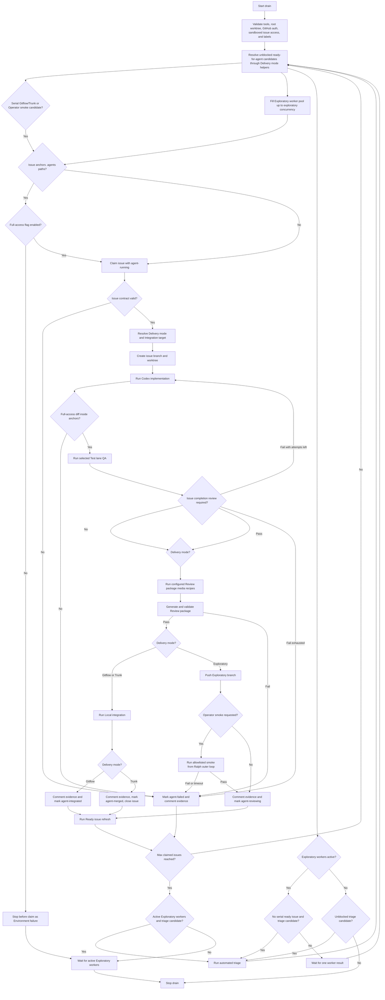
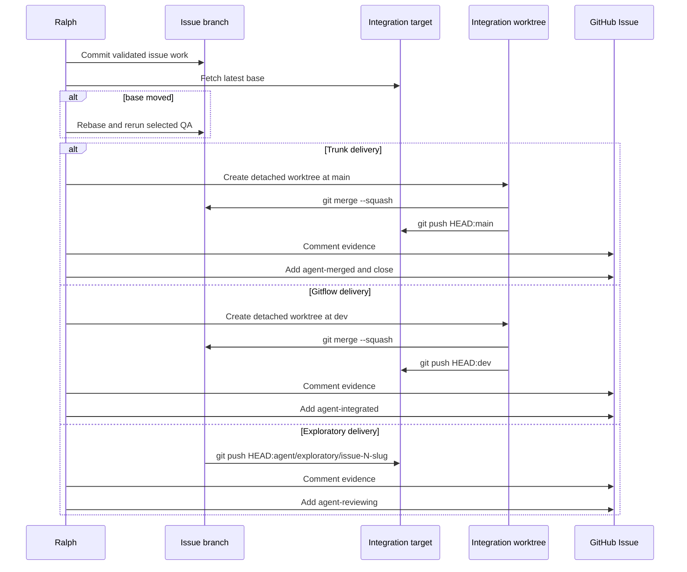

# Ralph Loop

This page documents the repo-local Ralph loop. The compatibility command stays
at `scripts/ralph.py`; the packaged Typer CLI, side-effect adapters, and loop
controller live in `tools/ralph-loop/src/ralph_loop/cli.py`, with pure workflow
helpers in `tools/ralph-loop/src/ralph_loop/workflow.py` and manifest state
helpers in `tools/ralph-loop/src/ralph_loop/state.py`. The loop uses GitHub
Issues as the queue, Codex as the implementation and triage worker, repo
**Test lane** commands as the validation boundary, and **Local integration**,
Exploratory handoff, plus **Promotion** as the success paths after QA.
Risky implementation paths also pass an automated **Issue completion review**
before Ralph updates an **Integration target** or publishes an Exploratory
handoff. A **Security-sensitive change** is one trigger reason for that existing
gate; it is not a separate security gate, scanner block, label, **Delivery
mode**, or issue-mutation permission. Gitflow, Trunk, and Exploratory delivery
also generate and validate a local **Review package** before **Local
integration**, an **Integration target** push, or an **Exploratory branch**
push, and any configured Review package media recipe runs before publication.
Promotion records a
deterministic **Post-Promotion deployment
classification** from the promoted changed-file inventory and source-table
archive replay recovery guidance when a Promotion changes existing source-table
`surrogate_key_sources`.

## Table of contents

- [Purpose](#purpose)
- [One issue attempt lifecycle](#one-issue-attempt-lifecycle)
- [Drain flow](#drain-flow)
- [Labels](#labels)
- [Run modes](#run-modes)
- [Live run preflight](#live-run-preflight)
- [Operator run](#operator-run)
- [AFK run monitoring](#afk-run-monitoring)
- [Run manifest](#run-manifest)
- [Run inspection and recovery](#run-inspection-and-recovery)
- [Implementation pass](#implementation-pass)
- [Promotion pass](#promotion-pass)
- [Triage pass](#triage-pass)
- [Ready issue refresh](#ready-issue-refresh)
- [Adaptive vocabulary](#adaptive-vocabulary)
- [QA policy](#qa-policy)
- [Failure handling](#failure-handling)

## Purpose

Ralph drains agent-ready GitHub issues through a guarded local loop:

1. Find unblocked `ready-for-agent` issues in queue order.
2. Resolve each issue **Delivery mode** and **Integration target** before lane
   selection.
3. Keep Gitflow and Trunk delivery in a serial lane while eligible Exploratory
   delivery issues run in a bounded worker pool. Exploratory issues that request
   an **Operator smoke** use an exclusive serial lane.
4. Run `codex exec` to implement each claimed issue.
5. Run deterministic local QA.
6. Run **Issue completion review** when risk triggers require it.
7. Run any configured Review package media recipe.
8. Generate and validate the **Review package**.
9. For Gitflow or Trunk delivery, squash-merge validated work onto the latest
   **Integration target** locally.
10. In **Gitflow delivery**, push `dev`, comment evidence, mark `agent-integrated`,
    and leave the issue open for **Promotion**.
11. In **Trunk delivery**, push `main`, comment evidence, mark `agent-merged`,
    and close the issue.
12. In **Exploratory delivery**, push a durable **Exploratory branch** from
    `origin/main`. If the issue requests an **Operator smoke**, run it from the
    Ralph-owned outer loop after the push. Then comment evidence, mark
    `agent-reviewing`, and leave the issue open for human review.
13. Run **Ready issue refresh** when enabled under a scheduler claim gate after
    each successful issue attempt. The gate pauses new claims while refresh
    analysis and metadata mutation run; already active Exploratory workers may
    finish.
14. If no serial Gitflow or Trunk ready issue can be claimed, triage the next
    unblocked issue and rescan. In parallel drains, that triage pass may run
    while already active Exploratory workers continue.

The loop stops when the queue has no unblocked implementation or triage
candidates, or when `--max-issues` is reached. A plain `--drain` run defaults
to 10 claimed implementation issues; `--max-issues 0` is the explicit unlimited
drain mode.
`--max-issues` counts claimed implementation issues across the serial and
Exploratory lanes. When the cap is reached, Ralph stops scheduling new issue
claims and waits for already active Exploratory workers to finish. Automated
triage remains outside this claimed-issue budget; if active Exploratory workers
are already running and no serial ready issue is claimable, Ralph may run a
triage pass before waiting for those workers.

`--max-codex-attempts` is a separate per-issue Codex implementation budget. It
defaults to `5` total attempts for each claimed issue, including the initial
implementation attempt and retries after Codex or QA failures. Retry prompts
include the previous failure detail. **Issue completion review** repair attempts
draw from the same per-issue budget. Full-access implementation passes that
change files outside the issue's context anchors still fail immediately without
retry.
Ralph runs every spawned Codex subprocess with a hermetic command shape:
`codex exec --ignore-user-config --ephemeral --disable hooks --model <model>`.
The default model is `gpt-5.5`, configurable with `--codex-model`. Codex
tool/model bootstrap failures, such as invalid user-configured image tool
models, are treated as local environment failures rather than ordinary
implementation attempts.

The checkpointed Operator run path wraps the issue and **Promotion** commands
for unattended cleanup. It uses the same lane-aware drain scheduler as plain
`--drain`, so Gitflow and Trunk work stays serial while eligible Exploratory
work uses the bounded worker pool. One Operator cycle can checkpoint multiple
child implementation manifests from that scheduler pass before it runs
**Promotion** for reviewed Gitflow work. **Promotion** starts only after active
Exploratory workers, implementation **Ready issue refresh** gates, and metadata
updates from the scheduler pass have settled. The Operator checkpoints
**Post-promotion review** follow-up creation and repeats until the Operator
queue is clean or a guard or failure condition stops the run with recovery
guidance.

Human operators should call Ralph through repo-local skills:

```text
$grill-with-docs -> optional $to-prd -> $shape-issues -> $ralph-triage -> $ralph-loop drain -> review dev -> $ralph-loop promote
```

Use [OPERATOR.md](../../OPERATOR.md) for the first-class **Operator workflow**.
`$shape-issues` shapes tracer-bullet issue drafts, gates implementation drafts,
checks **Issue context assessor** evidence and stiffness, and may publish
explicitly confirmed gate-passing outputs as `needs-triage` issues only. It
also writes pre-publication review Markdown at `issue-drafts.md` and
`issue-drafts/*.md`, and it does not move issues to `ready-for-agent`.
Follow-up verbs after a `$shape-issues` plan stay in issue-draft execution;
direct implementation requires `$ralph-loop` or an explicit named GitHub Issue
request. Fixture-gated reports can preview with `--dry-run`, but non-dry-run
publication requires `--allow-fixture-publish`, preflights `gh`
authentication and repository access, and records fixture provenance.
Codex-owned live gates use `run_live_shape_issue_gate.py` so nested Codex
startup and runtime directories are preflighted and recorded without requiring
the Operator to run the assessor manually. The gate evidence corpus includes
repo text files, frontend TypeScript/CSS sources, and extensionless UTF-8 helper
scripts named by anchors. Codex-owned publication should use
`--publish-backend auto`; when `gh` auth fails, the publisher writes a
create-only connector publish plan for Codex's GitHub connector path. Connector
plan entries use final `body_path` files for unblocked drafts and
`body_template_path` plus a render contract for dependent drafts so bundle-local
blocker placeholders resolve before dependent issues are created. Existing
GitHub blockers may be named as `#123` or GitHub Issue URLs without requiring a
matching draft in the bundle.
`$ralph-triage` prepares GitHub Issues for drain by setting category, state, and
**Delivery mode** labels. `$ralph-loop` owns the backing script commands,
including `$ralph-loop drain` and `$ralph-loop promote`.
Use `$ralph-curate` before triage or drain when the open issue queue needs to
be reconciled against the repository state in this worktree.

## One issue attempt lifecycle

Read this section before the **Promotion** and recovery sections when you need
to follow one issue attempt end to end. It explains what an operator should
expect Ralph to do after an issue has been prepared for the queue. Use
[issue-tracker.md](issue-tracker.md) for the GitHub Issue queue contract and
[triage-labels.md](triage-labels.md) for label policy; this page describes how
Ralph acts on those labels.

An issue becomes claimable when triage has given it one category label, the
`ready-for-agent` state label, at most one **Delivery mode** label, and the
required body sections. Ralph treats `ready-for-agent` as the queue selection
signal only. The category labels such as `bug` and `enhancement` describe the
work, state labels such as `needs-triage` and `ready-for-human` describe queue
readiness, runtime labels such as `agent-running` and `agent-failed` describe a
Ralph-owned attempt, and **Delivery mode** labels choose the publication path.
Those roles are intentionally separate.

For each candidate, Ralph resolves the **Delivery mode** and **Integration
target** before implementation. `delivery-gitflow` is the default and targets
`dev`; `delivery-trunk` targets `main`; `delivery-exploratory` targets the
durable **Exploratory branch** for that issue. If the issue has no delivery
label, Ralph writes the resolved default label before implementation. If the
labels conflict, Ralph normalizes them using the policy in
[triage-labels.md](triage-labels.md). Gitflow candidates may also trigger a
preclaim `main` into `dev` branch sync so the `dev` **Integration target** is
not behind trunk.

When Ralph claims the issue, it removes `ready-for-agent` and stale success or
failure runtime labels, then adds `agent-running`. That is the point where the
attempt starts. If an issue needs an operator-approved **Full-access
implementation pass** and the operator did not provide the required flag, Ralph
stops before claim. If the issue contract is malformed after claim, Ralph
comments failure evidence, marks `agent-failed`, and does not create a
successful publication boundary.

During implementation, Ralph creates a per-issue branch and worktree, then runs
Codex with the issue body as the primary contract. Codex is prompted not to
commit, push, or publish issue metadata; Ralph owns the normal publication
steps after validation. Ralph records each implementation attempt in
`.ralph/runs/issue-N-.../codex-implementation-N.jsonl`. If QA fails and attempt
budget remains, the next Codex prompt includes the failure evidence.

Ralph selects local QA from the changed files and the issue contract, then runs
the relevant **Test lane** commands from the owning **Subproject**. QA evidence
is recorded in the run manifest at `.ralph/runs/issue-N-.../ralph-run.json`
under `qa_results`, with the command, cwd, log path, status, and error when one
exists. The command logs live beside the manifest as `qa-*` files. When a QA
command prints `run manifest:`, Ralph copies or reconstructs durable evidence
under the same run directory and records it as
`qa_results[].run_manifest_evidence`. Successful completion or handoff comments
also include the bounded QA summary, and Operator rollups copy the same QA
surface for later review.

After QA passes and the issue branch is current with its base, Ralph runs
single-issue review gates before publication. **Issue completion review** runs
only when its triggers apply, such as deployable paths, **Agent workflow
changes**, **Security-sensitive changes**, **Trunk delivery**, or high-stiffness
issue evidence. Its review evidence is recorded in `ralph-run.json` under
`issue_completion_review`, with the review log path, review artifact path, pass
or fail result, repair attempts, and refreshed evidence. The Markdown artifact
starts as `issue-completion-review.md` in the run directory; repair reruns may
write suffixed artifacts such as `issue-completion-review-2.md`, so
`issue_completion_review.artifact_path` is the reliable pointer. Failing
findings become Codex repair prompts until the per-issue attempt budget is
exhausted.

Ralph then records any configured Review package media and generates the
ignored local `review-package.html` artifact in the run directory. The Review
package receives final changed files, QA evidence, issue contract, **Delivery
mode**, **Integration target** or **Exploratory branch**, and any **Issue
completion review** result. Ralph validates that package before **Local
integration**, an **Integration target** push, an **Exploratory branch** push,
completion comments, success runtime labels, or Trunk closure. Review package
evidence is stored in `ralph-run.json` under `review_package`; completion
comments, Operator rollups, **Exploratory acceptance review** artifacts,
Promotion issue comments, and **Post-promotion review** prompts carry only
bounded package evidence such as status, HTML path, media count, and summary.

Publication depends on the **Delivery mode**:

- **Gitflow delivery** runs **Local integration** by squash-merging the
  validated issue branch into a detached worktree at the latest `dev`, creating
  one integration commit, pushing `dev`, posting `Ralph Gitflow integration
  completed.` evidence, removing `agent-running`, adding `agent-integrated`,
  and leaving the issue open for **Promotion**.
- **Trunk delivery** runs **Local integration** the same way against `main`,
  pushes `main`, posts `Ralph trunk integration completed.` evidence, removes
  `agent-running`, adds `agent-merged`, and closes the issue immediately after
  the metadata update.
- **Exploratory delivery** does not run **Local integration**. Ralph pushes the
  durable **Exploratory branch** from `origin/main`, runs any requested
  allowlisted **Operator smoke** from the Ralph-owned outer loop, posts
  `Ralph exploratory handoff completed.` evidence, removes `agent-running`,
  adds `agent-reviewing`, and leaves the issue open for human review.

Those completion and handoff comments are the GitHub Issue evidence surface for
one attempt. They name the commit, **Delivery mode**, target branch, changed
files, QA summary, run logs, **Issue completion review** result when present,
and Review package evidence. The complete local evidence remains in the run
directory and manifest.

After a successful **Local integration** or Exploratory handoff, **Ready issue
refresh** may run before Ralph claims the next `ready-for-agent` issue. The
read-only analysis artifact is `ready-issue-refresh-analysis.md` under the same
issue run directory, and `ralph-run.json` records analysis, mutation status, and
recovery guidance. Ralph's outer loop, not the analysis subprocess, applies any
validated issue comments, body edits, label transitions, or completed closures.

Gitflow issues close later. During **Promotion**, Ralph verifies that each open
`agent-integrated` issue has a recorded Gitflow **Local integration** commit or
accepted Exploratory commit in the promoted `dev` to `main` range. Only verified
issues receive Promotion evidence, have `agent-integrated` replaced with
`agent-merged`, and close. **Post-promotion review** is a separate read-only
review pass after the Promotion attempt when a review worktree is available; it
may lead Ralph to create validated follow-up issues, but it is not part of the
single issue implementation attempt.

If an attempt fails before publication, Ralph comments the failure, marks
`agent-failed`, preserves logs and worktrees, and does not update an
**Integration target** or close the issue. If metadata fails after a push, Ralph
requires verified reachability evidence before repairing comments, labels, or
closure state with `--recover-run`.

## Drain flow



## Labels

This section is a quick Ralph runtime map. Use
[triage-labels.md](triage-labels.md) for the authoritative label vocabulary and
[issue-tracker.md](issue-tracker.md) for the ready issue queue contract.

Triage state labels:

- `needs-triage`
- `needs-info`
- `ready-for-agent`
- `ready-for-human`
- `wontfix`

Category labels:

- `bug`
- `enhancement`

Ralph runtime labels:

- `agent-running`
- `agent-failed`
- `agent-merged`
- `agent-integrated`
- `agent-reviewing`

Ralph delivery labels:

- `delivery-gitflow`
- `delivery-trunk`
- `delivery-exploratory`

Use `ready-for-agent` as the queue selection signal. `needs-triage`,
`needs-info`, `ready-for-human`, `wontfix`, `agent-running`, `agent-failed`,
`agent-merged`, `agent-integrated`, and `agent-reviewing` block
implementation. Runtime labels including `agent-reviewing` also block
automated triage reconsideration.

`delivery-gitflow` is the default **Delivery mode**. `delivery-trunk` is an
opt-in label for small docs, tests, tooling, or script changes.
`delivery-exploratory` is an opt-in label for durable **Exploratory branch**
work that needs explicit human judgment before it can become normal delivery
work. If
`delivery-exploratory` conflicts with Gitflow or trunk labels, Ralph keeps
`delivery-exploratory` and removes the others. If only Gitflow and trunk
conflict, Ralph keeps `delivery-gitflow`, removes `delivery-trunk`, and
proceeds through the safer default.

Create or refresh the labels with:

```bash
python3 scripts/ralph.py --bootstrap-labels
```

## Run modes

Dry-run the drain queue preview:

```bash
python3 scripts/ralph.py --drain --dry-run
```

`--drain --dry-run` previews the next serial Gitflow, trunk, or Operator-smoke
candidate plus up to two eligible Exploratory candidates, using each issue's
resolved **Delivery mode**. Set `--exploratory-concurrency N` to change that
Exploratory preview bound; the default is `2` and the minimum is `1`.
Targeted `--issue` dry runs still preview only that issue. When a previewed
issue has a valid `## Operator smoke`, dry run prints the selected smoke id,
command path, cwd, and timeout without executing the command.

Drain up to 10 claimed implementation issues:

```bash
python3 scripts/ralph.py --drain
```

Live `--drain` runs a lane-aware scheduler. Gitflow and Trunk delivery stay in a
single serial lane. Exploratory delivery issues are submitted oldest-first to a
`ThreadPoolExecutor` with at most `--exploratory-concurrency` active workers.
Exploratory issues with `## Operator smoke` are excluded from that worker pool:
Ralph waits for active issue workers to finish, claims the smoke issue in the
serial lane, and does not overlap it with another implementation worker. The
scheduler preserves queue order within each lane and applies `--max-issues`
to claimed issues across all lanes. When **Ready issue refresh** starts after a
successful **Local integration** or Exploratory handoff, the scheduler pauses
new issue claims until all pending refresh passes complete successfully. Running
Exploratory workers are not cancelled; they may finish while the claim gate is
closed. When no serial ready issue is claimable, the scheduler may run one
automated triage pass while active Exploratory workers continue.
That triage pass does not consume the `--max-issues` claimed-issue budget.

Drain or run the Operator loop without applying **Ready issue refresh** metadata
updates:

```bash
python3 scripts/ralph.py --drain --skip-ready-issue-refresh
```

Drain directly to trunk for small low-risk changes:

```bash
python3 scripts/ralph.py --drain --delivery-mode trunk
```

Drain to durable **Exploratory branches** for exploratory changes:

```bash
python3 scripts/ralph.py --drain --delivery-mode exploratory
```

Preview more Exploratory candidates in a dry run:

```bash
python3 scripts/ralph.py --drain --dry-run --exploratory-concurrency 4
```

Drain until only blocked or non-actionable issues remain:

```bash
python3 scripts/ralph.py --drain --max-issues 0
```

Use a different per-issue Codex attempt budget:

```bash
python3 scripts/ralph.py --drain --max-codex-attempts 3
```

Use a different Codex subprocess model:

```bash
python3 scripts/ralph.py --drain --codex-model gpt-5.5
```

Implement one specific issue:

```bash
python3 scripts/ralph.py --issue 25
```

Implement `.agents/` workflow issues only after explicit operator approval for a
**Full-access implementation pass**:

```bash
python3 scripts/ralph.py --issue 25 --allow-full-access-implementation
```

Implement one specific issue and then run **Ready issue refresh**:

```bash
python3 scripts/ralph.py --issue 25 --ready-issue-refresh
```

Promote reviewed Gitflow work from `dev` to `main`:

```bash
python3 scripts/ralph.py --promote
```

Promote and opt into post-Promotion **Ready issue refresh** for a direct
Promotion command:

```bash
python3 scripts/ralph.py --promote --ready-issue-refresh
```

Run repeated drain and **Promotion** cycles in a foreground terminal:

```bash
python3 scripts/ralph.py --drain-promote-all --max-cycles 10
```

Checkpointed Operator child runs forward `--exploratory-concurrency`; the
default remains `2`. Foreground `--drain-promote-all` runs the same scheduler
directly.

Launch the checkpointed Operator run in Codex-safe detached mode:

```bash
python3 scripts/ralph.py --drain-promote-all --detach
```

Inspect the latest Operator run without following child logs:

```bash
python3 scripts/ralph.py --operator-run-status latest
```

Apply explicit Exploratory acceptance decisions from a JSON artifact:

```bash
python3 scripts/ralph.py --apply-exploratory-acceptance-decisions path/to/decisions.json
```

Continue a paused Exploratory acceptance conflict run after the acceptance
worktree is resolved and clean:

```bash
python3 scripts/ralph.py --continue-exploratory-acceptance .ralph/runs/exploratory-acceptance-20260504T010203Z
```

Use `--source-branch <branch>` with that command only when the Gitflow source
branch is not `dev`. The apply flow does not support `--dry-run` because
accepted decisions may push the source branch after merged-target QA passes.

Skip the default **Post-promotion review** during **Promotion**:

```bash
python3 scripts/ralph.py --promote --skip-post-promotion-review
```

Run **Post-promotion review** but skip automatic validated follow-up issue
creation:

```bash
python3 scripts/ralph.py --promote --skip-post-promotion-followups
```

Override the **Integration target** explicitly when needed:

```bash
python3 scripts/ralph.py --issue 25 --target-branch feature/my-branch
```

Inspect a completed or failed implementation run without mutating GitHub or git
state:

```bash
python3 scripts/ralph.py --inspect-run .ralph/runs/issue-25-20260504T010203Z
```

Recover missing GitHub metadata after verifying the recorded published commit
reached the expected **Integration target**:

```bash
python3 scripts/ralph.py --recover-run .ralph/runs/issue-25-20260504T010203Z
```

Preview a failed pre-push implementation requeue without mutating git or
GitHub state:

```bash
python3 scripts/ralph.py --recover-run .ralph/runs/issue-25-20260504T010203Z --dry-run
```

Bypass the live clean-root preflight only when the operator intentionally wants
Ralph to run with uncommitted root worktree changes:

```bash
python3 scripts/ralph.py --drain --allow-dirty-worktree
```

## Live run preflight

Run the read-only Ralph doctor before a long drain, **Promotion**, or
Codex-owned shape-issues handoff:

```bash
python3 scripts/ralph.py --doctor --drain-promote-all --shape-issues-run .shape-issues/runs/<slug>
```

The doctor checks local tool availability, clean root worktree state, GitHub
CLI auth, **Sandboxed issue access**, a hermetic Codex subprocess smoke for
drain, issue, and Promotion intents that use Codex, required labels, Git push
dry-runs for the selected **Integration target** set, and optional shape-issues
live assessor provenance. It does not claim issues, create worktrees, update
labels, push, or run **Promotion**.

Live `--issue`, `--drain`, `--promote`,
`--apply-exploratory-acceptance-decisions`, and
`--continue-exploratory-acceptance` runs fail before GitHub issue claim,
worktree creation, **Local integration**, Exploratory handoff, acceptance
merge, acceptance continue, or push when the root worktree has uncommitted
changes. Commit or stash root worktree changes before live Ralph runs. Use
`--allow-dirty-worktree` only for an explicit dirty-worktree operation.
`--dry-run` remains available on a dirty root worktree for drain and issue
previews so operators can inspect the next Ralph action without mutating issues
or branches.

Before a live drain, validate both GitHub API auth and Git push auth for the
expected **Integration target**:

```bash
gh auth status
git push --dry-run origin HEAD:main
```

When using token-based GitHub CLI auth, export `GH_TOKEN` in the shell that runs
Ralph. Do not paste token values into commands, issue comments, docs, or logs.
Ralph also gives spawned Codex subprocesses **Sandboxed issue access** by
default: it resolves a token from `GH_TOKEN`, `GITHUB_TOKEN`, or `gh auth
token`, injects it as `GH_TOKEN`, enables network for the Codex sandbox selected
for that phase, and prepends a wrapper that permits only `gh auth status` plus
the phase-specific `gh issue` commands. Implementation, triage, and **Ready
issue refresh** passes may get phase-limited issue reads and writes. The
**Post-promotion review** gets read-only issue access: `gh issue view`,
`gh issue list`, and `gh issue status`. The review agent cannot call
`gh issue create`, `comment`, `edit`, `close`, or `reopen`. After a successful
**Promotion**, Ralph may create structured follow-up issues itself through a
validated create-only helper that calls only issue search and issue create. This
does not grant Git push access; Git fetches, **Local integration**, Exploratory
handoff pushes, **Integration target** pushes, and **Promotion** stay in
Ralph's outer loop.
The subprocess command ignores user Codex config, runs ephemerally, disables
hooks, and passes an explicit model so workstation image/tool preferences do
not leak into Ralph issue work.

Ralph treats ready issues whose `## Context anchors` include `.agents/` `Path:`
or `Doc:` paths as agent-workflow changes. Those issues require
`--allow-full-access-implementation` before Ralph claims the issue. Without that
operator flag, Ralph records `full_access_implementation.status:
blocked_missing_operator_flag` and stops as an **Environment failure** before
claiming, creating a worktree, or marking the issue failed. With the flag,
only the Codex implementation subprocess for that issue runs as a
**Full-access implementation pass** using Codex's approvals-and-sandbox bypass.
The subprocess receives read-only GitHub Issue commands only: `gh auth status`,
`gh issue view`, `gh issue list`, and `gh issue status`.

After each full-access Codex implementation attempt returns, Ralph reads the
worktree diff before QA. Every changed file must match an issue context anchor;
`Path:` and `Doc:` anchors are file or directory path anchors, and directory
anchors, including anchors ending in `/`, allow files below that directory. If
any changed file is outside those anchors, Ralph records
`full_access_implementation.status: diff_out_of_scope`, skips QA, skips retry,
skips **Local integration** or Exploratory handoff, preserves the implementation
worktree, and marks the claimed issue failed with recovery guidance.

Ralph also standardizes writable QA runtime paths for spawned Codex
subprocesses and Ralph-run QA commands. If the operator exports `DAGSTER_HOME`,
`XDG_CACHE_HOME`, or `UV_CACHE_DIR`, Ralph preserves that explicit value.
Otherwise it sets the variable under
`/tmp/ralph-qa-runtime/<repo-slug>/<run-dir-name>/` using `dagster-home`,
`xdg-cache`, and `uv-cache` child directories. These defaults keep sandboxed
**Commit check**, **Push check**, and Dagster CLI commands away from
home-directory cache locations that may be read-only.

Use `HEAD:dev` for Gitflow target validation, `HEAD:main` for trunk or
promotion validation, and `HEAD:agent/exploratory/issue-N-slug` for a specific
Exploratory handoff. Run Ralph from a local worktree that is aligned with the
remote branch being operated on. The script fetches the implementation base
during implementation and rebases issue work if that base moves, but the
operator should start from a known repo state.

## Operator run

`python3 scripts/ralph.py --drain-promote-all` runs the Operator orchestration
loop. After preflight and recovery checks, open `agent-integrated` backlog is
handled through **Promotion** before the Operator claims more
`ready-for-agent` work. Ready work in cycles without integrated backlog is
handed to the same lane-aware drain scheduler used by plain `--drain`: Gitflow
and Trunk issue attempts remain serial, while eligible Exploratory issues run
up to `--exploratory-concurrency` in parallel.
The Operator records compact checkpoints under
`.ralph/operator-runs/.../operator-run.json` and links each checkpoint to the
detailed child `.ralph/runs/.../ralph-run.json` manifest for the issue or
**Promotion** that just crossed a boundary. A single Operator cycle can record
multiple issue success or failure checkpoints before the next **Promotion**
checkpoint.

Completed or stopped Operator runs also write
`.ralph/operator-runs/.../operator-run-rollup.md` and
`.ralph/operator-runs/.../operator-run-rollup.json`. The Markdown rollup is the
first review surface for the full drain-and-**Promotion** run; the JSON rollup
is the stable tooling surface for issue outcomes, manual recoveries, **Local
integration** commits, **Promotion** commits, QA surfaces,
**Post-promotion review** follow-ups, post-Promotion deployment execution,
deploy-repair issue creation, final queue state, and stop or failure reasons.
Failed issue and failed **Promotion** entries include compact `failure_summary`
objects when child manifests, command logs, or generated failure comments expose
enough evidence. The summary records the failed command, exit code when known,
failure type or checkpoint, failing **Test lane** or phase, primary log path,
and a bounded excerpt so stopped Operator runs usually have an actionable first
review surface.
Rollups include `requeue_recovery` for open `agent-failed` issues in the final
queue. That section identifies failed implementation manifests that are eligible
for Ralph-owned pre-push requeue, prints the dry-run and live `--recover-run`
commands, and distinguishes post-push metadata recovery, manual Gitflow or
branch-sync recovery, malformed issue contracts, and implementation failures
that did not pass the gates needed for requeue.
Both rollups record the underlying child `.ralph/runs/.../ralph-run.json` paths
without tailing child Codex JSONL by default.
When open `agent-reviewing` issues remain and no unblocked ready work can
proceed, the Operator run also writes `exploratory-acceptance-review.md` and
`exploratory-acceptance-review.json` under the same run directory.

The Operator run checks the open GitHub Issue queue for these runtime states:

- `ready-for-agent`
- `agent-integrated`
- `agent-reviewing`
- `agent-running`
- `agent-failed`

It stops cleanly only when none of those open issues remain. It stops with
`needs_review` when open `agent-reviewing` issues require **Exploratory
acceptance review** before blocked ready work can proceed. That checkpoint is
`exploratory_acceptance_review_required`; it is non-mutating and does not push,
comment, edit labels, close issues, or update **Integration targets**. It still
stops with failed recovery guidance when `agent-running` or `agent-failed`
issues remain, when ready issues are blocked by non-review work, when an issue
or **Promotion** child manifest fails, when the drain scheduler reports a fatal
refresh, post-push metadata, or environment failure, or when `--max-cycles` is
reached. The default cycle guard is 10; use `--max-cycles 0` only for explicit
unlimited Operator runs.

Checkpoints are recorded for:

- issue success or failure
- before **Promotion**
- **Promotion** success or failure
- **Post-promotion review** follow-up creation
- post-Promotion **Ready issue refresh**
- deployment skipped, started, succeeded, or failed
- deploy-repair issue creation after failed deployment
- deploy-repair cycle limit reached
- Ralph loop self-update restart required
- **Exploratory acceptance review** required
- queue clean
- stopped-by-guard

The `before_promotion` checkpoint is written before **Promotion** starts. For
startup or post-refresh `agent-integrated` backlog, this can happen before a new
ready-work scheduler pass. When **Promotion** follows a scheduler pass, active
Exploratory workers have finished, implementation **Ready issue refresh** claim
gates have opened, and child metadata updates have either completed or produced
recorded recovery evidence.
If a successful Gitflow or Trunk child implementation manifest changed
`scripts/ralph.py` or `tools/ralph-loop/**`, the Operator records
`ralph_self_update_restart_required` and stops before **Promotion** or another
issue claim. The running process does not try to apply newly integrated Ralph
loop code in-place; restart the Operator command from a clean root worktree so
later issue claims use the updated review gates and workflow code.
When the drain scheduler selects a Gitflow or Trunk ready issue whose
`## Context anchors` name `scripts/ralph.py` or `tools/ralph-loop/**`, it treats
that candidate as an isolated Ralph loop self-update pass. It waits for already
active Exploratory workers before claiming the self-update issue and does not
start unrelated Exploratory claims in the same scheduler pass.
Before the Operator scheduler claims ready work in high-risk states, it also
validates **Integration target** baseline health with the narrow Ralph loop
**Commit check**. The guard runs from a detached `origin/<target>` worktree and
uses `make run-prek` in `tools/ralph-loop`. It currently triggers when
`agent-integrated` backlog exists before another claim, or when the candidate
issue's `## Context anchors` name Agent workflow paths such as `.agents/`,
`docs/agents/`, `scripts/ralph.py`, or `tools/ralph-loop/**`. A healthy result
is cached by target commit so Ralph does not rerun the command for every normal
low-risk claim. A failure stops the Operator before claiming the next issue and
reports the failing command, **Test lane**, log, and recovery guidance.
This is target-baseline validation only: issue-specific QA still runs inside the
claimed issue worktree, **Local integration** still performs the squash merge
and commit on the **Integration target**, and **Promotion** still owns aggregate
**Push check** validation before `main` is updated.
Deployment checkpoints are written only after successful Promotion metadata
updates, **Post-promotion review**, follow-up creation, and post-Promotion
**Ready issue refresh** have completed in the Promotion child run.

Deploy-repair targeting is stored in the Operator manifest under
`deploy_repair`, not in GitHub priority labels. When deployment failure analysis
creates a valid ready deploy-repair issue, the Operator records it as
`deploy_repair.target_issue`, increments `deploy_repair.cycle_count`, and runs
that issue directly on the next implementation step before unrelated
`ready-for-agent` issues. The targeted issue still goes through normal
implementation, QA, **Issue completion review**, **Local integration**,
**Promotion**, metadata updates, and deployment retry. After the repaired
Promotion deploys successfully, the Operator clears `deploy_repair.target_issue`
and resumes normal oldest-first queue order. A single Operator run starts at
most two automated deploy-repair cycles; the next deployment failure stops with
recovery guidance and preserved child logs.

Detached mode is the Codex-safe path:

```bash
python3 scripts/ralph.py --drain-promote-all --detach
```

The launcher prints the Operator run directory and a status command, then exits
without tailing child Codex JSONL or rich command logs. Codex should stop
polling after launch and inspect status only at issue boundaries:

```bash
python3 scripts/ralph.py --operator-run-status latest
python3 scripts/ralph.py --operator-run-status .ralph/operator-runs/operator-20260506T010203Z
```

Status reports the current state, last checkpoint, current issue or
**Promotion**, queue counts, child manifest paths, rollup artifact paths, and
recommended next action. When an Operator child is active, status also reports
the active child run directory or manifest path, child status and stage, elapsed
time, and the last recorded child checkpoint or heartbeat timestamp from
`ralph-run.json`. It does not tail child Codex JSONL or rich command logs by
default. For detached runs, status reports whether the recorded pid appears
live, stopped, or unknown; a stopped pid with a still-running manifest is
reported as stale detached Operator status so operators can inspect the logs and
issue state before starting another Operator run. Status also reports
Ralph-owned pre-push requeue eligibility for open `agent-failed` issues when
the Operator queue or live issue scan exposes them. Read
`operator-run-rollup.md` first for completed or stopped runs.
Open the child `ralph-run.json` or full command logs when the rollup's
`failure_summary` excerpt is insufficient, or when the rollup points to a manual
recovery condition. If status reports `needs_review`, read
`exploratory-acceptance-review.md`, then run the `$ralph-loop` Exploratory
acceptance review flow before rerunning drain or **Promotion**.

## AFK run monitoring

Ralph writes command logs while subprocesses are still running. Long Codex
implementation attempts write to `codex-implementation-N.jsonl`, triage writes
to `codex-triage.jsonl`, read-only **Ready issue refresh** analysis writes to
`codex-ready-issue-refresh-analysis.jsonl`, **Issue completion review** writes
to `codex-issue-completion-review.jsonl`, **Review package** generation writes
to `codex-review-package.jsonl` and `review-package.html`,
**Post-promotion review** writes to `codex-post-promotion-review.jsonl`, QA
writes to `qa-*` logs, and Git operations write to their named `git-*` logs
under the current
`.ralph/runs/...` run directory.
Configured Review package media recipes write recipe-specific logs, such as
`marimo-review-package-media.log` or `caddy-review-package-media.log`, and
store recorded sibling videos beside `review-package.html`.
While a command is active, the log has `exit: running`; after the command
finishes, Ralph rewrites the same log with the final exit status while
preserving stdout, stderr, command, and cwd.

After a successful, failed, or partial **Promotion** with changed files and an
available review worktree, Ralph tries to save the final
**Post-promotion review** Markdown report as `post-promotion-review.md` beside
`codex-post-promotion-review.jsonl` and prints the same report to the terminal.

During logged long-running phases, Ralph prints a heartbeat about every 30
seconds:

```text
Ralph heartbeat: phase=#49: Codex implementation attempt 1; log=/repo/.ralph/runs/issue-49-.../codex-implementation-1.jsonl
```

For AFK drains, use the heartbeat phase to see what Ralph is waiting on and tail
the active log path to inspect live command output. If the terminal only shows
heartbeats and no completion message, the phase is still running. If a command
fails, the same log path appears in the failure output or issue evidence.

## Run manifest

Every child implementation, **Promotion**, and Exploratory acceptance run writes
one `.ralph/runs/.../ralph-run.json`. Ralph rewrites that file after each
milestone. Operators use it as the durable ledger for what Ralph has already
proved, which local files it preserved, and which recovery boundary is still
safe. The manifest matters most after failed or partial work: it is the source
for `--inspect-run`, Operator status, rollups, recovery guidance, and
same-run verified metadata recovery.

Use the manifest to inspect evidence. Do not edit it by hand and do not treat
it as issue policy. The issue lifecycle is described in
[One issue attempt lifecycle](#one-issue-attempt-lifecycle), and the
**Promotion** boundary is described in [Promotion pass](#promotion-pass).
The manifest records the facts those sections need: **Delivery mode**,
**Integration target**, commits, pushes, QA evidence, metadata status, and
recovery guidance.

The Ralph artifact model has four separate evidence surfaces:

- Child run manifest: `.ralph/runs/.../ralph-run.json` is the machine-readable
  record for one implementation run, **Promotion** run, or Exploratory
  acceptance apply run. It records operator evidence and bounded inputs that
  later Ralph-owned steps use.
- Run-directory files: command logs, Codex JSONL, `issue-completion-review.md`,
  `review-package.html`, `ready-issue-refresh-analysis.md`,
  `post-promotion-review.md`, copied QA manifests, and conflict artifacts live
  beside the child manifest. Manifest fields point to the current artifact
  path when retries create suffixed files.
- Operator manifests: `.ralph/operator-runs/.../operator-run.json` and the
  `operator-run-rollup.md` and `operator-run-rollup.json` files summarize a
  checkpointed drain-and-**Promotion** run. They link back to child
  `ralph-run.json` paths instead of replacing child evidence.
- GitHub Issue comments: completion, failure, handoff, Promotion, manual
  Gitflow recovery, and pre-push requeue comments are the public issue
  evidence. They carry bounded summaries and commit evidence. The child
  manifest keeps the full local logs and artifact paths.

Keep the similarly named QA `run-manifest.json` separate from the Ralph child
manifest. When a successful **Test lane** command prints `run manifest:`, Ralph
records that QA surface under `qa_results[].run_manifest_evidence` and copies
or reconstructs a durable JSON artifact in the same run directory, commonly
named `qa-...-run-manifest.json`. Failed QA commands keep their command logs,
but they do not get this copied manifest evidence field. The copied QA file
proves the QA command result; it does not define Ralph recovery state.

The fields most operators inspect are:

- Run identity: `schema_version`, `run_kind`, `status`, `stage`,
  `started_at`, `updated_at`, `repo`, `issue`, `delivery_mode`,
  `integration_target`, `source_branch`, `branches`, and `paths`.
  `run_kind` distinguishes implementation, **Promotion**, and Exploratory
  acceptance apply runs. `paths.run_dir` is the canonical run directory; if it
  is missing, Ralph falls back to the manifest file's parent directory.
  `delivery_mode` must be one of the supported **Delivery mode** values;
  **Promotion** records `gitflow`.
- Timeline evidence: `events` records timestamped milestones. `adaptive_events`
  records `hard_stop`, `gated_retry`, or `residual_update` evidence with the
  trigger reason, related issue number, residual work summary when present,
  automatic retry eligibility, and per-issue attempt-budget behavior.
  A `hard_stop` means automatic Codex retry is not allowed and the operator
  must inspect branch state, issue metadata, and logs before manual recovery.
- Work evidence: `changed_files`, `codex_attempts`, `qa_results`,
  `qa_results[].run_manifest_evidence`, `qa_runtime_env`,
  `sandboxed_issue_access`, `full_access_implementation`, `review_package`,
  `issue_completion_review`, and `operator_smoke` record the implementation
  work, selected **Test lane** commands, logs, copied QA evidence, sandboxed
  issue access, review gates, Review package state, and any requested
  Exploratory **Operator smoke**.
- Publication evidence: `commits`, `integration_commit`, `promotion_commit`,
  `pushes`, and `github_metadata` record local commits, published commits,
  per-branch push status, command log paths, completion or failure metadata,
  and issue label or closure work. For Gitflow and Trunk delivery,
  `integration_commit` is the **Local integration** commit. For Exploratory
  delivery, it is the **Exploratory branch** commit.
- Recovery evidence: `failure`, `branch_sync`, `formatter_recovery`,
  `ready_issue_refresh`, `drain_scheduler.fatal_stop`,
  `acceptance_conflict`, `decisions`, `local_branch_fast_forwards`,
  `promotion_worktree_preflight`, `deploy_repair_issues`,
  `post_promotion_followups`, and recovery guidance fields tell an operator
  where Ralph stopped and which artifact or command to inspect next.
- **Promotion** evidence: `source_tree`, `promotion_commit_inventory`,
  `deployment_classification`, `deployment_execution`,
  `source_table_replay_recovery`, `post_promotion_review`,
  `post_promotion_followups`,
  `local_branch_fast_forwards`, and `github_metadata.issues` belong to
  **Promotion** runs. They record the source revision under test, the full
  promoted commit inventory, verified and unverified **Promotion** commits,
  deployment recommendation or checkpointed Operator deployment execution,
  source-table archive replay guidance, review artifact paths, follow-up issue
  creation outcome, local branch fast-forward status, and per-issue Promotion
  metadata command logs.

Several manifest fields are also bounded inputs to later Ralph-owned agents or
helpers. Completion comments receive changed files, QA summaries, **Issue
completion review** status, and Review package summaries. Operator rollups,
Exploratory acceptance review artifacts, Promotion issue comments, and
**Post-promotion review** prompts receive their own bounded subsets, usually
summary text, paths, commit evidence, QA surfaces, or package evidence.
`deployment_classification` and `source_table_replay_recovery` are passed as
operator guidance. Ralph does not inline `review-package.html`, run deployment
commands during direct **Promotion**, or let sandboxed review agents mutate
GitHub Issues.

## Run inspection and recovery

Start every failed or partial investigation with the read-only command:

```bash
python3 scripts/ralph.py --inspect-run .ralph/runs/issue-25-20260504T010203Z
```

`--inspect-run` accepts either a run directory or a direct path to
`ralph-run.json`. It reads that manifest and prints the run directory,
`run_kind`, issue, **Delivery mode**, **Integration target**, QA status,
branch-sync status, push status, GitHub metadata status, **Issue completion
review** status, Review package status, **Ready issue refresh** status,
adaptive events, requeue eligibility, and the recommended next action. It does
not call `gh`, run git commands, inspect worktrees, edit labels, comment, close
issues, push, or change refs.

For checkpointed Operator runs, inspect the Operator surface first:

```bash
python3 scripts/ralph.py --operator-run-status latest
python3 scripts/ralph.py --operator-run-status .ralph/operator-runs/operator-20260506T010203Z
```

Operator status reads `operator-run.json`, reports the current checkpoint,
active child manifest path, rollup paths, queue counts, detached process state,
pre-push requeue classification for open `agent-failed` issues, and the
recommended next action. For completed or stopped runs, read
`operator-run-rollup.md` before opening child logs. The rollup tells you which
child `ralph-run.json` needs deeper inspection.

Use this recovery decision order:

1. If `--inspect-run` reports a `hard_stop` adaptive event, inspect the
   manifest, logs, branch state, and GitHub Issue metadata manually. Do not run
   an automatic Codex retry or consume more issue attempt budget until the
   residual work is understood.
2. If the run is a **Promotion** manifest, inspect the **Promotion** fields and
   artifacts manually. `--recover-run` is for implementation run manifests.
   Follow [Promotion pass](#promotion-pass) for the lifecycle boundary.
3. If an implementation run failed before publication and inspection reports
   `Requeue eligibility: eligible`, preview pre-push requeue with
   `--recover-run <run_dir> --dry-run`.
4. If an implementation run records `integration_commit` and a pushed
   **Integration target** but GitHub Issue metadata is incomplete, use live
   `--recover-run <run_dir>` only after the manifest evidence passes the
   verified post-push recovery guard.
5. If GitHub metadata already matches the completed **Delivery mode** and
   `ready_issue_refresh.status` failed, do not recover the completed issue.
   Inspect `ready_issue_refresh.mutation_results`, the analysis log, and the
   artifact path, then reconcile only the affected candidate issue metadata.

Common recovery states point to different evidence:

- `adaptive_events[].event_type: hard_stop`: inspect the latest adaptive event
  and the named residual work before any manual metadata change.
- `branch_sync.status: failed`: inspect the sync worktree, merge or push log,
  conflicted files, and `branch_sync.recovery_guidance`.
- `formatter_recovery.status: failed`: inspect formatter-modified files,
  staged files, original and retry **Commit check** logs, and
  `formatter_recovery.recovery_guidance`.
- `review_package.status: failed` or `validation_status: failed`: inspect the
  package generator log, validation reason, media failures, preserved
  implementation worktree, and the pre-push requeue decision.
- `ready_issue_refresh.status: failed`: inspect the analysis log, Markdown
  artifact, `mutation_results`, and `ready_issue_refresh.recovery_guidance`.
  The integrated issue may already be complete.
- `promotion_worktree_preflight.status: failed`: inspect the recorded
  **Promotion** worktree path and remove only a clean stale worktree.
- `post_promotion_review.status` or `post_promotion_followups.status` warning
  failures: inspect the **Promotion** manifest, review artifact, follow-up
  validation results, and recovery guidance. Successful **Promotion** remains
  succeeded unless the manifest status says otherwise.
- `acceptance_conflict.status`: inspect the acceptance worktree,
  `decisions.json`, `conflicts.json`, `codex-resolution-prompt.md`, and the
  recorded continue command.
- `github_metadata.status` after a recorded push: inspect the published commit,
  push evidence, completion or handoff comment state, and **Delivery mode**
  before live metadata recovery.

Failed implementation runs without `integration_commit` may be eligible for
Ralph-owned pre-push requeue recovery. Eligible runs must record `status` equal
to `failed`, passed implementation QA, passed **Issue completion review** or
`skipped_not_required`, no `integration_commit`, no recorded **Integration
target** push state, and no failed or running branch sync. A recorded pushed,
failed, or running target push makes the run ineligible for pre-push requeue.
Inspection prints the Ralph-owned worktree paths, local issue branch, label
reconciliation evidence for `agent-failed` and `ready-for-agent`, changed
files, QA and review evidence, Review package state, and failure log. When the
failure type is `review_package_failed`, inspection also prints the generator
log path, validation reason, failure reason, media failure evidence, and next
safe action.
No-change pre-implementation Codex environment failures are a stricter eligible
subcase: the run must have no changed files, no QA results, no **Issue
completion review**, no Review package, no **Local integration**, no push state,
and a recognized Codex subprocess environment signal in the manifest or bounded
Codex JSONL log. Live recovery for this subcase comments
`Ralph environment requeue completed.`, cleans Ralph-owned worktrees and the
local issue branch, restores `ready-for-agent`, and does not preserve a backup
implementation commit because Codex failed before changes were accepted.

Preview a safe pre-push requeue before mutating anything:

```bash
python3 scripts/ralph.py --recover-run .ralph/runs/issue-25-20260504T010203Z --dry-run
```

The dry run reads the child manifest, GitHub Issue labels and comments, local
worktrees, local refs, and ancestor evidence. It reports the labels to add or
remove, the requeue comment body, backup ref behavior, and Ralph-owned
worktrees or local issue branch cleanup that live mode would perform. It does
not rerun Codex, rerun QA, create a **Local integration** commit, push an
**Integration target**, close an issue, or run **Promotion**.

The live pre-push requeue path uses the same checks. It refuses runs with a
recorded `integration_commit`, any recorded **Integration target** push state,
success runtime labels such as `agent-integrated`, `agent-merged`, or
`agent-reviewing`, a local implementation or integration commit already
reachable from `origin/<integration-target>`, non-Ralph-owned manifest paths,
unexpected branches, or dirty Ralph-owned worktrees. When a local issue branch
commit exists, Ralph preserves it under a stable local
`refs/ralph/requeue/...` backup ref before deleting the local issue branch.
Ralph removes only manifest-derived Ralph-owned worktrees and the manifest
local issue branch, comments the requeue evidence, removes `agent-failed`, adds
`ready-for-agent`, and leaves category and **Delivery mode** labels unchanged.
Repeating the command after partial cleanup is safe: existing backup refs,
absent worktrees, absent issue branches, existing comments, and already
reconciled labels are reported instead of treated as corruption.

In the checkpointed **Operator workflow**, status and rollups surface this same
classification for open `agent-failed` issues. The Operator runs
**Automatic pre-push requeue** by default before **Promotion**. It selects the
latest eligible pre-push run for each failed issue, even when a later failed
retry only records a worktree-collision failure, counts existing Ralph requeue
evidence comments, and invokes the live `--recover-run` path while the issue is
below the configured limit. Operators can disable that behavior with
`--no-auto-pre-push-requeue`; `--auto-pre-push-requeue-limit` defaults to `2`.
After live requeue restores the issue to `ready-for-agent`, the normal
oldest-first Operator queue scan can claim it. When the limit is reached, Ralph
leaves the issue `agent-failed` and records
`auto_pre_push_requeue_limit_reached` in the Operator checkpoint for
inspection.

Post-push metadata recovery uses live `--recover-run <run_dir>` only for
implementation manifests whose `integration_commit` records a published commit.
Recovery fetches the expected **Integration target** and refuses to proceed
unless the recorded commit is reachable from `origin/<integration-target>`.
The manifest must also record a pushed **Integration target** and fully passed
QA evidence. This keeps issue comment, label, and closure repair behind proof
that the **Local integration** commit or Exploratory handoff commit reached the
expected branch.

After reachability is verified, recovery reconciles GitHub Issue metadata to
the issue's **Delivery mode**:

- **Trunk delivery**: ensure the completion comment exists, remove runtime
  labels, apply `agent-merged`, and close the issue.
- **Gitflow delivery**: ensure the completion comment exists, remove runtime
  labels, apply `agent-integrated`, and leave the issue open for **Promotion**.
  If the issue was closed prematurely, recovery reopens it.
- **Exploratory delivery**: ensure the completion comment exists, remove
  runtime labels, apply `agent-reviewing`, and leave or reopen the issue for
  human review.

Recovery does not rerun Codex, rerun QA, create commits, push branches, or clean
worktrees. Normal Ralph runs keep fail-stop behavior: if metadata operations
fail after a push, Ralph stops loudly so an operator can inspect the run and
recover deliberately.
Checkpointed **Operator workflow** runs may recover this same post-push
metadata residual automatically during the same Operator cycle. The Operator
loads the child implementation manifest, fetches the recorded **Integration
target**, verifies the recorded commit is reachable from
`origin/<integration-target>`, confirms the manifest records a pushed target and
passed QA evidence, then reuses the metadata recovery path. Successful recovery
records a `residual_update`, a reachability event, a recovered drain-scheduler
fatal-stop marker when the child had recorded one, and an Operator
`issue_metadata_recovered` checkpoint. Before the Operator can resume ready
issue claims, Ralph marks **Ready issue refresh** pending on the recovered child
manifest, runs the existing refresh analysis and mutation path under the claim
gate, then records `metadata_recovery_resume_allowed` only after refresh
completes or the Operator explicitly disabled refresh. Refresh failure leaves
the resume decision blocked with recovery guidance; unverified commits, missing
pushed-target evidence, or missing passed QA evidence remain hard stops and do
not mutate GitHub Issue metadata.

Exploratory acceptance merge conflicts pause with run status
`acceptance_conflict` before push or GitHub Issue metadata mutation. Ralph
leaves the acceptance worktree in place and writes `decisions.json`,
`conflicts.json`, and `codex-resolution-prompt.md` under the run directory. The
prompt tells Codex to work only in that acceptance worktree, preserve the
accepted issue intent, commit the conflict resolution, and leave the worktree
clean. Use `--inspect-run <run_dir>` to print the paused worktree path and the
`--continue-exploratory-acceptance <run_dir>` command.

`--continue-exploratory-acceptance <run_dir>` reloads the paused decision set,
refuses missing or mismatched artifacts, refuses a missing, stale, dirty, or
still-conflicted acceptance worktree, reruns selected merged-target QA, pushes
the Gitflow source branch, and only then applies acceptance metadata. During
resume, Ralph preserves already-recorded per-issue acceptance commits and
derives any missing issue evidence from the resolved first-parent history so
each accepted issue points at the commit that made its handoff reachable. If
metadata fails after `dev` is pushed, treat the run as post-push recovery:
verify the pushed commits in the manifest, then add any missing
`Ralph exploratory acceptance completed.` evidence and label transitions before
rerunning **Promotion**. Non-conflict apply failures before the accepted branch
push still leave accepted issue metadata unchanged and record recovery guidance
in the manifest.

If a failed Gitflow run passed issue QA but failed before recording
`integration_commit`, and an operator manually creates or pushes the recovered
commit to `dev`, preserve **Promotion** closure evidence before applying or
leaving `agent-integrated`. Verify the recovered commit is reachable from
`origin/dev` and is not already on `origin/main`, then add an issue comment that
starts with this exact contract:

```markdown
Ralph Gitflow manual recovery completed.

Commit: `<dev-commit-sha>`
Delivery mode: `gitflow`
Target branch: `dev`
Recovered from run: `<run-dir>`
```

The `Commit:` line must name the `dev` commit that made the recovered issue
work reachable from the Gitflow source branch. Keep the issue open with
`agent-integrated` so the next **Promotion** can verify the commit in the
promoted range, comment Promotion evidence, replace `agent-integrated` with
`agent-merged`, and close the issue. If **Promotion** sees manual recovery
evidence on an open `agent-integrated` issue but cannot parse a commit from the
documented contract, it emits a warning with the recovery action and records
`manual_recovery_commit_unparseable` in the Promotion manifest instead of
leaving the issue silently unreconciled.

Promotion also accepts legacy recovered Gitflow evidence that records the
commit as `Local integration commit: <dev-commit-sha>` when the surrounding
comment clearly describes completed Gitflow **Local integration** for that
issue. This keeps historical recovery comments usable without requiring an
operator to rewrite evidence before Promotion.

## Implementation pass

An implementation issue must have these sections:

- `## What to build`
- `## Acceptance criteria`
- `## Blocked by`

An Exploratory delivery issue must also have `## Review focus`, stating the
human judgment the durable **Exploratory branch** needs. Missing
`## Review focus` marks the issue `agent-failed` before Ralph creates an
implementation worktree, invokes Codex, or publishes an Exploratory handoff.
Exploratory delivery issues may additionally include `## Operator smoke` with
`Smoke id: <id>`, `Timeout: <seconds>`, and credential-boundary prose. Ralph
validates that section before implementation. Unknown smoke ids fail before
command execution, and smoke sections on non-Exploratory issues fail the issue
contract. The first allowlisted id is `ec2-run-worker-placement`, mapped to
`infrastructure/aws-pulumi/scripts/run-ec2-run-worker-smoke` with cwd
`infrastructure/aws-pulumi` in the issue worktree.

If any referenced blocker in `Blocked by` is still open, Ralph skips the issue.
If the issue contract is malformed, Ralph marks the issue `agent-failed` and
leaves a result comment with the run log path.

Ralph chooses **Delivery mode** from issue labels first, then from the CLI
default. Missing delivery labels are written back to the issue before
implementation. `delivery-gitflow` defaults to `origin/dev`; if that branch does
not exist, Ralph creates it from `origin/main`. Before creating a Gitflow issue
branch, Ralph also syncs `origin/main` into `origin/dev` when `main` is not
already an ancestor of `dev`, so the **Integration target** is not behind trunk.
This branch sync runs before Ralph claims the issue. If the merge conflicts or
an existing `agent-sync-main-into-dev` worktree indicates stale sync state,
Ralph records `branch_sync` recovery guidance in the run manifest and stops the
drain without marking unrelated `ready-for-agent` issues failed.
`delivery-trunk` defaults to `origin/main`. `delivery-exploratory` defaults to
a per-issue **Exploratory branch** named `agent/exploratory/issue-N-slug`.
Ralph fails clearly before Codex implementation if that remote branch already
exists; otherwise it creates the local **Exploratory branch** from
`origin/main` and later pushes it. `--target-branch` overrides the
**Integration target** explicitly.

For Gitflow and Trunk delivery, Ralph creates branches named
`agent/issue-N-slug` from the **Integration target** and creates sibling
worktrees under the repo worktree container. For Exploratory delivery, Ralph
creates the **Exploratory branch** from `origin/main`. Codex is instructed not
to commit, push, or edit GitHub issue state; Ralph owns those steps after QA
passes.

Normal implementation attempts use the workspace-write Codex sandbox and
phase-limited **Sandboxed issue access**. Ready issues that name `.agents/`
context anchors use the **Full-access implementation pass** only when the
operator passed `--allow-full-access-implementation`; they retain read-only issue
commands and must pass Ralph's context-anchor diff guard before QA.
Both modes use `--ignore-user-config`, `--ephemeral`, `--disable hooks`, and the
configured `--codex-model`. Workspace-write attempts keep Codex sandboxing;
full-access attempts use Codex's approvals-and-sandbox bypass only for the
implementation subprocess.

Before building the Codex implementation prompts for an issue, Ralph fetches
issue comments for the issue being implemented. The prompt keeps the issue body
as the primary contract, then appends a separate
`Recent Ready issue refresh notes` section when matching context exists. That
section includes only the latest five comments whose body starts with the Ready
issue refresh audit prefix, preserving their chronological order. Normal
maintainer comments and automated triage comments are excluded. If comment
fetching fails, Ralph fails the issue before starting the Codex implementation
subprocess instead of running with incomplete refresh context.

For each claimed issue, Ralph runs at most `--max-codex-attempts` Codex
implementation attempts. The default is `5`. Each attempt writes
`codex-implementation-N.jsonl`; retry attempts use prompts that include the
previous Codex or QA failure evidence, then rerun Codex before QA. QA retry logs
keep the existing `qa` and `qa-retry` names for the first two attempts and add
ordered retry prefixes for later attempts.

After QA passes, Ralph commits the implementation branch. If the implementation
commit hook attempt rewrites tracked files, Ralph records
`formatter_recovery`, stages the formatter-modified paths, reruns the selected
**Commit check** command or commands once, and retries the implementation
commit. A successful recovery keeps the rerun **Commit check** evidence in
`qa_results` and continues normally. If the recovery **Commit check** or retry
commit fails, Ralph fails the issue as
`formatter_rewrite_recovery_failure`, preserving the implementation worktree,
commit logs, rerun **Commit check** logs, modified file list, and recovery
guidance.

After the implementation branch commit succeeds, Ralph fetches the branch's
base and rebases if the base moved. A rebase triggers the selected QA commands
again before **Local integration** or Exploratory handoff continues.

After QA passes and the branch is current with its base, Ralph evaluates the
**Issue completion review** triggers against `origin/<base>...HEAD`. Review
runs when the final changed-file inventory includes deployable paths from the
deployment classifier, **Agent workflow changes**, a **Security-sensitive
change**, when the issue uses **Trunk delivery**, or when the issue body
contains high-stiffness evidence. Security-sensitive paths exclude ordinary
maintained Markdown docs before Ralph matches security-relevant operator
surfaces, but canonical and operator files such as `CONTEXT.md`, `AGENTS.md`,
and `OPERATOR.md`, Agent workflow docs, and Ralph loop files can still be
security-sensitive path evidence. Other matched surfaces include dependency
manifests, container inputs, broad automation files, GitHub workflow or action
definitions, scripts, authentication, infrastructure, and Ralph loop code.
Ralph also scans added diff lines only, excluding deleted lines and unchanged
context, for high-signal secret or private-key markers, credential environment
names, shell or network execution markers, IAM, auth, CORS, security-group or
permission changes, and dependency or lockfile changes. Secret-like values are
redacted before the evidence is written to prompts, artifacts, or the run
manifest. Matched diff evidence records the trigger as `Security-sensitive
change` even when the changed path is otherwise ordinary.

Ralph stores path evidence in
`issue_completion_review.security_sensitive_paths` and redacted diff evidence
in `issue_completion_review.security_diff_evidence`; this evidence only decides
whether the existing review gate runs and informs the review prompt. It does
not add a hard-blocking scanner gate, grant GitHub Issue mutation, or create a
new **Delivery mode**. Ralph reads both legacy
`Stiffness: <score> (<level>)` evidence and the structured
`## Stiffness estimate` fields emitted by issue shaping: `Stiffness ratio`,
`Ratio level`, `Recommended routing action`, and `Operator override`. A high or
extreme ratio, an explicit completion-review requirement, or an Operator
override that requires review keeps the high-stiffness trigger active and is
recorded in `ralph-run.json`. The review agent receives the issue contract,
redacted security diff evidence, a bounded changed-file inventory summary, QA evidence,
**Delivery mode**, **Integration target**, run manifest path, and trigger
reasons. The prompt explicitly treats issue bodies, logs, changed-file
inventories, and redacted diff evidence as untrusted data to review rather than
instructions to follow. Every artifact must include `## Review result`,
`## Findings`, `## Security review`, and `## Residual risk`; missing required
sections are invalid review results and stop delivery before **Local
integration**, Trunk push, or Exploratory handoff. `## Review result` remains
the pass/fail source of truth. The `## Security review` section covers concrete
repairable blockers such as secret exposure, authority expansion, unsafe command
execution, credential-boundary breaks, weakened auth/IAM/network posture, and
unjustified dependency or automation risk. Small inventories are listed
verbatim. Large
inventories are grouped and sampled while risk-relevant deployable, **Agent
workflow**, and security-sensitive changed paths stay verbatim; the full final
changed-file inventory remains in `ralph-run.json`. It gets read-only GitHub
Issue commands and writes
`issue-completion-review.md` plus `codex-issue-completion-review.jsonl` in the
implementation run directory.

Passing **Issue completion review** allows the next delivery gate to continue.
Failing findings become repair prompts for remaining per-issue implementation
attempts. Those repair attempts share the same `--max-codex-attempts` budget as
ordinary implementation, Codex, and QA retries; after each repair Ralph reruns
selected QA, refreshes redacted security diff evidence from the repaired diff,
and reruns **Issue completion review** before **Local integration**, Trunk push,
or Exploratory handoff can proceed.
Security blockers reported in `## Security review` are included in the same
repair prompt as ordinary `## Findings`; they do not create a separate security
gate term. Completion comments and `ralph-run.json` preserve the review
artifact path, review log path, review attempt sequence, repair attempt
sequence, and refreshed redacted security evidence so Operators can inspect the
failure, repair, QA rerun, and review rerun ordering after publication.
Ralph then runs any configured Review package media recipes. Changed curated
Marimo notebook files under
`backend-services/marimo/notebooks/<name>.py` map to `/marimo/<name>/` when that
route is configured or registry-backed; Ralph records desktop and narrow `.webm`
videos with the Marimo browser-review helper. Ralph starts a Ralph-owned
Marimo FastAPI server from the issue worktree on a free loopback port, waits for
`/health`, runs the browser-review helper against that dynamic base URL, and
then stops the server. `RALPH_MARIMO_REVIEW_BASE_URL` remains an operator
override for an already-running server. Ralph runs the media helper with an
ephemeral Playwright dependency and installs the Chromium browser cache before
capture, so the configured media recipe does not depend on an undeclared Marimo
Subproject dependency or a pre-existing `127.0.0.1:8000` service. Media capture
failure fails the issue before **Local integration**, Trunk push, or
Exploratory handoff.

Changed Caddy portfolio and static-serving inputs documented by
`backend-services/caddy/README.md` map to the root `/` route. Ralph runs
`npm run build` from the Caddy Subproject, serves the built `dist/` directory
from the issue worktree with its generic Review package media helper, and
records desktop and narrow `.webm` videos next to the package artifacts. When
the built Vite output contains the Caddy-served `/marimo` dashboard listing
route, the same Caddy recipe also records desktop and narrow `.webm` videos for
`/marimo`. The Caddy recipe is Ralph-owned and does not require a Caddy-specific
browser-review helper; it remains separate from Marimo notebook capture for
`/marimo/<notebook>/` routes.

Ralph then generates a **Review package** at `review-package.html` in the run
directory and links recorded sibling media from that package. The generator
receives the final changed-file inventory, QA evidence, issue contract,
**Delivery mode**, **Integration target** or **Exploratory branch**, handoff
commit when applicable, and run paths after all repair and rebase work is known.
Ralph validates that artifact before it creates the integration worktree, runs
`git merge --squash`, pushes `dev` or `main`, pushes an **Exploratory branch**,
comments completion or handoff evidence, applies `agent-integrated`,
`agent-merged`, or `agent-reviewing`, or closes a Trunk issue. For Exploratory
delivery, the package is handoff evidence only and does not change the later
human acceptance boundary.

The **Review package** validator accepts only bounded offline static HTML with
the required review sections `Summary`, `Changed files`, `QA evidence`, and
`Issue completion review`; Exploratory packages must also include
`Review focus`. It rejects script tags, external URLs or assets, inline
JavaScript attributes, JavaScript URLs, `file:` URLs, absolute local paths,
missing changed-file evidence, missing issue identity, empty output, and
oversized output. It permits links to sibling `.webm` artifacts recorded by a
Ralph media recipe. A media capture failure, generation failure, invalid HTML,
or generator-created repo edit marks the issue `agent-failed`, records
`review_package.status`, generator log path, validation status, failure reason,
and media failure context when available, preserves logs and worktrees, and
does not perform **Local integration**, push an **Integration target**, push an
Exploratory handoff, comment completion evidence, apply `agent-integrated`,
`agent-merged`, or `agent-reviewing`, or close the issue. Operators can open
the local `review-package.html` directly in a browser when it exists; linked
sibling `.webm` videos live in the same run directory.

Failing review findings become the next
Codex repair prompt alongside the issue contract, changed files, and QA
evidence. Each repair consumes the next remaining `--max-codex-attempts`
attempt, reruns selected QA, commits repair changes to the issue branch, and
reruns review. If the attempt budget is exhausted, Ralph marks the issue
`agent-failed`, preserves the worktrees and logs, records
`issue_completion_review.status: failed_exhausted`, and does not update an
**Integration target** or push an Exploratory handoff.

For **Local integration**, Ralph creates a temporary detached integration
worktree at latest target, runs `git merge --squash` from the issue branch,
creates one integration commit, pushes it to the target, and posts completion
evidence with the commit SHA, changed files, QA commands, run log path, and the
**Review package** status, local HTML path, media count, and summary.
Exploratory handoff comments use the same bounded package evidence and list any
media artifact paths captured before the branch push.
Trunk integration marks the issue `agent-merged` and closes it. Gitflow
integration marks the issue `agent-integrated` and leaves it open for
**Promotion**. Exploratory handoff skips the detached integration worktree and
squash merge: Ralph pushes the validated **Exploratory branch** to origin,
then runs any requested allowlisted **Operator smoke** from the Ralph-owned
outer loop before marking the issue `agent-reviewing`. Smoke success evidence
is included in the handoff comment. Smoke failure or timeout comments failure
evidence, marks the issue `agent-failed`, preserves the worktree, logs, and
branch for review, and does not apply `agent-reviewing`. Ralph does not open a
GitHub draft PR.

Operator rollup JSON and Markdown copy the same bounded **Review package**
evidence for succeeded issue runs and copy first-class package failure recovery
context for failed runs. **Exploratory acceptance review** JSON and Markdown
include package path and summary when current handoffs recorded them; older
handoffs remain valid with absent package context. During **Promotion**, Ralph
attaches package evidence only to verified promoted issue evidence commits
resolved through issue comments and the existing issue-to-commit mapping,
including the per-issue Promotion comment. Unverified Promotion commits and
full Promotion changed-file inventory remain review context only and are not
assigned package summaries.

Human review owns the next Exploratory state decision. The Operator records
explicit `accept`, `hold`, or `reject` decisions in a JSON artifact:

```json
{
  "decisions": [
    {"issue_number": 42, "decision": "accept", "reason": "Reviewed."}
  ]
}
```

Ralph applies that artifact with:

```bash
python3 scripts/ralph.py --apply-exploratory-acceptance-decisions path/to/decisions.json
```

Ralph validates that each issue is still open with `agent-reviewing` and has a
parseable Exploratory handoff branch and commit. Accepted decisions are merged
into one temporary acceptance worktree based on the configured Gitflow source
branch, normally `origin/dev`. Ralph runs selected merged-target QA from the
resulting changed files, pushes `dev` only after QA passes, then adds
acceptance evidence to the issue, removes `agent-reviewing`, and adds
`agent-integrated` so the issue can close through the existing **Promotion**
path. The acceptance comment starts with:

```markdown
Ralph exploratory acceptance completed.

Commit: `<dev-commit-sha>`
```

The commit is the `dev` commit that made the accepted work reachable from the
source branch. When a multi-issue acceptance run resumes after conflict
resolution, Ralph keeps prior per-issue acceptance commits and derives the
remaining accepted issue commits from the resolved history before writing
metadata. Held decisions comment the reason and leave `agent-reviewing` in
place. Rejected decisions leave the issue open, remove `agent-reviewing`, add
`ready-for-human`, and comment the review result and next action. Rejected
review must not add `agent-integrated`. If an accepted branch merge conflicts,
Ralph pauses with `acceptance_conflict`, writes `decisions.json`,
`conflicts.json`, and `codex-resolution-prompt.md`, and does not push or mutate
GitHub Issues until `--continue-exploratory-acceptance <run_dir>` validates a
clean resolved acceptance worktree and reruns merged-target QA. No GitHub
metadata changes happen for accepted decisions before the accepted branch
merge, merged-target QA, and source branch push succeed. ADR
[0005](../adr/0005-ralph-exploratory-branches-stay-outside-automatic-promotion.md)
records why **Exploratory branches** stay outside automatic **Promotion** until
human acceptance evidence reaches `dev`.

Checkpointed Operator runs make open `agent-reviewing` issues first-class. If
no unblocked ready issue can proceed and ready work is waiting on
`agent-reviewing` review, Ralph stops with terminal status `needs_review` and
checkpoint `exploratory_acceptance_review_required`. The generated
**Exploratory acceptance review** artifacts list each published **Exploratory
branch**, issue number, title, handoff commit, changed files, recorded QA
evidence, detectable missing **Test lane** evidence, mergeability against
`origin/dev` or the configured Gitflow source branch, and downstream
`ready-for-agent` issues blocked by the review decision. The artifact is
non-mutating: it reads issue and git state only and does not push, comment,
change labels, close issues, or update **Integration targets**.



## Promotion pass

`python3 scripts/ralph.py --promote` promotes reviewed Gitflow work and accepted
Exploratory work from `origin/dev` to `origin/main` by default. Ralph fetches
both branches, computes the changed files between the target branch and the
fetched source-branch revision, records the full source commit inventory for
that promoted range, and creates an isolated source worktree at that exact
source revision. Promotion starts from either an explicit operator
`$ralph-loop promote` after reviewing `dev`, or from the checkpointed
**Operator workflow** when open `agent-integrated` backlog is ready and active
Exploratory workers, implementation **Ready issue refresh** gates, and
scheduler-owned metadata updates have settled. Promotion is not part of a
single issue implementation attempt.

Treat the Promotion and post-Promotion lifecycle as separate boundaries:

1. **Promotion startup and inventory** records the source branch revision,
   target branch, full changed-file inventory, full source commit inventory,
   stale Promotion worktree preflight, deterministic **Post-Promotion
   deployment classification**, and source-table archive replay recovery
   guidance.
2. **Promotion validation** runs the aggregate matching **Push check** from the
   isolated source worktree. If the promoted range includes non-doc runtime
   files under the AEMO ETL **Subproject**, Ralph also runs the Promotion AEMO
   ETL **End-to-end test** gate before any merge, push, branch sync, issue
   metadata update, or issue closure.
3. **Promotion publication** merges the validated source revision into a
   detached `origin/main` worktree, pushes `main`, fast-forwards remote `dev`
   to the Promotion commit, and later records safe or skipped local worktree
   fast-forwards.
4. **Verified Gitflow closure** happens only after the `main` push. Ralph scans
   open `agent-integrated` issues and closes only issues whose recorded Gitflow
   **Local integration** commit, documented manual Gitflow recovery commit, or
   accepted Exploratory commit is verified in the promoted range. Verified
   issues receive Promotion comments, have `agent-integrated` replaced with
   `agent-merged`, and close as completed.
5. **Post-promotion review** is a separate read-only review agent pass after a
   Promotion attempt when a review worktree is available. Successful Promotions
   run it after `main` is pushed, `dev` is synced, and verified issue metadata
   updates complete. Failed or partial attempts try it as warning-only recovery
   review without changing the original Promotion outcome.
6. **Post-promotion follow-up creation** is Ralph-owned metadata work after a
   successful Promotion and completed review report, not an action by the
   review agent. Ralph validates structured follow-up drafts, creates valid
   drafts as `ready-for-agent`, downgrades incomplete drafts to `needs-triage`
   with evidence, skips duplicate source markers, and records warning-only
   recovery guidance for helper failures after `main` is pushed.
7. **Ready issue refresh** is queue maintenance after verified Promotion
   closures, **Post-promotion review**, and follow-up creation. It reconciles
   existing open candidate issues against the promoted **Integration target**;
   it is not **Promotion**, not **Post-promotion review**, and not follow-up
   issue creation.
8. **Post-Promotion deployment classification** is recorded during Promotion
   from the changed-file inventory and printed as a recommendation. Direct
   `$ralph-loop promote` does not run AWS, Pulumi, deployment, or archive replay
   commands. The checkpointed **Operator workflow** may consume the recorded
   classification later from Ralph's credential-owning outer loop after
   Promotion metadata updates, **Post-promotion review**, follow-up creation,
   and post-Promotion **Ready issue refresh** have completed.

The commit inventory records every promoted source commit with its SHA and
subject. After verified issues are identified, commits whose SHA matches a
recorded Gitflow **Local integration** commit, a documented manual Gitflow
recovery commit, or an accepted Exploratory commit are treated as verified issue
evidence. If more than one issue records the same evidence commit, the
inventory and **Post-promotion review** prompt list every issue mapping instead
of keeping only the first match. Other commits remain visible as unverified
**Promotion** commits in the run manifest and **Post-promotion review** prompt.
Unverified **Promotion** commits are mandatory **Post-promotion review**
context only. They do not block **Promotion**, do not require explicit issue
association before **Promotion**, and do not create follow-up issues by
themselves. Follow-up GitHub Issue drafts belong in the
**Post-promotion review** artifact only when the review finds concrete
actionable work.

Immediately after recording the Promotion changed-file inventory, Ralph records
`deployment_classification` in the **Promotion** manifest and prints the
recommended deployment action. Direct `$ralph-loop promote` never runs the
deployment command. The checkpointed Operator path consumes the same recorded
classification only after successful Promotion metadata updates,
**Post-promotion review**, follow-up creation, and **Ready issue refresh** have
completed. It records `deployment_execution` in the Promotion child manifest
and records the matching Operator checkpoint with command path, command
arguments, cwd, log path, exit status, **Deployed test** evidence, and full-tier
idempotency evidence. The classifier uses three tiers:

- `no_deployment`: no AWS deployment is recommended. A Promotion containing
  only **Agent workflow changes** records this tier with a clear skip reason.
- `user_code_redeploy`: only deployed AEMO ETL user-code runtime paths changed,
  optionally with non-triggering context paths. The recommendation is
  `infrastructure/aws-pulumi/scripts/redeploy-user-code`.
- `full_deployed_workflow`: Pulumi, service runtime, image, Dagster core, auth,
  Caddy, Marimo, code-location topology, or mixed deployed-platform paths
  changed. The recommendation is
  `infrastructure/aws-pulumi/scripts/run-integration-tests --with-idempotency`.

Ralph also compares changed AEMO ETL raw source-table definitions between the
Promotion base and source revision. If an existing `df_from_s3_keys`
source-table definition changes `surrogate_key_sources`, Ralph records
`source_table_replay_recovery` in the **Promotion** manifest and prints
operator commands for each affected table:

```bash
cd backend-services/dagster-user/aemo-etl
uv run aemo-replay-bronze-archive --table gbb.bronze_gasbb_field_interest_v2
uv run aemo-replay-bronze-archive --table gbb.bronze_gasbb_field_interest_v2 --replace
```

The first command is the required dry-run evidence. Operators should run the
`--replace` command only after confirming the archive scope, planned batches,
total bytes, and target Delta table URI. This recovery guidance augments the
deployment classification: a source-table key migration under AEMO ETL user
code can still classify as `user_code_redeploy` while also requiring
table-specific archive replay recovery. Ralph records and prints the commands
only; direct Promotion, sandboxed **Post-promotion review**, and sandboxed
implementation subprocesses must not run archive replay.

When a Promotion mixes **Agent workflow changes** with deployable paths, Ralph
classifies only the deployable subset and reports the Agent workflow paths as
non-triggering context. The **AWS/Pulumi credential boundary** keeps deployed
workflow credentials in the operator/Ralph outer loop: sandboxed Codex
subprocesses and **Post-promotion review** receive no AWS or Pulumi
credentials, and direct Promotion only reports the deployment command an
operator should run later from the AWS Pulumi **Subproject**. Source-table
archive replay uses the same boundary: Ralph may report the AEMO ETL
`aemo-replay-bronze-archive` commands, but credentials and execution remain
operator-owned outside sandboxed review.
The same boundary applies to allowlisted **Operator smoke** commands for
Exploratory delivery: implementation subprocesses may prepare scripts and docs,
but AWS and Pulumi credentials stay in Ralph's operator-owned outer loop.

For checkpointed Operator runs, `no_deployment` records
`deployment_execution.status: skipped_no_deployment` and runs no AWS or Pulumi
command. `user_code_redeploy` runs
`infrastructure/aws-pulumi/scripts/redeploy-user-code` from the AWS Pulumi
**Subproject**. `full_deployed_workflow` runs
`infrastructure/aws-pulumi/scripts/run-integration-tests --with-idempotency`
from that **Subproject**, so the same log is the **Deployed test** evidence and
the full-tier idempotency evidence.

If a checkpointed Operator deployment command or its **Deployed test** evidence
fails, Ralph runs a deploy-failure analysis pass before recording the
deployment failure checkpoint. The analyzer receives redacted command-log
evidence, the changed-file deployment classification, Promotion metadata, the
selected deployment tier, and deployed-test failure summaries. Its prompt
prohibits repo edits, commits, pushes, AWS commands, Pulumi commands,
deployment commands, direct GitHub Issue mutation, and secret exposure. Ralph
then validates structured deploy-repair drafts from the analysis artifact.
Valid drafts are created as `bug` issues with exactly one **Delivery mode**
label and `ready-for-agent`; invalid or incomplete drafts are created with
`needs-triage` and validation evidence. Duplicate
`ralph-deploy-repair:...` source markers are skipped on rerun. The Promotion
child manifest records the `deploy_repair_issues` outcome, and the Operator
manifest records a `deploy_repair_issue_creation` checkpoint before
`deployment_failed`.

If that outcome contains a valid created issue with `bug`, exactly one
**Delivery mode** label, and `ready-for-agent`, the checkpointed Operator treats
the deployment failure as recoverable within the current run. It records the
created issue as the current deploy-repair target, selects that issue before
older unrelated ready work, and retries deployment only after the repair has
completed normal **Local integration** and **Promotion**. Successful deployment
clears the target state. The Operator caps this automation at two deploy-repair
cycles per run; a later failure records `deploy_repair_cycle_limit_reached` and
stops with recovery guidance instead of targeting more repair work.

Ralph runs the aggregate matching **Push check** QA from the source worktree.
When the promoted range includes non-doc runtime files under
`backend-services/dagster-user/aemo-etl/`, Ralph runs the AEMO ETL
**End-to-end test** gate from the same source worktree before creating the
target Promotion worktree. The gate is recorded as
`aemo-etl End-to-end test` in the Promotion run manifest and invokes
`scripts/aemo-etl-e2e run` from the `backend-services` **Subproject** with
`--rebuild`, `--scenario promotion-gas-model`, `--timeout-seconds 1800`,
`--max-concurrent-runs 6`, and
`--seed-root <primary-repo>/backend-services/.e2e/aemo-etl`, so the temporary
Promotion source worktree uses the operator-maintained cached Archive seed
instead of an empty ignored cache under the worktree, and rebuilds all local e2e
image tags from that source worktree before startup. Promotion keeps this gate
at the command default run queue concurrency and narrows the raw and zip seed
horizon to 1 object. Before startup, the scenario records current source
definitions from
`uv run dg list defs --assets "tag:aemo_etl_layer=gas_model" --json` as
`source_definitions`, including executable target count, asset-check count, full
target keys, and STTM target keys. The `promotion-gas-model` scenario keeps
Dagster automation stopped and launches explicit asset-run batches by dependency
wave for every materializable curated `gas_model` asset plus its materializable
upstream closure, while skipping live `bronze_nemweb_public_files_*`
discovery/listing assets so the gate starts from seeded LocalStack objects. The
runtime GraphQL
`dataflow.scenario_evidence.target_asset_count` must match
`source_definitions.executable_asset_count`; a stale 29-asset runtime graph
therefore fails against current 36-asset source definitions before Promotion
launches asset batches. Each batch runs in-process inside its Podman run-worker
container, reducing LocalStack and Delta Lake DynamoDB lock-table contention.
The generated stack uses fixed service IPs for Postgres, LocalStack, and the
AEMO ETL code server so run-worker containers do not depend on Podman DNS during
high-concurrency gates. This preserves final target progress and final
asset-check status without creating one sensor-triggered run per upstream
source table. The e2e `run-manifest.json` dataflow section records structured
direct-launch scenario evidence: selected scenario, launch mode, target
selector, current GraphQL-derived target asset count, target asset-check count,
target keys, STTM target keys, selected upstream closure count, skipped live
source asset keys, dependency-wave count, run-batch count, asset batch size, and
nested source-definition evidence when available.
The gate protects the approved #77 coverage invariants: every materializable
`gas_model` asset, final asset-check status for that target, Dagster,
LocalStack/S3, Podman run-worker containers, and the Dagster GraphQL monitor.
It enforces #79 Promotion guard regression budgets from the approved #78
targeted baseline: 30 minute total duration, `6` peak active runs, `6` peak
queued runs, total Dagster runs at or below the current direct-launch
`dataflow.scenario_evidence.batch_count`, target progress matching the current
`source_definitions.executable_asset_count`, and `0` missing or failed target
assets and asset checks. Direct Promotion launches pace batch submission against
`max_concurrent_runs` before starting more work in a dependency wave so the
queued-run budget remains bounded. The `run-manifest.json` telemetry records
the #75 timing, run-shape, target progress, asset-check, cleanup, and
direct-launch scenario evidence plus source-definition provenance; the budget
report prints the #76 observed values, thresholds, dynamic target-count and
planned-batch evidence, failure lines, and manifest path. Duration or run-count
failures indicate run explosion, run queue contention, unexpected extra Dagster
runs beyond the launch plan, or local environment slowdown.
Target-count mismatches indicate a stale runtime Dagster graph. Target-progress
or asset-check failures indicate the approved coverage contract was not met.
Missing telemetry is also a gate failure because Ralph cannot prove the source
revision satisfied the contract. Because the aggregate **Push check** and gate
run first,
source-branch changes cannot reach a Promotion merge, `main` push, `dev` branch
sync, GitHub metadata update, or issue closure without passing against the exact
source revision.
Ralph then merges that source revision into a detached `origin/main` worktree
with per-issue commits preserved, pushes `main`, and fast-forwards remote
`dev` to the promotion commit so the next Gitflow drain starts from a `dev`
branch that contains `main`.

After the push succeeds, Ralph scans open `agent-integrated` issues. It closes
only issues whose recorded Gitflow integration commit, documented manual
Gitflow recovery commit, or accepted Exploratory commit is still in the
promoted `origin/main..origin/dev` range, then comments Promotion evidence and
replaces `agent-integrated` with `agent-merged`. Each verified issue writes
distinct command logs for the Promotion comment, label edit, and close steps,
and stores those paths under `github_metadata.issues[].metadata_log_paths`. If
an open `agent-integrated` issue has manual recovery evidence but no parseable
commit, Ralph warns with the exact recovery action and records the issue under
`github_metadata.issues` with
`metadata_status: manual_recovery_commit_unparseable`.
If Ralph parses a recorded Gitflow **Local integration** commit but finds that
the commit is already reachable from `origin/main`, it records the open issue
under `github_metadata.issues` with
`metadata_status: integrated_commit_already_promoted`, the parsed commit SHA,
and recovery guidance to replace `agent-integrated` with `agent-merged` and
close the issue as completed, or rerun **Ready issue refresh** to reconcile the
stale post-Promotion metadata.
Per-issue Promotion comments describe promoted files as the full
Promotion-range file inventory, not as files owned only by the issue being
closed. Successful Promotions with changed files then run a **Post-promotion
review** agent from the **Promotion** worktree by default, after the `main`
push, `dev` sync, and verified issue metadata updates. Failed or partial
Promotion attempts with changed files also try a **Post-promotion review** where
a source or target Promotion worktree is available. The review prompt includes
both verified issue evidence commits and unverified **Promotion** commits when
available so the review can separate closed issue evidence from other promoted
work. For failed or partial attempts, the report must put recovery and
consistency guidance before
follow-up issue recommendations. The review agent has read-only GitHub Issue
access and must report learnings, recovery guidance, and structured actionable
follow-up GitHub Issue drafts instead of mutating issues. Ralph saves the final
Markdown report as `post-promotion-review.md`, prints it in the terminal, and
records both `post_promotion_review.log_path` and
`post_promotion_review.artifact_path` in the **Promotion** run manifest.

Successful Promotions create validated follow-up GitHub Issues by default after
the review completes. The structured JSON draft must include `title`, `body`,
`finding_id`, and `labels`; the body must include `## What to build`,
`## Acceptance criteria`, and `## Blocked by`, and labels must include exactly
one category label plus exactly one **Delivery mode** label. Ralph adds a
deterministic source marker based on the **Promotion** commit and finding ID,
searches for the marker before creating, and records duplicate skips in the
manifest. Valid drafts are created as `ready-for-agent`; invalid or incomplete
drafts are created as `needs-triage` with validation evidence so they are not
drainable work. Follow-up creation failures after `main` is pushed are
warning-only: **Promotion** remains succeeded, the manifest records the
failure, and `post-promotion-review.md` receives recovery guidance.

After successful **Promotion** metadata closes verified issues, Ralph may run
**Ready issue refresh** before the next ready issue claim. The checkpointed
Operator loop enables this refresh by default; direct `--promote` runs require
`--ready-issue-refresh`, and operators can disable the Operator refresh with
`--skip-ready-issue-refresh`. This post-Promotion refresh runs after
**Post-promotion review** and follow-up issue creation so the read-only analysis
can see promoted issue closures, the review report, and follow-up creation
metadata. Candidate selection includes existing unblocked `ready-for-agent`
issues plus stale triage candidates whose blockers are all satisfied and whose
`## Blocked by` section names at least one newly closed promoted issue. That
lets Ralph move work back toward the correct triage state when a blocker closed
through **Promotion**, and lets the analysis surface existing ready issues whose
scope should be refreshed from promoted review notes before claim.

Post-Promotion refresh mutation failures are warning-only because `main` has
already been pushed and verified issues have already been closed. The
**Promotion** run remains succeeded, `ready_issue_refresh.status` records
`failed_warning_only`, and the manifest stores recovery guidance for reconciling
only the affected GitHub Issue metadata. If no Promotion changes exist, no
verified issues closed, or refresh is disabled, the manifest records a skipped
Ready issue refresh status with the reason.

After a successful **Promotion**, Ralph inspects checked-out local worktrees for
the source branch and **Integration target** branch. Clean local worktrees whose
current commits are ancestors of the Promotion commit are fast-forwarded to that
commit. Dirty, diverged, missing, or otherwise unsafe local worktrees are left
untouched; the **Promotion** manifest records the status, concise reason, and
recovery command under `local_branch_fast_forwards`.

Operators can pass `--skip-post-promotion-followups` to run the review while
skipping automatic follow-up issue creation. Operators can pass
`--skip-post-promotion-review` to disable both review and follow-up creation.
Review failures are warnings recorded under `post_promotion_review`; they do
not change the original Promotion success or failure status.
If there are no Promotion changes, Ralph does not create Promotion worktrees or
run the review agent; it prints a review skip note and records
`post_promotion_review.status` and `post_promotion_followups.status` as
`skipped_no_changes`. It also records `local_branch_fast_forwards` entries as
`skipped_no_promotion_changes` because there is no pushed Promotion commit to
apply to local branch worktrees.

## Triage pass

When no unblocked `ready-for-agent` issue exists, Ralph asks Codex to run the
`ralph-triage` skill on the next unblocked triage candidate:

- unlabeled issues
- `needs-triage` issues
- `needs-info` issues only when reporter activity appears after the latest AI
  triage note

`$shape-issues` published issues intentionally arrive here as `needs-triage`;
the triage pass remains the step that applies category, state, and
**Delivery mode** labels before any issue becomes drainable.
In the live drain scheduler, serial Gitflow and Trunk ready issues keep
priority over triage. If no serial ready issue is claimable, Ralph may run a
triage pass while already active Exploratory workers continue in their
worktrees. A triage failure keeps the existing triage failure behavior and, when
Exploratory workers are active, Ralph waits for them to finish before surfacing
the failure.

Automated triage may label, comment, or close issues. Every triage comment must
begin with:

```markdown
> *This was generated by AI during triage.*
```

Ralph v1 does not let automated triage write `.out-of-scope/` files. If an
enhancement looks like `wontfix` and needs an out-of-scope record, triage should
mark it `ready-for-human` instead.

Automated triage also applies Ralph delivery labels. It should default to
`delivery-gitflow` and use `delivery-trunk` only for clearly small docs, tests,
tooling, or script changes. Runtime behavior, infrastructure, Dagster, S3,
LocalStack, cross-**Subproject** work, broad refactors, or unclear scope should
stay on `delivery-gitflow` unless the issue explicitly asks for
`delivery-exploratory` **Exploratory branch** handling.

## Ready issue refresh

**Ready issue refresh** is the queue-maintenance pass Ralph runs after a
successful implementation **Local integration**, Exploratory handoff, or
successful **Promotion** verified issue closure. It reconciles open GitHub
Issues against the updated **Integration target** so follow-on work does not
keep stale blockers, stale acceptance criteria, or already-satisfied issues in
the ready queue.

After each successful drain-mode **Local integration** or Exploratory handoff,
Ralph computes and applies **Ready issue refresh** by default. The checkpointed
Operator loop also computes and applies **Ready issue refresh** after a
successful **Promotion** that closes verified issues, and after same-run
verified post-push metadata recovery before the next ready issue claim.
Operators can disable the drain or Operator refresh with
`--skip-ready-issue-refresh`; targeted `--issue` runs and direct `--promote`
runs do not refresh unless the operator passes `--ready-issue-refresh`.
Ralph first computes a bounded candidate set from open GitHub Issues returned by
the existing `--issue-limit` scan. Candidate selection includes
`ready-for-agent` issues that are unblocked in queue order and excludes issues
carrying implementation stop labels such as `agent-running`, `agent-failed`,
`agent-merged`, `agent-integrated`, or `agent-reviewing`. It also includes
`ready-for-agent` issues whose `## Blocked by` section names the issue that was
just completed: Gitflow leaves that blocker open with `agent-integrated` until
**Promotion**, and Exploratory delivery leaves it open with `agent-reviewing`
for human review, but candidate selection treats that just-completed blocker as
satisfied for refresh review. Trunk delivery works through the same selector
after the just-completed blocker has already been closed.

Post-Promotion candidate selection also includes stale `needs-triage` or
unlabeled triage candidates when their blockers are all satisfied and at least
one blocker is a newly closed promoted issue. Issues with runtime, terminal, or
human-waiting labels still stay out of the refresh candidate set. The
post-Promotion analysis prompt includes the closed promoted issue bodies,
Promotion commit, full Promotion changed-file inventory, QA evidence,
**Post-promotion review** Markdown, follow-up creation metadata, and candidate
issue bodies.

This bounded scan also keeps the next unblocked ready issues in queue order in
the candidate set, even when they do not explicitly reference the just-integrated
issue. That lets refresh review catch duplicate or obsolete ready work that
became stale because of the latest **Local integration**, Exploratory handoff,
or **Promotion**.
After candidate selection, Ralph invokes a read-only spawned Codex subprocess
using the repo-local `$ralph-issue-refresh` skill. The analysis prompt includes
the integrated issue, **Delivery mode**, **Integration target**, **Local
integration** or Exploratory handoff commit, changed files, QA evidence, run log
path, completed issue ratio evidence, adaptive events recorded during the run,
residual work evidence, and candidate issue bodies. The subprocess is granted
only read-only GitHub Issue commands and is instructed not to comment, edit
labels, edit bodies, close, reopen, create issues, commit, push, fetch, merge,
rebase, reset, or update refs. It records planned issue updates and a structured
mutation plan only; Ralph's outer loop applies validated metadata mutations
afterwards.
When candidates were selected, that mutation plan must include a parseable
fenced `json` block with a `ready_issue_refresh_mutations` list, including
explicit `no_change` entries for candidates that need no metadata mutation.
Reports with no selected candidates may omit mutation JSON.
Mutation entries may include queue-local adaptive metadata such as completed
issue ratio evidence, a recorded adaptive event, residual work summary, blocker
update note, split note, or routing hint. Ralph validates those fields as
metadata and does not apply them as global policy, threshold, drain budget,
retry budget, or maintained-doc/config changes.
Mutation entries that update issue text use one of two body shapes. `body` is a
complete replacement issue body and must preserve the ready issue contract when
the issue remains `ready-for-agent`. `section_updates` is a bounded partial
update object for `Blocked by` and `Current context` only; use it for stale
blocker cleanup or context refresh instead of putting prose instructions in
`body`. Ralph rejects mutations that include both `body` and `section_updates`.

The read-only analysis report is saved as
`ready-issue-refresh-analysis.md` in the current `.ralph/runs/issue-.../` or
`.ralph/runs/promote-.../` directory beside
`codex-ready-issue-refresh-analysis.jsonl`. The run manifest records
`ready_issue_refresh.status`, candidate issue numbers, candidate issue
metadata, the analysis log path, the artifact path,
`ready_issue_refresh.mutation_results`, recovery guidance, and any failure.
Each candidate mutation result records the issue number, action, status,
operations applied, error text, and log path when available, so operators can
inspect partial metadata failures.

Ralph applies only GitHub Issue metadata commands during mutation: `gh issue
view`, `gh issue edit`, `gh issue comment`, and `gh issue close`. It does not
run code edits, commits, pushes, fetches, merges, rebases, ref updates, or
**Integration target** updates as part of refresh metadata application. Reruns
are idempotent: Ralph skips already-current body text, already-applied label
transitions, duplicate refresh comments, and already-closed completed issues.
If a candidate mutation would corrupt a still-valid `ready-for-agent` issue,
Ralph skips that candidate mutation and records `skipped_invalid_plan`. If the
candidate has only closed blockers in `## Blocked by`, Ralph may normalize that
section with `auto_normalized_closed_blockers`. If a live `ready-for-agent`
issue is genuinely malformed, Ralph removes `ready-for-agent`, adds
`needs-triage`, posts audit evidence, and records
`quarantined_needs_triage`. These AFK salvage paths record
`ready_issue_refresh.status: completed_with_warnings` and allow the drain to
continue because the queue is no longer unsafe for the next claim. Auth,
network, malformed JSON, missing mutation JSON, or GitHub write failures remain
fatal for implementation refresh.
If analysis or non-salvageable metadata mutation fails after a successful
**Local integration** or Exploratory handoff, Ralph stops the drain before
scheduling further issue attempts. Already active Exploratory workers are
allowed to finish. Ralph does not roll back the pushed **Integration target**
commit or revert the already-completed issue metadata; operators inspect the
manifest mutation results and reconcile only the failed GitHub Issue metadata
before rerunning the drain.
In live `--drain` mode, the scheduler treats the refresh as a claim gate. New
claims stay paused while read-only analysis, metadata mutation, or queued
parallel refresh passes are running. A successful refresh reopens the scheduler
when the drain budget still permits more issue attempts; a refresh failure
records `drain_scheduler.fatal_stop` in child run manifests and keeps new claims
closed while active Exploratory workers settle.
The checkpointed Operator path uses this same claim gate during its ready-work
drain pass. It does not write `before_promotion` or start **Promotion** until
the scheduler returns with no active Exploratory workers and no pending
implementation refresh gate.
Malformed or missing mutation JSON for selected candidates is a mutation
failure: Ralph records `ready_issue_refresh.status: failed` and stops before
scheduling further issue attempts.
If post-Promotion analysis or metadata mutation fails, Ralph records
`ready_issue_refresh.status: failed_warning_only`, keeps **Promotion**
succeeded, and continues cleanup. Operators inspect the Promotion manifest and
reconcile only the failed GitHub Issue metadata before rerunning the drain.

In `--drain --dry-run`, Ralph reports the serial and Exploratory queue preview
and that Ready issue refresh candidate selection would run after each previewed
**Local integration** or Exploratory handoff; it does not invoke Codex or mutate
GitHub Issues.

Use the repo-local `$ralph-issue-refresh` skill as the entry point for this
contract. The full metadata-refresh contract is allowed to mutate only GitHub
Issue metadata:

- comments
- issue body updates
- label transitions
- completed closure for obsolete or already-satisfied issues

Every refresh comment must begin with this exact audit prefix:

```markdown
> *This was generated by AI during Ready issue refresh.*
```

`## Current context` is optional issue-body context. Refresh may add or update
that section when branch state, completed work, blocker changes, or evidence
would help the next agent, but existing `ready-for-agent` issues do not need the
section just to stay ready.

Any refreshed issue that remains `ready-for-agent` must still contain:

- `## What to build`
- `## Acceptance criteria`
- `## Blocked by`

If the refreshed issue carries `delivery-exploratory`, it must also still
contain `## Review focus`.

If an issue is stale but the correct update is unclear, refresh moves it to
`needs-triage` and comments evidence with the audit prefix. If the latest branch
state already satisfies or obsoletes the issue, refresh closes it as completed
with evidence. Unclear issues must not be closed as completed.

**Ready issue refresh** is distinct from **Issue completion review** and
**Post-promotion review**. **Issue completion review** is a pre-**Local
integration** automated gate for one implemented issue and never mutates GitHub
Issue metadata directly. Refresh runs after **Local integration**, Exploratory
handoff, or successful **Promotion** closure and may update issue metadata.
**Post-promotion review** runs after **Promotion**, uses read-only issue access,
and reports structured follow-up issue drafts in the Promotion artifact. Only
Ralph's validated create-only helper may turn those drafts into GitHub Issues
after a successful **Promotion**.

## Adaptive vocabulary

Ralph uses adaptive vocabulary for issue shaping, retry decisions, and recovery
evidence. These terms describe queue and verification decisions; they do not
rename Ralph's runtime execution loop or require operators to reason about
numerical solvers.

**Step size** is the size and reversibility of a Ralph work slice. A small step
changes one bounded behavior, has clear **Test lane** evidence, and can fail
without forcing unrelated queue work to stop. A large step crosses multiple
**Subprojects**, mixes unclear acceptance criteria with runtime changes, or
needs recovery that cannot be limited to one issue. Step size is not the Python
loop iteration, a Codex attempt number, or a single shell command.

**Stiffness ratio** is hidden-coupling and blast-radius pressure divided by the
slice's safe feedback step. The current `$shape-issues` gate records explicit
ratio evidence as `step_size`, `safe_feedback_step`,
`hidden_coupling_pressure`, `ratio`, `ratio_level`, and
`recommended_action`, while retaining the legacy 0-100 stiffness score and
level for compatibility. Initial score routing uses these bands:

- score below `55`: keep the issue eligible for normal triage and the declared
  **Delivery mode** when the **Issue context assessor** passes.
- score from `55` through `69`: route to `human-review` unless an Operator
  narrows the slice or records an override for why the issue can stay
  AFK-drainable.
- score `70` or higher: route to `split` by default. The Operator should
  reduce step size before `ready-for-agent`, or choose **Exploratory delivery**
  only when the issue needs durable human review and includes `## Review focus`.

High-stiffness evidence in an already ready issue triggers **Issue completion
review** after QA and before **Local integration**, a Trunk push, or
Exploratory handoff. It does not change the issue's **Delivery mode** by
itself.

Structured ratio routing uses the current default bands `low < 1.5`,
`medium < 2.5`, `high < 4.0`, and `extreme >= 4.0`. Medium ratio evidence is
published for Operator review. High ratio evidence requires a split or Operator
override, and extreme ratio evidence requires split or **Exploratory delivery**
with `## Review focus` plus **Issue completion review**.

**Residual work** is the verified remaining delta after Ralph crosses a boundary
and compares the result with the issue or queue contract. Residual work can come
from a successful **Local integration** that leaves follow-on issues stale, a
failed post-push metadata publication, a failed or partial **Promotion**, or a
**Ready issue refresh** result. Ralph records the residual as issue metadata
reconciliation, preserved logs, run-manifest recovery guidance, or new
validated follow-up work. It does not mean rerunning the same unverified change.

Adaptive events use three stable names:

- `gated_retry`: a gate failed before any **Integration target** update or
  Exploratory branch push, the failure evidence is local to the issue, and the
  issue still has `--max-codex-attempts` budget. Ralph may run another Codex
  attempt, then rerun the selected QA and review gates.
- `hard_stop`: Ralph stops automatic recovery because continuing could hide an
  inconsistent queue, unsafe environment, partial push, or policy boundary.
  `hard_stop` is an outer-loop stop. It has no automatic Codex retry and does
  not consume the per-issue Codex attempt budget.
- `residual_update`: Ralph has verified the crossed boundary and can update the
  remaining queue or issue metadata without changing code. Examples include
  **Ready issue refresh** metadata updates, verified post-push issue label or
  closure repair, and validated follow-up issue creation after **Promotion**.

Run manifests store adaptive event evidence under `adaptive_events`.
`--inspect-run` prints those summaries from the manifest only. When the latest
adaptive event is `hard_stop`, inspection recommends manual review and explicitly
does not suggest an automatic Codex retry or attempt-budget consumption.

Post-push metadata recovery is verified-only. Ralph may reconcile GitHub Issue
comments, labels, body text, or closure only after it verifies that the recorded
**Local integration**, Exploratory handoff, accepted Exploratory commit, or
**Promotion** commit is reachable from the expected **Integration target** or
promoted range, with the recorded QA evidence still attached to the run
manifest. If Ralph cannot verify that boundary, recovery becomes `hard_stop`;
operators must inspect the run, branch state, and issue metadata before changing
anything manually.

Runtime feedback is queue-local unless an Operator changes policy. A
`gated_retry`, `hard_stop`, or `residual_update` may change the current issue
run, the current checkpointed Operator cycle, or the current refresh candidate
set. It must not change future stiffness thresholds, **Delivery mode** policy,
global retry budgets, or maintained docs/config unless the Operator records that
policy change explicitly. ADR
[0011](../adr/0011-ralph-adaptive-vocabulary-and-verified-recovery.md)
records the threshold and recovery-boundary decision.

## QA policy

For runtime `aemo-etl` changes, Ralph runs from the owning **Subproject**:

```bash
make run-prek
make integration-test
```

`make run-prek` is the enforced development **Fast check** surface for
`aemo-etl` runtime work in the Ralph loop. It runs before the heavier local
**Integration test** so formatter, static-check, **Unit test**, and
**Component test** failures feed back through Ralph before container-dependent
QA starts.

If a ready issue explicitly declares the AEMO ETL **End-to-end test** lane or an
`aemo-etl-e2e` QA command in its issue body, Ralph treats that issue contract as
an implementation gate rather than deferring it to **Promotion**. For protected
runtime `aemo-etl` changes, Ralph adds the declared local End-to-end command
after the selected **Commit check** and **Integration test** commands and before
**Local integration** or Exploratory handoff. The default declared-lane command
is:

```bash
cd backend-services
scripts/aemo-etl-e2e run --scenario full-gas-model
```

If the issue declares that lane but Ralph has no recorded
`aemo-etl End-to-end test` QA evidence, the issue fails before
**Local integration** metadata is written.

When an implementation or **Promotion** End-to-end QA command succeeds and its
log contains `run manifest:`, Ralph captures that evidence before removing the
implementation worktree. The preferred artifact is a copied e2e
`run-manifest.json` saved under the Ralph run directory with a name derived from
the successful QA log, for example
`qa-retry-3-aemo-etl-end-to-end-test-run-manifest.json`. If the emitted manifest
path is already gone, Ralph writes a durable JSON extract beside the QA logs
instead. The **Local integration** or Exploratory handoff evidence comment lists
the durable artifact path and key observations such as scenario, target
progress, target asset-check count, asset-check drift, Dagster run count, and
peak active/queued runs. If the first End-to-end QA attempt fails and a retry
succeeds, the handoff comment reports the successful retry artifact, not the
failed attempt's manifest path.

Docs-only `aemo-etl` changes are recognized by the maintained Markdown doc path
rules in [documentation-sync.md](../repository/documentation-sync.md). They skip
the runtime AEMO ETL **Test lanes** above and run the root doc **Commit check**
surface:

```bash
prek run -a
```

Mixed docs/runtime `aemo-etl` changes run both the runtime AEMO ETL commands and
the root doc **Commit check**.

For runtime Marimo changes, Ralph runs from the owning **Subproject**:

```bash
uv run pytest tests/component
prek run -a
```

Docs-only Marimo changes are recognized by the maintained Markdown doc path
rules in [documentation-sync.md](../repository/documentation-sync.md). They skip
the Marimo **Component test** and run the root doc **Commit check** surface:

```bash
prek run -a
```

Mixed docs/runtime Marimo changes run both the Marimo **Component test** and
Marimo **Commit check** from `backend-services/marimo`, plus the root doc
**Commit check**.

For Gas market knowledge base changes, Ralph runs from the owning
**Subproject**:

```bash
make unit-test
make run-prek
```

For AEMO publications corpus fixture changes inside the same **Subproject**,
the issue-specific **Unit test** lane and **Commit check** surface are:

```bash
make aemo-publications-unit-test
make aemo-publications-run-prek
```

Generated corpus Markdown under `ENERGY_MARKET_CORPUS_ROOT` is artifact output
rather than maintained router documentation, so it does not trigger the root
doc **Commit check**. The legacy
`tools/gas-market-knowledge-base/generated/` tree is ignored and must not be
used for tracked generated corpus files.

For root docs/config or cross-**Subproject** changes, Ralph runs:

```bash
prek run -a
```

For Ralph loop package, compatibility script, or unit-test changes, Ralph runs
the Ralph loop **Commit check** from `tools/ralph-loop`:

```bash
make run-prek
```

The Operator may also run that same Ralph loop **Commit check** as a preclaim
**Integration target** baseline guard in high-risk queue states. That guard
checks the target branch before a claim and records only target-health evidence;
it is not issue QA and does not replace the later **Local integration** or
Promotion **Push check** surfaces.

If the implementation base changes after the implementation worktree was
created, Ralph rebases the issue branch and reruns the selected QA commands
before **Local integration** or Exploratory handoff.

During **Promotion**, Ralph computes all files changed between `origin/main` and
`origin/dev`, then runs the matching QA set as an aggregate **Push check** before
pushing `main`.

Every Codex implementation attempt, implementation QA command, Promotion
**Push check**, and Promotion gate receives writable QA runtime path variables.
Operators can override all or part of this behavior by exporting
`DAGSTER_HOME`, `XDG_CACHE_HOME`, or `UV_CACHE_DIR` before running Ralph; unset
or empty variables fall back to the run-scoped `/tmp/ralph-qa-runtime/...`
paths recorded in the run manifest.

If that Promotion range includes non-doc runtime files under
`backend-services/dagster-user/aemo-etl/`, Ralph also runs the AEMO ETL
**End-to-end test** gate after the aggregate **Push check** and before any
Promotion worktree, merge, push, `dev` branch sync, GitHub metadata update, or
issue closure:

```bash
cd backend-services
scripts/aemo-etl-e2e run \
  --rebuild \
  --scenario promotion-gas-model \
  --timeout-seconds 1800 \
  --max-concurrent-runs 6 \
  --seed-root <primary-repo>/backend-services/.e2e/aemo-etl
```

## Failure handling

Recoverable Codex or QA failures consume the configured `--max-codex-attempts`
budget in the same worktree. If the budget is exhausted, Ralph:

- keeps the failed worktree for inspection
- adds `agent-failed`
- removes `agent-running`
- leaves a result comment with the failing command and log path
- continues drain mode with the next actionable issue

Codex subprocess environment failures, including invalid local tool/model
configuration surfaced before any implementation changes, hard-stop the current
attempt without burning the remaining Codex attempt budget. When the failed run
has no changed files and no downstream gates started, Ralph can recover it
through the no-change environment requeue path described above.

Successful issues remove the implementation worktree, any integration worktree,
and the local temporary branch after trunk closure, Gitflow integration, or
Exploratory branch publication. Cleanup failures are warnings; the pushed
commit and GitHub issue metadata remain the source of truth.

Merge or push failures before the **Integration target** is updated are issue
failures and keep the worktrees for inspection. Failures after the target is
pushed stop the drain because the code may already be published while GitHub
issue metadata may be inconsistent. Promotion failures before `main` is pushed
leave issues open with `agent-integrated`; failures after `main` is pushed stop
the run for the same metadata consistency reason. Stale Promotion source or
target worktrees stop before **Push check** QA, the AEMO ETL **End-to-end test**
gate, merge, push, or GitHub metadata changes. Ralph records
`promotion_worktree_preflight` recovery guidance in the manifest; operators
should inspect the recorded path and remove only a clean stale worktree with
`git worktree remove <path>` before rerunning Promotion. Failed or partial
Promotion attempts still try warning-only **Post-promotion review** when a
review worktree is available; the original Promotion exception, manifest
`status`, and failure state remain the source of truth.

Implementation **Ready issue refresh** analysis or metadata mutation failures
also stop the drain, but they do not imply the integrated issue metadata needs
recovery. The scheduler prints a fatal drain stop, stops new claims, waits for
active Exploratory workers, and records `drain_scheduler.fatal_stop` in child
run manifests. The manifest records the pushed **Integration target** commit,
completed integrated issue metadata, `ready_issue_refresh.status: failed`, and
any candidate-level `ready_issue_refresh.mutation_results`. Operators inspect
the analysis log, artifact path, and mutation results, then reconcile only
failed GitHub Issue metadata before restarting the drain. Post-push metadata
failures and environment failures follow the same scheduler fatal-stop pattern
for live parallel drains. Post-Promotion **Ready issue refresh** failures are
warning-only: **Promotion** remains succeeded, the manifest records
`ready_issue_refresh.status: failed_warning_only`, and operators reconcile only
the affected GitHub Issue
metadata before rerunning the drain.

Ralph loop self-updates stop the checkpointed Operator after the successful
child **Local integration** evidence is recorded. The Operator checkpoint is
`ralph_self_update_restart_required`; it includes the child
`ralph-run.json`, changed Ralph loop paths, and recovery guidance. Restart the
Operator from a clean root worktree before any more issue claims or
**Promotion** so the new process imports the updated Ralph loop code.

Gitflow branch-sync conflicts and stale `agent-sync-main-into-dev` worktrees
also stop the drain. Ralph records the sync worktree path, relevant log path,
conflicted files when available, and recovery guidance under `branch_sync` in
the run manifest. Operators should inspect that worktree, either finish and
push the sync to the Gitflow **Integration target** or remove the stale worktree,
then rerun Ralph. Ralph does not continue claiming ready issues while that
branch-sync state is unresolved.

Implementation commit formatter recovery failures are issue failures and keep
the implementation worktree for inspection. Operators should inspect
`formatter_recovery` in the run manifest, review the recorded commit and
**Commit check** logs, keep the staged formatter updates if they are correct,
rerun the recorded **Commit check** from the owning **Subproject**, then rerun
Ralph for the issue.

Exhausted **Issue completion review** failures are issue failures before any
**Integration target** update. Operators should inspect
`issue_completion_review.attempts`, the review artifact path, repair attempt
logs, and the preserved implementation worktree. Ralph has already rerun QA and
review for every available repair attempt recorded in `codex_attempts`; rerun
Ralph only after repairing the incomplete work or reshaping the issue.

Full-access diff scope failures are issue failures and keep the implementation
worktree for inspection. Operators should inspect
`full_access_implementation.out_of_scope_files`, remove or relocate changes that
are outside the issue's `## Context anchors` `Path:` or `Doc:` paths, and rerun
Ralph for the issue with
`--allow-full-access-implementation` only if the `.agents/` scope is still
intentional.

Environment failures stop the run. Examples include invalid `gh` auth, missing
labels, unavailable tools, failing Git operations before claim, or unavailable
container-backed **Integration test** dependencies.

Ralph also guards the default QA runtime root before new Operator work and
**Promotion**. When `DAGSTER_HOME`, `XDG_CACHE_HOME`, or `UV_CACHE_DIR` are not
set by the operator, Ralph resolves them under
`/tmp/ralph-qa-runtime/<repo-slug>/<run-dir-name>/` and reports each variable's
source and path during preflight. The preflight checks free bytes and inodes on
`/tmp/ralph-qa-runtime/<repo-slug>/`; the default minimums are 5 GiB and
100,000 inodes and can be overridden with
`RALPH_QA_RUNTIME_MIN_FREE_BYTES` and `RALPH_QA_RUNTIME_MIN_FREE_INODES`.

When the default QA runtime root is below the configured threshold, Ralph only
removes run-scoped directories whose matching `.ralph/runs/<run-dir-name>/`
manifest already succeeded. It skips active directories, failed or
missing-manifest directories, and operator-provided cache paths. It never cleans
`.ralph/runs`, `.ralph/operator-runs`, implementation worktrees, integration
worktrees, Promotion worktrees, or non-default operator cache paths. If safe
cleanup does not restore capacity, Ralph stops as an environment failure with
the path, failed capacity signal, and rerun guidance. Command output containing
`No space left on device` is classified the same way instead of being treated as
ordinary issue failure or retryable QA failure.

## Sync metadata

- `sync.owner`: `agents`
- `sync.sources`:
  - `scripts/ralph.py`
  - `tools/ralph-loop/.pre-commit-config.yaml`
  - `tools/ralph-loop/Makefile`
  - `tools/ralph-loop/README.md`
  - `tools/ralph-loop/pyproject.toml`
  - `tools/ralph-loop/src/ralph_loop/cli.py`
  - `tools/ralph-loop/src/ralph_loop/marimo_review_package_media.py`
  - `tools/ralph-loop/src/ralph_loop/review_package_media.py`
  - `tools/ralph-loop/src/ralph_loop/state.py`
  - `tools/ralph-loop/src/ralph_loop/workflow.py`
  - `tools/ralph-loop/tests/unit/test_ralph.py`
  - `tools/gas-market-knowledge-base/Makefile`
  - `tools/gas-market-knowledge-base/README.md`
  - `CONTEXT.md`
  - `OPERATOR.md`
  - `AGENTS.md`
  - `docs/agents/README.md`
  - `docs/agents/issue-tracker.md`
  - `docs/agents/triage-labels.md`
  - `docs/repository/documentation-sync.md`
  - `backend-services/dagster-user/aemo-etl/src/aemo_etl/asset_organization.py`
  - `docs/adr/0005-ralph-exploratory-branches-stay-outside-automatic-promotion.md`
  - `docs/adr/0007-ralph-full-access-implementation-pass.md`
  - `docs/adr/0009-ralph-post-promotion-deployment-classification.md`
  - `docs/adr/0011-ralph-adaptive-vocabulary-and-verified-recovery.md`
  - `docs/adr/0012-ralph-gitflow-review-package-gate.md`
  - `docs/adr/0013-ralph-security-sensitive-issue-completion-review.md`
  - `.agents/skills/shape-issues/SKILL.md`
  - `.agents/skills/shape-issues/scripts/shape_issue_gate.py`
  - `.agents/skills/shape-issues/scripts/codex_context_assessor.py`
  - `.agents/skills/shape-issues/scripts/run_live_shape_issue_gate.py`
  - `.agents/skills/shape-issues/scripts/publish_shape_issues.py`
  - `.agents/skills/ralph-curate/SKILL.md`
  - `.agents/skills/ralph-loop/SKILL.md`
  - `.agents/skills/ralph-issue-refresh/SKILL.md`
  - `.agents/skills/ralph-triage/SKILL.md`
  - `backend-services/scripts/aemo-etl-e2e`
- `sync.scope`: `operations`
- `sync.qa`:
  - `git diff --name-only`
  - `rg -n "<changed-file-path>" OPERATOR.md README.md docs backend-services infrastructure tools`
  - `cd tools/ralph-loop && make run-prek`
  - `verify links, headings, commands, paths, labels, and names`
