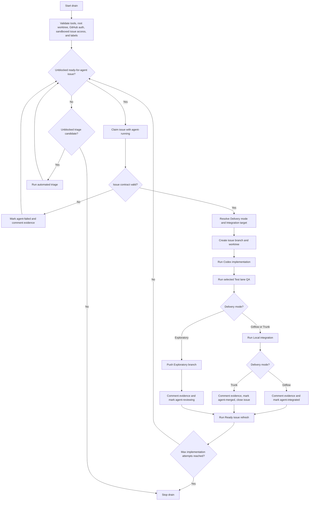
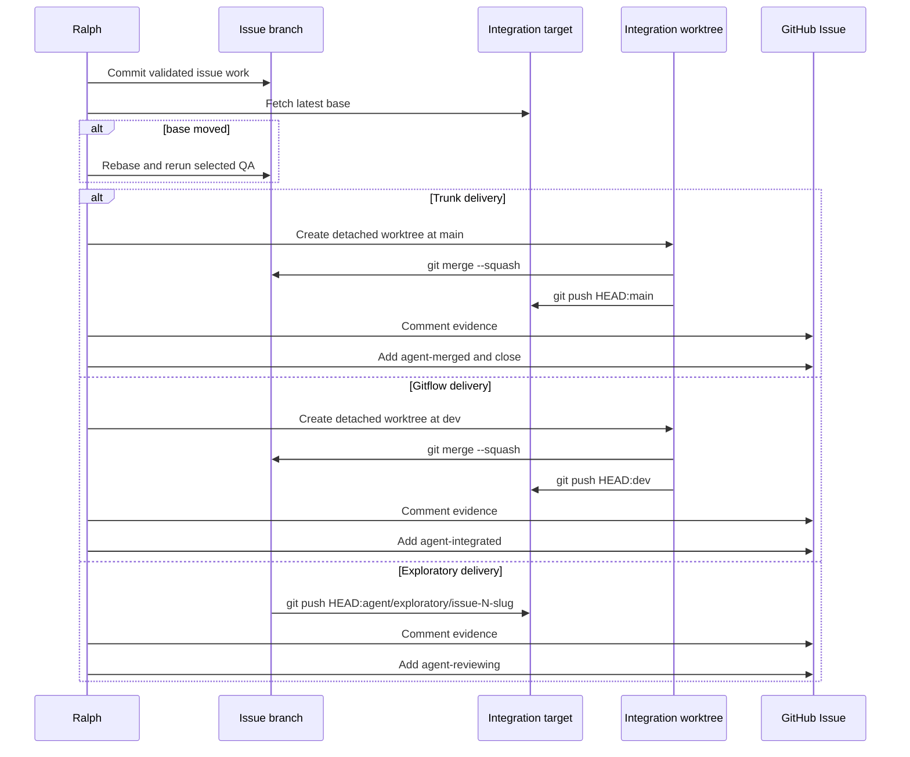

# Ralph Loop

This page documents the repo-local Ralph loop in `scripts/ralph.py`. The loop
uses GitHub Issues as the queue, Codex as the implementation and triage worker,
repo **Test lane** commands as the validation boundary, and **Local
integration**, Exploratory handoff, plus **Promotion** as the success paths
after QA.

## Table of contents

- [Purpose](#purpose)
- [Drain flow](#drain-flow)
- [Labels](#labels)
- [Run modes](#run-modes)
- [Live run preflight](#live-run-preflight)
- [AFK run monitoring](#afk-run-monitoring)
- [Run manifest](#run-manifest)
- [Run inspection and recovery](#run-inspection-and-recovery)
- [Implementation pass](#implementation-pass)
- [Promotion pass](#promotion-pass)
- [Triage pass](#triage-pass)
- [Ready issue refresh](#ready-issue-refresh)
- [QA policy](#qa-policy)
- [Failure handling](#failure-handling)

## Purpose

Ralph drains agent-ready GitHub issues through a guarded local loop:

1. Find the oldest unblocked `ready-for-agent` issue.
2. Resolve the issue **Delivery mode** and **Integration target**.
3. Run `codex exec` to implement the issue.
4. Run deterministic local QA.
5. For Gitflow or Trunk delivery, squash-merge validated work onto the latest
   **Integration target** locally.
6. In **Gitflow delivery**, push `dev`, comment evidence, mark
   `agent-integrated`, and leave the issue open for **Promotion**.
7. In **Trunk delivery**, push `main`, comment evidence, mark `agent-merged`,
   and close the issue.
8. In **Exploratory delivery**, push a durable **Exploratory branch** from
   `origin/main`, comment evidence, mark `agent-reviewing`, and leave the issue
   open for human review.
9. Run **Ready issue refresh** before the next ready issue claim.
10. If no ready issue exists, triage the next unblocked issue and rescan.

The loop stops when the queue has no unblocked implementation or triage
candidates, or when `--max-issues` is reached. A plain `--drain` run defaults
to 10 implementation attempts; `--max-issues 0` is the explicit unlimited drain
mode.

Human operators should call Ralph through repo-local skills:

```text
$grill-with-docs -> optional $to-prd -> $to-issues -> $ralph-triage -> $ralph-loop drain -> review dev -> $ralph-loop promote
```

Use [OPERATOR.md](../../OPERATOR.md) for the first-class **Operator workflow**.
`$ralph-triage` prepares GitHub Issues for drain by setting category, state, and
**Delivery mode** labels. `$ralph-loop` owns the backing script commands,
including `$ralph-loop drain` and `$ralph-loop promote`.
Use `$ralph-curate` before triage or drain when the open issue queue needs to
be reconciled against current branch state.

## Drain flow



## Labels

Triage state labels:

- `needs-triage`
- `needs-info`
- `ready-for-agent`
- `ready-for-human`
- `wontfix`

Category labels:

- `bug`
- `enhancement`

Ralph runtime labels:

- `agent-running`
- `agent-failed`
- `agent-merged`
- `agent-integrated`
- `agent-reviewing`

Ralph delivery labels:

- `delivery-gitflow`
- `delivery-trunk`
- `delivery-exploratory`

Use `ready-for-agent` as the queue selection signal. `needs-triage`,
`needs-info`, `ready-for-human`, `wontfix`, `agent-running`, `agent-failed`,
`agent-merged`, `agent-integrated`, and `agent-reviewing` block
implementation. Runtime labels including `agent-reviewing` also block
automated triage reconsideration.

`delivery-gitflow` is the default **Delivery mode**. `delivery-trunk` is an
opt-in label for small docs, tests, tooling, or script changes.
`delivery-exploratory` is an opt-in label for durable **Exploratory branch**
work that needs explicit human judgment before it can become normal delivery
work. If
`delivery-exploratory` conflicts with Gitflow or trunk labels, Ralph keeps
`delivery-exploratory` and removes the others. If only Gitflow and trunk
conflict, Ralph keeps `delivery-gitflow`, removes `delivery-trunk`, and
proceeds through the safer default.

Create or refresh the labels with:

```bash
python3 scripts/ralph.py --bootstrap-labels
```

## Run modes

Dry-run the next action:

```bash
python3 scripts/ralph.py --drain --dry-run
```

Drain up to 10 implementation attempts:

```bash
python3 scripts/ralph.py --drain
```

Drain without applying **Ready issue refresh** metadata updates:

```bash
python3 scripts/ralph.py --drain --skip-ready-issue-refresh
```

Drain directly to trunk for small low-risk changes:

```bash
python3 scripts/ralph.py --drain --delivery-mode trunk
```

Drain to durable **Exploratory branches** for exploratory changes:

```bash
python3 scripts/ralph.py --drain --delivery-mode exploratory
```

Drain until only blocked or non-actionable issues remain:

```bash
python3 scripts/ralph.py --drain --max-issues 0
```

Implement one specific issue:

```bash
python3 scripts/ralph.py --issue 25
```

Implement one specific issue and then run **Ready issue refresh**:

```bash
python3 scripts/ralph.py --issue 25 --ready-issue-refresh
```

Promote reviewed Gitflow work from `dev` to `main`:

```bash
python3 scripts/ralph.py --promote
```

Skip the default **Post-promotion review** during **Promotion**:

```bash
python3 scripts/ralph.py --promote --skip-post-promotion-review
```

Run **Post-promotion review** but skip automatic validated follow-up issue
creation:

```bash
python3 scripts/ralph.py --promote --skip-post-promotion-followups
```

Override the **Integration target** explicitly when needed:

```bash
python3 scripts/ralph.py --issue 25 --target-branch feature/my-branch
```

Inspect a completed or failed implementation run without mutating GitHub or git
state:

```bash
python3 scripts/ralph.py --inspect-run .ralph/runs/issue-25-20260504T010203Z
```

Recover missing GitHub metadata after verifying the recorded published commit
reached the expected **Integration target**:

```bash
python3 scripts/ralph.py --recover-run .ralph/runs/issue-25-20260504T010203Z
```

Bypass the live clean-root preflight only when the operator intentionally wants
Ralph to run with uncommitted root worktree changes:

```bash
python3 scripts/ralph.py --drain --allow-dirty-worktree
```

## Live run preflight

Live `--issue`, `--drain`, and `--promote` runs fail before GitHub issue claim,
worktree creation, **Local integration**, Exploratory handoff, or push when the
root worktree has uncommitted changes. Commit or stash root worktree changes
before live Ralph runs. Use `--allow-dirty-worktree` only for an explicit
dirty-worktree operation. `--dry-run` remains available on a dirty root worktree
so operators can inspect the next Ralph action without mutating issues or
branches.

Before a live drain, validate both GitHub API auth and Git push auth for the
expected **Integration target**:

```bash
gh auth status
git push --dry-run origin HEAD:main
```

When using token-based GitHub CLI auth, export `GH_TOKEN` in the shell that runs
Ralph. Do not paste token values into commands, issue comments, docs, or logs.
Ralph also gives spawned Codex subprocesses **Sandboxed issue access** by
default: it resolves a token from `GH_TOKEN`, `GITHUB_TOKEN`, or `gh auth
token`, injects it as `GH_TOKEN`, enables network for the workspace-write Codex
sandbox, and prepends a wrapper that permits only `gh auth status` plus the
phase-specific `gh issue` commands. Implementation, triage, and **Ready issue
refresh** passes may get phase-limited issue reads and writes. The
**Post-promotion review** gets read-only issue access: `gh issue view`,
`gh issue list`, and `gh issue status`. The review agent cannot call
`gh issue create`, `comment`, `edit`, `close`, or `reopen`. After a successful
**Promotion**, Ralph may create structured follow-up issues itself through a
validated create-only helper that calls only issue search and issue create. This
does not grant Git push access; Git fetches, **Local integration**, Exploratory
handoff pushes, **Integration target** pushes, and **Promotion** stay in
Ralph's outer loop.

Ralph also standardizes writable QA runtime paths for spawned Codex
subprocesses and Ralph-run QA commands. If the operator exports `DAGSTER_HOME`,
`XDG_CACHE_HOME`, or `UV_CACHE_DIR`, Ralph preserves that explicit value.
Otherwise it sets the variable under
`/tmp/ralph-qa-runtime/<repo-slug>/<run-dir-name>/` using `dagster-home`,
`xdg-cache`, and `uv-cache` child directories. These defaults keep sandboxed
**Commit check**, **Push check**, and Dagster CLI commands away from
home-directory cache locations that may be read-only.

Use `HEAD:dev` for Gitflow target validation, `HEAD:main` for trunk or
promotion validation, and `HEAD:agent/exploratory/issue-N-slug` for a specific
Exploratory handoff. Run Ralph from a local worktree that is aligned with the
remote branch being operated on. The script fetches the implementation base
during implementation and rebases issue work if that base moves, but the
operator should start from a known repo state.

## AFK run monitoring

Ralph writes command logs while subprocesses are still running. Long Codex
implementation attempts write to `codex-implementation-N.jsonl`, triage writes
to `codex-triage.jsonl`, read-only **Ready issue refresh** analysis writes to
`codex-ready-issue-refresh-analysis.jsonl`, **Post-promotion review** writes to
`codex-post-promotion-review.jsonl`, QA writes to `qa-*` logs, and Git
operations write to their named `git-*` logs under the current
`.ralph/runs/...` run directory.
While a command is active, the log has `exit: running`; after the command
finishes, Ralph rewrites the same log with the final exit status while
preserving stdout, stderr, command, and cwd.

After a successful, failed, or partial **Promotion** with changed files and an
available review worktree, Ralph tries to save the final
**Post-promotion review** Markdown report as `post-promotion-review.md` beside
`codex-post-promotion-review.jsonl` and prints the same report to the terminal.

During logged long-running phases, Ralph prints a heartbeat about every 30
seconds:

```text
Ralph heartbeat: phase=#49: Codex implementation attempt 1; log=/repo/.ralph/runs/issue-49-.../codex-implementation-1.jsonl
```

For AFK drains, use the heartbeat phase to see what Ralph is waiting on and tail
the active log path to inspect live command output. If the terminal only shows
heartbeats and no completion message, the phase is still running. If a command
fails, the same log path appears in the failure output or issue evidence.

## Run manifest

Every implementation run and **Promotion** run writes
`.ralph/runs/.../ralph-run.json`. The manifest is rewritten as milestones
complete, so a failed run still records the last known recovery state.

Key fields for inspection:

- `schema_version`: manifest format version.
- `run_kind`: `implementation` or `promotion`.
- `status` and `stage`: current run outcome and latest milestone.
- `events`: timestamped milestone history.
- `issue`: implementation issue number, title, and URL.
- `github_metadata.issues`: promoted issue numbers, recorded issue evidence
  commits, and manual recovery evidence warnings during **Promotion**.
- `delivery_mode`: issue **Delivery mode**; **Promotion** records `gitflow`.
- `integration_target`: branch Ralph is updating for the run.
- `source_branch`: **Promotion** source branch, usually `dev`.
- `source_tree`: **Promotion** source branch revision and source worktree used
  for QA.
- `promotion_commit_inventory`: full promoted source commit range with each
  commit SHA, subject, and whether it matched verified issue evidence or
  remained an unverified **Promotion** commit.
- `post_promotion_review`: enabled state, skip reason, warning-only review
  status, review log path, and Markdown artifact path for **Promotion** runs.
- `post_promotion_followups`: enabled state, created issue URLs, duplicate
  source-marker skips, validation downgrades to `needs-triage`, warning-only
  creation failures, and recovery guidance for **Promotion** follow-ups.
- `ready_issue_refresh`: read-only analysis status, candidate issue numbers,
  candidate issue metadata, analysis log path, Markdown artifact path, and
  failure state for drain-mode implementation runs after successful **Local
  integration** or Exploratory handoff.
- `branches`: issue, source, and target branch names that apply to the run.
- `paths`: repo root, run directory, worktree container, and implementation,
  integration, Promotion source, or Promotion target worktree paths.
- `changed_files`: current file diff used for QA, **Local integration**, or
  Exploratory handoff.
- `qa_results`: selected QA commands, cwd, log path, and pass/fail state.
- `qa_runtime_env`: effective `DAGSTER_HOME`, `XDG_CACHE_HOME`, and
  `UV_CACHE_DIR` values plus whether each came from the operator environment or
  Ralph's writable fallback.
- `sandboxed_issue_access`: non-secret token source, wrapper path, allowed
  command set, and network access state for spawned Codex subprocesses.
- `integration_commit`: published implementation commit. For Gitflow and Trunk
  delivery this is the **Local integration** commit; for Exploratory delivery
  this is the **Exploratory branch** commit.
- `promotion_commit`: **Promotion** commit pushed to `main`.
- `pushes`: per-branch push state, commit SHA, and push log path.
- `github_metadata`: claim, completion, failure, Promotion comment, label, and
  close state.
- `failure`: user-facing error message and command log path when the run fails.

## Run inspection and recovery

Use `--inspect-run <run_dir>` first when a terminal shows a post-push metadata
failure, a completed issue looks inconsistent in GitHub, or an AFK run needs a
read-only summary. Inspection reads only `<run_dir>/ralph-run.json` and reports
the issue, **Delivery mode**, **Integration target**, QA status, push status,
metadata status, and recommended next action. It does not call `gh`, run git
commands, edit labels, comment, close issues, or change refs.

Use `--recover-run <run_dir>` only for implementation runs whose manifest
records a published implementation commit. Recovery fetches the expected target
branch and refuses to proceed unless the recorded commit is reachable from
`origin/<integration-target>`. This guard keeps GitHub metadata reconciliation
behind proof that the **Local integration** commit or Exploratory handoff commit
reached the expected branch.

After reachability is verified, recovery reconciles GitHub metadata to the
issue's **Delivery mode**:

- **Trunk delivery**: ensure the completion comment exists, remove runtime
  labels, apply `agent-merged`, and close the issue.
- **Gitflow delivery**: ensure the completion comment exists, remove runtime
  labels, apply `agent-integrated`, and leave the issue open for **Promotion**.
  If the issue was closed prematurely, recovery reopens it.
- **Exploratory delivery**: ensure the completion comment exists, remove
  runtime labels, apply `agent-reviewing`, and leave or reopen the issue for
  human review.

Recovery does not rerun Codex, rerun QA, create commits, push branches, or clean
worktrees. Normal Ralph runs keep fail-stop behavior: if metadata operations
fail after a push, Ralph stops loudly so an operator can inspect the run and
recover deliberately.

If a failed Gitflow run passed issue QA but failed before recording
`integration_commit`, and an operator manually creates or pushes the recovered
commit to `dev`, preserve **Promotion** closure evidence before applying or
leaving `agent-integrated`. Verify the recovered commit is reachable from
`origin/dev` and is not already on `origin/main`, then add an issue comment that
starts with this exact contract:

```markdown
Ralph Gitflow manual recovery completed.

Commit: `<dev-commit-sha>`
Delivery mode: `gitflow`
Target branch: `dev`
Recovered from run: `<run-dir>`
```

The `Commit:` line must name the `dev` commit that made the recovered issue
work reachable from the Gitflow source branch. Keep the issue open with
`agent-integrated` so the next **Promotion** can verify the commit in the
promoted range, comment Promotion evidence, replace `agent-integrated` with
`agent-merged`, and close the issue. If **Promotion** sees manual recovery
evidence on an open `agent-integrated` issue but cannot parse a commit from the
documented contract, it emits a warning with the recovery action and records
`manual_recovery_commit_unparseable` in the Promotion manifest instead of
leaving the issue silently unreconciled.

## Implementation pass

An implementation issue must have these sections:

- `## What to build`
- `## Acceptance criteria`
- `## Blocked by`

An Exploratory delivery issue must also have `## Review focus`, stating the
human judgment the durable **Exploratory branch** needs. Missing
`## Review focus` marks the issue `agent-failed` before Ralph creates an
implementation worktree, invokes Codex, or publishes an Exploratory handoff.

If any referenced blocker in `Blocked by` is still open, Ralph skips the issue.
If the issue contract is malformed, Ralph marks the issue `agent-failed` and
leaves a result comment with the run log path.

Ralph chooses **Delivery mode** from issue labels first, then from the CLI
default. Missing delivery labels are written back to the issue before
implementation. `delivery-gitflow` defaults to `origin/dev`; if that branch does
not exist, Ralph creates it from `origin/main`. Before creating a Gitflow issue
branch, Ralph also syncs `origin/main` into `origin/dev` when `main` is not
already an ancestor of `dev`, so the **Integration target** is not behind trunk.
`delivery-trunk` defaults to `origin/main`. `delivery-exploratory` defaults to
a per-issue **Exploratory branch** named `agent/exploratory/issue-N-slug`.
Ralph fails clearly before Codex implementation if that remote branch already
exists; otherwise it creates the local **Exploratory branch** from
`origin/main` and later pushes it. `--target-branch` overrides the
**Integration target** explicitly.

For Gitflow and Trunk delivery, Ralph creates branches named
`agent/issue-N-slug` from the **Integration target** and creates sibling
worktrees under the repo worktree container. For Exploratory delivery, Ralph
creates the **Exploratory branch** from `origin/main`. Codex is instructed not
to commit, push, or edit GitHub issue state; Ralph owns those steps after QA
passes.

Before building the Codex implementation prompts for an issue, Ralph fetches
issue comments for the issue being implemented. The prompt keeps the issue body
as the primary contract, then appends a separate
`Recent Ready issue refresh notes` section when matching context exists. That
section includes only the latest five comments whose body starts with the Ready
issue refresh audit prefix, preserving their chronological order. Normal
maintainer comments and automated triage comments are excluded. If comment
fetching fails, Ralph fails the issue before starting the Codex implementation
subprocess instead of running with incomplete refresh context.

After QA passes, Ralph commits the implementation branch, fetches the branch's
base, and rebases if the base moved. A rebase triggers the selected QA commands
again before **Local integration** or Exploratory handoff continues.

For **Local integration**, Ralph creates a temporary detached integration
worktree at latest target, runs `git merge --squash` from the issue branch,
creates one integration commit, pushes it to the target, and posts completion
evidence with the commit SHA, changed files, QA commands, and run log path.
Trunk integration marks the issue `agent-merged` and closes it. Gitflow
integration marks the issue `agent-integrated` and leaves it open for
**Promotion**. Exploratory handoff skips the detached integration worktree and
squash merge: Ralph pushes the validated **Exploratory branch** to origin,
marks the issue `agent-reviewing`, and leaves it open for human review. Ralph
does not open a GitHub draft PR.

Human review owns the next Exploratory state transition. For accepted
Exploratory work, merge the reviewed **Exploratory branch** to `dev`, add
acceptance evidence to the issue, remove `agent-reviewing`, and add
`agent-integrated` so the issue can close through the existing **Promotion**
path. The acceptance comment must start with:

```markdown
Ralph exploratory acceptance completed.

Commit: `<dev-commit-sha>`
```

The commit is the `dev` commit that made the accepted work reachable from the
source branch. For rejected Exploratory work, leave the issue open, remove
`agent-reviewing`, add `ready-for-human`, and comment the review result and
next action. Rejected review must not add `agent-integrated`. ADR
[0005](../adr/0005-ralph-exploratory-branches-stay-outside-automatic-promotion.md)
records why **Exploratory branches** stay outside automatic **Promotion** until
human acceptance evidence reaches `dev`.



## Promotion pass

`python3 scripts/ralph.py --promote` promotes reviewed Gitflow work and accepted
Exploratory work from `origin/dev` to `origin/main` by default. Ralph fetches
both branches, computes the changed files between the target branch and the
fetched source-branch revision, records the full source commit inventory for
that promoted range, and creates an isolated source worktree at that source
revision. The commit inventory records every promoted source commit with its
SHA and subject. After verified issues are identified, commits whose SHA matches
a recorded Gitflow **Local integration** commit, a documented manual Gitflow
recovery commit, or an accepted Exploratory commit are treated as verified issue
evidence; other commits remain visible as unverified **Promotion** commits in
the run manifest and **Post-promotion review** prompt.
Unverified **Promotion** commits are mandatory **Post-promotion review**
context only. They do not block **Promotion**, do not require explicit issue
association before **Promotion**, and do not create follow-up issues by
themselves. Follow-up GitHub Issue drafts belong in the
**Post-promotion review** artifact only when the review finds concrete
actionable work.

Ralph runs the aggregate matching **Push check** QA from the source worktree.
When the promoted range includes non-doc runtime files under
`backend-services/dagster-user/aemo-etl/`, Ralph runs the AEMO ETL
**End-to-end test** gate from the same source worktree before creating the
target Promotion worktree. The gate is recorded as
`aemo-etl End-to-end test` in the Promotion run manifest and invokes
`scripts/aemo-etl-e2e run` from the `backend-services` **Subproject** with
`--scenario promotion-gas-model`, `--timeout-seconds 1200`,
`--max-concurrent-runs 6`, and
`--seed-root <primary-repo>/backend-services/.e2e/aemo-etl`, so the temporary
Promotion source worktree uses the operator-maintained cached Archive seed
instead of an empty ignored cache under the worktree. Promotion keeps this gate
at the command default run queue concurrency and narrows the raw and zip seed
horizon to 1 object. The `promotion-gas-model` scenario keeps Dagster automation
stopped and launches explicit asset-run batches by dependency wave for every
materializable `gas_model` asset plus its materializable upstream closure, while
skipping live `bronze_nemweb_public_files_*` discovery/listing assets so the
gate starts from seeded LocalStack objects. Each batch runs in-process inside its
Podman run-worker container, reducing LocalStack and Delta Lake DynamoDB
lock-table contention. The generated stack uses fixed service IPs for Postgres,
LocalStack, and the AEMO ETL code server so run-worker containers do not depend
on Podman DNS during high-concurrency gates. This preserves final target
progress and final asset-check status without creating one sensor-triggered run
per upstream source table. The e2e `run-manifest.json` dataflow section records
structured direct-launch scenario evidence: selected scenario, launch mode,
target group, target asset count, selected upstream closure count, skipped live
source asset keys, dependency-wave count, run-batch count, and asset batch size.
The gate protects the approved #77 coverage invariants: every materializable
`gas_model` asset, final asset-check status for that target, Dagster,
LocalStack/S3, Podman run-worker containers, and the Dagster GraphQL monitor.
It enforces #79 Promotion guard regression budgets from the approved #78
targeted baseline: 20 minute total duration, `6` peak active runs, `6` peak
queued runs, `48` total Dagster runs, `29/29` target progress, and `0` missing
or failed target assets and asset checks. Direct Promotion launches pace batch
submission against `max_concurrent_runs` before starting more work in a
dependency wave so the queued-run budget remains bounded. The
`run-manifest.json` telemetry records the #75 timing, run-shape, target
progress, asset-check, cleanup, and direct-launch scenario evidence; the budget
report prints the #76 observed values, thresholds, failure lines, and manifest
path. Duration or run-count failures indicate run explosion, run queue
contention, or local environment slowdown. Target-progress or asset-check
failures indicate the approved coverage contract was not met. Missing telemetry
is also a gate failure because Ralph cannot prove the source revision satisfied
the contract. Because the aggregate **Push check** and gate run first,
source-branch changes cannot reach a Promotion merge, `main` push, `dev` branch
sync, GitHub metadata update, or issue closure without passing against the exact
source revision.
Ralph then merges that source revision into a detached `origin/main` worktree
with per-issue commits preserved, pushes `main`, and fast-forwards `dev` to the
promotion commit so the next Gitflow drain starts from a `dev` branch that
contains `main`.

After the push succeeds, Ralph scans open `agent-integrated` issues. It closes
only issues whose recorded Gitflow integration commit, documented manual
Gitflow recovery commit, or accepted Exploratory commit is still in the
promoted `origin/main..origin/dev` range, then comments Promotion evidence and
replaces `agent-integrated` with `agent-merged`. If an open `agent-integrated`
issue has manual recovery evidence but no parseable commit, Ralph warns with
the exact recovery action and records the issue under `github_metadata.issues`
with `metadata_status: manual_recovery_commit_unparseable`.
Per-issue Promotion comments describe promoted files as the full
Promotion-range file inventory, not as files owned only by the issue being
closed. Successful Promotions with changed files then run a **Post-promotion
review** agent from the **Promotion** worktree by default, after the `main`
push, `dev` sync, and verified issue metadata updates. Failed or partial
Promotion attempts with changed files also try a **Post-promotion review** where
a source or target Promotion worktree is available. The review prompt includes
both verified issue evidence commits and unverified **Promotion** commits when
available so the review can separate closed issue evidence from other promoted
work. For failed or partial attempts, the report must put recovery and
consistency guidance before
follow-up issue recommendations. The review agent has read-only GitHub Issue
access and must report learnings, recovery guidance, and structured actionable
follow-up GitHub Issue drafts instead of mutating issues. Ralph saves the final
Markdown report as `post-promotion-review.md`, prints it in the terminal, and
records both `post_promotion_review.log_path` and
`post_promotion_review.artifact_path` in the **Promotion** run manifest.

Successful Promotions create validated follow-up GitHub Issues by default after
the review completes. The structured JSON draft must include `title`, `body`,
`finding_id`, and `labels`; the body must include `## What to build`,
`## Acceptance criteria`, and `## Blocked by`, and labels must include exactly
one category label plus exactly one **Delivery mode** label. Ralph adds a
deterministic source marker based on the **Promotion** commit and finding ID,
searches for the marker before creating, and records duplicate skips in the
manifest. Valid drafts are created as `ready-for-agent`; invalid or incomplete
drafts are created as `needs-triage` with validation evidence so they are not
drainable work. Follow-up creation failures after `main` is pushed are
warning-only: **Promotion** remains succeeded, the manifest records the
failure, and `post-promotion-review.md` receives recovery guidance.

Operators can pass `--skip-post-promotion-followups` to run the review while
skipping automatic follow-up issue creation. Operators can pass
`--skip-post-promotion-review` to disable both review and follow-up creation.
Review failures are warnings recorded under `post_promotion_review`; they do
not change the original Promotion success or failure status.
If there are no Promotion changes, Ralph does not create Promotion worktrees or
run the review agent; it prints a review skip note and records
`post_promotion_review.status` and `post_promotion_followups.status` as
`skipped_no_changes`.

## Triage pass

When no unblocked `ready-for-agent` issue exists, Ralph asks Codex to run the
`ralph-triage` skill on the next unblocked triage candidate:

- unlabeled issues
- `needs-triage` issues
- `needs-info` issues only when reporter activity appears after the latest AI
  triage note

Automated triage may label, comment, or close issues. Every triage comment must
begin with:

```markdown
> *This was generated by AI during triage.*
```

Ralph v1 does not let automated triage write `.out-of-scope/` files. If an
enhancement looks like `wontfix` and needs an out-of-scope record, triage should
mark it `ready-for-human` instead.

Automated triage also applies Ralph delivery labels. It should default to
`delivery-gitflow` and use `delivery-trunk` only for clearly small docs, tests,
tooling, or script changes. Runtime behavior, infrastructure, Dagster, S3,
LocalStack, cross-**Subproject** work, broad refactors, or unclear scope should
stay on `delivery-gitflow` unless the issue explicitly asks for
`delivery-exploratory` **Exploratory branch** handling.

## Ready issue refresh

**Ready issue refresh** is the queue-maintenance pass Ralph runs after a
successful implementation **Local integration** or Exploratory handoff and
before the next `ready-for-agent` issue claim in the drain. It reconciles open
GitHub Issues against the updated **Integration target** so follow-on work does
not keep stale blockers, stale acceptance criteria, or already-satisfied issues
in the ready queue.

After each successful drain-mode **Local integration** or Exploratory handoff,
Ralph computes and applies **Ready issue refresh** by default. Operators can
disable the drain refresh with `--skip-ready-issue-refresh`; targeted
`--issue` runs do not refresh unless the operator passes `--ready-issue-refresh`.
Ralph first computes a bounded candidate set from open GitHub Issues returned by
the existing `--issue-limit` scan. Candidate selection includes
`ready-for-agent` issues that are unblocked in queue order and excludes issues
carrying implementation stop labels such as `agent-running`, `agent-failed`,
`agent-merged`, `agent-integrated`, or `agent-reviewing`. It also includes
`ready-for-agent` issues whose `## Blocked by` section names the issue that was
just completed: Gitflow leaves that blocker open with `agent-integrated` until
**Promotion**, and Exploratory delivery leaves it open with `agent-reviewing`
for human review, but candidate selection treats that just-completed blocker as
satisfied for refresh review. Trunk delivery works through the same selector
after the just-completed blocker has already been closed.

This bounded scan also keeps the next unblocked ready issues in queue order in
the candidate set, even when they do not explicitly reference the just-integrated
issue. That lets refresh review catch duplicate or obsolete ready work that
became stale because of the latest **Local integration** or Exploratory handoff.
After candidate selection, Ralph invokes a read-only spawned Codex subprocess
using the repo-local `$ralph-issue-refresh` skill. The analysis prompt includes
the integrated issue, **Delivery mode**, **Integration target**, **Local
integration** or Exploratory handoff commit, changed files, QA evidence, run log
path, and candidate issue bodies. The subprocess is granted only read-only
GitHub Issue commands and is instructed not to comment, edit labels, edit
bodies, close, reopen, create issues, commit, push, fetch, merge, rebase, reset,
or update refs. It records planned issue updates and a structured mutation plan
only; Ralph's outer loop applies validated metadata mutations afterwards.

The read-only analysis report is saved as
`ready-issue-refresh-analysis.md` in the current `.ralph/runs/issue-.../`
directory beside `codex-ready-issue-refresh-analysis.jsonl`. The implementation
run manifest records `ready_issue_refresh.status`, candidate issue numbers,
candidate issue metadata, the analysis log path, the artifact path,
`ready_issue_refresh.mutation_results`, recovery guidance, and any failure.
Each candidate mutation result records the issue number, action, status,
operations applied, error text, and log path when available, so operators can
inspect partial post-**Local integration** metadata failures.

Ralph applies only GitHub Issue metadata commands during mutation: `gh issue
view`, `gh issue edit`, `gh issue comment`, and `gh issue close`. It does not
run code edits, commits, pushes, fetches, merges, rebases, ref updates, or
**Integration target** updates as part of refresh metadata application. Reruns
are idempotent: Ralph skips already-current body text, already-applied label
transitions, duplicate refresh comments, and already-closed completed issues.
If analysis or metadata mutation fails after a successful **Local integration**
or Exploratory handoff, Ralph stops the drain before claiming another issue. It
does not roll back the pushed **Integration target** commit or revert the
already-completed issue metadata; operators inspect the manifest mutation
results and reconcile only the failed GitHub Issue metadata before rerunning
the drain.

In `--dry-run`, Ralph reports that Ready issue refresh candidate selection would
run after **Local integration** or Exploratory handoff; it does not invoke Codex
or mutate GitHub Issues.

Use the repo-local `$ralph-issue-refresh` skill as the entry point for this
contract. The full metadata-refresh contract is allowed to mutate only GitHub
Issue metadata:

- comments
- issue body updates
- label transitions
- completed closure for obsolete or already-satisfied issues

Every refresh comment must begin with this exact audit prefix:

```markdown
> *This was generated by AI during Ready issue refresh.*
```

`## Current context` is optional issue-body context. Refresh may add or update
that section when branch state, completed work, blocker changes, or evidence
would help the next agent, but existing `ready-for-agent` issues do not need the
section just to stay ready.

Any refreshed issue that remains `ready-for-agent` must still contain:

- `## What to build`
- `## Acceptance criteria`
- `## Blocked by`

If the refreshed issue carries `delivery-exploratory`, it must also still
contain `## Review focus`.

If an issue is stale but the correct update is unclear, refresh moves it to
`needs-triage` and comments evidence with the audit prefix. If the latest branch
state already satisfies or obsoletes the issue, refresh closes it as completed
with evidence. Unclear issues must not be closed as completed.

**Ready issue refresh** is distinct from **Post-promotion review**. Refresh
runs during drain after **Local integration** or Exploratory handoff and may
update issue metadata.
**Post-promotion review** runs after **Promotion**, uses read-only issue access,
and reports structured follow-up issue drafts in the Promotion artifact. Only
Ralph's validated create-only helper may turn those drafts into GitHub Issues
after a successful **Promotion**.

## QA policy

For runtime `aemo-etl` changes, Ralph runs from the owning **Subproject**:

```bash
make unit-test
make component-test
make integration-test
make run-prek
```

Docs-only `aemo-etl` changes are recognized by the maintained Markdown doc path
rules in [documentation-sync.md](../repository/documentation-sync.md). They skip
the runtime AEMO ETL **Test lanes** above and run the root doc **Commit check**
surface:

```bash
prek run -a
```

Mixed docs/runtime `aemo-etl` changes run both the runtime AEMO ETL commands and
the root doc **Commit check**.

For root docs/config or cross-**Subproject** changes, Ralph runs:

```bash
prek run -a
```

For Ralph script or unit-test changes, Ralph runs:

```bash
python3 -m unittest discover -s tests
```

If the implementation base changes after the implementation worktree was
created, Ralph rebases the issue branch and reruns the selected QA commands
before **Local integration** or Exploratory handoff.

During **Promotion**, Ralph computes all files changed between `origin/main` and
`origin/dev`, then runs the matching QA set as an aggregate **Push check** before
pushing `main`.

Every Codex implementation attempt, implementation QA command, Promotion
**Push check**, and Promotion gate receives writable QA runtime path variables.
Operators can override all or part of this behavior by exporting
`DAGSTER_HOME`, `XDG_CACHE_HOME`, or `UV_CACHE_DIR` before running Ralph; unset
or empty variables fall back to the run-scoped `/tmp/ralph-qa-runtime/...`
paths recorded in the run manifest.

If that Promotion range includes non-doc runtime files under
`backend-services/dagster-user/aemo-etl/`, Ralph also runs the AEMO ETL
**End-to-end test** gate after the aggregate **Push check** and before any
Promotion worktree, merge, push, `dev` branch sync, GitHub metadata update, or
issue closure:

```bash
cd backend-services
scripts/aemo-etl-e2e run \
  --scenario promotion-gas-model \
  --timeout-seconds 1200 \
  --max-concurrent-runs 6 \
  --seed-root <primary-repo>/backend-services/.e2e/aemo-etl
```

## Failure handling

Codex or QA failures get one retry in the same worktree. If retry fails, Ralph:

- keeps the failed worktree for inspection
- adds `agent-failed`
- removes `agent-running`
- leaves a result comment with the failing command and log path
- continues drain mode with the next actionable issue

Successful issues remove the implementation worktree, any integration worktree,
and the local temporary branch after trunk closure, Gitflow integration, or
Exploratory branch publication. Cleanup failures are warnings; the pushed
commit and GitHub issue metadata remain the source of truth.

Merge or push failures before the **Integration target** is updated are issue
failures and keep the worktrees for inspection. Failures after the target is
pushed stop the drain because the code may already be published while GitHub
issue metadata may be inconsistent. Promotion failures before `main` is pushed
leave issues open with `agent-integrated`; failures after `main` is pushed stop
the run for the same metadata consistency reason. Failed or partial Promotion
attempts still try warning-only **Post-promotion review** when a review worktree
is available; the original Promotion exception, manifest `status`, and failure
state remain the source of truth.

**Ready issue refresh** analysis or metadata mutation failures also stop the
drain, but they do not imply the integrated issue metadata needs recovery. The
manifest records the pushed **Integration target** commit, completed integrated
issue metadata, `ready_issue_refresh.status: failed`, and any candidate-level
`ready_issue_refresh.mutation_results`. Operators inspect the analysis log,
artifact path, and mutation results, then reconcile only failed GitHub Issue
metadata before restarting the drain.

Environment failures stop the run. Examples include invalid `gh` auth, missing
labels, unavailable tools, failing Git operations before claim, or unavailable
container-backed **Integration test** dependencies.

## Sync metadata

- `sync.owner`: `agents`
- `sync.sources`:
  - `scripts/ralph.py`
  - `CONTEXT.md`
  - `OPERATOR.md`
  - `AGENTS.md`
  - `docs/agents/README.md`
  - `docs/agents/issue-tracker.md`
  - `docs/agents/triage-labels.md`
  - `docs/repository/documentation-sync.md`
  - `docs/adr/0005-ralph-exploratory-branches-stay-outside-automatic-promotion.md`
  - `.agents/skills/ralph-curate/SKILL.md`
  - `.agents/skills/ralph-loop/SKILL.md`
  - `.agents/skills/ralph-issue-refresh/SKILL.md`
  - `.agents/skills/ralph-triage/SKILL.md`
  - `backend-services/scripts/aemo-etl-e2e`
- `sync.scope`: `operations`
- `sync.qa`:
  - `git diff --name-only`
  - `rg -n "<changed-file-path>" OPERATOR.md README.md docs backend-services infrastructure`
  - `python3 -m unittest discover -s tests`
  - `verify links, headings, commands, paths, labels, and names`
