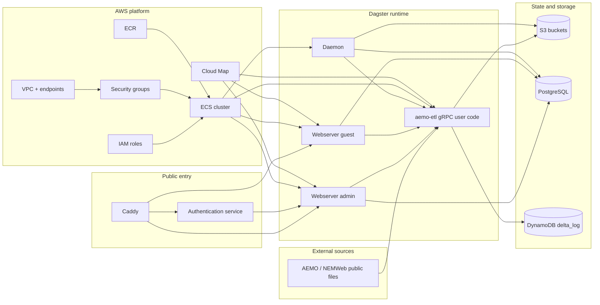
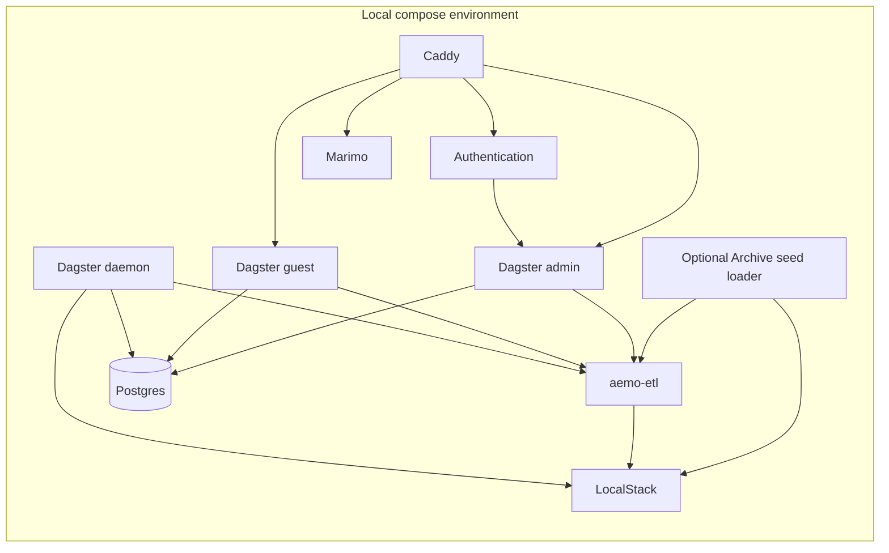

# Repository Architecture

This repository's main architecture is the AWS deployment provisioned from
`infrastructure/aws-pulumi`. The local compose stack exists to support
development and testing of that deployed platform.

## Table of contents

- [AWS deployed system](#aws-deployed-system)
- [Local test and development harness](#local-test-and-development-harness)
- [Repository responsibilities](#repository-responsibilities)
- [Related docs](#related-docs)

## AWS deployed system

## Local test and development harness

This local stack is intentionally broader than the deployed stack in some areas.
For example, `marimo` is part of local compose but is not provisioned by the
current Pulumi deployment. The optional Archive seed loader is also local-only:
it can require a cached seed under `backend-services/.e2e/aemo-etl` before
starting the `aemo-etl` code location for local **End-to-end test** setup.
`backend-services/scripts/aemo-etl-e2e run` uses that cache through an isolated
e2e stack with generated Dagster config, Postgres, LocalStack, AEMO ETL user
code, one webserver, and the daemon. Once the stack is ready, it enables only
the intended Dagster sensors, keeps local-only schedules and alerting stopped,
bootstraps non-sensor prerequisites, and monitors the full `gas_model`
dataflow through Dagster GraphQL.

## Repository responsibilities

- `infrastructure/aws-pulumi`
  - provisions the canonical AWS platform and deployed runtime
- `backend-services/dagster-user/aemo-etl`
  - defines Dagster assets, sensors, resources, and ETL-specific docs
- `backend-services/dagster-core`
  - provides the Dagster runtime image and environment-specific configuration
- `backend-services/authentication`
  - implements the OIDC/session bridge used in front of protected routes
- `backend-services/caddy`
  - provides the reverse-proxy image and routing rules
- `backend-services/marimo`
  - local notebook-oriented service used in the test/dev harness

## Related docs

- [Documentation sync workflow](documentation-sync.md)
- [Repository workflow](workflow.md)
- [AWS Pulumi infrastructure](../infrastructure/aws-pulumi/README.md)
- [aemo-etl architecture](../backend-services/dagster-user/aemo-etl/docs/architecture/high_level_architecture.md)

## Sync metadata

- `sync.owner`: `docs`
- `sync.sources`:
  - `infrastructure/aws-pulumi/__main__.py`
  - `backend-services/compose.yaml`
  - `backend-services/scripts/aemo-etl-e2e`
  - `backend-services/dagster-user/aemo-etl/src/aemo_etl/maintenance/e2e_archive_seed.py`
  - `backend-services/dagster-user/aemo-etl/src/aemo_etl/cli/e2e_archive_seed.py`
  - `backend-services/caddy/Caddyfile`
- `sync.scope`: `architecture`
- `sync.qa`:
  - `git diff --name-only`
  - `rg -n "<changed-file-path>" README.md docs backend-services infrastructure`
  - `verify links, diagrams, commands, paths, ports, env vars, and names`
