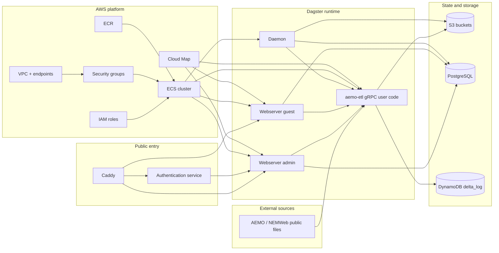
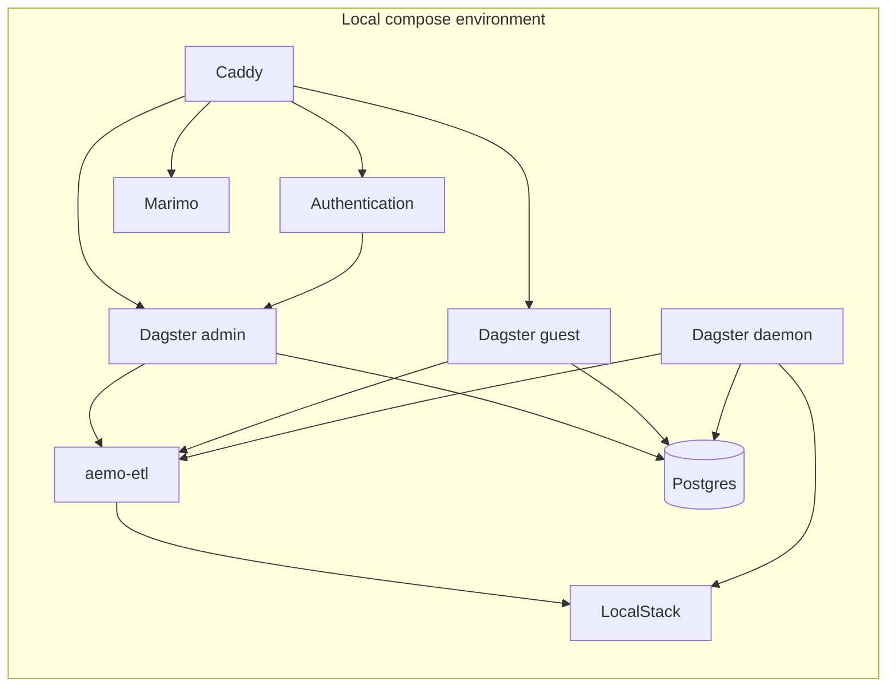

# Repository Architecture

This repository's main architecture is the AWS deployment provisioned from
`infrastructure/aws-pulumi`. The local compose stack exists to support
development and testing of that deployed platform.

## Table of contents

- [AWS deployed system](#aws-deployed-system)
- [Local test and development harness](#local-test-and-development-harness)
- [Repository responsibilities](#repository-responsibilities)
- [Related docs](#related-docs)

## AWS deployed system

## Local test and development harness

This local stack is intentionally broader than the deployed stack in some areas.
For example, `marimo` is part of local compose but is not provisioned by the
current Pulumi deployment.

## Repository responsibilities

- `infrastructure/aws-pulumi`
  - provisions the canonical AWS platform and deployed runtime
- `backend-services/dagster-user/aemo-etl`
  - defines Dagster assets, sensors, resources, and ETL-specific docs
- `backend-services/dagster-core`
  - provides the Dagster runtime image and environment-specific configuration
- `backend-services/authentication`
  - implements the OIDC/session bridge used in front of protected routes
- `backend-services/caddy`
  - provides the reverse-proxy image and routing rules
- `backend-services/marimo`
  - local notebook-oriented service used in the test/dev harness
- `specs`
  - captures migration notes, design intent, and implementation plans

## Related docs

- [Repository workflow](workflow.md)
- [AWS Pulumi infrastructure](../infrastructure/aws-pulumi/README.md)
- [aemo-etl architecture](../backend-services/dagster-user/aemo-etl/docs/architecture/high_level_architecture.md)
- [Specs and design notes](../specs/README.md)
