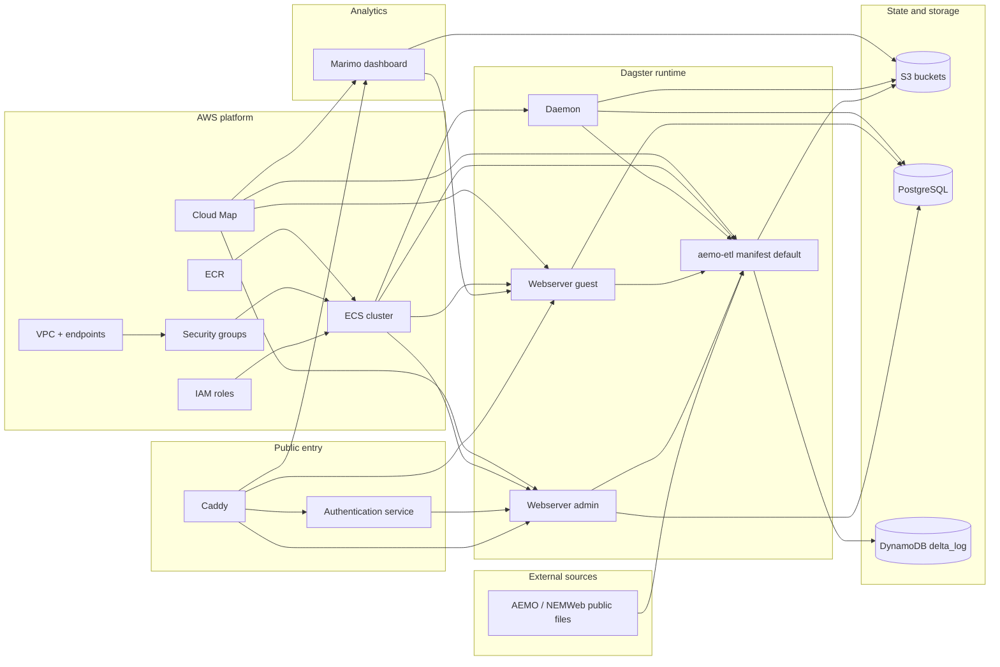
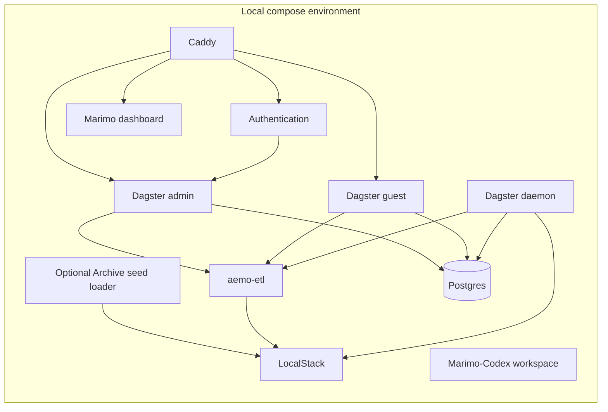

# Repository Architecture

This repository's main architecture is the AWS deployment provisioned from
`infrastructure/aws-pulumi`. The local compose stack exists to support
development and testing of that deployed platform.

## Table of contents

- [AWS deployed system](#aws-deployed-system)
- [Local test and development harness](#local-test-and-development-harness)
- [Repository responsibilities](#repository-responsibilities)
- [Related docs](#related-docs)

## AWS deployed system

The default deployed Dagster runtime uses ECS Fargate/Fargate Spot. Issue #126
adds a default-off **Exploratory delivery** prototype for EC2-backed Dagster
run-worker capacity; that path is documented under the AWS Pulumi runtime docs
and is not part of the normal architecture unless an Operator enables the
matching Pulumi config.

## Local test and development harness

This local stack is intentionally broader than the deployed stack in some areas.
The `marimo-dashboard` service is also deployed by Pulumi as a private EC2
instance behind Caddy, but `marimo-codex-workspace` remains local-only. The
deployed dashboard serves curated notebooks through Caddy, reads the private
guest Dagster GraphQL endpoint, and has read-only access to curated AEMO and
IO-manager buckets. Its data readiness overview gives platform operators a
first-stop check over those read-only S3 and Dagster GraphQL surfaces. Its
glossary explorer browses packaged registry metadata without reading generated
gold Markdown or live S3 tables at runtime. Its concept-to-asset explorer maps
Market context glossary concepts to registry backing assets, dashboard routes,
planned dashboard cards, and table explorer deep links without reading table
rows. Its citation-chain explorer audits registry metadata from generated-gold
paths to source chunk IDs, silver chunk paths, and source hashes without
opening generated corpus files. Its Flow operations, Operational Meter Flow,
market price, schedule run, settlement activity, customer transfer, Bid / Offer
stack, gas quality, heating value and SCADA pressure, and system notice
dashboards use the shared bounded gas-model loader for
read-only fact previews and summaries. Its forecast-vs-actual dashboard compares
bounded forecast and actual flow/storage facts without changing ETL grain or
full-scan policy. Its Gas Day explainer uses registry context metadata and bounded
gas-model samples to show date-field coverage across curated assets. Its Hub /
Zone explainer uses the
same bounded loader to show current `silver_gas_dim_zone` coverage and
source-qualified identifiers. Its table explorer remains
the selected-table workbench for storage inspection, readiness navigation,
bounded-read diagnostics, and concept-gallery metadata for mapped
`silver.gas_model` assets. The
Marimo-Codex workspace is
bound to localhost for human-operated research and
issue-draft preparation. Deployed Codex execution remains deferred pending
security review. The optional
Archive seed loader is also local-only: it can load a cached seed under
`backend-services/.e2e/aemo-etl` into LocalStack during local compose startup.
Strict seed-before-Dagster gating belongs to the isolated **End-to-end test**
stack.
`backend-services/scripts/aemo-etl-e2e run` uses that cache through an isolated
e2e stack with generated Dagster config, Postgres, LocalStack, AEMO ETL user
code, one webserver, and the daemon. Once the stack is ready, it keeps
local-only schedules and alerting stopped, drives the selected Dagster dataflow
through GraphQL, and monitors the full `gas_model` dataflow plus a direct
Dagster event-log storage read for final asset-check status. Direct-launch
scenarios also collect current-source `source_definitions` with
`uv run dg list defs --assets "group:gas_model" --json` before stack startup.
The `full-gas-model` scenario launches explicit Dagster asset-run batches by
dependency wave for every materializable `gas_model` asset plus its
materializable upstream closure; it defaults to host webserver port `3001`, a 90
minute timeout, Dagster `max_concurrent_runs` `6`, 1 cached raw object per
required source table, and 1 cached zip object per required domain. Ralph
**Promotion** uses the `promotion-gas-model` scenario from the isolated source
worktree with `--rebuild`, a 20 minute timeout, Dagster `max_concurrent_runs`
`6`, and the same 1-object raw and zip seed horizon. That Promotion scenario
validates the runtime GraphQL target count against that source count through the
GitHub issue #141 stale-runtime/current-source guard, and uses the same
dependency-wave launch shape. Both scenarios skip live
`bronze_nemweb_public_files_*`
discovery/listing assets so they start from seeded LocalStack objects. This
preserves the mandatory final target and asset-check status without the full
sensor-triggered run queue. Each direct-launch batch uses Dagster's in-process
executor inside its Podman run-worker container to reduce LocalStack and Delta
Lake DynamoDB lock-table contention, and direct launch paces batch submission
against `max_concurrent_runs` so queued runs remain bounded for the full proof
and within the Promotion guard budget.
The generated stack uses fixed service IPs for Postgres, LocalStack, and the
AEMO ETL code server so run-worker containers do not depend on Podman DNS during
high-concurrency Promotion gates. Its run
manifest records gate timing, final dataflow telemetry, direct-launch scenario
evidence, cleanup duration, and non-benign cleanup evidence so Promotion review
can distinguish dataflow success from cleanup residue without changing the
dataflow gate decision. The direct-launch evidence records the scenario, launch
mode, target group, target asset count, target asset-check count, target keys,
STTM target keys, selected upstream closure count, skipped live source asset
keys, dependency-wave count, run-batch count, and asset batch size; the
manifest also records top-level source-definition evidence with the current
executable asset count, asset-check count, full target keys, and STTM target
keys. The Promotion scenario enforces regression budgets from the
approved targeted baseline: total gate duration at or below 20 minutes, peak
active and queued runs at or below `6`, total Dagster runs at or below the
current direct-launch `dataflow.scenario_evidence.batch_count`, target progress
matching the current `source_definitions.executable_asset_count`, and missing or
failed target assets and asset checks at `0`. A source/runtime target-count
mismatch indicates a stale Dagster graph for the source revision. Budget
failures print the observed values, thresholds, dynamic target-count evidence,
planned-batch evidence, and run manifest path. The full scenario records the
expanded baseline observations with `budget.status` set to `not-enforced`
without making local development performance claims.

## Repository responsibilities

- `infrastructure/aws-pulumi`
  - provisions the canonical AWS platform and deployed runtime, including
    manifest-declared Dagster user-code images and ECS services
- `backend-services/dagster-user/aemo-etl`
  - defines Dagster assets, sensors, resources, and ETL-specific docs
- `backend-services/dagster-core`
  - provides the Dagster runtime image, environment-specific configuration, and
    the AWS code-location manifest used to render the deployed workspace
- `backend-services/authentication`
  - implements the OIDC/session bridge used in front of protected routes
- `backend-services/caddy`
  - provides the reverse-proxy image, root Astro portfolio, and routing rules
- `backend-services/marimo`
  - notebook-oriented Subproject with a registry-backed `/marimo` concept
    gallery, registry-only glossary explorer, operational readiness and
    materialization freshness dashboards, immutable cache headers for packaged
    static assets, a curated dashboard image used locally and in AWS,
    plus a local-only Marimo-Codex research workspace image

Gas market knowledge base responsibility:

- `tools/gas-market-knowledge-base`
  - provides the **Gas market knowledge base** Subproject, including the bronze
    source manifest command, archive-prefix completeness audit, archive PDF
    cache fetcher, Docling-based silver document extraction, Docling Hybrid
    retrieval chunks, silver chunk index validation, gold **Market context**
    citation validation, seed glossary artifacts, generated text artifact roots,
    raw-PDF ignore policy, unit tests, and **Commit check** surface. ADR
    [0010](../adr/0010-gas-market-knowledge-base.md) records the corpus
    architecture and the generated gold boundary.

## Related docs

- [Documentation sync workflow](documentation-sync.md)
- [Repository workflow](workflow.md)
- [AWS Pulumi infrastructure](../../infrastructure/aws-pulumi/README.md)
- [aemo-etl architecture](../../backend-services/dagster-user/aemo-etl/docs/architecture/high_level_architecture.md)
- [ADR 0010: Gas market knowledge base](../adr/0010-gas-market-knowledge-base.md)
- [Gas market knowledge base Subproject](../../tools/gas-market-knowledge-base/README.md)

## Sync metadata

- `sync.owner`: `docs`
- `sync.sources`:
  - `docs/README.md`
  - `docs/adr/0010-gas-market-knowledge-base.md`
  - `tools/gas-market-knowledge-base/README.md`
  - `infrastructure/aws-pulumi/__main__.py`
  - `infrastructure/aws-pulumi/components/marimo.py`
  - `backend-services/dagster-core/code-locations.aws.toml`
  - `infrastructure/aws-pulumi/code_locations.py`
  - `backend-services/compose.yaml`
  - `backend-services/scripts/aemo-etl-e2e`
  - `backend-services/dagster-user/aemo-etl/src/aemo_etl/maintenance/e2e_archive_seed.py`
  - `backend-services/dagster-user/aemo-etl/src/aemo_etl/cli/e2e_archive_seed.py`
  - `backend-services/caddy/Caddyfile`
  - `backend-services/caddy/Dockerfile`
  - `backend-services/caddy/package.json`
  - `backend-services/caddy/src/pages/index.astro`
  - `backend-services/caddy/public/theme.css`
  - `backend-services/marimo/src/marimoserver/main.py`
  - `backend-services/marimo/src/marimoserver/gas_dashboard.py`
  - `backend-services/marimo/src/marimoserver/table_explorer.py`
  - `backend-services/marimo/src/marimoserver/data_readiness.py`
  - `backend-services/marimo/src/marimoserver/glossary_explorer.py`
  - `backend-services/marimo/src/marimoserver/concept_asset_explorer.py`
  - `backend-services/marimo/src/marimoserver/citation_chain_explorer.py`
  - `backend-services/marimo/notebooks/table_explorer.py`
  - `backend-services/marimo/notebooks/source_coverage_matrix.py`
  - `backend-services/marimo/notebooks/gas_day_explainer.py`
  - `backend-services/marimo/notebooks/data_readiness_overview.py`
  - `backend-services/marimo/notebooks/dagster_asset_catalogue_status.py`
  - `backend-services/marimo/notebooks/materialization_freshness.py`
  - `backend-services/marimo/notebooks/s3_bucket_health.py`
  - `backend-services/marimo/notebooks/glossary_explorer.py`
  - `backend-services/marimo/notebooks/concept_to_asset_explorer.py`
  - `backend-services/marimo/notebooks/citation_chain_explorer.py`
  - `backend-services/marimo/notebooks/system_notices.py`
  - `backend-services/marimo/notebooks/gas_market_prices.py`
  - `backend-services/marimo/notebooks/gas_schedule_runs.py`
  - `backend-services/marimo/notebooks/facility_explainer.py`
  - `backend-services/marimo/notebooks/participant_explainer.py`
  - `backend-services/marimo/notebooks/hub_zone_explainer.py`
  - `backend-services/marimo/notebooks/connection_point_explainer.py`
  - `backend-services/marimo/notebooks/flow_operations.py`
  - `backend-services/marimo/notebooks/operational_meter_flow.py`
  - `backend-services/marimo/notebooks/pipeline_connection_operations.py`
  - `backend-services/marimo/notebooks/gas_settlement_activity.py`
  - `backend-services/marimo/notebooks/gas_customer_transfer_activity.py`
  - `backend-services/marimo/notebooks/facility_flow_storage.py`
  - `backend-services/marimo/notebooks/forecast_vs_actual.py`
  - `backend-services/marimo/notebooks/capacity_outlook.py`
  - `backend-services/marimo/notebooks/capacity_auction.py`
  - `backend-services/marimo/notebooks/linepack_adequacy.py`
  - `backend-services/marimo/notebooks/nomination_demand_forecast.py`
  - `backend-services/marimo/notebooks/gas_bid_offer_stack.py`
  - `backend-services/marimo/notebooks/gas_quality_composition.py`
  - `backend-services/marimo/notebooks/heating_value_pressure.py`
- `sync.scope`: `architecture`
- `sync.qa`:
  - `git diff --name-only`
  - `rg -n "<changed-file-path>" OPERATOR.md README.md docs backend-services infrastructure tools`
  - `python3 -m unittest discover -s tests`
  - `verify links, diagrams, commands, paths, ports, env vars, and names`
