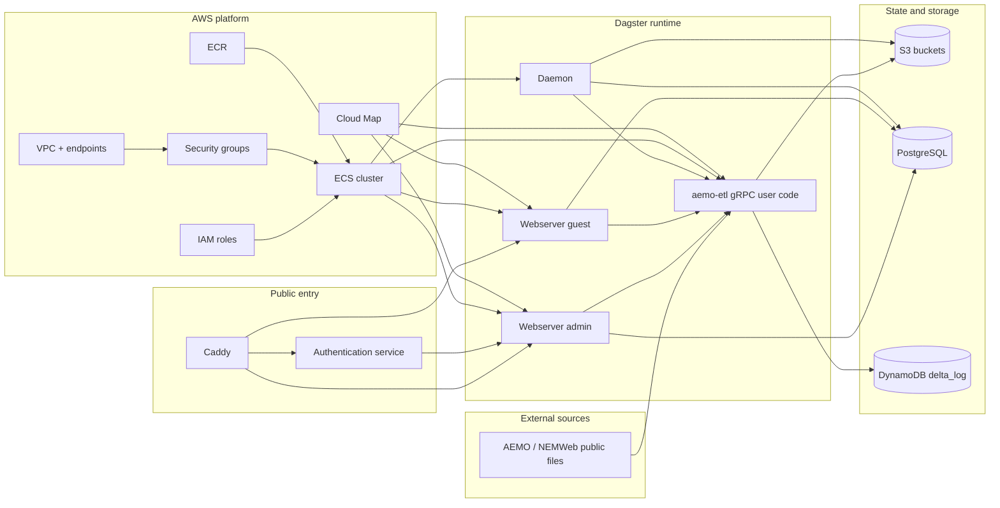
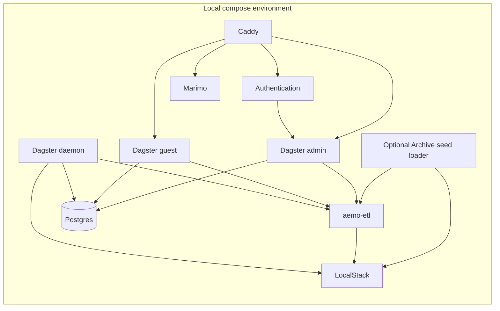

# Repository Architecture

This repository's main architecture is the AWS deployment provisioned from
`infrastructure/aws-pulumi`. The local compose stack exists to support
development and testing of that deployed platform.

## Table of contents

- [AWS deployed system](#aws-deployed-system)
- [Local test and development harness](#local-test-and-development-harness)
- [Repository responsibilities](#repository-responsibilities)
- [Related docs](#related-docs)

## AWS deployed system

## Local test and development harness

This local stack is intentionally broader than the deployed stack in some areas.
For example, `marimo` is part of local compose but is not provisioned by the
current Pulumi deployment. The optional Archive seed loader is also local-only:
it can require a cached seed under `backend-services/.e2e/aemo-etl` before
starting the `aemo-etl` code location for local **End-to-end test** setup.
`backend-services/scripts/aemo-etl-e2e run` uses that cache through an isolated
e2e stack with generated Dagster config, Postgres, LocalStack, AEMO ETL user
code, one webserver, and the daemon. Once the stack is ready, it keeps
local-only schedules and alerting stopped, drives the selected Dagster dataflow
through GraphQL, and monitors the full `gas_model` dataflow plus a direct
Dagster event-log storage read for final asset-check status. The
`full-gas-model` scenario enables only the intended Dagster sensors and
bootstraps non-sensor prerequisites; it defaults to host webserver port `3001`,
a 90 minute timeout, Dagster `max_concurrent_runs` `6`, 3 cached raw objects
per required source table, and 3 cached zip objects per required domain. Ralph
**Promotion** uses the `promotion-gas-model` scenario from the isolated source
worktree with a 20 minute timeout, Dagster `max_concurrent_runs` `6`, and a
1-object raw and zip seed horizon. That Promotion scenario launches one
explicit Dagster asset-run batch per dependency-wave chunk for every
materializable `gas_model` asset plus its materializable upstream closure, while
skipping live `bronze_nemweb_public_files_*` discovery/listing assets so it
starts from seeded LocalStack objects. This preserves the mandatory final target
and asset-check status without the full sensor-triggered run queue. Each
Promotion batch uses Dagster's in-process executor inside its Podman run-worker
container to reduce LocalStack and Delta Lake DynamoDB lock-table contention.
The generated stack uses fixed service IPs for Postgres, LocalStack, and the
AEMO ETL code server so run-worker containers do not depend on Podman DNS during
high-concurrency Promotion gates. Its run
manifest records gate timing, final dataflow telemetry, direct-launch scenario
evidence, cleanup duration, and non-benign cleanup evidence so Promotion review
can distinguish dataflow success from cleanup residue without changing the
dataflow gate decision. The direct-launch evidence records the scenario, launch
mode, target group, target asset count, selected upstream closure count, skipped
live source asset keys, dependency-wave count, run-batch count, and asset batch
size. The Promotion scenario enforces regression budgets from the approved
targeted baseline: total gate duration at or below 20 minutes, peak active and
queued runs at or below `6`, total Dagster runs at or below `48`, target
progress exactly `29/29`, and missing or failed target assets and asset checks
at `0`. Budget failures print the observed values, thresholds, and run manifest
path. The full scenario prints the same telemetry without making local
development performance claims.

## Repository responsibilities

- `infrastructure/aws-pulumi`
  - provisions the canonical AWS platform and deployed runtime
- `backend-services/dagster-user/aemo-etl`
  - defines Dagster assets, sensors, resources, and ETL-specific docs
- `backend-services/dagster-core`
  - provides the Dagster runtime image and environment-specific configuration
- `backend-services/authentication`
  - implements the OIDC/session bridge used in front of protected routes
- `backend-services/caddy`
  - provides the reverse-proxy image and routing rules
- `backend-services/marimo`
  - local notebook-oriented service used in the test/dev harness

## Related docs

- [Documentation sync workflow](documentation-sync.md)
- [Repository workflow](workflow.md)
- [AWS Pulumi infrastructure](../../infrastructure/aws-pulumi/README.md)
- [aemo-etl architecture](../../backend-services/dagster-user/aemo-etl/docs/architecture/high_level_architecture.md)

## Sync metadata

- `sync.owner`: `docs`
- `sync.sources`:
  - `docs/README.md`
  - `infrastructure/aws-pulumi/__main__.py`
  - `backend-services/compose.yaml`
  - `backend-services/scripts/aemo-etl-e2e`
  - `backend-services/dagster-user/aemo-etl/src/aemo_etl/maintenance/e2e_archive_seed.py`
  - `backend-services/dagster-user/aemo-etl/src/aemo_etl/cli/e2e_archive_seed.py`
  - `backend-services/caddy/Caddyfile`
- `sync.scope`: `architecture`
- `sync.qa`:
  - `git diff --name-only`
  - `rg -n "<changed-file-path>" OPERATOR.md README.md docs backend-services infrastructure`
  - `python3 -m unittest discover -s tests`
  - `verify links, diagrams, commands, paths, ports, env vars, and names`
