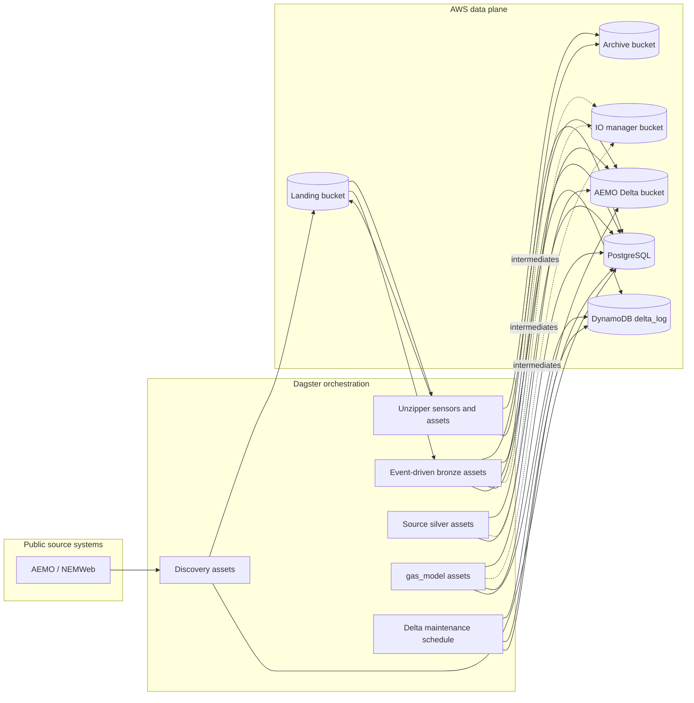
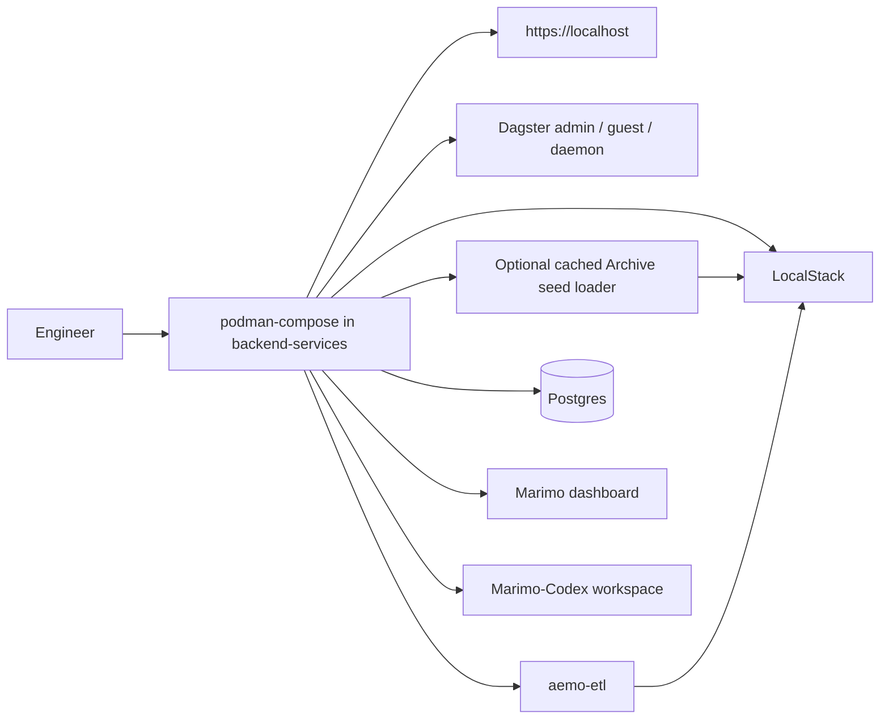

# Repository Workflow

This page maps the repository workflows and routes details to the owning pages.
The deployed AWS workflow is canonical; local compose exists for development,
testing, and validation of that platform.

## Table of contents

- [Production data and orchestration flow](#production-data-and-orchestration-flow)
- [Local development and testing workflow](#local-development-and-testing-workflow)
- [Operator and agent workflow](#operator-and-agent-workflow)
- [Where to work](#where-to-work)
- [Documentation maintenance](#documentation-maintenance)

## Production data and orchestration flow

Production orchestration behavior:

1. Discovery assets poll public source locations, including NEMWeb GBB, STTM,
   and VicGas report paths, and register landed files.
2. Unzipper sensors detect zip payloads, expand their members, and archive the
   original zip files after success.
3. Event-driven bronze assets ingest matching landed files into Delta tables,
   archive processed source files only after a table write, delete zero-byte
   landing objects, and warn on skipped selected keys.
4. Downstream silver and `gas_model` assets materialize through Dagster
   automation based on dependency updates. Manifest-backed STTM coverage uses
   the fit-plus-extend modeling policy in ADR
   [0006](../adr/0006-sttm-gas-model-uses-fit-plus-extend-modeling.md):
   matching STTM grains enrich existing `gas_model` assets, and distinct STTM
   grains become new `gas_model` facts.
5. `delta_table_vacuum_schedule` runs daily at 02:00 Australia/Melbourne and
   launches `delta_table_vacuum_job` to compact and vacuum Delta-backed assets.
6. Dagster metadata and orchestration state are stored in PostgreSQL.
7. Delta-table storage lives in S3, with `delta_log` in DynamoDB for locking.

Detailed ETL behavior lives in the
[AEMO ETL Subproject docs](../../backend-services/dagster-user/aemo-etl/README.md).
Detailed deployed platform behavior lives in the
[AWS Pulumi Subproject docs](../../infrastructure/aws-pulumi/README.md),
including the AWS code-location manifest that currently keeps `aemo-etl` as the
default deployed Dagster gRPC location.
The issue #126 EC2-backed run-worker path is an **Exploratory delivery**
prototype in that Subproject; the normal AWS workflow still uses the Fargate
runtime unless an Operator deliberately enables the prototype Pulumi config.

## Local development and testing workflow

Local workflow notes:

- `backend-services/compose.yaml` is a local harness, not the primary
  architecture.
- LocalStack stands in for AWS-managed storage services during local validation.
- Caddy remains the local front door so auth and routing behavior can be tested.
- `marimo-dashboard` is available locally for curated notebooks through Caddy,
  and the same curated dashboard image is deployed by Pulumi behind the AWS
  Caddy route. `marimo-codex-workspace` is a separate localhost-only research
  service for human-operated notebook exploration and issue-draft preparation;
  deployed Codex execution remains deferred pending security review.
- The isolated AEMO ETL **End-to-end test** stack belongs to the
  `backend-services/dagster-user/aemo-etl` Subproject and is operated through
  `backend-services/scripts/aemo-etl-e2e`; its run manifest records timing,
  dataflow telemetry, direct-launch scenario evidence, current-source
  `source_definitions`, and non-benign cleanup warning or failure evidence for
  local proof and Promotion review. The default
  `full-gas-model` scenario launches explicit dependency-wave asset batches for
  every materializable `gas_model` asset plus its materializable upstream closure
  with the shared 1-object seed horizon, then records expanded baseline
  observations, including source-definition-backed asset-check count, with
  `budget.status` set to `not-enforced`. Ralph **Promotion** runs pass
  `--rebuild`, an explicit `--seed-root` pointing at the primary repo cache, and
  select the `promotion-gas-model` scenario with `--timeout-seconds 1200` and
  `--max-concurrent-runs 6`. The scenario uses the same raw and zip seed horizon
  and validates the runtime
  GraphQL target count against that source count through the #141
  stale-runtime/current-source guard, and uses the same explicit Dagster
  asset-run batch shape while skipping live `bronze_nemweb_public_files_*`
  discovery/listing assets. Each batch runs
  in-process inside its Podman run-worker container, and the generated stack
  uses fixed service IPs for Postgres, LocalStack, and the AEMO ETL code server.
  This preserves the approved #77 coverage contract:
  every materializable `gas_model` asset, final asset-check status for that
  target, Dagster, LocalStack/S3, Podman run-worker containers, and the Dagster
  GraphQL monitor. Direct launches pace batch submission against
  `max_concurrent_runs` before starting more work in a dependency wave, keeping
  the queued-run budget bounded. For direct launches, the dataflow manifest
  records the scenario, launch mode, target group, target asset count,
  source-definition-backed target asset-check count when available, target keys,
  STTM target keys, selected upstream closure count, skipped live source asset
  keys, dependency-wave count, run-batch count, asset batch size, and
  source-definition evidence when available. The #75
  telemetry and #76 budget report expose the observed timing, run-shape,
  target-progress, asset-check, cleanup, and manifest-path fields. The Promotion
  scenario enforces #79 Promotion guard
  regression budgets from the approved #78 targeted baseline: 20 minute total
  duration, `6` peak active runs, `6` peak queued runs, total Dagster runs at
  or below the current direct-launch `dataflow.scenario_evidence.batch_count`,
  target progress matching the current
  `source_definitions.executable_asset_count`, and `0` missing or failed
  target assets and asset checks. Duration or run-count failures indicate run
  explosion, queue contention, unexpected extra Dagster runs beyond the launch
  plan, or local environment slowdown; target-count mismatches,
  target-progress, asset-check, or missing-telemetry failures mean Ralph cannot
  prove the source revision met the **Promotion** contract.
  Temporary Promotion source worktrees therefore do not look for ignored seed
  data under the ephemeral worktree.

Use [backend-services/README.md](../../backend-services/README.md) for local
stack commands and
[backend-services/dagster-user/aemo-etl/docs/development/local_development.md](../../backend-services/dagster-user/aemo-etl/docs/development/local_development.md)
for ETL local development.

## Operator and agent workflow

Human operators use [OPERATOR.md](../../OPERATOR.md) as the **Operator
workflow** entrypoint for shaping work, preparing GitHub Issues, draining Ralph,
reviewing `dev`, handling **Exploratory acceptance review**, running
**Promotion**, and using checkpointed Operator runs when Codex should launch
detached and inspect status only at issue boundaries.

Agents use [AGENTS.md](../../AGENTS.md) for imperative policy and
[docs/agents/README.md](../agents/README.md) for the agent workflow map.
Ralph internals live in [docs/agents/ralph-loop.md](../agents/ralph-loop.md),
including **Local integration**, **Delivery mode**, **Integration target**,
**Issue completion review**, **Ready issue refresh**, **Exploratory acceptance
review**, checkpointed Operator runs, **Promotion**, **Post-promotion review**,
**Post-Promotion deployment classification**, and deploy-repair issue creation
after failed checkpointed deployment evidence.

## Where to work

- Deployed architecture and operations:
  [infrastructure/aws-pulumi/README.md](../../infrastructure/aws-pulumi/README.md)
- Local service startup and local validation:
  [backend-services/README.md](../../backend-services/README.md)
- ETL definitions, dataset structure, and Dagster internals:
  [backend-services/dagster-user/aemo-etl/README.md](../../backend-services/dagster-user/aemo-etl/README.md)
- **Gas market knowledge base** command surface and corpus implementation:
  [tools/gas-market-knowledge-base](../../tools/gas-market-knowledge-base/README.md)
  owns the bronze source manifest command, archive PDF cache fetcher,
  Docling-based silver document extraction, generated-artifact roots, and
  raw-PDF ignore policy. ADR
  [0010](../adr/0010-gas-market-knowledge-base.md) records the corpus
  architecture for extraction, retrieval chunks, and cited **Market context**
  pages.
- Repo-level documentation architecture:
  [docs/README.md](../README.md)

## Documentation maintenance

For the **Documentation sync** contract, searchable `sync.sources` metadata,
and the required `git diff` to `rg` to QA flow, use
[documentation-sync.md](documentation-sync.md).

## Sync metadata

- `sync.owner`: `docs`
- `sync.sources`:
  - `CONTEXT.md`
  - `OPERATOR.md`
  - `AGENTS.md`
  - `docs/agents/README.md`
  - `docs/agents/ralph-loop.md`
  - `docs/repository/documentation-sync.md`
  - `backend-services/dagster-user/aemo-etl/src/aemo_etl/definitions.py`
  - `backend-services/dagster-user/aemo-etl/src/aemo_etl/factories/df_from_s3_keys/assets.py`
  - `backend-services/dagster-user/aemo-etl/src/aemo_etl/maintenance/delta_tables.py`
  - `backend-services/dagster-user/aemo-etl/src/aemo_etl/maintenance/e2e_archive_seed.py`
  - `backend-services/dagster-user/aemo-etl/src/aemo_etl/cli/e2e_archive_seed.py`
  - `backend-services/compose.yaml`
  - `backend-services/marimo/Dockerfile`
  - `backend-services/marimo/src/marimoserver/main.py`
  - `backend-services/marimo/src/marimoserver/table_explorer.py`
  - `backend-services/marimo/notebooks/table_explorer.py`
  - `backend-services/scripts/aemo-etl-e2e`
  - `infrastructure/aws-pulumi/__main__.py`
  - `infrastructure/aws-pulumi/components/marimo.py`
  - `backend-services/dagster-core/code-locations.aws.toml`
  - `infrastructure/aws-pulumi/code_locations.py`
  - `docs/adr/0006-sttm-gas-model-uses-fit-plus-extend-modeling.md`
  - `docs/adr/0010-gas-market-knowledge-base.md`
  - `tools/gas-market-knowledge-base/README.md`
- `sync.scope`: `behavior`
- `sync.qa`:
  - `git diff --name-only`
  - `rg -n "<changed-file-path>" OPERATOR.md README.md docs backend-services infrastructure tools`
  - `python3 -m unittest discover -s tests`
  - `verify links, diagrams, commands, paths, ports, env vars, and names`
