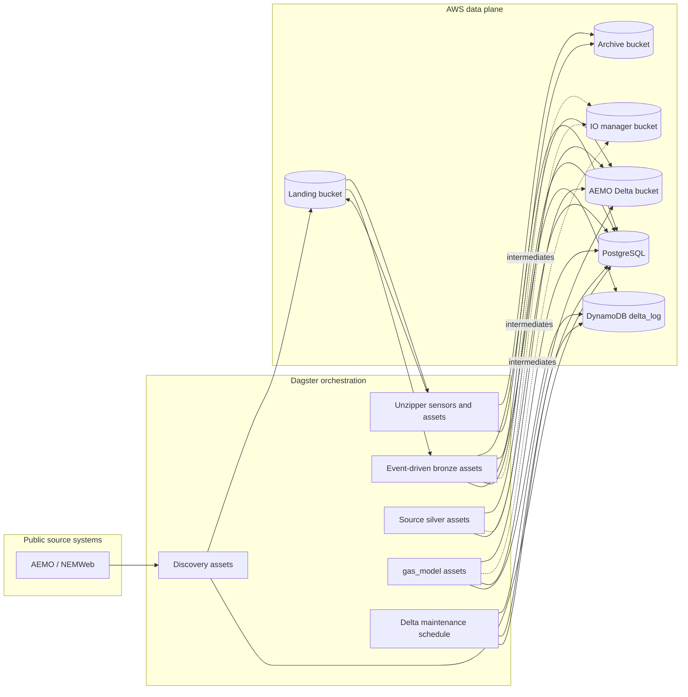
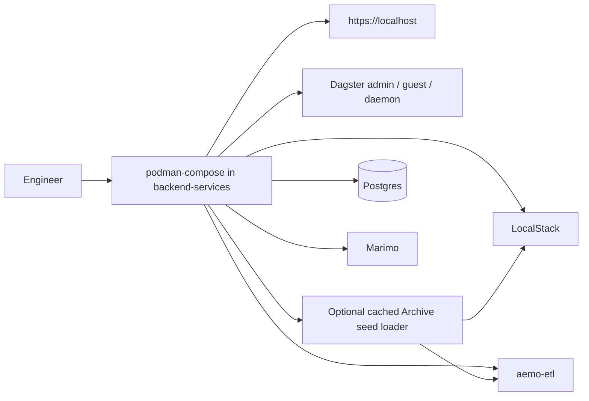

# Repository Workflow

This page maps the repository workflows and routes details to the owning pages.
The deployed AWS workflow is canonical; local compose exists for development,
testing, and validation of that platform.

## Table of contents

- [Production data and orchestration flow](#production-data-and-orchestration-flow)
- [Local development and testing workflow](#local-development-and-testing-workflow)
- [Operator and agent workflow](#operator-and-agent-workflow)
- [Where to work](#where-to-work)
- [Documentation maintenance](#documentation-maintenance)

## Production data and orchestration flow

Production orchestration behavior:

1. Discovery assets poll public source locations and register landed files.
2. Unzipper sensors detect zip payloads, expand their members, and archive the
   original zip files after success.
3. Event-driven bronze assets ingest matching landed files into Delta tables,
   archive processed source files only after a table write, delete zero-byte
   landing objects, and warn on skipped selected keys.
4. Downstream silver and `gas_model` assets materialize through Dagster
   automation based on dependency updates.
5. `delta_table_vacuum_schedule` runs daily at 02:00 Australia/Melbourne and
   launches `delta_table_vacuum_job` to compact and vacuum Delta-backed assets.
6. Dagster metadata and orchestration state are stored in PostgreSQL.
7. Delta-table storage lives in S3, with `delta_log` in DynamoDB for locking.

Detailed ETL behavior lives in the
[AEMO ETL Subproject docs](../../backend-services/dagster-user/aemo-etl/README.md).
Detailed deployed platform behavior lives in the
[AWS Pulumi Subproject docs](../../infrastructure/aws-pulumi/README.md).

## Local development and testing workflow

Local workflow notes:

- `backend-services/compose.yaml` is a local harness, not the primary
  architecture.
- LocalStack stands in for AWS-managed storage services during local validation.
- Caddy remains the local front door so auth and routing behavior can be tested.
- `marimo` is available locally for exploration, but it is not part of the
  Pulumi-deployed stack.
- The isolated AEMO ETL **End-to-end test** stack belongs to the
  `backend-services/dagster-user/aemo-etl` Subproject and is operated through
  `backend-services/scripts/aemo-etl-e2e`; its run manifest records timing and
  dataflow telemetry for Promotion review. Ralph **Promotion** runs pass an
  explicit `--seed-root` pointing at the primary repo cache so temporary
  Promotion source worktrees do not look for ignored seed data under the
  ephemeral worktree.

Use [backend-services/README.md](../../backend-services/README.md) for local
stack commands and
[backend-services/dagster-user/aemo-etl/docs/development/local_development.md](../../backend-services/dagster-user/aemo-etl/docs/development/local_development.md)
for ETL local development.

## Operator and agent workflow

Human operators use [OPERATOR.md](../../OPERATOR.md) as the **Operator
workflow** entrypoint for shaping work, preparing GitHub Issues, draining Ralph,
reviewing `dev`, and running **Promotion**.

Agents use [AGENTS.md](../../AGENTS.md) for imperative policy and
[docs/agents/README.md](../agents/README.md) for the agent workflow map.
Ralph internals live in [docs/agents/ralph-loop.md](../agents/ralph-loop.md),
including **Local integration**, **Delivery mode**, **Integration target**,
**Ready issue refresh**, **Promotion**, and **Post-promotion review** behavior.

## Where to work

- Deployed architecture and operations:
  [infrastructure/aws-pulumi/README.md](../../infrastructure/aws-pulumi/README.md)
- Local service startup and local validation:
  [backend-services/README.md](../../backend-services/README.md)
- ETL definitions, dataset structure, and Dagster internals:
  [backend-services/dagster-user/aemo-etl/README.md](../../backend-services/dagster-user/aemo-etl/README.md)
- Repo-level documentation architecture:
  [docs/README.md](../README.md)

## Documentation maintenance

For the doc-sync contract, searchable `sync.sources` metadata, and the required
`git diff` to `rg` to QA flow, use
[documentation-sync.md](documentation-sync.md).

## Sync metadata

- `sync.owner`: `docs`
- `sync.sources`:
  - `CONTEXT.md`
  - `OPERATOR.md`
  - `AGENTS.md`
  - `docs/agents/README.md`
  - `docs/agents/ralph-loop.md`
  - `docs/repository/documentation-sync.md`
  - `backend-services/dagster-user/aemo-etl/src/aemo_etl/definitions.py`
  - `backend-services/dagster-user/aemo-etl/src/aemo_etl/factories/df_from_s3_keys/assets.py`
  - `backend-services/dagster-user/aemo-etl/src/aemo_etl/maintenance/delta_tables.py`
  - `backend-services/dagster-user/aemo-etl/src/aemo_etl/maintenance/e2e_archive_seed.py`
  - `backend-services/dagster-user/aemo-etl/src/aemo_etl/cli/e2e_archive_seed.py`
  - `backend-services/compose.yaml`
  - `backend-services/scripts/aemo-etl-e2e`
  - `infrastructure/aws-pulumi/__main__.py`
- `sync.scope`: `behavior`
- `sync.qa`:
  - `git diff --name-only`
  - `rg -n "<changed-file-path>" OPERATOR.md README.md docs backend-services infrastructure`
  - `python3 -m unittest discover -s tests`
  - `verify links, diagrams, commands, paths, ports, env vars, and names`
