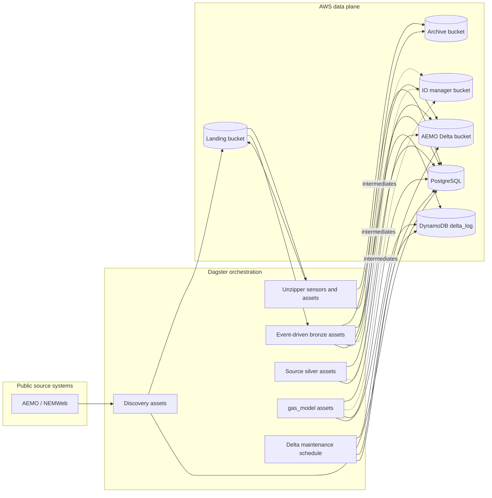
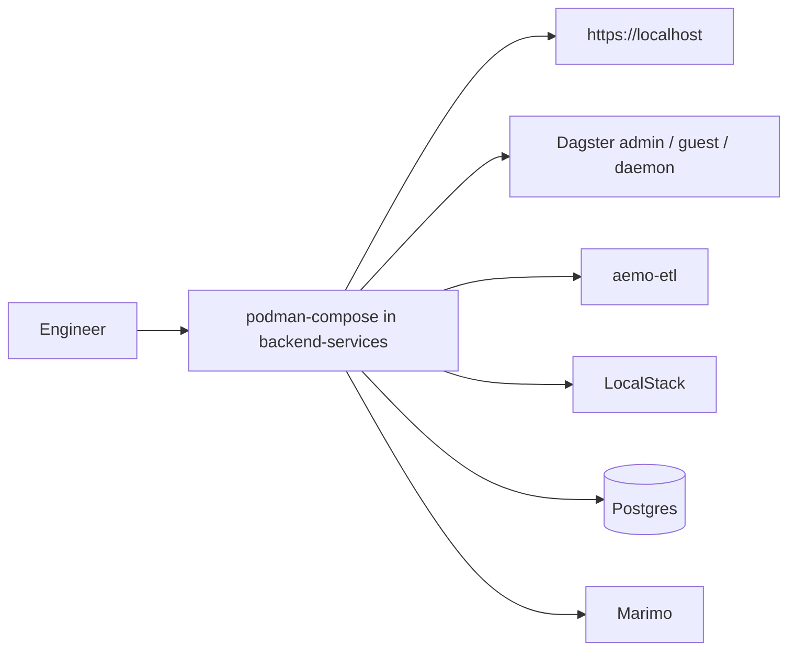

# Repository Workflow

This page summarizes the production workflow and the local development/testing
workflow. The production workflow is the canonical one.

## Table of contents

- [Production data and orchestration flow](#production-data-and-orchestration-flow)
- [Local development and testing workflow](#local-development-and-testing-workflow)
- [Where to work](#where-to-work)
- [Documentation maintenance](#documentation-maintenance)

## Production data and orchestration flow

Production orchestration behavior:

1. Discovery assets poll public source locations and register landed files.
2. Unzipper sensors detect zip payloads, expand their members, and archive the original zip files after success.
3. Event-driven bronze assets ingest matching landed files into Delta tables and archive processed source files.
4. Downstream silver and `gas_model` assets materialize through Dagster automation based on dependency updates.
5. `delta_table_vacuum_schedule` runs daily at 02:00 Australia/Melbourne and launches `delta_table_vacuum_job` to compact and vacuum Delta-backed assets using per-asset metadata defaults or overrides.
6. Dagster metadata and orchestration state are stored in PostgreSQL.
7. Delta-table storage lives in S3, with `delta_log` in DynamoDB for locking.

## Local development and testing workflow

Local workflow notes:

- `backend-services/compose.yaml` is a local harness, not the primary architecture.
- LocalStack stands in for AWS-managed storage services during local validation.
- Caddy is still the local front door so auth and routing behavior can be tested.
- `marimo` is available locally for exploration, but it is not part of the Pulumi-deployed stack.

## Where to work

- For deployed architecture and operations:
  - [infrastructure/aws-pulumi/README.md](../infrastructure/aws-pulumi/README.md)
- For local service startup and local validation:
  - [backend-services/README.md](../backend-services/README.md)
- For ETL definitions, dataset structure, and Dagster internals:
  - [backend-services/dagster-user/aemo-etl/README.md](../backend-services/dagster-user/aemo-etl/README.md)
  - [aemo-etl architecture docs](../backend-services/dagster-user/aemo-etl/docs/architecture/high_level_architecture.md)
  - [aemo-etl ingestion flows](../backend-services/dagster-user/aemo-etl/docs/architecture/ingestion_flows.md)

## Documentation maintenance

For the doc-sync contract, searchable `sync.sources` metadata, and the required
`git diff` to `rg` to QA flow, use
[documentation-sync.md](documentation-sync.md).

## Sync metadata

- `sync.owner`: `docs`
- `sync.sources`:
  - `backend-services/dagster-user/aemo-etl/src/aemo_etl/definitions.py`
  - `backend-services/dagster-user/aemo-etl/src/aemo_etl/maintenance/delta_tables.py`
  - `backend-services/compose.yaml`
- `sync.scope`: `behavior`
- `sync.qa`:
  - `git diff --name-only`
  - `rg -n "<changed-file-path>" README.md docs backend-services infrastructure`
  - `verify links, diagrams, commands, paths, ports, env vars, and names`
