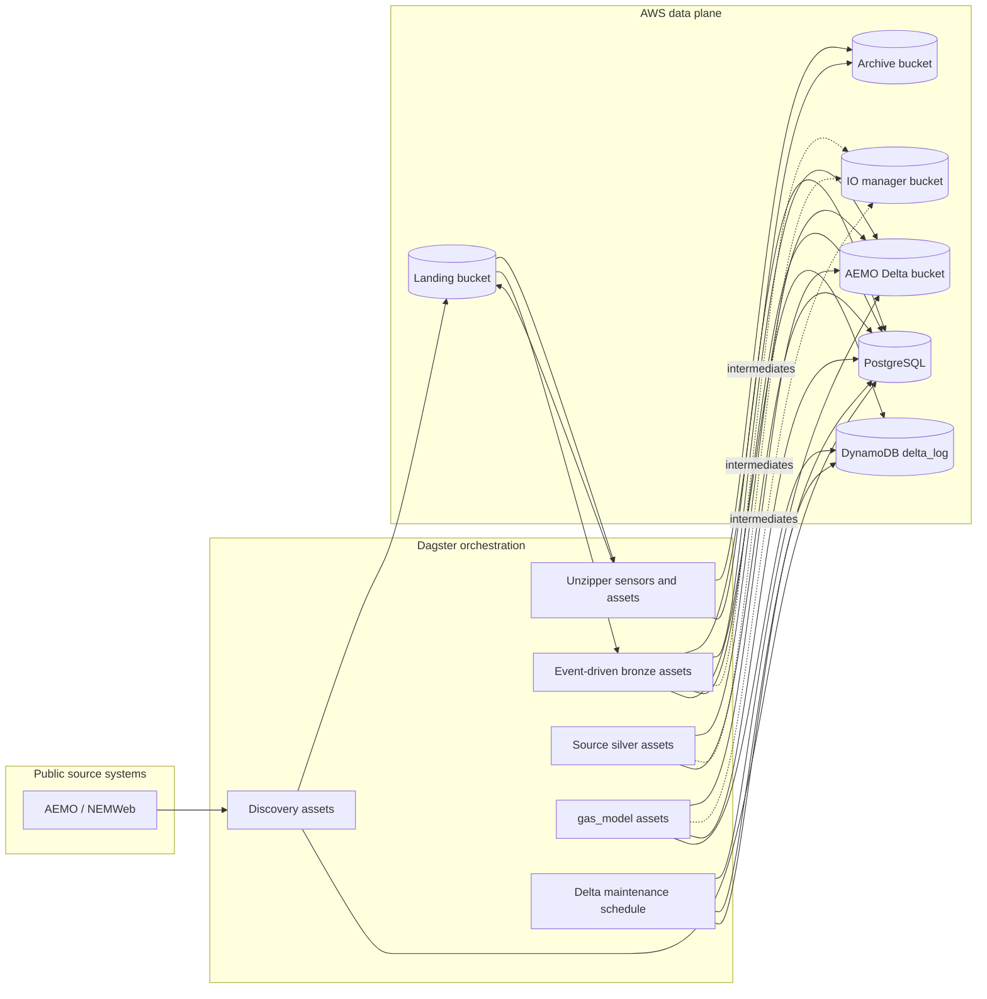
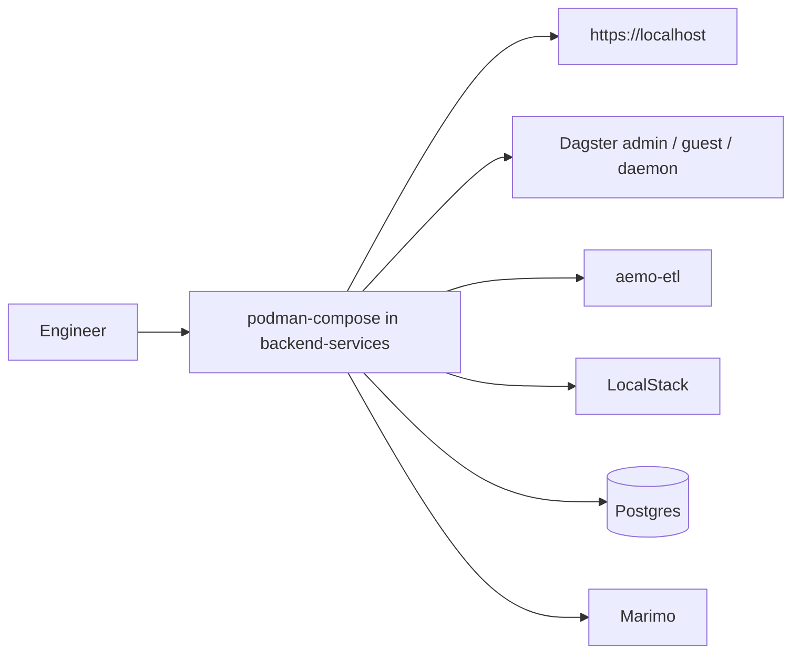

# Repository Workflow

This page summarizes the production workflow and the local development/testing
workflow. The production workflow is the canonical one.

## Table of contents

- [Production data and orchestration flow](#production-data-and-orchestration-flow)
- [Local development and testing workflow](#local-development-and-testing-workflow)
- [Human agent workflow](#human-agent-workflow)
- [Agent issue loop](#agent-issue-loop)
- [Where to work](#where-to-work)
- [Documentation maintenance](#documentation-maintenance)

## Production data and orchestration flow



Production orchestration behavior:

1. Discovery assets poll public source locations and register landed files.
2. Unzipper sensors detect zip payloads, expand their members, and archive the original zip files after success.
3. Event-driven bronze assets ingest matching landed files into Delta tables, archive processed source files only after a table write, delete zero-byte landing objects, and warn on skipped selected keys.
4. Downstream silver and `gas_model` assets materialize through Dagster automation based on dependency updates.
5. `delta_table_vacuum_schedule` runs daily at 02:00 Australia/Melbourne and launches `delta_table_vacuum_job` to compact and vacuum Delta-backed assets using per-asset metadata defaults or overrides.
6. Dagster metadata and orchestration state are stored in PostgreSQL.
7. Delta-table storage lives in S3, with `delta_log` in DynamoDB for locking.

## Local development and testing workflow



Local workflow notes:

- `backend-services/compose.yaml` is a local harness, not the primary architecture.
- LocalStack stands in for AWS-managed storage services during local validation.
- Caddy is still the local front door so auth and routing behavior can be tested.
- `marimo` is available locally for exploration, but it is not part of the Pulumi-deployed stack.

## Human agent workflow

For feature work that should flow through Ralph, call the workflow skills at a
high level:

```text
$grill-with-docs <feature idea> -> $to-prd -> $to-issues -> $ralph-triage -> $ralph-loop drain
```

Use `$grill-with-docs` to sharpen the feature against `CONTEXT.md` and ADRs,
`$to-prd` to publish the PRD, `$to-issues` to create tracer-bullet GitHub
Issues, `$ralph-triage` to set category, state, and **Delivery mode** labels,
and `$ralph-loop drain` to run the implementation loop. The skill calls are the
human-facing interface; the underlying commands stay inside the skills.

## Agent issue loop

The repo-local Ralph loop in
[agent-issue-loop.md](agent-issue-loop.md) drains GitHub Issues through Codex
implementation, deterministic local QA, **Local integration**, **Promotion**,
and post-loop issue triage. Use `$ralph-triage` as the gate before
`$ralph-loop drain`; a plain drain has a default budget of 10 implementation
attempts, while `--max-issues 0` is explicit unlimited drain mode. Ralph uses
the default triage labels documented under
[docs/agents/triage-labels.md](agents/triage-labels.md) plus Ralph
**Delivery mode** labels. **Gitflow delivery** keeps `dev` synced with `main`,
integrates to `dev` for review, and then promotes to `main`; **Trunk delivery**
is an opt-in path for small low-risk changes that can close after integration
to `main`. Live implementation and **Promotion** runs require a clean root
worktree unless the operator passes `--allow-dirty-worktree`; `--dry-run`
remains available on a dirty root worktree. During AFK drains, Ralph prints
heartbeat lines with the active phase and log path, and command logs under
`.ralph/runs/...` update while Codex and QA commands are still running.
Implementation and **Promotion** runs also keep
`.ralph/runs/.../ralph-run.json` updated with **Delivery mode**, **Integration
target**, QA, push, commit, and GitHub metadata state for recovery. Use
`python3 scripts/ralph.py --inspect-run <run_dir>` for a read-only manifest
summary. Use `python3 scripts/ralph.py --recover-run <run_dir>` only after the
recorded **Local integration** commit is verified reachable from the expected
**Integration target**.
Spawned Codex subprocesses receive **Sandboxed issue access** by default for
authenticated `gh issue` reads and writes. Ralph resolves the token from the
parent environment or local `gh auth`, injects it as `GH_TOKEN`, and wraps `gh`
so the sandbox cannot use broader GitHub commands; Git push auth stays in
Ralph's outer loop.

## Where to work

- For deployed architecture and operations:
  - [infrastructure/aws-pulumi/README.md](../infrastructure/aws-pulumi/README.md)
- For local service startup and local validation:
  - [backend-services/README.md](../backend-services/README.md)
- For ETL definitions, dataset structure, and Dagster internals:
  - [backend-services/dagster-user/aemo-etl/README.md](../backend-services/dagster-user/aemo-etl/README.md)
  - [aemo-etl architecture docs](../backend-services/dagster-user/aemo-etl/docs/architecture/high_level_architecture.md)
  - [aemo-etl ingestion flows](../backend-services/dagster-user/aemo-etl/docs/architecture/ingestion_flows.md)

## Documentation maintenance

For the doc-sync contract, searchable `sync.sources` metadata, and the required
`git diff` to `rg` to QA flow, use
[documentation-sync.md](documentation-sync.md).

## Sync metadata

- `sync.owner`: `docs`
- `sync.sources`:
  - `backend-services/dagster-user/aemo-etl/src/aemo_etl/definitions.py`
  - `backend-services/dagster-user/aemo-etl/src/aemo_etl/factories/df_from_s3_keys/assets.py`
  - `backend-services/dagster-user/aemo-etl/src/aemo_etl/maintenance/delta_tables.py`
  - `backend-services/compose.yaml`
  - `.agents/skills/ralph-loop/SKILL.md`
  - `.agents/skills/ralph-triage/SKILL.md`
  - `scripts/ralph.py`
- `sync.scope`: `behavior`
- `sync.qa`:
  - `git diff --name-only`
  - `rg -n "<changed-file-path>" README.md docs backend-services infrastructure`
  - `verify links, diagrams, commands, paths, ports, env vars, and names`
