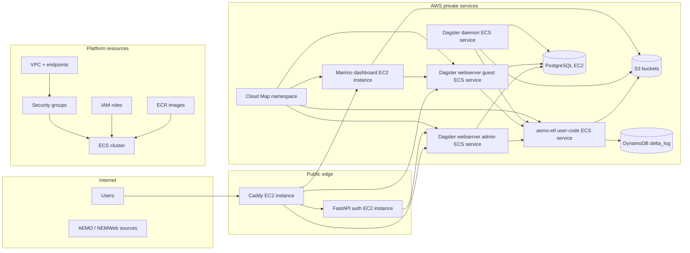

# AWS Pulumi Infrastructure

Pulumi program for the deployed AWS energy-market platform.

This directory is the source of truth for the main runtime architecture. It
provisions the network, storage, container images, compute platform, and public
entrypoint used by the Dagster-based deployment.

## Table of contents

- [What this stack provisions](#what-this-stack-provisions)
- [Architecture summary](#architecture-summary)
- [Component order](#component-order)
- [Component docs](#component-docs)
- [Security posture](#security-posture)
- [Container images and service source](#container-images-and-service-source)
- [Runtime behavior](#runtime-behavior)
- [Configuration](#configuration)
- [Failed-run alert topic setup](#failed-run-alert-topic-setup)
- [Common commands](#common-commands)
- [Relationship to local development](#relationship-to-local-development)
- [Related docs](#related-docs)

## What this stack provisions

From `__main__.py`, the stack builds these layers:

- networking: VPC, public/private subnets, route tables, and VPC endpoints
- security: security groups and IAM roles for EC2 and ECS tasks
- data services: S3 buckets, DynamoDB `delta_log`, PostgreSQL, and a bastion host
- container platform: ECR repositories and image builds, ECS cluster, Cloud Map
- public services: Caddy reverse proxy and FastAPI authentication service
- analytics service: private Marimo dashboard EC2 instance
- Dagster services:
  - `aemo-etl` user-code gRPC service
  - Dagster webserver admin
  - Dagster webserver guest
  - Dagster daemon

## Architecture summary



## Component order

The dependency order in `__main__.py` is deliberate:

1. `VpcComponentResource`
1. `VpcEndpointsComponentResource`
1. `SecurityGroupsComponentResource`
1. `IamRolesComponentResource`
1. `S3BucketsComponentResource`
1. `DeltaLockingTableComponentResource`
1. `ECRComponentResource`
1. `ServiceDiscoveryComponentResource`
1. `PostgresComponentResource`
1. `BastionHostComponentResource`
1. `EcsClusterComponentResource`
1. `FastAPIAuthComponentResource`
1. `MarimoDashboardComponentResource`
1. `CaddyServerComponentResource`
1. `DagsterUserCodeServiceComponentResource`
1. `DagsterWebserverServiceComponentResource` for admin
1. `DagsterWebserverServiceComponentResource` for guest
1. `DagsterDaemonServiceComponentResource`

In practical terms:

- the network and access controls are created first
- shared storage and image registry come next
- compute and service discovery follow
- public-facing and Dagster runtime services are created last

## Component docs

Detailed subsystem docs live under [docs/](docs/README.md):

- [VPC architecture](docs/vpc.md)
- [Connectivity](docs/connectivity.md)
- [Identity and discovery](docs/identity-and-discovery.md)
- [Storage](docs/storage.md)
- [Runtime](docs/runtime.md)
- [Edge and access](docs/edge-and-access.md)
- [Security audit](docs/security-audit.md)

## Security posture

The dev stack now treats the Pulumi code and deployed AWS resources as the
security boundary to audit. Current controls include:

- administrator SSH ingress is limited to validated IPv4 `/32` CIDRs from
  `ADMINISTRATOR_IPS`
- EC2 hosts require IMDSv2 and encrypted root volumes
- the Marimo dashboard instance has no public IP, no SSH key, and is operated
  through SSM Session Manager
- Cognito secrets and non-dev Postgres passwords are stored in SSM
  SecureString parameters and fetched at boot/task start instead of being
  embedded directly in EC2 user data or ECS plain environment variables
- `dev-energy-market` may opt into an SSM `String` parameter for the Postgres
  password with `aws-pulumi:allow_dev_string_postgres_password_parameter=true`;
  this weakens at-rest protection for the dev password only, and
  non-dev resource names are rejected if the flag is enabled
- ECS task execution roles can read only the required Postgres password
  parameter, and task roles scope `iam:PassRole` to the Dagster run-worker
  roles
- ECR repositories keep digest-pinned runtime deploys, including EC2 service
  bootstraps, and enable scan-on-push
- the Marimo dashboard instance role can read only the curated AEMO and
  IO-manager buckets and cannot write S3 objects

The latest audit record is [docs/security-audit.md](docs/security-audit.md).

## Container images and service source

`components/ecr.py` builds and pushes the deployed images directly from the
repository:

- `backend-services/dagster-core` for Dagster webserver and daemon
- `backend-services/dagster-user/aemo-etl` for the default gRPC user-code
  service declared in `backend-services/dagster-core/code-locations.aws.toml`
- `backend-services/authentication` for the auth service
- `backend-services/caddy` for the public reverse proxy and Astro portfolio
- `backend-services/marimo` for the curated Marimo dashboard image

The Pulumi deployment uses the AWS-targeted Dagster configuration by building
`dagster-core` with `DAGSTER_DEPLOYMENT=aws` by default. Both AWS-targeted
Dagster core Docker stages, `aws` and `aws-ec2-run-workers-prototype`, render
`workspace.aws.yaml` from the code-location manifest before `workspace.yaml` is
copied into place. The issue #126 **Exploratory delivery** prototype can set
`dagster_core_deployment` to
`aws-ec2-run-workers-prototype` so only the webserver and daemon images switch
to the EC2 run-worker `EcsRunLauncher` config. Pulumi rejects that image target
unless `enable_ec2_run_worker_capacity_prototype=true` is set in the same
preview or deployment.

## Runtime behavior

Key deployed behaviors visible in the infrastructure code:

- Caddy runs on a public EC2 instance, serves the Astro portfolio at the root
  URL, and proxies to:
  - `webserver-admin.dagster:3000`
  - `webserver-guest.dagster:3000`
  - `marimo-dashboard.dagster:2718`
  - the FastAPI auth service
- Dagster services run as ECS Fargate services in private subnets
- the curated Marimo dashboard runs on a private `t3.small` EC2 instance with
  an encrypted 30 GiB `gp3` root volume, uses its instance profile for S3
  reads, exposes `/marimo/health` and Marimo packaged asset routes through
  Caddy, serves the registry-backed `/marimo` concept gallery, returns
  immutable cache headers for content-hashed `/marimo/<notebook>/assets/*`
  responses, exposes the data readiness overview for platform operations and
  the registry-only glossary explorer for Market context metadata browsing,
  links table explorer rows to readiness, bounded-read diagnostics, and
  concept-gallery metadata for mapped `silver.gas_model` assets, exposes
  materialization freshness gaps from Dagster GraphQL metadata without table
  content scans,
  exposes the gas system notices, Flow operations, settlement activity,
  customer transfer and retail activity, Bid / Offer stack, and Hub / Zone
  explainer dashboards over curated gas-model facts and dimensions, exposes
  the forecast-vs-actual dashboard over bounded forecast and actual
  flow/storage facts, runs with
  `MARIMO_OUTPUT_MAX_BYTES=16000000`,
  `MARIMO_MAX_PREVIEW_ROWS=100`, and
  `MARIMO_FULL_TABLE_SCAN_ENABLED=false`, and loads bounded table previews
  instead of full table scans, with explicit
  refresh, session cache keys, load timing, and row-limit messages for shared
  gas-model dashboard reads
- An issue #126 **Exploratory delivery** path can add EC2-backed run-worker
  capacity behind explicit Pulumi config, but the default runtime remains
  Fargate/Fargate Spot
- Cloud Map provides private DNS names under the `dagster` namespace, with
  user-code names resolved from the manifest
- PostgreSQL is used for Dagster run, schedule, and event-log storage
- S3 holds landing, archive, Delta-table, and IO-manager data
- DynamoDB `delta_log` supports Delta locking

## Configuration

This project reads a small set of important config values:

- `ENVIRONMENT`
  - defaults to `dev`
  - contributes to the shared resource prefix
- `ADMINISTRATOR_IPS`
  - used outside local mode for admin-access configuration
  - accepts individual IPv4 addresses or `/32` CIDRs only
- `aws:region`
  - stack region, shown in `Pulumi.dev-ausenergymarket.yaml` as `ap-southeast-2`
- Pulumi secrets for Cognito/auth and public site configuration:
  - `aws-pulumi:cognito_client_id`
  - `aws-pulumi:cognito_server_metadata_url`
  - `aws-pulumi:cognito_token_signing_key_url`
  - `aws-pulumi:cognito_client_secret`
  - `aws-pulumi:website_root_url`
  - `aws-pulumi:developer_email`

  The Cognito app client referenced by those secrets is managed outside this
  Pulumi stack. Its allowed callback URLs must include
  `<website_root_url>/oauth2/dagster-webserver/admin/authorize` and
  `<website_root_url>/oauth2/marimo/authorize`; keep the `https://localhost`
  equivalents when local browser auth testing is required.
- Optional Pulumi secret for Dagster failed-run alerts:
  - `aws-pulumi:dagster_failure_alert_topic_arn`
- Dev-only Postgres password SSM parameter exception:
  - `aws-pulumi:allow_dev_string_postgres_password_parameter`
    - defaults to `false`
    - set to `true` only in `Pulumi.dev-ausenergymarket.yaml` for
      `dev-energy-market`
    - stores `/{resource_name}/dagster/postgres/password` as SSM `String`
      instead of `SecureString`, trading weaker at-rest protection for the dev
      deployment only
    - Pulumi rejects the flag for any Postgres component name other than
      `dev-energy-market`
    - ECS task definitions still receive `DAGSTER_POSTGRES_PASSWORD` through
      ECS `secrets`, not plain container environment variables
- Optional issue #126 EC2 run-worker prototype config:
  - `aws-pulumi:dagster_core_deployment`
    - defaults to `aws`
    - set to `aws-ec2-run-workers-prototype` only for the Exploratory
      run-worker EC2 image variant
  - `aws-pulumi:enable_ec2_run_worker_capacity_prototype`
    - defaults to `false`
    - set to `true` only when previewing or deploying the matching EC2-backed
      ECS capacity provider
- The two prototype values are a strict pair:
  - the EC2 run-worker image target without the EC2 capacity prototype fails
    before Pulumi constructs resources
  - the EC2 capacity prototype without the EC2 run-worker image target also
    fails, so unused capacity-provider previews are rejected
  - the current prototype is dev-only because the baked Dagster config targets
    `dev-energy-market-run-worker-ec2`; any other `ENVIRONMENT`-derived stack
    prefix fails until the provider name is made dynamic

The stack name prefix resolves to `"{ENVIRONMENT}-energy-market"`.

## Failed-run alert topic setup

The stack does not create or manage the alert topic. Create a Standard Amazon
SNS topic manually, subscribe the people or distribution endpoints that should
receive alerts, then pass the topic ARN into Pulumi.

Manual setup:

1. In the Amazon SNS console, choose a Region that supports SMS messaging, then
   create a Standard topic such as `dagster-failed-run-alerts`.
1. Create subscriptions on that topic:
   - use protocol `sms` with E.164 phone numbers for text alerts
   - use protocol `email` for email recipients or email distribution lists
1. Confirm email subscriptions before expecting delivery.
1. For SMS recipients, verify destination numbers while the account is in the
   AWS End User Messaging SMS sandbox, or request production access before using
   unverified production recipients.
1. Configure an SMS origination identity where the target country or AWS account
   setup requires one.
1. Store the topic ARN for this stack:

```bash
pulumi config set --secret dagster_failure_alert_topic_arn <topic-arn>
```

Then run `pulumi preview` and `pulumi up`. Pulumi injects the topic ARN into
the AEMO ETL user-code task and grants that task role `sns:Publish` on that
topic.

AWS references:

- [Publishing SMS messages with Amazon SNS](https://docs.aws.amazon.com/sns/latest/dg/sms_sending-overview.html)
- [SNS Publish API](https://docs.aws.amazon.com/sns/latest/api/API_Publish.html)
- [SMS/MMS sandbox](https://docs.aws.amazon.com/sms-voice/latest/userguide/sandbox.html)
- [SNS SMS origination identities](https://docs.aws.amazon.com/sns/latest/dg/channels-sms-originating-identities.html)

## Common commands

Run the AWS Pulumi **Commit check** hook set from this **Subproject** directory:

```bash
prek run -a
```

The shell formatting and linting hooks run through this **Subproject**'s uv dev
environment, so `shfmt` and `shellcheck` are provided by `pyproject.toml` and
`uv.lock` rather than the caller's `PATH`.

Ruff enforces Google-style docstrings for production component APIs and the
default `C901` complexity threshold across this **Subproject**; unit, component,
and deployed tests are outside that first docstring ratchet.

Preview infrastructure changes:

```bash
pulumi preview
```

Apply infrastructure changes:

```bash
pulumi up
```

Run the full deployed-test workflow against the default stack. The script runs
local Pulumi **Unit test** and **Component test** validation plus the
**Commit check** before applying the stack. After `pulumi up`, it waits for
the required ECS services to stabilize and for each primary deployment rollout
to reach `COMPLETED` before starting the Deployed tests:

```bash
AWS_DEFAULT_REGION=ap-southeast-2 scripts/run-integration-tests --with-idempotency
```

The rollout-completion poll is bounded by `ECS_ROLLOUT_TIMEOUT_SECONDS`
(default `900`) and `ECS_ROLLOUT_POLL_SECONDS` (default `15`). Timeout or
failed-rollout diagnostics print each required service name, primary rollout
state, and sanitized failed deployment state without task environment or secret
values.

Run deployed tests without applying infrastructure first:

```bash
AWS_DEFAULT_REGION=ap-southeast-2 scripts/run-integration-tests --skip-up
```

Run the deployed suite directly:

```bash
PULUMI_INTEGRATION_TESTS=1 PULUMI_STACK=dev-ausenergymarket uv run pytest tests/deployed -v
```

During AFK issue implementation, update component and deployed-test
expectations when the infrastructure contract changes, but do not run
`pulumi up`, AWS CLI live checks, deployed tests, or
`scripts/run-integration-tests`. Live deployed validation belongs to the
checkpointed **Operator workflow** after **Promotion**.

## Relationship to local development

The local compose setup under `backend-services/` is not the canonical
architecture. It exists to support development and testing of the deployed
system's services and Dagster workflows.

- Use this directory when you are provisioning or validating AWS resources.
- Use `backend-services/` when you need a local test/dev harness.
- Use `backend-services/dagster-user/aemo-etl/` for ETL definitions and
  Dagster-specific data pipeline docs.

## Related docs

- [Repository overview](../../README.md)
- [Repository architecture](../../docs/repository/architecture.md)
- [Repository workflow](../../docs/repository/workflow.md)
- [AWS Pulumi component docs](docs/README.md)
- [VPC architecture notes](docs/vpc.md)
- [Local backend-services stack](../../backend-services/README.md)

## Sync metadata

- `sync.owner`: `docs`
- `sync.sources`:
  - `infrastructure/aws-pulumi/__main__.py`
  - `infrastructure/aws-pulumi/dagster_core_deployment.py`
  - `backend-services/dagster-core/code-locations.aws.toml`
  - `backend-services/dagster-core/Dockerfile`
  - `backend-services/dagster-core/render_aws_workspace.py`
  - `backend-services/caddy/Dockerfile`
  - `backend-services/caddy/package.json`
  - `backend-services/caddy/src/pages/index.astro`
  - `backend-services/caddy/public/theme.css`
  - `infrastructure/aws-pulumi/configs.py`
  - `infrastructure/aws-pulumi/code_locations.py`
  - `infrastructure/aws-pulumi/components/bastion_host.py`
  - `infrastructure/aws-pulumi/components/caddy.py`
  - `infrastructure/aws-pulumi/components/ecr.py`
  - `infrastructure/aws-pulumi/components/ecs_cluster.py`
  - `infrastructure/aws-pulumi/components/ecs_services.py`
  - `infrastructure/aws-pulumi/components/fastapi_auth.py`
  - `infrastructure/aws-pulumi/components/iam_roles.py`
  - `infrastructure/aws-pulumi/components/marimo.py`
  - `infrastructure/aws-pulumi/components/postgres.py`
  - `infrastructure/aws-pulumi/components/s3_buckets.py`
  - `infrastructure/aws-pulumi/components/security_groups.py`
  - `infrastructure/aws-pulumi/components/service_discovery.py`
  - `infrastructure/aws-pulumi/components/vpc.py`
  - `backend-services/marimo/Dockerfile`
  - `backend-services/marimo/src/marimoserver/main.py`
  - `backend-services/marimo/src/marimoserver/gas_dashboard.py`
  - `backend-services/marimo/src/marimoserver/gas_model_loader.py`
  - `backend-services/marimo/src/marimoserver/table_explorer.py`
  - `backend-services/marimo/src/marimoserver/data_readiness.py`
  - `backend-services/marimo/src/marimoserver/glossary_explorer.py`
  - `backend-services/marimo/src/marimoserver/citation_chain_explorer.py`
  - `backend-services/marimo/notebooks/sample_energy_market.py`
  - `backend-services/marimo/notebooks/table_explorer.py`
  - `backend-services/marimo/notebooks/source_coverage_matrix.py`
  - `backend-services/marimo/notebooks/gas_day_explainer.py`
  - `backend-services/marimo/notebooks/data_readiness_overview.py`
  - `backend-services/marimo/notebooks/dagster_asset_catalogue_status.py`
  - `backend-services/marimo/notebooks/materialization_freshness.py`
  - `backend-services/marimo/notebooks/s3_bucket_health.py`
  - `backend-services/marimo/notebooks/glossary_explorer.py`
  - `backend-services/marimo/notebooks/citation_chain_explorer.py`
  - `backend-services/marimo/notebooks/system_notices.py`
  - `backend-services/marimo/notebooks/gas_market_prices.py`
  - `backend-services/marimo/notebooks/gas_schedule_runs.py`
  - `backend-services/marimo/notebooks/facility_explainer.py`
  - `backend-services/marimo/notebooks/participant_explainer.py`
  - `backend-services/marimo/notebooks/hub_zone_explainer.py`
  - `backend-services/marimo/notebooks/connection_point_explainer.py`
  - `backend-services/marimo/notebooks/flow_operations.py`
  - `backend-services/marimo/notebooks/pipeline_connection_operations.py`
  - `backend-services/marimo/notebooks/gas_settlement_activity.py`
  - `backend-services/marimo/notebooks/gas_customer_transfer_activity.py`
  - `backend-services/marimo/notebooks/facility_flow_storage.py`
  - `backend-services/marimo/notebooks/forecast_vs_actual.py`
  - `backend-services/marimo/notebooks/capacity_outlook.py`
  - `backend-services/marimo/notebooks/linepack_adequacy.py`
  - `backend-services/marimo/notebooks/nomination_demand_forecast.py`
  - `backend-services/marimo/notebooks/gas_bid_offer_stack.py`
  - `backend-services/marimo/notebooks/gas_quality_composition.py`
  - `backend-services/caddy/Caddyfile`
  - `infrastructure/aws-pulumi/.pre-commit-config.yaml`
  - `infrastructure/aws-pulumi/pyproject.toml`
  - `infrastructure/aws-pulumi/ecs_rollouts.py`
  - `infrastructure/aws-pulumi/scripts/setup_secrets`
  - `infrastructure/aws-pulumi/scripts/redeploy-user-code`
  - `infrastructure/aws-pulumi/scripts/run-integration-tests`
  - `infrastructure/aws-pulumi/tests/component/test_ecr.py`
  - `infrastructure/aws-pulumi/tests/component/test_ecs_cluster.py`
  - `infrastructure/aws-pulumi/tests/component/test_ecs_services.py`
  - `infrastructure/aws-pulumi/tests/component/test_postgres.py`
  - `infrastructure/aws-pulumi/tests/deployed/conftest.py`
  - `infrastructure/aws-pulumi/tests/deployed/test_integration.py`
  - `infrastructure/aws-pulumi/tests/unit/test_dagster_core_deployment.py`
  - `infrastructure/aws-pulumi/tests/unit/test_ecs_rollouts.py`
  - `infrastructure/aws-pulumi/Pulumi.dev-ausenergymarket.yaml`
  - `backend-services/dagster-core/Dockerfile`
  - `backend-services/dagster-core/dagster.aws.ec2-run-workers.prototype.yaml`
- `sync.scope`: `architecture, tooling`
- `sync.qa`:
  - `git diff --name-only`
  - `rg -n "<changed-file-path>" README.md docs backend-services infrastructure`
  - `verify links, diagrams, commands, paths, ports, env vars, and names`
