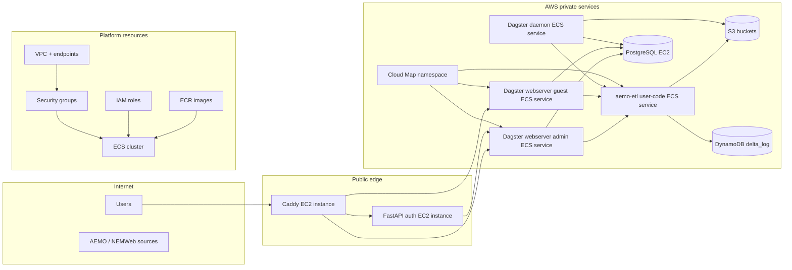

# AWS Pulumi Infrastructure

Pulumi program for the deployed AWS energy-market platform.

This directory is the source of truth for the main runtime architecture. It
provisions the network, storage, container images, compute platform, and public
entrypoint used by the Dagster-based deployment.

## Table of contents

- [What this stack provisions](#what-this-stack-provisions)
- [Architecture summary](#architecture-summary)
- [Component order](#component-order)
- [Component docs](#component-docs)
- [Container images and service source](#container-images-and-service-source)
- [Runtime behavior](#runtime-behavior)
- [Configuration](#configuration)
- [Failed-run alert topic setup](#failed-run-alert-topic-setup)
- [Common commands](#common-commands)
- [Relationship to local development](#relationship-to-local-development)
- [Related docs](#related-docs)

## What this stack provisions

From `__main__.py`, the stack builds these layers:

- networking: VPC, public/private subnets, route tables, and VPC endpoints
- security: security groups and IAM roles for EC2 and ECS tasks
- data services: S3 buckets, DynamoDB `delta_log`, PostgreSQL, and a bastion host
- container platform: ECR repositories and image builds, ECS cluster, Cloud Map
- public services: Caddy reverse proxy and FastAPI authentication service
- Dagster services:
  - `aemo-etl` user-code gRPC service
  - Dagster webserver admin
  - Dagster webserver guest
  - Dagster daemon

## Architecture summary



## Component order

The dependency order in `__main__.py` is deliberate:

1. `VpcComponentResource`
1. `VpcEndpointsComponentResource`
1. `SecurityGroupsComponentResource`
1. `IamRolesComponentResource`
1. `S3BucketsComponentResource`
1. `DeltaLockingTableComponentResource`
1. `ECRComponentResource`
1. `ServiceDiscoveryComponentResource`
1. `PostgresComponentResource`
1. `BastionHostComponentResource`
1. `EcsClusterComponentResource`
1. `FastAPIAuthComponentResource`
1. `CaddyServerComponentResource`
1. `DagsterUserCodeServiceComponentResource`
1. `DagsterWebserverServiceComponentResource` for admin
1. `DagsterWebserverServiceComponentResource` for guest
1. `DagsterDaemonServiceComponentResource`

In practical terms:

- the network and access controls are created first
- shared storage and image registry come next
- compute and service discovery follow
- public-facing and Dagster runtime services are created last

## Component docs

Detailed subsystem docs live under [docs/](docs/README.md):

- [VPC architecture](docs/vpc.md)
- [Connectivity](docs/connectivity.md)
- [Identity and discovery](docs/identity-and-discovery.md)
- [Storage](docs/storage.md)
- [Runtime](docs/runtime.md)
- [Edge and access](docs/edge-and-access.md)

## Container images and service source

`components/ecr.py` builds and pushes the deployed images directly from the
repository:

- `backend-services/dagster-core` for Dagster webserver and daemon
- `backend-services/dagster-user/aemo-etl` for the gRPC user-code service
- `backend-services/authentication` for the auth service
- `backend-services/caddy` for the public reverse proxy

The Pulumi deployment uses the AWS-targeted Dagster configuration by building
`dagster-core` with `DAGSTER_DEPLOYMENT=aws`.

## Runtime behavior

Key deployed behaviors visible in the infrastructure code:

- Caddy runs on a public EC2 instance and proxies to:
  - `webserver-admin.dagster:3000`
  - `webserver-guest.dagster:3000`
  - the FastAPI auth service
- Dagster services run as ECS Fargate services in private subnets
- Cloud Map provides private DNS names under the `dagster` namespace
- PostgreSQL is used for Dagster run, schedule, and event-log storage
- S3 holds landing, archive, Delta-table, and IO-manager data
- DynamoDB `delta_log` supports Delta locking

## Configuration

This project reads a small set of important config values:

- `ENVIRONMENT`
  - defaults to `dev`
  - contributes to the shared resource prefix
- `ADMINISTRATOR_IPS`
  - used outside local mode for admin-access configuration
- `aws:region`
  - stack region, shown in `Pulumi.dev-ausenergymarket.yaml` as `ap-southeast-2`
- Pulumi secrets for Cognito/auth and public site configuration:
  - `aws-pulumi:cognito_client_id`
  - `aws-pulumi:cognito_server_metadata_url`
  - `aws-pulumi:cognito_token_signing_key_url`
  - `aws-pulumi:cognito_client_secret`
  - `aws-pulumi:website_root_url`
  - `aws-pulumi:developer_email`
- Optional Pulumi secret for Dagster failed-run alerts:
  - `aws-pulumi:dagster_failure_alert_topic_arn`

The stack name prefix resolves to `"{ENVIRONMENT}-energy-market"`.

## Failed-run alert topic setup

The stack does not create or manage the alert topic. Create a Standard Amazon
SNS topic manually, subscribe the people or distribution endpoints that should
receive alerts, then pass the topic ARN into Pulumi.

Manual setup:

1. In the Amazon SNS console, choose a Region that supports SMS messaging, then
   create a Standard topic such as `dagster-failed-run-alerts`.
1. Create subscriptions on that topic:
   - use protocol `sms` with E.164 phone numbers for text alerts
   - use protocol `email` for email recipients or email distribution lists
1. Confirm email subscriptions before expecting delivery.
1. For SMS recipients, verify destination numbers while the account is in the
   AWS End User Messaging SMS sandbox, or request production access before using
   unverified production recipients.
1. Configure an SMS origination identity where the target country or AWS account
   setup requires one.
1. Store the topic ARN for this stack:

```bash
pulumi config set --secret dagster_failure_alert_topic_arn <topic-arn>
```

Then run `pulumi preview` and `pulumi up`. Pulumi injects the topic ARN into
the AEMO ETL user-code task and grants that task role `sns:Publish` on that
topic.

AWS references:

- [Publishing SMS messages with Amazon SNS](https://docs.aws.amazon.com/sns/latest/dg/sms_sending-overview.html)
- [SNS Publish API](https://docs.aws.amazon.com/sns/latest/api/API_Publish.html)
- [SMS/MMS sandbox](https://docs.aws.amazon.com/sms-voice/latest/userguide/sandbox.html)
- [SNS SMS origination identities](https://docs.aws.amazon.com/sns/latest/dg/channels-sms-originating-identities.html)

## Common commands

Run the AWS Pulumi **Commit check** hook set from this **Subproject** directory:

```bash
prek run -a
```

The shell formatting and linting hooks run through this **Subproject**'s uv dev
environment, so `shfmt` and `shellcheck` are provided by `pyproject.toml` and
`uv.lock` rather than the caller's `PATH`.

Ruff enforces Google-style docstrings for production component APIs and the
default `C901` complexity threshold across this **Subproject**; unit, component,
and deployed tests are outside that first docstring ratchet.

Preview infrastructure changes:

```bash
pulumi preview
```

Apply infrastructure changes:

```bash
pulumi up
```

Run the full deployed-test workflow against the default stack:

```bash
AWS_DEFAULT_REGION=ap-southeast-2 scripts/run-integration-tests
```

Run deployed tests without applying infrastructure first:

```bash
AWS_DEFAULT_REGION=ap-southeast-2 scripts/run-integration-tests --skip-up
```

Run the deployed suite directly:

```bash
PULUMI_INTEGRATION_TESTS=1 PULUMI_STACK=dev-ausenergymarket uv run pytest tests/deployed -v
```

## Relationship to local development

The local compose setup under `backend-services/` is not the canonical
architecture. It exists to support development and testing of the deployed
system's services and Dagster workflows.

- Use this directory when you are provisioning or validating AWS resources.
- Use `backend-services/` when you need a local test/dev harness.
- Use `backend-services/dagster-user/aemo-etl/` for ETL definitions and
  Dagster-specific data pipeline docs.

## Related docs

- [Repository overview](../../README.md)
- [Repository architecture](../../docs/repository/architecture.md)
- [Repository workflow](../../docs/repository/workflow.md)
- [AWS Pulumi component docs](docs/README.md)
- [VPC architecture notes](docs/vpc.md)
- [Local backend-services stack](../../backend-services/README.md)

## Sync metadata

- `sync.owner`: `docs`
- `sync.sources`:
  - `infrastructure/aws-pulumi/__main__.py`
  - `infrastructure/aws-pulumi/configs.py`
  - `infrastructure/aws-pulumi/components/ecs_services.py`
  - `infrastructure/aws-pulumi/components/iam_roles.py`
  - `infrastructure/aws-pulumi/.pre-commit-config.yaml`
  - `infrastructure/aws-pulumi/pyproject.toml`
  - `infrastructure/aws-pulumi/scripts/setup_secrets`
  - `infrastructure/aws-pulumi/scripts/run-integration-tests`
  - `infrastructure/aws-pulumi/tests/deployed/conftest.py`
  - `infrastructure/aws-pulumi/tests/deployed/test_integration.py`
  - `infrastructure/aws-pulumi/Pulumi.dev-ausenergymarket.yaml`
- `sync.scope`: `architecture, tooling`
- `sync.qa`:
  - `git diff --name-only`
  - `rg -n "<changed-file-path>" README.md docs backend-services infrastructure`
  - `verify links, diagrams, commands, paths, ports, env vars, and names`
