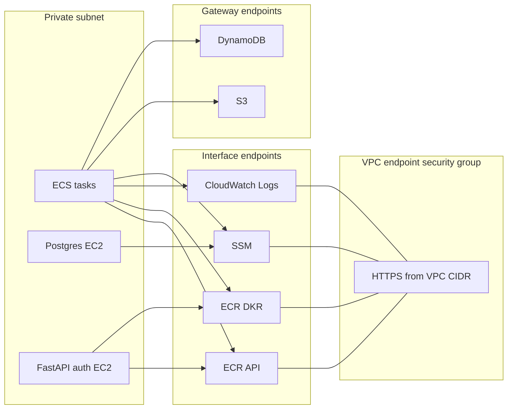
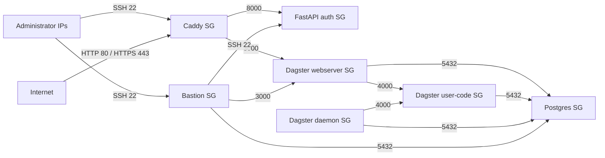

# Connectivity

This page covers the AWS-network connectivity controls layered on top of the
base VPC: VPC endpoints for private AWS API access and security groups for
service-to-service traffic.

## Table of contents

- [What this page covers](#what-this-page-covers)
- [VPC endpoint topology](#vpc-endpoint-topology)
- [Security-group trust graph](#security-group-trust-graph)
- [Component summary](#component-summary)
- [Traffic rules](#traffic-rules)
- [Related docs](#related-docs)

## What this page covers

- `VpcEndpointsComponentResource`
- `SecurityGroupsComponentResource`

The VPC itself, subnets, NAT instance, and route tables are documented in
[vpc.md](vpc.md).

## VPC endpoint topology

The component creates:

- interface endpoints in the private subnet for `ecr.api`, `ecr.dkr`, `logs`,
  and `ssm`
- gateway endpoints attached to the private route table for `s3` and
  `dynamodb`
- one dedicated security group allowing HTTPS from the VPC CIDR to the
  interface endpoints

## Security-group trust graph

## Component summary

| Component | Key resources | Purpose |
|---|---|---|
| `VpcEndpointsComponentResource` | endpoint SG, 4 interface endpoints, 2 gateway endpoints | Keep AWS API access inside the VPC where possible |
| `SecurityGroupsComponentResource` | 7 service security groups plus explicit ingress/egress rules | Encode allowed operator access and service-to-service paths |

## Traffic rules

- Caddy is the only internet-facing service security group.
- FastAPI auth is private and only accepts traffic from Caddy plus SSH from the
  bastion host.
- Dagster webservers accept port `3000` from Caddy and the bastion host.
- Dagster user-code accepts gRPC port `4000` only from the webserver and
  daemon.
- Postgres accepts port `5432` from the Dagster ECS services plus the bastion
  host for manual administration.
- The daemon has no inbound rules because it only initiates outbound
  connections.

## Related docs

- [VPC architecture](vpc.md)
- [Identity and discovery](identity-and-discovery.md)
- [Runtime](runtime.md)
- [Edge and access](edge-and-access.md)

## Sync metadata

- `sync.owner`: `docs`
- `sync.sources`:
  - `infrastructure/aws-pulumi/components/vpc_endpoints.py`
  - `infrastructure/aws-pulumi/components/security_groups.py`
- `sync.scope`: `architecture`
- `sync.qa`:
  - `git diff --name-only`
  - `rg -n "<changed-file-path>" README.md docs backend-services infrastructure`
  - `verify links, diagrams, commands, paths, ports, env vars, and names`
