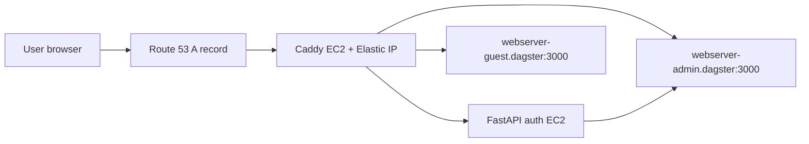
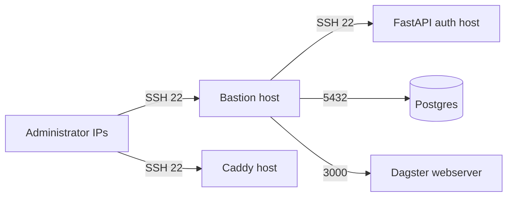

# Edge And Access

This page documents the EC2-based access layer around the private Dagster
runtime: the bastion host for operators, the FastAPI auth host, and the public
Caddy reverse proxy.

## Table of contents

- [What this page covers](#what-this-page-covers)
- [Public request flow](#public-request-flow)
- [Operator access flow](#operator-access-flow)
- [Component summary](#component-summary)
- [Implementation notes](#implementation-notes)
- [Related docs](#related-docs)

## What this page covers

- `BastionHostComponentResource`
- `FastAPIAuthComponentResource`
- `CaddyServerComponentResource`

## Public request flow

The public edge is intentionally thin:

- Caddy is the only internet-facing runtime host
- FastAPI auth stays in the private subnet
- Dagster webservers stay in ECS private networking behind Caddy

## Operator access flow

## Component summary

| Component | Placement | Key resources | Purpose |
|---|---|---|---|
| `BastionHostComponentResource` | public subnet | EC2 instance, EIP, SSH key pair, SSM params | controlled operator entry point |
| `FastAPIAuthComponentResource` | private subnet | EC2 instance, ECR-read role, Docker bootstrap | OIDC/session bridge for protected routes |
| `CaddyServerComponentResource` | public subnet | EC2 instance, EIP, 1 GiB EBS volume, Route 53 record | public TLS termination and reverse proxy |

## Implementation notes

- The bastion host uses the shared bastion instance profile from
  `IamRolesComponentResource` and stores its instance ID and key-pair ID in
  SSM.
- The FastAPI auth host pulls the `dagster/authentication` image from ECR and
  injects Cognito and website-root configuration from Pulumi config.
- The Caddy host:
  - pulls the `dagster/caddy` image from ECR
  - mounts a dedicated encrypted EBS volume at `/mnt/caddy-certs`
  - persists certificate state under `/data`
  - creates a Route 53 A record for `ausenergymarketdata.com`
  - proxies to Cloud Map names for the private Dagster webservers and to the
    auth host private IP on port `8000`

## Related docs

- [Connectivity](connectivity.md)
- [Identity and discovery](identity-and-discovery.md)
- [Runtime](runtime.md)
- [Storage](storage.md)

## Sync metadata

- `sync.owner`: `docs`
- `sync.sources`:
  - `infrastructure/aws-pulumi/components/bastion_host.py`
  - `infrastructure/aws-pulumi/components/fastapi_auth.py`
  - `infrastructure/aws-pulumi/components/caddy.py`
- `sync.scope`: `architecture`
- `sync.qa`:
  - `git diff --name-only`
  - `rg -n "<changed-file-path>" README.md docs backend-services infrastructure`
  - `verify links, diagrams, commands, paths, ports, env vars, and names`
