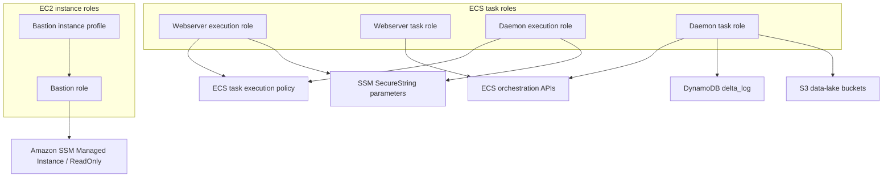
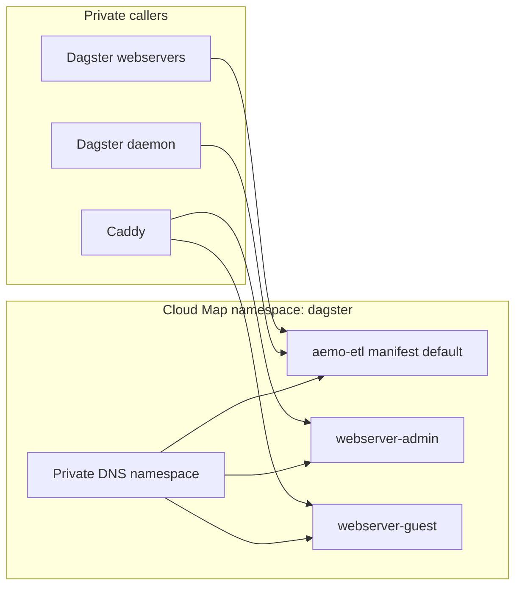

# Identity And Discovery

This page covers the control-plane components that let instances and tasks
assume the correct permissions and discover one another inside the private
network.

## Table of contents

- [What this page covers](#what-this-page-covers)
- [IAM role model](#iam-role-model)
- [Service discovery topology](#service-discovery-topology)
- [Code-location discovery boundary](#code-location-discovery-boundary)
- [Component summary](#component-summary)
- [Permission boundaries](#permission-boundaries)
- [Related docs](#related-docs)

## What this page covers

- `IamRolesComponentResource`
- `ServiceDiscoveryComponentResource`

## IAM role model

The role split is deliberate:

- execution roles cover image pulls, task startup, and log shipping
- task roles cover what the running containers can do at runtime
- the daemon task role is broader because it launches and supervises Dagster
  work on ECS

## Service discovery topology

The namespace is private to the VPC and currently backs:

- `aemo-etl.dagster:4000`
- `webserver-admin.dagster:3000`
- `webserver-guest.dagster:3000`

The daemon is not registered because it does not accept inbound traffic.

## Code-location discovery boundary

User-code Cloud Map names now come from
`backend-services/dagster-core/code-locations.aws.toml`. This issue #153
**Exploratory branch** keeps the live namespace boundary unchanged: only
`aemo-etl.dagster:4000` is declared for production review. A second
fixture-declared code location is covered in AWS Pulumi tests to prove the
manifest path can produce distinct workspace, ECR, ECS, and Cloud Map resource
definitions before a human accepts a broader production interface.

## Component summary

| Component | Key resources | Purpose |
|---|---|---|
| `IamRolesComponentResource` | 1 EC2 instance profile, 2 ECS execution roles, 2 ECS task roles | Separate bootstrap permissions from runtime permissions |
| `ServiceDiscoveryComponentResource` | 1 Cloud Map private DNS namespace | Give private service names to the ECS runtime |

## Permission boundaries

- The bastion host gets SSM-centric EC2 permissions through an instance
  profile.
- The webserver task role can inspect and stop ECS tasks and pass roles to
  ECS tasks when launching work.
- The webserver and daemon execution roles add scoped `ssm:GetParameters`
  access to the Postgres password parameter so ECS can inject the database
  password as a task secret.
- The daemon task role includes:
  - ECS orchestration calls
  - `dagster-*` service and `run_*` run-worker task definition registration,
    tagging, and launch permissions
  - `ecs:TagResource` for tasks created inside the Dagster ECS cluster during
    `RunTask`
  - SNS topic publish for Dagster failed-run alerts when a Pulumi secret topic
    ARN is configured
  - DynamoDB access to `delta_log`
  - S3 access to the environment-scoped `*-energy-market*` buckets
  - scoped `iam:PassRole` for ECS task launches

## Related docs

- [Connectivity](connectivity.md)
- [Storage](storage.md)
- [Runtime](runtime.md)
- [Edge and access](edge-and-access.md)

## Sync metadata

- `sync.owner`: `docs`
- `sync.sources`:
  - `backend-services/dagster-core/code-locations.aws.toml`
  - `infrastructure/aws-pulumi/code_locations.py`
  - `infrastructure/aws-pulumi/components/ecs_services.py`
  - `infrastructure/aws-pulumi/components/iam_roles.py`
  - `infrastructure/aws-pulumi/components/service_discovery.py`
- `sync.scope`: `architecture`
- `sync.qa`:
  - `git diff --name-only`
  - `rg -n "<changed-file-path>" README.md docs backend-services infrastructure`
  - `verify links, diagrams, commands, paths, ports, env vars, and names`
