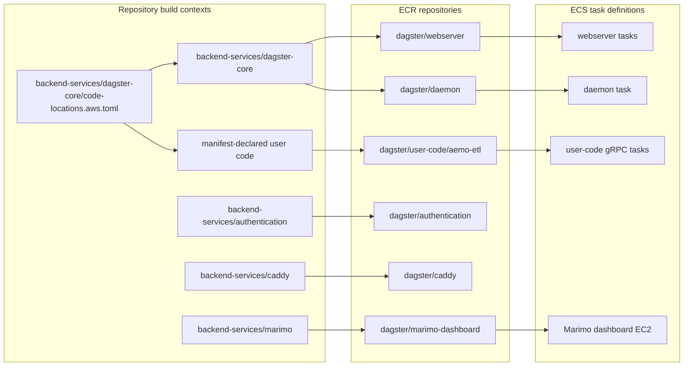
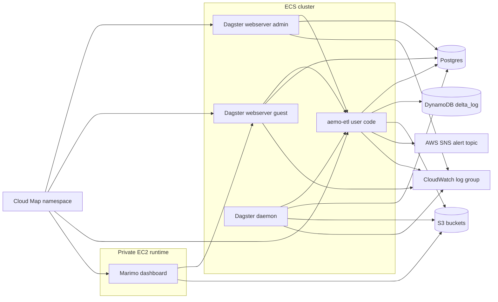

# Runtime

This page covers the container build pipeline, the private ECS runtime that
hosts Dagster services in AWS, and the private Marimo dashboard runtime.

## Table of contents

- [What this page covers](#what-this-page-covers)
- [Image build and publish flow](#image-build-and-publish-flow)
- [Code-location manifest prototype](#code-location-manifest-prototype)
- [ECS runtime topology](#ecs-runtime-topology)
- [Service profiles](#service-profiles)
- [EC2 run-worker capacity prototype](#ec2-run-worker-capacity-prototype)
- [Component summary](#component-summary)
- [Implementation notes](#implementation-notes)
- [Related docs](#related-docs)

## What this page covers

- `ECRComponentResource`
- `EcsClusterComponentResource`
- `DagsterUserCodeServiceComponentResource`
- `DagsterWebserverServiceComponentResource`
- `DagsterDaemonServiceComponentResource`
- `MarimoDashboardComponentResource`

## Image build and publish flow



`ECRComponentResource` builds and pushes images during `pulumi up`, enables
scan-on-push on each repository, and exposes digest-pinned image URIs for the
ECS task definitions and EC2 service bootstraps that need deterministic image
availability.

The Caddy build context runs the Astro portfolio build during the Docker build
and copies the generated static files into Caddy's `/var/www/html` root before
the image is pushed.

## Code-location manifest prototype

The issue #153 **Exploratory branch** trials
`backend-services/dagster-core/code-locations.aws.toml` as the shared AWS
Dagster code-location declaration. The manifest is now the source for:

- AWS core-image workspace rendering through
  `backend-services/dagster-core/render_aws_workspace.py`
- user-code ECR repository and image resources in `ECRComponentResource`
- user-code gRPC ECS services in `DagsterUserCodeServiceComponentResource`
- redeploy and deployed-test service-name resolution

The current production review boundary is deliberately narrow: `aemo-etl`
remains the only checked-in live location and stays the default location with
module `aemo_etl.definitions`, port `4000`, and Cloud Map name `aemo-etl`.
The two-location path is proven by AWS Pulumi tests with a fixture manifest, not
by adding a second production code location on this branch.

## ECS runtime topology



## Service profiles

| Service | CPU | Memory | Port | Cloud Map name | Notes |
|---|---:|---:|---:|---|---|
| user-code default | 256 | 1024 | 4000 | `aemo-etl` | Dagster gRPC server from the manifest |
| webserver admin | 256 | 1024 | 3000 | `webserver-admin` | path prefix `/dagster-webserver/admin` |
| webserver guest | 256 | 1024 | 3000 | `webserver-guest` | `--read-only`, path prefix `/dagster-webserver/guest` |
| daemon | 256 | 1024 | none | none | background scheduler/sensor/orchestration process |
| Marimo dashboard | 2 vCPU | 2 GiB | 2718 | `marimo-dashboard` | private EC2 `t3.small` host for the `/marimo` concept gallery and curated notebooks |

Cluster-level behavior:

- one shared CloudWatch log group with one-day retention
- cluster capacity providers include `FARGATE` and `FARGATE_SPOT`
- long-running Dagster services use `FARGATE_SPOT`
- one private subnet placement strategy for all services
- no public IP assignment on tasks
- deployment circuit breaker enabled on services

Dagster run-worker tasks are launched by `EcsRunLauncher` from
`backend-services/dagster-core/dagster.aws.yaml`. Those ephemeral tasks use
`FARGATE_SPOT`, and the AWS run queue is capped at 20 concurrent runs to limit
peak compute in the dev deployment. Spot capacity can be unavailable or
interrupted. AWS run monitoring is enabled so the daemon can detect interrupted
or orphaned run-worker tasks, poll ECS every 120 seconds, cap runtime at 30
minutes, and mark unrecovered runs failed without automatic resume attempts.
The default Secrets Manager tag lookup is disabled because this deployment
injects required runtime secrets through ECS task-definition secrets and SSM
password parameters instead. Non-dev Postgres passwords remain SSM
`SecureString`; `dev-energy-market` can use SSM `String` only when
`aws-pulumi:allow_dev_string_postgres_password_parameter=true` is set, which
weakens at-rest protection for that dev parameter but keeps the value out of
plain ECS environment variables.

## EC2 run-worker capacity prototype

Issue #126 adds a default-off **Exploratory delivery** path for EC2-backed
Dagster run workers. The normal `aws` Dagster image target and long-running ECS
services remain on `FARGATE_SPOT`; the prototype is active only when both of
these Pulumi config values are set before preview or deployment:

```bash
pulumi config set dagster_core_deployment aws-ec2-run-workers-prototype
pulumi config set enable_ec2_run_worker_capacity_prototype true
```

Pulumi validates this as a strict pairing before it constructs stack resources:

- `dagster_core_deployment=aws-ec2-run-workers-prototype` without
  `enable_ec2_run_worker_capacity_prototype=true` is rejected because the
  Dagster daemon would launch run-worker tasks against a capacity provider the
  stack does not create.
- `enable_ec2_run_worker_capacity_prototype=true` with the normal `aws`
  Dagster image is also rejected; unused EC2 capacity-provider previews are not
  an accepted configuration.
- The prototype is dev-only while
  `backend-services/dagster-core/dagster.aws.ec2-run-workers.prototype.yaml`
  names `dev-energy-market-run-worker-ec2` directly. If `ENVIRONMENT` would
  produce any other stack prefix, Pulumi fails instead of creating a capacity
  provider whose name cannot be reached by the baked Dagster config.

Prototype resources:

- `EcsClusterComponentResource` can add a `dev-energy-market-run-worker-ec2`
  ECS capacity provider backed by an empty EC2 Auto Scaling group.
- The Auto Scaling group starts with `min_size=0`, `desired_capacity=0`, and
  `max_size=2`, so it has no idle EC2 instance cost until ECS managed scaling
  requests capacity.
- The launch template uses the Amazon Linux 2023 ECS-optimized AMI SSM
  parameter, `t3.medium`, an encrypted 30 GiB `gp3` root volume, IMDSv2, the
  private subnet, and the existing Dagster daemon security group for egress.
- The Auto Scaling group carries the `AmazonECSManaged=true` tag required for
  ECS managed scaling.
- `IamRolesComponentResource` creates an ECS container-instance instance profile
  with `AmazonEC2ContainerServiceforEC2Role` and `AmazonSSMManagedInstanceCore`.

Prototype run-worker task placement:

- `backend-services/dagster-core/dagster.aws.ec2-run-workers.prototype.yaml`
  supplies an explicit `EcsRunLauncher.task_definition` with
  `requires_compatibilities: ["EC2"]`. This is required because inheriting the
  daemon task definition would keep run workers Fargate-only.
- The prototype image passes daemon role ARNs, the ECS log group name, and the
  Postgres SSM parameter ARN through webserver and daemon environment variables
  so Dagster can register run-worker task definitions without hard-coded ARNs.
- `run_task_kwargs.capacityProviderStrategy` targets
  `dev-energy-market-run-worker-ec2`; `placementStrategy` binpacks by memory.
- The launcher still inherits the current ECS task network configuration, so
  run workers use the private subnet and the Dagster daemon security group.

Prototype scaling and cost assumptions:

- ECS managed scaling is enabled with `target_capacity=100`, step size `1..2`,
  and a 60 second instance warmup. Pending EC2-compatible run-worker tasks
  should therefore drive ASG scale-out up to two `t3.medium` instances.
- A `t3.medium` has 2 vCPU and 4 GiB memory, so it is sized for the default
  256 CPU / 2048 MiB run-worker profile and not for existing 8192 MiB job-tagged
  rebuild runs. Those tagged jobs still override `ecs/run_task_kwargs` to
  `FARGATE_SPOT`; moving them to EC2 would need a larger capacity provider.
- Idle prototype cost should be zero for EC2 instances because desired capacity
  is zero. Active cost is bounded by at most two `t3.medium` instances plus
  their 30 GiB `gp3` root volumes while tasks are pending or running. Operators
  should verify current regional prices in the AWS Pricing Calculator before any
  deployed test.

Rollback path:

1. Set `dagster_core_deployment` back to `aws` and deploy so new webserver and
   daemon images use `dagster.aws.yaml`.
1. After no run workers target `dev-energy-market-run-worker-ec2`, set
   `enable_ec2_run_worker_capacity_prototype` to `false` and preview removal of
   the launch template, Auto Scaling group, capacity provider, and ECS
   cluster-capacity-provider association.
1. Confirm the cluster capacity providers are back to `FARGATE` and
   `FARGATE_SPOT`; long-running service capacity-provider strategies should not
   change during rollback.

Exploratory handoff recommendation: create a follow-up **Exploratory delivery**
issue for an explicitly approved deployed smoke test before shaping any Gitflow
implementation issue. Static code and component tests prove the configuration
surface is present and default-off, but this branch does not prove live EC2
placement, image pull, task startup latency, or scale-in behavior because issue
`#126` did not approve deployed changes.

## Component summary

| Component | Key resources | Purpose |
|---|---|---|
| `ECRComponentResource` | ECR repos, lifecycle policies, docker build+push resources | Publish deployable images from repo source |
| `EcsClusterComponentResource` | ECS cluster, CloudWatch log group, Fargate providers, optional EC2 run-worker provider | Shared compute substrate for Dagster runtime |
| `ecs_services.py` components | task definitions, ECS services, Cloud Map service registrations | Run Dagster webserver, daemon, and user-code containers |
| `MarimoDashboardComponentResource` | private EC2 instance with encrypted 30 GiB `gp3` root volume, Cloud Map registration, SSM-enabled instance profile, read-only S3 policy | Run the curated Marimo dashboard outside ECS |
| `code_locations.py` | manifest parser, workspace renderer, resource-name helpers | Keep user-code images, workspaces, services, and live checks aligned |

## Implementation notes

- The webserver and daemon images both come from `backend-services/dagster-core`
  built with `DAGSTER_DEPLOYMENT=aws` by default.
- The AWS-targeted core image stages, `aws` and
  `aws-ec2-run-workers-prototype`, render `workspace.aws.yaml` from the
  manifest during the Docker build before copying it to `workspace.yaml`.
- The issue #126 **Exploratory delivery** prototype can swap only that build
  argument to `aws-ec2-run-workers-prototype`.
- ECS services use digest-pinned image URIs rather than mutable `:latest` tags
  at runtime.
- The Caddy, FastAPI auth, and Marimo dashboard EC2 user data also pull
  digest-pinned image URIs, so image publish completion is part of the Pulumi
  dependency graph before replacement bootstraps run.
- ECS task definitions inject the Postgres password through ECS `secrets`
  backed by the SSM password parameter, not through plain container environment
  variables. The backing parameter is `SecureString` by default and `String`
  only for the gated `dev-energy-market` exception.
- Admin and guest webservers get separate task-definition families so revisions
  are not shared across the two variants.
- Cloud Map registration is used only for the inbound-facing private services:
  user code, both webservers, and Marimo dashboard.
- The daemon task does not register in Cloud Map because it only initiates
  outbound orchestration work.
- The deployed Marimo dashboard runs with `DEVELOPMENT_LOCATION=aws`,
  `MARIMO_FULL_TABLE_SCAN_ENABLED=false`, and `MARIMO_MAX_PREVIEW_ROWS=100`,
  so table previews are bounded and use the instance profile instead of static
  AWS credentials. Curated gas-model dashboard reads use explicit refresh,
  session-level cache keys, load timing, and row-limit messages rather than
  auto-refresh timers. The data readiness overview uses the same read-only S3
  and Dagster GraphQL helper surfaces to summarize platform operations
  readiness without adding AWS write paths. The glossary explorer browses the
  packaged Marimo registry for generated-gold metadata paths, source chunk IDs,
  related concepts, and dashboard states without generated-file or table reads.
  The gas system notices dashboard reads the curated system notice fact through
  the same bounded helper surface and does not add AWS write paths.
  Its `/marimo` entry route renders the registry-backed concept gallery;
  available cards link to mounted notebooks and planned cards remain non-link
  roadmap entries. Marimo packaged assets stay on
  `/marimo/<notebook>/assets/*` routes, pass through Caddy to the dashboard,
  and return immutable cache headers when the FastAPI wrapper serves them
  successfully.
- The user-code task receives `DAGSTER_FAILURE_ALERT_TOPIC_ARN` from Pulumi
  secret config and `DAGSTER_FAILURE_ALERT_BASE_URL` from public site config so
  the AEMO ETL failure sensor can publish alerts to a manually managed AWS SNS
  topic.

## Related docs

- [Connectivity](connectivity.md)
- [Identity and discovery](identity-and-discovery.md)
- [Storage](storage.md)
- [Edge and access](edge-and-access.md)

## Sync metadata

- `sync.owner`: `docs`
- `sync.sources`:
  - `infrastructure/aws-pulumi/components/ecr.py`
  - `infrastructure/aws-pulumi/__main__.py`
  - `infrastructure/aws-pulumi/dagster_core_deployment.py`
  - `infrastructure/aws-pulumi/code_locations.py`
  - `infrastructure/aws-pulumi/components/dagster_runtime_task.py`
  - `infrastructure/aws-pulumi/components/postgres.py`
  - `infrastructure/aws-pulumi/components/ecs_cluster.py`
  - `infrastructure/aws-pulumi/components/ecs_services.py`
  - `infrastructure/aws-pulumi/components/iam_roles.py`
  - `infrastructure/aws-pulumi/components/marimo.py`
  - `backend-services/marimo/Dockerfile`
  - `backend-services/marimo/src/marimoserver/main.py`
  - `backend-services/marimo/src/marimoserver/gas_dashboard.py`
  - `backend-services/marimo/src/marimoserver/gas_model_loader.py`
  - `backend-services/marimo/src/marimoserver/table_explorer.py`
  - `backend-services/marimo/src/marimoserver/data_readiness.py`
  - `backend-services/marimo/src/marimoserver/glossary_explorer.py`
  - `backend-services/marimo/notebooks/sample_energy_market.py`
  - `backend-services/marimo/notebooks/table_explorer.py`
  - `backend-services/marimo/notebooks/data_readiness_overview.py`
  - `backend-services/marimo/notebooks/glossary_explorer.py`
  - `backend-services/marimo/notebooks/system_notices.py`
  - `backend-services/caddy/Dockerfile`
  - `backend-services/caddy/package.json`
  - `backend-services/caddy/src/pages/index.astro`
  - `backend-services/caddy/public/theme.css`
  - `backend-services/dagster-core/code-locations.aws.toml`
  - `backend-services/dagster-core/Dockerfile`
  - `backend-services/dagster-core/dagster.aws.yaml`
  - `backend-services/dagster-core/dagster.aws.ec2-run-workers.prototype.yaml`
  - `backend-services/dagster-core/render_aws_workspace.py`
  - `backend-services/dagster-core/workspace.aws.yaml`
  - `infrastructure/aws-pulumi/Pulumi.dev-ausenergymarket.yaml`
  - `infrastructure/aws-pulumi/tests/fixtures/code-locations-two-location.toml`
  - `infrastructure/aws-pulumi/tests/component/test_ecs_services.py`
  - `infrastructure/aws-pulumi/tests/component/test_postgres.py`
  - `infrastructure/aws-pulumi/tests/deployed/test_integration.py`
  - `infrastructure/aws-pulumi/tests/unit/test_code_locations.py`
  - `infrastructure/aws-pulumi/tests/unit/test_dagster_core_deployment.py`
- `sync.scope`: `architecture`
- `sync.qa`:
  - `git diff --name-only`
  - `rg -n "<changed-file-path>" README.md docs backend-services infrastructure`
  - `verify links, diagrams, commands, paths, ports, env vars, and names`
