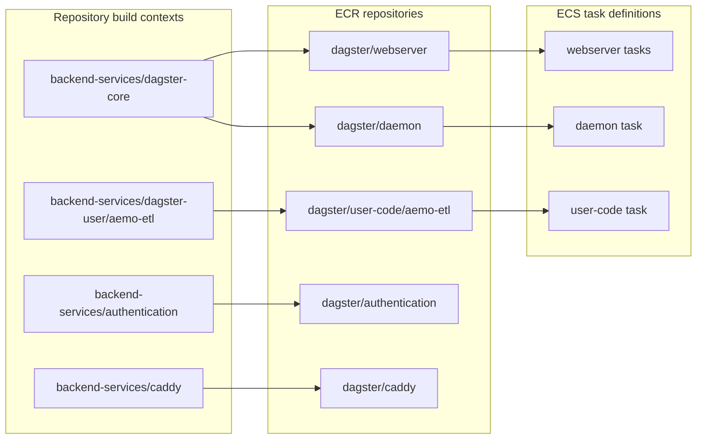
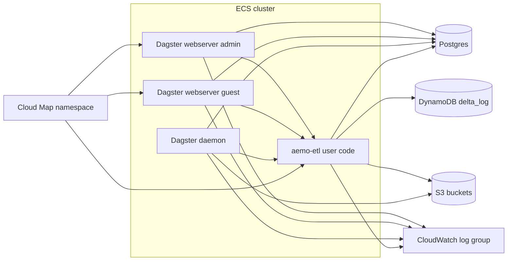

# Runtime

This page covers the container build pipeline and the private ECS runtime that
hosts Dagster services in AWS.

## Table of contents

- [What this page covers](#what-this-page-covers)
- [Image build and publish flow](#image-build-and-publish-flow)
- [ECS runtime topology](#ecs-runtime-topology)
- [Service profiles](#service-profiles)
- [Component summary](#component-summary)
- [Implementation notes](#implementation-notes)
- [Related docs](#related-docs)

## What this page covers

- `ECRComponentResource`
- `EcsClusterComponentResource`
- `DagsterUserCodeServiceComponentResource`
- `DagsterWebserverServiceComponentResource`
- `DagsterDaemonServiceComponentResource`

## Image build and publish flow

`ECRComponentResource` builds and pushes images during `pulumi up` and exposes
digest-pinned image URIs for the ECS task definitions.

## ECS runtime topology

## Service profiles

| Service | CPU | Memory | Port | Cloud Map name | Notes |
|---|---:|---:|---:|---|---|
| user-code | 256 | 1024 | 4000 | `aemo-etl` | Dagster gRPC server |
| webserver admin | 512 | 1024 | 3000 | `webserver-admin` | path prefix `/dagster-webserver/admin` |
| webserver guest | 512 | 1024 | 3000 | `webserver-guest` | `--read-only`, path prefix `/dagster-webserver/guest` |
| daemon | 256 | 1024 | none | none | background scheduler/sensor/orchestration process |

Cluster-level behavior:

- one shared CloudWatch log group with one-day retention
- cluster capacity providers include `FARGATE` and `FARGATE_SPOT`
- long-running Dagster services use on-demand `FARGATE`
- one private subnet placement strategy for all services
- no public IP assignment on tasks
- deployment circuit breaker enabled on services

Dagster run-worker tasks are launched by `EcsRunLauncher` from
`backend-services/dagster-core/dagster.aws.yaml`. Those ephemeral tasks prefer
`FARGATE_SPOT` with on-demand `FARGATE` fallback, and the AWS run queue is capped
at 20 concurrent runs to limit peak compute spend.

## Component summary

| Component | Key resources | Purpose |
|---|---|---|
| `ECRComponentResource` | ECR repos, lifecycle policies, docker build+push resources | Publish deployable images from repo source |
| `EcsClusterComponentResource` | ECS cluster, CloudWatch log group, capacity providers | Shared compute substrate for Dagster runtime |
| `ecs_services.py` components | task definitions, ECS services, Cloud Map service registrations | Run Dagster webserver, daemon, and user-code containers |

## Implementation notes

- The webserver and daemon images both come from `backend-services/dagster-core`
  built with `DAGSTER_DEPLOYMENT=aws`.
- ECS services use digest-pinned image URIs rather than mutable `:latest` tags
  at runtime.
- Admin and guest webservers get separate task-definition families so revisions
  are not shared across the two variants.
- Cloud Map registration is used only for the inbound-facing private services:
  user code and both webservers.
- The daemon task does not register in Cloud Map because it only initiates
  outbound orchestration work.

## Related docs

- [Connectivity](connectivity.md)
- [Identity and discovery](identity-and-discovery.md)
- [Storage](storage.md)
- [Edge and access](edge-and-access.md)

## Sync metadata

- `sync.owner`: `docs`
- `sync.sources`:
  - `infrastructure/aws-pulumi/components/ecr.py`
  - `infrastructure/aws-pulumi/components/ecs_cluster.py`
  - `infrastructure/aws-pulumi/components/ecs_services.py`
- `sync.scope`: `architecture`
- `sync.qa`:
  - `git diff --name-only`
  - `rg -n "<changed-file-path>" README.md docs backend-services infrastructure`
  - `verify links, diagrams, commands, paths, ports, env vars, and names`
