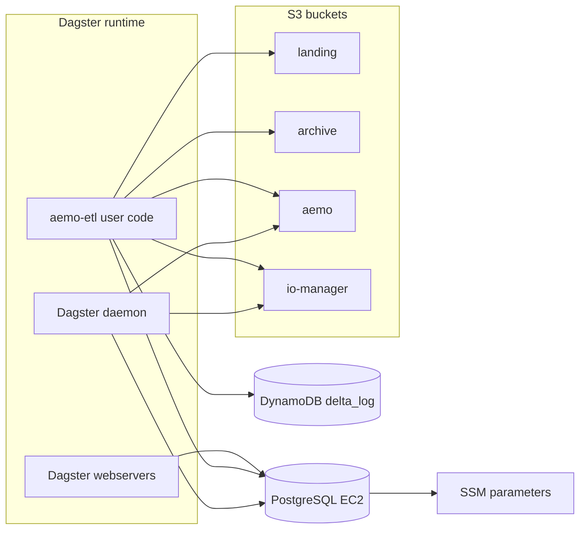

# Storage

This page documents the stateful data-plane resources used by the platform:
S3 buckets, the DynamoDB Delta locking table, and the PostgreSQL host used for
Dagster metadata.

## Table of contents

- [What this page covers](#what-this-page-covers)
- [Storage topology](#storage-topology)
- [Bucket roles](#bucket-roles)
- [Component summary](#component-summary)
- [Implementation notes](#implementation-notes)
- [Related docs](#related-docs)

## What this page covers

- `S3BucketsComponentResource`
- `DeltaLockingTableComponentResource`
- `PostgresComponentResource`

## Storage topology

## Bucket roles

| Bucket suffix | Role |
|---|---|
| `-landing` | raw source landing zone |
| `-archive` | processed and archived source files |
| `-aemo` | Delta tables and lakehouse outputs |
| `-io-manager` | Dagster IO manager payloads and intermediates |

All bucket names are prefixed by `"{ENVIRONMENT}-energy-market"`.

## Component summary

| Component | Key resources | Purpose |
|---|---|---|
| `S3BucketsComponentResource` | 4 S3 buckets plus encryption, public-access-block, versioning, archive lifecycle | Host raw files, Delta tables, and Dagster intermediates |
| `DeltaLockingTableComponentResource` | 1 DynamoDB table named `delta_log` with TTL on `expireTime` | Distributed lock table for `delta-rs` |
| `PostgresComponentResource` | 1 private EC2 instance with encrypted 32 GiB `gp3` root volume, password generator, 2 SSM params | Dagster run, schedule, and event-log metadata |

## Implementation notes

- The archive bucket has lifecycle transitions to `GLACIER` after 30 days and
  `DEEP_ARCHIVE` after 180 days, with long-term expiration after 3650 days.
- The S3 and DynamoDB components both support adoption/import of existing
  retained resources through Pulumi config flags.
- The DynamoDB Delta locking table uses `tablePath` as the partition key,
  `fileName` as the sort key, `PAY_PER_REQUEST` billing, and `expireTime` as
  the TTL attribute for automatic lock metadata expiry.
- Postgres is provisioned on a private `t4g.nano` instance with IMDSv2
  required and encrypted 32 GiB `gp3` root storage. User data installs
  PostgreSQL 14, fetches the database password from SSM at boot, configures
  `scram-sha-256` password auth for the VPC CIDR, creates `dagster_user`, and
  creates the `dagster` database.
- Postgres writes two SSM parameters:
  - password as `SecureString` by default
  - password as SSM `String` only when
    `aws-pulumi:allow_dev_string_postgres_password_parameter=true` and the
    component name is exactly `dev-energy-market`
  - private DNS name as `String`
- ECS services consume the Postgres private DNS as a Pulumi output and the
  password as an ECS task secret backed by the SSM password parameter. The
  dev-only SSM `String` exception weakens at-rest protection for that dev
  password, but it does not move `DAGSTER_POSTGRES_PASSWORD` into plain
  container environment variables.

## Related docs

- [Connectivity](connectivity.md)
- [Identity and discovery](identity-and-discovery.md)
- [Runtime](runtime.md)
- [Edge and access](edge-and-access.md)

## Sync metadata

- `sync.owner`: `docs`
- `sync.sources`:
  - `infrastructure/aws-pulumi/components/s3_buckets.py`
  - `infrastructure/aws-pulumi/components/dynamodb.py`
  - `infrastructure/aws-pulumi/components/postgres.py`
  - `infrastructure/aws-pulumi/Pulumi.dev-ausenergymarket.yaml`
  - `infrastructure/aws-pulumi/tests/component/test_postgres.py`
- `sync.scope`: `architecture`
- `sync.qa`:
  - `git diff --name-only`
  - `rg -n "<changed-file-path>" README.md docs backend-services infrastructure`
  - `verify links, diagrams, commands, paths, ports, env vars, and names`
