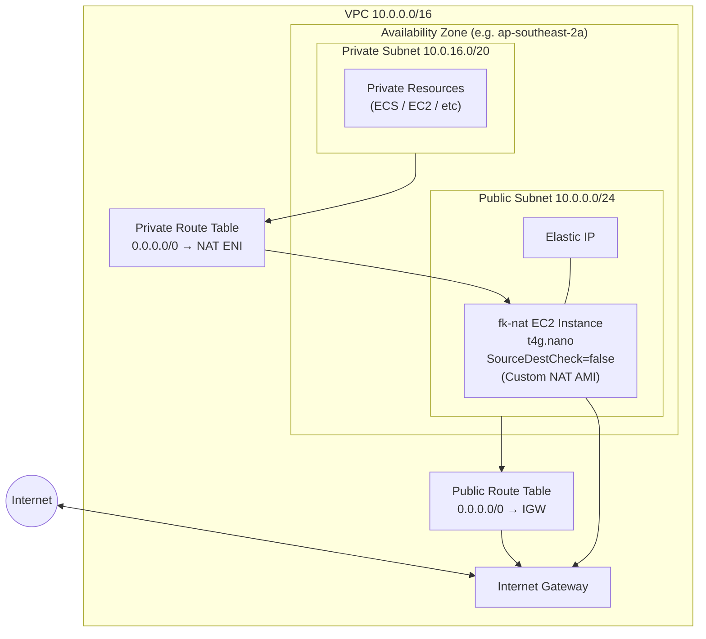

# VPC Architecture

## Table of contents

- [Traffic](#traffic)
- [Resources](#resources)
- [Components](#components)
- [CIDR Explained](#cidr-explained)
- [Traffic Flow](#traffic-flow)
- [Related docs](#related-docs)

## Traffic

### Private → Internet

Private resource → Private Route Table (0.0.0.0/0 → NAT) → NAT instance → Public Route Table (0.0.0.0/0 → IGW) → Internet

### Public → Internet

Public resource (e.g., NAT) → Public Route Table (0.0.0.0/0 → IGW) → Internet

### Internet → Private

No route exists → blocked

### Internet → Public

Internet → IGW → Public subnet resource (must have public IP/EIP)

## Resources

- [What is network CIDR notation](https://www.youtube.com/watch?v=tpa9QSiiiUo&t=14s)
- [IP address network and host portion](https://www.youtube.com/watch?v=eHV1aOnu7oM)
- [Subnetting Made Simple](https://www.youtube.com/watch?v=nFYilGQ-p-8)
- [Subnet Mask](https://www.youtube.com/watch?v=s_Ntt6eTn94&t=8s)
- [How to find the number of subnets valid hosts](https://www.youtube.com/watch?v=uyRtYUg6bnw)

## Components

| Component | CIDR | Description |
|-----------|------|-------------|
| VPC | 10.0.0.0/16 | Main virtual network |
| Public Subnet | 10.0.0.0/24 | Contains NAT instance with Elastic IP |
| Private Subnet | 10.0.16.0/20 | Private resources, outbound traffic via NAT |

## CIDR Explained

CIDR (Classless Inter-Domain Routing) notation combines an IP address with a prefix length (`/n`) to define a contiguous range of IP addresses.

### How it works

- **IP address**: Base network address (e.g., `10.0.0.0`)
- **Prefix length** (`/n`): Number of *fixed* bits in the network portion — the remaining bits are available for host addresses

| Prefix | Total Addresses | AWS Usable | Description |
|--------|-----------------|------------|-------------|
| /16 | 65,536 | 65,531 | Large network (e.g., a VPC) |
| /24 | 256 | 251 | Typical subnet |
| /28 | 16 | 11 | Small subnet |

### Calculating usable IPs

The prefix length tells you how many addresses are in the block:

- `/24` fixes the first 24 bits, leaving 8 bits for hosts: 2⁸ = 256 total addresses
- AWS reserves **5 addresses** per subnet (not 2 like standard CIDR):

| Address | Example (`10.0.0.x`) | Purpose |
|---------|----------------------|---------|
| First | `10.0.0.0` | Network address |
| Second | `10.0.0.1` | AWS VPC router |
| Third | `10.0.0.2` | AWS DNS |
| Fourth | `10.0.0.3` | AWS reserved for future use |
| Last | `10.0.0.255` | Broadcast address |

So usable = 256 − 5 = **251 addresses** per /24 subnet.

### This project's CIDR blocks

| Network | CIDR | Total | AWS Usable |
|---------|------|-------|------------|
| VPC | 10.0.0.0/16 | 65,536 | 65,531 |
| Public Subnet | 10.0.0.0/24 | 256 | 251 |
| Private Subnet | 10.0.16.0/20 | 4,096 | 4,091 |

The subnets are carved out of the VPC's address space:

- VPC: `10.0.0.0/16` → covers `10.0.0.0` – `10.0.255.255`
- Public: `10.0.0.0/24` → covers `10.0.0.0` – `10.0.0.255`
- Private: `10.0.16.0/20` → covers `10.0.16.0` – `10.0.31.255`

## Traffic Flow

- **Outbound (private → internet)**: Private resource → private route table → NAT instance ENI → Internet Gateway → internet
- **Outbound (public → internet)**: Public resource → public route table → Internet Gateway → internet
- **Inbound (internet → public)**: Internet → Internet Gateway → public subnet resource (requires public IP or EIP)
- **No inbound path to private subnet** — NAT is outbound-only; there is no route from the internet into the private subnet

## Related docs

- [AWS Pulumi component docs](README.md)
- [AWS Pulumi infrastructure](../README.md)
- [Connectivity](connectivity.md)
- [Identity and discovery](identity-and-discovery.md)
- [Storage](storage.md)
- [Runtime](runtime.md)
- [Edge and access](edge-and-access.md)
- [Repository architecture](../../../docs/architecture.md)
- [Repository workflow](../../../docs/workflow.md)

## Sync metadata

- `sync.owner`: `docs`
- `sync.sources`:
  - `infrastructure/aws-pulumi/components/vpc.py`
  - `infrastructure/aws-pulumi/tests/component/test_vpc.py`
- `sync.scope`: `architecture`
- `sync.qa`:
  - `git diff --name-only`
  - `rg -n "<changed-file-path>" README.md docs backend-services infrastructure`
  - `verify links, diagrams, commands, paths, ports, env vars, and names`
