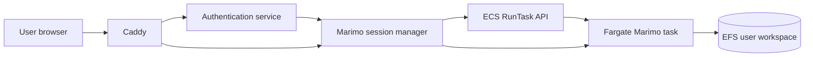

# Marimo Fargate Session Launcher Plan

## Goal

Add a user-facing Marimo launch flow where an authenticated user clicks a Caddy-exposed Marimo link, sees a wait screen while an AWS Fargate task starts, and is then routed into a per-user Marimo coding container with persistent storage mounted on every launch.

This is a planning document only. It does not yet change runtime behavior.

## Current repo context

The repository already has the pieces this feature should integrate with:

- `backend-services/caddy/` for the public reverse proxy.
- `backend-services/authentication/` for the FastAPI authentication/session service.
- `backend-services/marimo/` for the local notebook service.
- `infrastructure/aws-pulumi/` as the canonical AWS deployment source.
- ECS, Cloud Map, IAM, ECR, VPC, and Caddy are already part of the deployed architecture.

The proposed implementation should extend those existing pieces rather than creating a separate deployment system.

## Target user experience

1. User opens the Marimo link exposed through Caddy, for example `/marimo`.
2. The request is authenticated through the existing auth flow.
3. The backend creates or reuses a Marimo session for that user.
4. If no task is ready, the user sees a wait page: `Starting your Marimo workspace...`.
5. The backend starts an ECS Fargate task for the user's Marimo workspace.
6. The task mounts the user's persistent workspace volume.
7. The backend waits until Marimo is reachable and healthy.
8. The wait page redirects the user to the ready Marimo session URL.
9. While the user is active, the task remains running.
10. After logout, manual stop, or idle timeout, the backend stops the task.
11. On the next launch, the same user volume is mounted again.

## Proposed architecture



Caddy should stay responsible for public HTTPS routing. It should not directly orchestrate Fargate. The orchestration should live in the authenticated backend/session manager.

## Main components

### 1. Session manager

Add Marimo session lifecycle endpoints to the existing authentication/FastAPI service, or create a sibling backend service if separation is preferred.

Initial endpoints:

| Endpoint | Purpose |
|---|---|
| `GET /marimo` | Authenticated entrypoint. Creates/reuses a session and returns the wait page or redirects if already ready. |
| `GET /marimo/sessions/{session_id}/wait` | Wait screen. Polls status and redirects when ready. |
| `GET /api/marimo/sessions/{session_id}` | Returns `starting`, `ready`, `failed`, or `stopped`. |
| `POST /api/marimo/sessions/{session_id}/stop` | Stops a user's running task. |
| `ANY /marimo/sessions/{session_id}/{path:path}` | Optional backend proxy to the user's Marimo task. |

The session manager should own:

- user-to-session mapping;
- ECS task launch;
- task readiness polling;
- task private IP / service discovery lookup;
- idle timeout tracking;
- task cleanup;
- failure state and error messages.

### 2. Session state

Use a durable store rather than only process memory. Candidate stores:

- DynamoDB table, preferred for deployed AWS;
- PostgreSQL if reusing the existing database is simpler;
- in-memory only for local proof-of-concept.

Suggested fields:

| Field | Notes |
|---|---|
| `session_id` | Random opaque ID. Do not expose raw user IDs as routing IDs. |
| `user_id` | Authenticated user ID. |
| `user_email` | Optional audit/debug field. |
| `status` | `starting`, `ready`, `failed`, `stopping`, `stopped`. |
| `ecs_task_arn` | Fargate task ARN. |
| `task_private_ip` | Set after ENI attachment is available. |
| `task_port` | Marimo port, likely `2718`. |
| `workspace_path` | User EFS path or access point ID. |
| `created_at` | Session creation time. |
| `ready_at` | When Marimo passed readiness checks. |
| `last_seen_at` | Updated by proxied requests or polling. |
| `stopped_at` | Set when cleanup completes. |
| `failure_reason` | User-visible summary for failed starts. |

### 3. Fargate task definition

Create a dedicated Marimo trainer task definition in Pulumi.

It should include:

- Marimo container image from ECR.
- Container command similar to `marimo edit --host 0.0.0.0 --port 2718 /workspace`.
- Port mapping for Marimo.
- CloudWatch logs.
- Task role with only the permissions needed by the trainer.
- Execution role for pulling ECR images and writing logs.
- Environment variables populated at launch:
  - `USER_ID`
  - `USER_EMAIL`
  - `SESSION_ID`
  - `WORKSPACE_DIR=/workspace`
  - any project-specific config needed by the trainer.

### 4. Persistent workspace volume

Use EFS for persistent user workspaces.

Preferred production model:

- one EFS filesystem for Marimo workspaces;
- one EFS access point per user, or per-user directories with enforced POSIX ownership;
- Fargate task mounts the user's workspace at `/workspace`;
- container runs as a non-root user matching the EFS access point ownership.

Example logical layout:

```text
/efs/marimo-workspaces/{user_id}/
```

Mounted inside the container as:

```text
/workspace
```

### 5. Readiness and wait screen

The wait page should poll the session manager instead of directly polling the task.

Readiness criteria:

1. ECS task status is `RUNNING`.
2. Task ENI/private IP has been discovered.
3. Marimo TCP port is reachable from the session manager or proxy layer.
4. Optional HTTP readiness endpoint returns success.

Status API examples:

```json
{ "status": "starting", "message": "Starting your workspace" }
```

```json
{ "status": "ready", "url": "/marimo/sessions/abc123/" }
```

```json
{ "status": "failed", "message": "Workspace failed to start. Please try again." }
```

### 6. Routing strategy

There are two viable approaches.

#### Option A: Backend proxy, preferred for MVP

Caddy routes all Marimo session paths to the session manager. The session manager proxies HTTP and WebSocket traffic to the correct Fargate task.

Pros:

- Caddy config remains mostly static.
- Session routing logic stays in application code.
- Easier to show wait/failure states.

Cons:

- The backend must correctly proxy WebSockets.
- The backend becomes part of the data path.

#### Option B: Dynamic Caddy upstreams

The session manager updates Caddy's dynamic config or service discovery once a task is ready.

Pros:

- Caddy handles the proxy data path.
- Cleaner separation once stable.

Cons:

- More moving parts.
- Stale route cleanup is harder.
- Need careful admin API security.

Recommendation: start with Option A, then evaluate Option B if proxy throughput or complexity becomes an issue.

### 7. Idle shutdown

The session manager should stop tasks when they are no longer in use.

Initial policy:

- update `last_seen_at` on wait-page polling and proxied Marimo traffic;
- stop sessions idle for 30 minutes;
- stop sessions immediately when the user clicks a Stop button;
- periodically reconcile session records against ECS to clean up orphaned tasks.

A scheduled cleanup loop can run in the session manager or as a small ECS scheduled task.

### 8. Security requirements

- Require authentication before creating or accessing a session.
- Authorize every session route: users can only access their own sessions.
- Use random opaque session IDs.
- Do not expose task private IPs to the browser.
- Keep Marimo tasks in private subnets.
- Restrict security groups so only the proxy/session manager can reach Marimo task ports.
- Run containers as non-root where possible.
- Scope IAM task roles narrowly.
- Avoid passing secrets directly as plain environment variables unless necessary.
- Prefer Secrets Manager or SSM Parameter Store for sensitive values.
- Ensure WebSocket routes go through the same auth and session checks.

### 9. Pulumi infrastructure work

Add infrastructure for:

- Marimo trainer ECR repository or image reference.
- ECS task definition for Marimo trainer sessions.
- IAM task execution role and task role.
- CloudWatch log group.
- EFS filesystem, access points, mount targets, and security groups.
- Security group rules from Caddy/session manager to Marimo tasks.
- Optional DynamoDB session table.
- Required environment variables for the auth/session service.

### 10. Local development plan

For local compose:

- keep the existing local Marimo service;
- add a fake/local session manager mode that starts or proxies to the local Marimo container instead of ECS;
- use a local bind mount as the workspace volume;
- keep route shape aligned with production, e.g. `/marimo/sessions/{session_id}`.

This allows the wait page and routing behavior to be tested without AWS.

## Suggested implementation phases

### Phase 1: Planning and interfaces

- Land this plan.
- Decide whether the session manager lives inside `backend-services/authentication/` or as a new service.
- Confirm desired route shape.
- Confirm whether session state should use DynamoDB or PostgreSQL.

### Phase 2: Local proof of concept

- Add wait page.
- Add session status API.
- Add local session state.
- Proxy to the existing local Marimo service.
- Validate WebSocket behavior through Caddy.

### Phase 3: AWS task launch

- Add ECS RunTask integration.
- Add task status polling.
- Discover task private IP.
- Add failure handling and retry behavior.
- Add manual stop endpoint.

### Phase 4: Persistent workspaces

- Add EFS infrastructure in Pulumi.
- Mount per-user workspace into Fargate tasks.
- Validate file persistence across task restarts.
- Lock down filesystem permissions.

### Phase 5: Production hardening

- Add durable session table.
- Add idle timeout cleanup.
- Add orphan ECS task reconciliation.
- Add metrics/logging.
- Add rate limits and per-user task quotas.
- Add user-facing failure states.
- Add integration tests for route authorization.

## Acceptance criteria

MVP acceptance:

- An authenticated user can click `/marimo`.
- The user sees a wait screen while no Marimo task is ready.
- A Marimo Fargate task starts for that user.
- The user is redirected to Marimo after readiness succeeds.
- The user can create or edit a file in `/workspace`.
- Stopping and relaunching the task preserves files in `/workspace`.
- Another user cannot access the first user's session URL.
- The task stops after the configured idle timeout.

Production acceptance:

- Sessions survive session-manager restarts.
- Orphaned ECS tasks are reconciled and stopped.
- EFS permissions prevent cross-user data access.
- Caddy/WebSocket routing is reliable for Marimo usage.
- CloudWatch logs make failed starts diagnosable.
- Costs are bounded with per-user/session quotas.

## Open questions

- Should the session manager be part of the existing authentication service or a separate service?
- What identity field is the stable user ID: email, OIDC subject, or app-specific user ID?
- Should users get one active Marimo session or multiple named workspaces?
- What should the idle timeout be?
- Should each user get an EFS access point, or should access be enforced by directory ownership?
- Is the Marimo trainer image the existing `backend-services/marimo` image or a new purpose-built image?
- Does the trainer need access to project AWS data buckets, and if so, should access be scoped per user?

## Risks

| Risk | Mitigation |
|---|---|
| Fargate cold starts feel slow | Wait screen with progress states; optionally warm pool later. |
| Duplicate tasks for same user | Use idempotent session creation and locking. |
| Task starts but Marimo is not usable | Require app-level readiness checks before redirecting. |
| WebSockets fail through proxy | Test Marimo editing through Caddy in local compose before AWS rollout. |
| EFS permissions leak user data | Prefer EFS access points and non-root containers. |
| Idle cleanup misses tasks | Add reconciliation against ECS `ListTasks`/`DescribeTasks`. |
| Costs grow unexpectedly | Add quotas, idle timeout, max session duration, and alarms. |

## Non-goals for the first PR

- Implementing the full Fargate launcher.
- Changing the deployed Caddy config.
- Changing the Marimo image.
- Adding EFS infrastructure.
- Adding production IAM policies.

Those should follow after the route shape and session-manager ownership are agreed.
